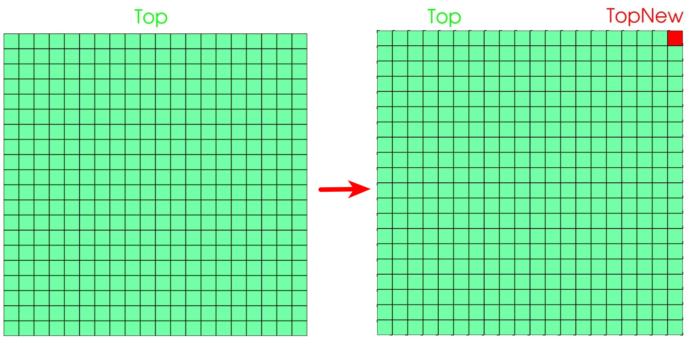
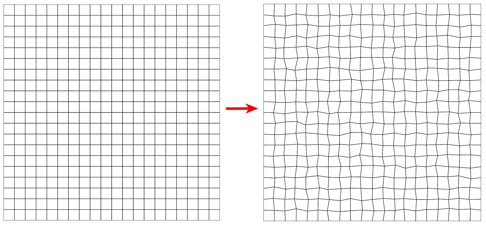

# Utilities

---

Prepared by Ivan Batistić, with additions by Philip Cardiff

---

## Section Aims

- This document describes the `solids4foam` utilities located in
  `applications/utilities`;
- Utilities are executables that provide various pre and post-processing
  functionalities;
- These `solids4foam` utilities provide functionalities not available in the
  standard `OpenFOAM` utilities
  ([OpenFOAM-wiki](https://openfoamwiki.net/index.php/Main_OFUtilities)).

---

## `abaqusMeshToFoam`

- **Utility purpose** Mesh converter: converts
  [Abaqus](https://www.3ds.com/products-services/simulia/products/abaqus/) mesh
  (in `*.inp` format) into the FOAM mesh format.  
  Currently, this utility only supports 3-D hexahedral cells/elements.
  Note that each distribution of `OpenFOAM` comes with a set of mesh converters
  (but not for Abaqus), see the available one
  [here](https://www.openfoam.com/documentation/user-guide/4-mesh-generation-and-conversion/4.5-mesh-conversion).
- **Arguments**

  - `<mesh.inp>` name of the Abaqus mesh file.

- **Options/parameters**

  None

- **Example of usage**

  ```bash
  abaqusMeshToFoam mesh.inp
  ```

  ```note
  - Only the following Abaqus element types are supported: C3D8 and C3D8R.
  - Only the first PART is used and the rest are ignored.
  - Node sets, element sets and surfaces are not converted.
  ```

---

## `addTinyPatch`

- **Utility purpose** For a chosen patch, find the closest face to the specified
  location and separate it into a new patch.  
  The utility can be used, for example, to create patches for specifying point
  loads.

- **Arguments**

  - `<currentPatchName>` chosen patch name;
  - `<newTinyPatchName>` name of the one-face patch to be created;
  - `"(x y z)"` location vector.

- **Options/parameters**

  None

- **Example of usage**

  ```bash
  addTinyPatch Top TopNew "(30 30 0)"
  ```


**`addTinyPatch`: top patch before and after adding one-face patch**

```note
When using `addTinyPatch` the original mesh is overwritten!
```

---

## `foamMeshToAbaqus`

- **Utility purpose** Mesh converter: converts FOAM mesh into
  [Abaqus](https://www.3ds.com/products-services/simulia/products/abaqus/) mesh
  (`*.inp` format). Currently, this utility only supports 3-D hexahedral
  cells/elements.
- **Arguments**

  None

- **Options/parameters**

  None

- **Example of usage**

  ```bash
  foamMeshToAbaqus
  ```

  Converted mesh is written to the`abaqusMesh.inp` file.  
  Creates a node set and and element set and a surface for each boundary
  patch.  
  Also creates a element set for each material in the materials file (if it is
  exists).

  ```note
  - Only works for hexahedral cells as yet.
  - Created for Abaqus-6.9-2, but should work for new versions too.
  ```

---

## `perturbMeshPoints`

- **Utility purpose**  
   Add a random perturbation to each mesh points. The perturbation of a point is
  calculated as a scale factor times the local minimum edge length.

  By default, boundary points are slide along the patch. Patches which should
  not move can be defined via the fixedPatches entry.

  In OpenFOAM.com, points on feature edges are not moved, where feature edges
  are defined by the minimum cosine angle (minCos). This feature is not
  currently implemented with OpenFOAM.org and foam-extend.

  The inputs are defined in `$FOAM_CASE/system/perturbMeshPointsDict`, and
  consist of a seed (for the random number generator) and a scaling factor to
  scale the perturbations relative to the local minimum edge length. The scaling
  factor is a vector to allow different scalings in different directions; for
  example, for 2-D, the Z component should be set to 0.0.

  If checkMesh fails after moving the points, the local motion is reduced by
  the factor beta (defaults to 0.8) and the motion is performed again. The
  maximum number of corrections iterations is set with maxIter (defaults to
  1000).

  This utility is useful for creating distorted grids for testing
  discretisations.

- **Arguments**  
  None

- **Options/parameters**

  None

- **Dictionary**  
  Inputs are defined in dictionary named `perturbMeshPointsDict` and located in
  `system` directory:

  ```c++
  // Perturn by 30% of the local minimum edge length in the X, Y and Z directions
  scaleFactor (0.3 0.3 0.3);

  // Gaussian or uniform random distribution
  Gaussian    no;

  // Seed for random number generator
  seed        1;

  // Minimum cosine to find feature edges
  // Points on feature edges are not moved
  minCos      0.7;

  // Names of patches which should not be perturbed
  fixedPatches
  (
      // Add patch names here
  );

  // Optional: maximum number of corrections iterations
  // Defaults to 1000
  //maxIter 1000;

  // Optional: local motion rescale factor for applying corrections
  // Defaults to 0.8
  //beta 0.8;
  ```

  The `Gaussian` distribution can only be used in combination with
  [OpenFOAM.com](https://www.openfoam.com/).

- **Example of usage**

  ```bash
  perturbMeshPoints
  ```

  The figure below shows mesh before and after using `perturbMeshPoints`
  utility.


**`perturbMeshPoints`: mesh before and after point perturbation**

```note
Perturbed mesh (`polyMesh`) is stored in the `0` directory and needs to be moved
to `constant` before running the simulation!
```

---

## `splitPatch`

- **Utility purpose** Splits a patch into two patches by putting faces in the
  given bounding box in a new patch.

- **Arguments** None

- **Options/parameters**

  `-overwrite` overwrite the original mesh when storing mesh after patch
  splitting.

- **Dictionary**

  ```c++
  patchToSplitName    Top;

  newPatchName        TopNew;

  boundBoxes
  (
      (0 0 0.01) (1 1 1)
  );
  ```

  - `patchToSplitName` is a name of the patch to be split;
  - `newPatchName`is the name of the splitted patch part;
  - `boundBoxes` is list of bounding boxes; each defined with two vectors:
    `(xmin ymin zmin)` and `(xmax ymax zmax)`. Boundary patch faces inside this
    bounding box will be put in a new patch.  
    _Note:_ The face's centre point is tested to see if it is inside the
    bounding boxes!

- **Example of usage**

  ```bash
  splitPatch
  ```


**splitPatch: top patch before and after split**

  ```note
  The mesh with the new patch is stored in a new time-step directory (`1` for
  example) and should be moved to the `constant` before running the simulation.
  Alternatively, the `-overwrite` option can be used to overwrite the original
  mesh.
  ```

---
