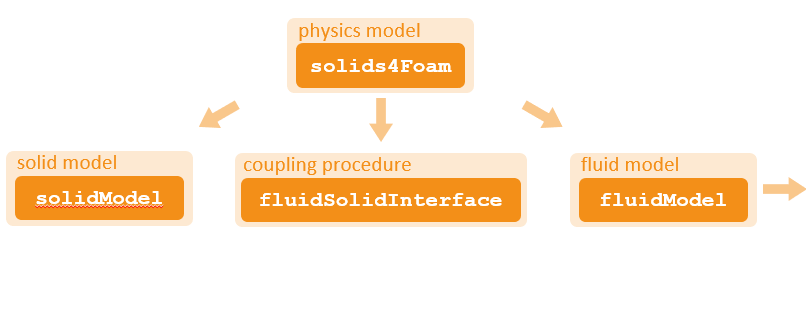
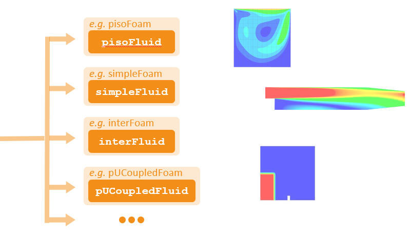
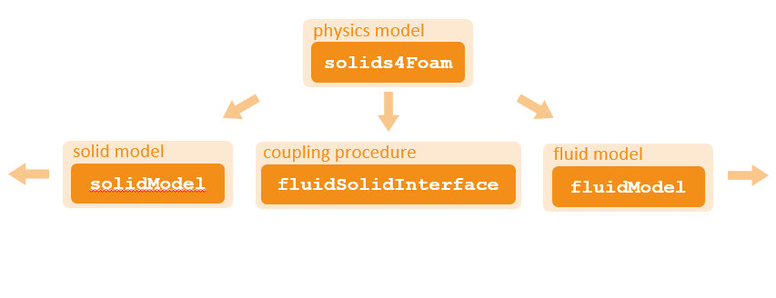
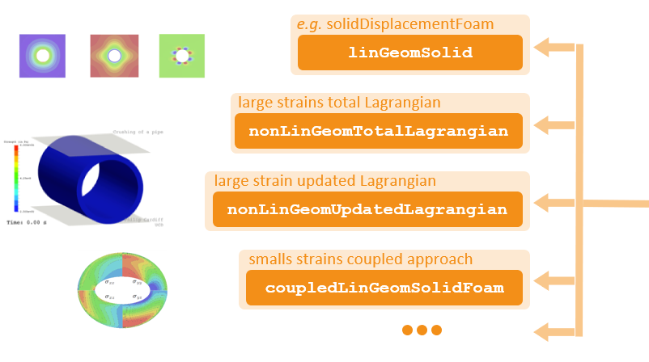
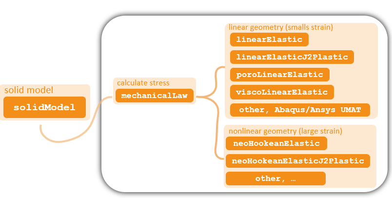
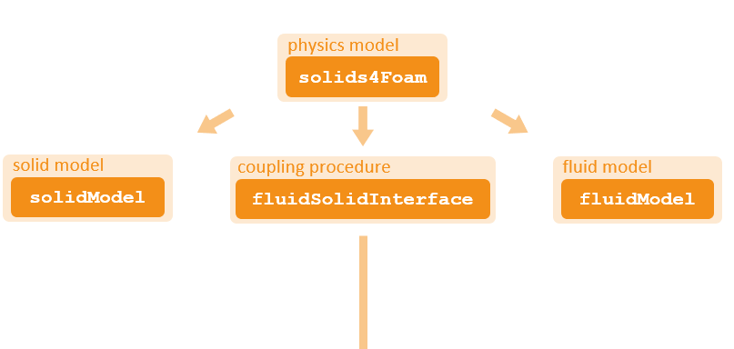
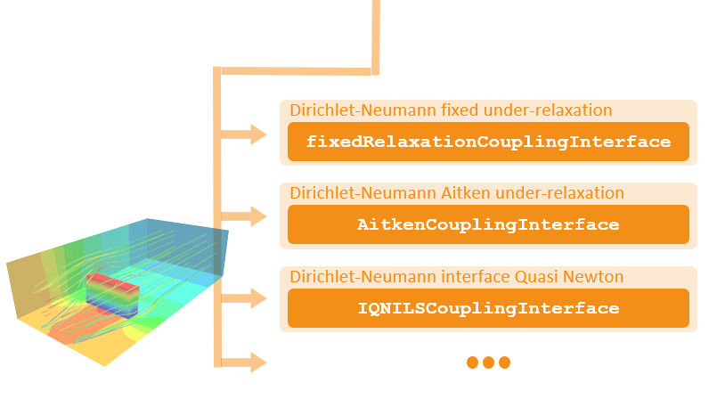
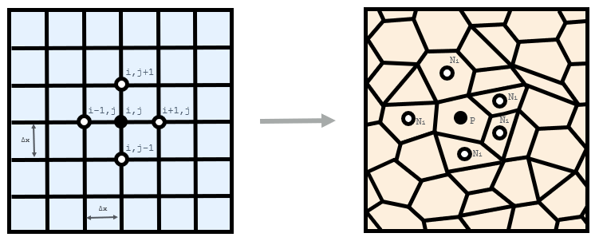
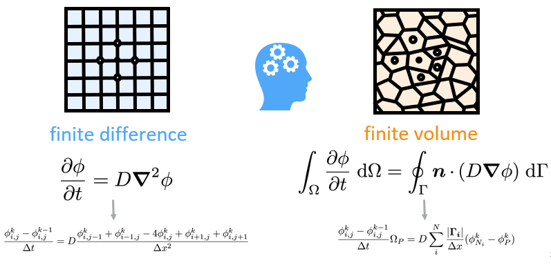
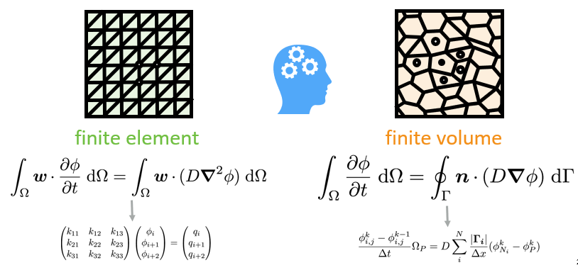

# **Overview**

### Overall aim

The overall aim of the solids4foam project is to develop an OpenFOAM toolbox for solid mechanics and fluid-solid interactions that is:
- intuitive to **use** for new users
- easy to **understand** at the case and code level
- straightforward to **maintain**
- uncomplicated to **extend**

In addition, the toolbox should be compatible will all major OpenFOAM forks, as far as reasonably possible. So far, all features are only available with foam extend 4.0 and 4.1, however, most main features are available in OpenFOAM-v1812 and OpenFOAM-7.

solids4foam builds on the toolboxes *stressAnalysis*, *solidMechanics* and *extendBazaar*

### Modular Approach
















### Coding Style

When consistent style is not followed, reading code generated by others becomes tedious, painstaking and even impossible!

Coding style is a crucial feature of software that is easy to read, understand, maintain and extend

Fortunately, the OpenFOAM Foundation have set out a comprehensive coding style at: https://openfoam.org/dev/coding-style-guide.

#### Bad
```
Info <<“This is not good”
<< endl;

( a+b ) * ( c&d ) / (e&&f)

if(myName == “Philip”){
success = true;
}

…
```
#### Good
```
Info<< “That’s better”
    << endl;

(a + b)*(c & d)/(e && f)

if (myName == “Philip”)
{
    success = true;
}

…
```

### Finite Volume vs Finite Difference vs Finite Element
<!--  -->


---

The finite volume method is a generalisation of the finite difference method, in terms of geometry and topology

But the methods differ in their philosophy …




