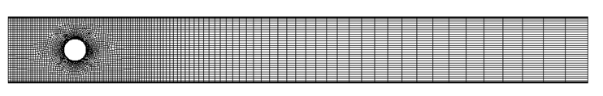
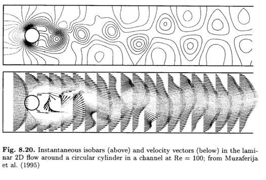

# **My First Fluids Case**: cylinderInChannel

## Case Overview

#### Running our first fluid case: cylinderInChannel





This is the classic “**flow over a cylinder in a channel**” test case, as analysed by, for example, Ferziger and Peric (2002). The problem is modelled as 2-D.

The **inlet flow velocity profile is specified** (coming in from the left) and the **outlet (right) gauge pressure is zero**.

The upper wall, lower wall and cylinder are **no slip walls**.

## Expected Results

For Re = 100, the flow is expected to be unsteady with vortices shedding from the cylinder.




## Theory

We assume an incompressible Newtonian isothermal laminar fluid, where the Navier-Stokes governing equations take the form:


### Theory: solution methodology

In this case, we will use a **transient** version of the **SIMPLE** algorithm (e.g. pimpleFoam); we could have also used PISO or a coupled approach.

```
for all time-steps
    do
        solve momentum equation for U (terms depending on
        p are calculated explicitly)

        solve pressure equation for p (terms depending on
        U are calculated explicitly)
    while not converged
end
```
### Running the Case

#### Running our first fluid case: *cylinderInChannel*
Change directory into the cylinderInChannel tutorial case:
```
$> cd $FOAM_RUN/tutorials/fluids/cylinderInChannel
```
Or if using the docker image:
```
$> cd $FOAM_RUN/../sharedRun/tutorials/fluids/cylinderInChannel
```

We can run the case using the Allrun script, or manually (using the commands from the Allrun script):
```
$> fluentMeshToFoam cylinderInChannel.msh
$> changeDictionary
$> solids4Foam
```

We will now look at the results in ParaView:
```
$> paraFoam # or “paraFoam -nativeReader”
$> # or “touch case.foam && paraview case.foam”
```


Let us examine the cylinderInChannel case structure and discuss the **similarities** and **differences** between a “fluid” case and a “solid” case

```
cylinderInChannel
├── 0
│   ├── U
│   └── p
├── Allclean
├── Allrun
├── constant
│   ├── RASProperties
│   ├── dynamicMeshDict
│   ├── fluidProperties
│   ├── physicsProperties
│   ├── polyMesh
│   │   └── …
│   ├── transportProperties
│   └── turbulenceProperties
├── cylinderInChannel.msh
└── system
    ├── changeDictionaryDict
    ├── controlDict
    ├── fvSchemes
    └── fvSolution
```
- The case setup is the same as a typical “*simpleFoam/pimpleFoam*” case, apart for a couple of small differences.

    **physicsProperties**: in this case, we specify the analysis type to be “fluid”:
    ```
    type     fluid;
    //type   solid;
    //type   fluidSolidInteraction;
    ```
- For a fluid analysis, we must specify the type of fluid model in the **fluidProperties** dictionary; in this case we will use a transient SIMPLE approach for a incompressible isothermal fluid:
    ```
    fluidModel transientSimpleFluid;
    transientSimpleFluidCoeffs
    {
        nOuterCorrectors 200;
        nNonOrthogonalCorrectors 0;
        pRefCell        0;
        pRefValue       0;
        convergence 1e-7;
    }
    ```
- Apart from specifying the *physicsProperties* and *fluidProperties* dictionary, the case is equivalent to standard OpenFOAM fluid cases, e.g. specifying *transportProperties*, *RASProperties*, *dynamicMeshDict*, *U, p, fvSchemes*, etc.

## Case Settings

```
cylinderInChannel
├── 0
│   ├── U
│   └── p
├── Allclean
├── Allrun
├── constant
│   ├── RASProperties
│   ├── dynamicMeshDict
│   ├── fluidProperties
│   ├── physicsProperties
│   ├── polyMesh
│   │   └── …
│   ├── transportProperties
│   └── turbulenceProperties
├── cylinderInChannel.msh
└── system
    ├── changeDictionaryDict
    ├── controlDict
    ├── fvSchemes
    └── fvSolution
```
- Settings for the solution algorithm (e.g. SIMPLE or PISO) are specified in the **fluidProperties** dictionary (as opposed to the fvSolution) dictionary:
    ```
    transientSimpleFluidCoeffs
    {
        nOuterCorrectors 200;
        nNonOrthogonalCorrectors 0;
        pRefCell        0;
        pRefValue       0;
        convergence 1e-7;
    }
    ```

## Code
### cylinderInChannel: **code**

As discussed in the _hotSphere_ solid tutorial case slides, the _solids4Foam_ solver creates a run-time selectable _physicsModel_; in the case,  we have selected this to be the _transientSimpleFluid_ model.

The code for the _transientSimpleFluid_ class is located at:
solids4foam/src/solids4FoamModels/fluidModels/transientSimpleFluid/transientSimpleFluid.C


Let us examine the “evolve” function of this class to see the equations solved…
```
bool transientSimpleFluid::evolve()
{
    if (consistencyByJasak_)
    {
        return evolveConsistentByJasak();
    }
    else
    {
        return evolveInconsistent();
    }
}
bool transientSimpleFluid::evolveInconsistent()
{
    Info<< "Evolving fluid model" << endl;

    const fvMesh& mesh = fluidModel::mesh();

    const int nNonOrthCorr =
        readInt(fluidProperties().lookup("nNonOrthogonalCorrectors"));

    const int nOuterCorr =
        readInt(fluidProperties().lookup("nOuterCorrectors"));

    scalar convergenceCriterion = 0;
    fluidProperties().readIfPresent("convergence", convergenceCriterion);

    // Prepare for the pressure solution
    label pRefCell = 0;
    scalar pRefValue = 0.0;
    setRefCell(p(), fluidProperties(), pRefCell, pRefValue);

    phi().oldTime();

    for (int oCorr = 0; oCorr < nOuterCorr; oCorr++)
    {
        scalar eqnResidual = 1, maxResidual = 0;
        p().storePrevIter();

        if (mesh.moving())
        {
            // Make the fluxes relative
            phi() -= fvc::meshPhi(U());
        }

        // Calculate CourantNo
        {
            scalar CoNum = 0.0;
            scalar meanCoNum = 0.0;
            scalar velMag = 0.0;
            fluidModel::CourantNo(CoNum, meanCoNum, velMag);
        }
        // Construct momentum equation
        fvVectorMatrix UEqn
        (
            fvm::ddt(U())
          + fvm::div(phi(), U())
          + turbulence_->divDevReff()
        );

        UEqn.relax();

        // Solve momentum equation
        eqnResidual =
            solve(UEqn == -gradp()).initialResidual();
         maxResidual = max(eqnResidual, maxResidual);

         volScalarField aU = UEqn.A();

        U() = UEqn.H()/aU;
        phi() = (fvc::interpolate(U()) & mesh.Sf());

#       include "adjustPhi.H"

        for (int nonOrth = 0; nonOrth <= nNonOrthCorr; nonOrth++)
        {
            // Construct pressure equation
            fvScalarMatrix pEqn
            (
                fvm::laplacian(1/aU, p()) == fvc::div(phi())
            );

            // Solve pressure equation

            pEqn.setReference(pRefCell, pRefValue);

            pEqn.solve();

            if (nonOrth == nNonOrthCorr)
            {
                phi() -= pEqn.flux();
            }
        }

        // Calculate Continuity error
        fluidModel::continuityErrs();
        // Explicitly relax pressure for momentum corrector
        p().relax();

        gradp() = fvc::grad(p());

        U() -= gradp()/aU;
        U().correctBoundaryConditions();

        turbulence_->correct();

        if (maxResidual < convergenceCriterion)
        {
            Info<< "reached convergence criterion: "
                << convergenceCriterion << endl;
            Info<< "Number of iterations: " << oCorr << endl;
            break;
        }
    }

    return 0;
}
```
