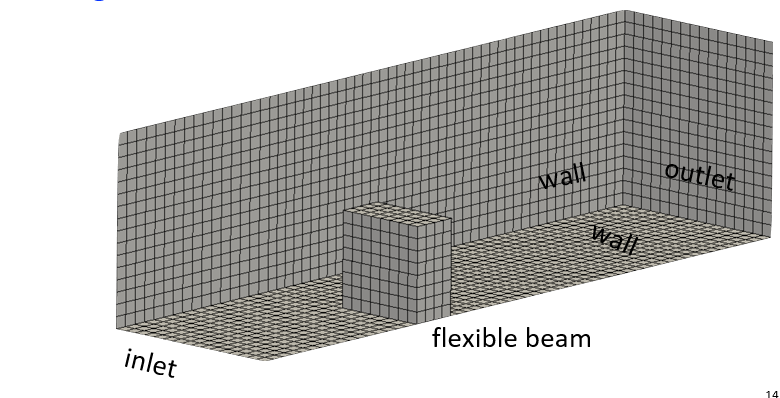
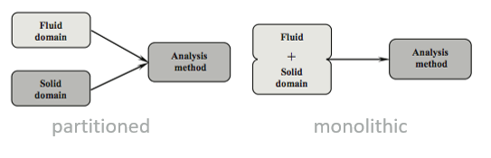
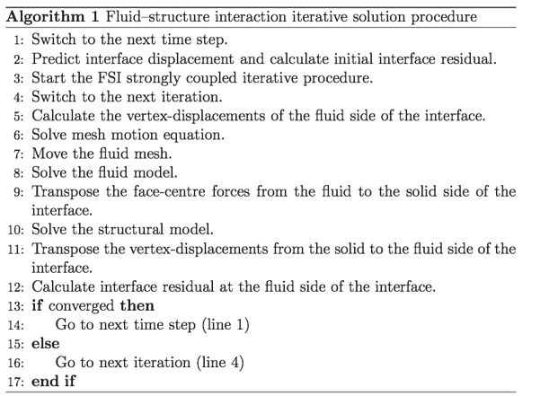
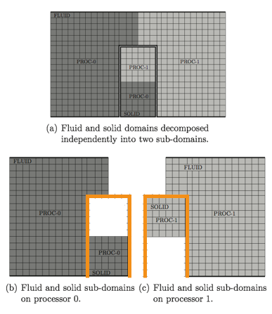
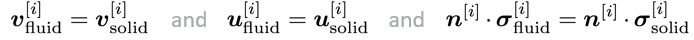

# My First Fluid-Solid Interaction Case

## Case Overview

### Running our first FSI case: beamInCrossFlow



This case consists of an elastic thick plate attached to the bottom surface of a rectangular channel. Due to symmetry, only half of the spatial domain is considered. An **incompressible viscous fluid** with density 1000 kg/m3 and kinematic viscosity 0.001 m2/s enters the channel from the left-hand side with a parabolic velocity profile.

The peak inlet velocity is 0.2 m/s, corresponding to Re = 40 with respect to the plate height (h = 0.2 m). **The peak inlet velocity is gradually increased from zero at t = 0 s to its maximum value at t = 4 s using the following transition function 0.2 [1 − cos(πt/4)]/2**. A constant pressure is imposed at the outlet of the channel and a no-slip boundary condition is applied on the channel walls. The elastic plate has a density of 1000 kg/m3, a Young’s modulus of 1.4 MPa (shear modulus of 0.5 MPa), a Poisson’s ratio of 0.4.

### Expected results

The plate is expected to bend and reach a steady-state deformed position, where the fluid flow is laminar.

The solid deformation is expected to be relatively small in this case.


Note: the **beamInCrossFlow/oscilatingElasticBeam** case is the same as this case, except the inlet velocity varies sinusoidally in time.

---
## Theory

**Fluid**: we assume incompressible Newtonian isothermal laminar flow, where the Navier-Stokes governing equations take the form:


**Solid**: we assume finite strains (though a small strain assumption would be OK in this case) with the material behaviour described by the neo-Hookean hyperelastic law:


### Conditions at the FSI interface
**Fluid-solid interface**: at the interface between the fluid and solid regions, kinematic and dynamic conditions hold:

The kinematic conditions state that the velocity and displacement must be continuous across the interface:


The dynamic conditions follow from linear momentum conservation and state that the forces are in equilibrium:


### Solution methodology

There are two common solution methodologies used for fluid-solid interaction analyses:
- partitioned
- monolithic




Currently, only the partitioned approach is implemented in *soldis4foam*, but the monolithic implementation is in progress. We will next discuss the details and relative merits of each approach.

### Solution methodology: monolithic approach
Typical monolithic approach formulate the solid in terms of velocity and pressure and then solve both fluid and solid domains simultaneously, e.g. Greenshields (2005), and Giannopapa (2004).

The monolithic approach has the potential benefit of begin more robust and efficient (achieving convergence and faster convergence), but requires more memory and better linear solvers (a typical solid “viscosity” is many orders of magnitude higher than that of a typical fluid).

The monolithic approach is not (as yet) implemented in *solids4foam*, but is a *work-in-progress*.

### Solution methodology: partitioned approach

In the partitioned approach, the **fluid and solid regions are solved separately** and a **coupling algorithm** is used to enforce momentum and kinematic continuity at the fluid-to-solid interface.

One such coupling algorithm is the **Dirichlet-Neumann approach**; this is currently implemented in solids4foam. In this approach, the fluid domain is solved with a Dirichlet condition for velocity at the interface, and the solid domain is solved with a Neumann condition (traction) at the interface.

Note: a **Robin-Neumann** coupling procedure based on a Robin boundary condition for pressure has also been recently implemented and will be included in solids4foam:
>Z. Tukovic, M. Bukac, P. Cardiff, H. Jasak, A. Ivanković. Added mass partitioned fluid-structure interaction solver based on a Robin boundary condition for pressure. OpenFOAM Selected papers of the 11th Workshop, 2018.

The **strongly-coupled** Dirichlet-Neumann coupling algorithm is:
```
for all time-steps
    do
        solve fluid domain
        pass fluid interface forces to the solid interface
        solve solid domain
        pass solid interface velocities to the fluid
        interface using under-relaxation
        update the fluid mesh
    while not converged
end

```
The **weakly/loosely-coupled** Dirichlet-Neumann coupling algorithm is:
```
for all time-steps
    do
        solve fluid domain
        pass fluid interface forces to the solid interface
        solve solid domain
        pass solid interface velocities to the fluid
        interface using under-relaxation
        update the fluid mesh
    while not converged
end
```
The fluid and solid are each solved only once per time-step; no under-relaxation is used when passing displacement/velocities/forces between the solid and the fluid.




To improve/achieve the convergence of the Dirichlet-Neumann coupling algorithm, **under-relaxation** of the interface velocity is performed when passing from the solid to the fluid.

Currently, three separate relaxation methods are implemented:
- fixed under-relaxation
- dynamic (Aitken’s) under-relaxation
- interface-quasi-Newton with inverse Jacobian from a - least-squares model (IQN-ILS from Degroote et al. 2009)

### Interpolation of fields at the interface

To map fields (e.g. traction, velocity, displacement) between the fluid and solid interfaces, and vice versa, the **General Grid Interface** (GGI) class in foam extend is used; the **Arbitrary Mesh Interface** (AMI) can be used in standard OpenFOAM.

The method is used to interpolate face-based and point-based fields.

To allow convenient parallelisation, a globalPolyPatch approach is used.

### Parallelisation
Both fluid and solid sub-domains are decomposed into the same number of processors.




The entire FSI interface is stored on each processor (globalPolyPatch) to allow straight-forward parallelisation.

---
## Running the Case

Let us examine the beamInCrossFlow case structure and discuss the **similarities** and **differences** between a “fluidSolidInteraction” cases and “fluid”/“solid” cases.
```
beamInCrossFlow/elasticBeam
├── 0
│   ├── fluid
│   │   └── ...
│   └── solid
│   │   └── ...
├── Allclean
├── Allrun
├── constant
│   ├── fluid
│   │   └── ...
│   ├── fsiProperties
│   ├── physicsProperties
│   └── solid
│       └── ...
├── setBatch.fluid
├── setBatch.solid
└── system
    ├── fluid
    │   └── ...
    └── solid
       └── ...
```
To indicate that the case is a fluid-solid interaction analysis, we specify “fluidSolidInteraction” in the **physicsProperties** dictionary:
```
//type   fluid;
//type   solid;
type     fluidSolidInteraction;
```
Now the solids4Foam solver will expect to find “**fluid**” and “**solid**” sub-directories in the “0”, “constant” and “system” case directories, where the separate fluid and solid settings are specified.

The **fsiProperties** dictionary specifies what approach is used to couple the solid and fluid sub-domains:
```
//fluidSolidInterface fixedRelaxation;
fluidSolidInterface   Aitken;
//fluidSolidInterface IQNILS;
```
Each of these methods use a Dirichlet-Neumann coupling approach, where the fluid interface stresses (viscous and pressure) are passed to the solid interface, and the solid interface displacements/velocities are passed to the fluid interface.

---
The fluid boundary conditions are set inside *0/fluid*, and the solid boundary conditions are set inside *0/solid*. The primitive variable for the solid may be total displacement (*D*) or increment of displacement (*DD*) depending on the choice of solid model (in *solidProperties*):
```
├── 0
│   ├── fluid
│   │   ├── U
│   │   ├── p
│   │   └── pointMotionU
│   └── solid
│       └── DD
```

---
The fluid and solid settings are defined just as before, except they are in the fluid and solid sub-directories:
```
├── constant
│   ├── fluid
│   │   ├── dynamicMeshDict
│   │   ├── fluidProperties
│   │   ├── polyMesh
│   │   └── transportProperties
│   ├── ...
│   └── solid
│       ├── dynamicMeshDict
│       ├── g
│       ├── mechanicalProperties
│       ├── polyMesh
│       └── solidProperties
```

---
Similarly, for the system directory:
```
└── system
    ├── controlDict
    ├── decomposeParDict
    ├── fluid
    │   ├── decomposeParDict
    │   ├── fvSchemes
    │   ├── fvSolution
    │   └── tetFemSolution
    └── solid
        ├── controlDict
        ├── decomposeParDict
        ├── fvSchemes
        └── fvSolution
```
### Running our first FSI case: beamInCrossFlow
Change directory into the beamInCrossFlow tutorial case:
```
$> cd $FOAM_RUN/tutorials/fluidSolidInteraction/beamInCrossFlow/elasticBeam/linearGeometryElasticBeam
```
Or in the docker container:
```
$> cd $FOAM_RUN/../sharedRun/tutorials/fluidSolidInteraction/beamInCrossFlow/elasticBeam/linearGeometryElasticBeam
```
We can run the case using the Allrun script, or manually (using the commands from the Allrun script):

Create solid and fluid meshes:
```
$> blockMesh -region solid
$> blockMesh -region fluid
```
Note: extendBazaar and previous versions of solids4foam needed faceZones/globalFaceZones defined for the interface but this is no longer needed; it is taken care of in the code by the globalPolyPatch class.

Run the solver:
```
$> solids4Foam
```
We will now look at the results in ParaView:
```
$> touch case.foam && paraview case.foam &
```


**Tip**: in FSI cases, it can be convenient to open two instances of the case (File -> Open -> case.foam), where one opens the “fluid/internalMesh” and the other opens the “solid/internalMesh”: this allows us to colour the fluid sub-domain using a different field to the solid sub-domain

### The solids4Foam solver output for FSI analyses
```
Time = 0.1, iteration: 15
Current fsi under-relaxation factor (Aitken): 0.980175
Maximal accumulated displacement of interface points: 8.51423e-07
Evolving fluid model: icoFluid
Courant Number mean: 0.00184822 max: 0.0346019 velocity magnitude: 0.00487047
time step continuity errors : sum local = 9.26048e-10, global = -2.65049e-11, cumulative = -2.74836e-09
time step continuity errors : sum local = 2.0302e-10, global = -1.72198e-11, cumulative = -2.76558e-09
time step continuity errors : sum local = 1.11805e-10, global = 6.68802e-12, cumulative = -2.7589e-09
Setting traction on solid patch
Total force (fluid) = (-0.147015 0.378642 -0.38067)
Total force (solid) = (0.146715 -0.378943 0.380941)
Evolving solid solver
Solving the updated Lagrangian form of the momentum equation for DD
    Corr, res, relRes, matRes, iters
    Both residuals have converged
    2, 5.23068e-07, 7.10068e-07, 0, 2

Current fsi relative residual norm: 5.70921e-07
Alternative fsi residual: 5.70555e-07
```
- The solids4Foam solver will output the fluidModel residual information, the fluid mesh motion solver information, and also the solidModel residual information: each of these three component should converge. In addition, if you are using a strongly coupled approach, it is important that the FSI loop converges within each time-step.

pic maybe

### Running the solver in parallel for FSI analyses
To run the *solids4Foam* solver in parallel for fluid-solid interaction cases, copy the *decomposeParDict* into the case (the *beamInCrossFlow* case already has decomposeParDicts in place).

In FSI cases, we must have three *decomposeParDicts*:
- *system/fluid/decomposeParDict*
- *system/solid/decomposeParDict*
- *system/decomposeParDict*

The first is for decomposing the fluid domain; the second for the solid domain, while the third is to keep *decomposePar* happy even though it is not directly used.

**Currently, all three dicts must specify the same number of processors.**

Both fluid and solid domains must be decomposed
```
$> decomposePar -region fluid
$> decomposePar -region solid
```
Run the solver in parallel:
```
$> mpirun -np 4 solids4Foam -parallel
```
To view the results in ParaView, the case can be reconstructed or viewed directly in parallel using the decomposedCase option in ParaView; for reconstruction, you run:
```
$> reconstructPar -region fluid
$> reconstructPar -region solid
$> touch case.foam && paraview case.foam
```
### solid/system/decomposeParDict
The fluid and solid decomposeParDicts are shown below.
>beamInCrossFlow/system/solid/decomposeParDict

and
>beamInCrossFlow/system/fluid/decomposeParDict


```
numberOfSubdomains 4;

method          metis;

Note: globalFaceZones are no longer required.
```


## Case Settings & Tips

```
beamInCrossFlow/elasticBeam
├── 0
│   ├── fluid
│   │   └── ...
│   └── solid
│   │   └── ...
├── Allclean
├── Allrun
├── constant
│   ├── fluid
│   │   └── ...
│   ├── fsiProperties
│   ├── physicsProperties
│   └── solid
│       └── ...
├── setBatch.fluid
├── setBatch.solid
└── system
    ├── fluid
    │   └── ...
    └── solid
       └── ...
```

Next, we will briefly discuss **numerical settings** specific to the FSI procedures, as given in the *fsiProperties* dictionary.

The *fsiProperties* dictionary sets the type of coupling algorithm to use, as well as the settings for this coupling algorithm.


### fsiProperties dictionary

coupling algorithm & coupling algorithm settings
```
//fluidSolidInterface    fixedRelaxation;
fluidSolidInterface    Aitken;
//fluidSolidInterface    IQNILS;

"fixedRelaxationCoeffs|AitkenCoeffs|ISNILSCoeffs"
{
    // Solid interface patch
    solidPatch interface;

    // Fluid interface patch
    fluidPatch interface;

...
```
```
    // Under-relaxation factor for passing the solid interface
    // displacement/velocity to the fluid interface
    // For fixedRelaxation, this value is used for all iterations
    // For Aitken, this value is used for the first iteration each time-step,
    // then it adaptively changes
    // For IQNILS, this value is used for the first two iterations each
    // time-step, then the IQNILS procedure is used
    relaxationFactor 0.4;

    // Tolerance for the FSI loop within each time-step
    outerCorrTolerance 1e-6;

    // Maximum number of outer FSI loop correctors within each time-step
    nOuterCorr 20;

    // Enable/disable coupling from the start
    coupled yes;

    // Optional: if coupled is set to "no", then the couplingStartTime allows you
    // to enable coupling at specified time
    // Defaults to 0.0
    // couplingStartTime    2.0;
    // Optional (only for IQNILS): re-use modes from previous time-steps.
    // The number of modes to be re-used is specified
    // Defaults to 0 modes
    // couplingReuse 0;

    // Optional: if any point on the fluid interface moves greater than the
    // interfaceDeformationLimit then the entire fluid mesh is updated; if not
    // then only the interface points are moved and the remaining fluid mesh is
    // not. Note that interfaceDeformationLimit is a relative motion: it is the
    // point displacement normalised with respect to the local cell size (delta
    // coeffs are used)
    // Defaults to 0.0 i.e. the fluid mesh is always updated
    // interfaceDeformationLimit 0.0;

    // Frequency of time-step at which the fluid-solid interface interpolation
    // weights are updated
    // 0 means the interpolator is update every time-step, whereas 10 would be
    // every 10 time-steps
    // Defaults to 0
    // interpolatorUpdateFrequency 0;
}
```

### Tips for fluid-solid interaction analysis
### Problem: when I view the fluid and solid in ParaView, there is a gap between the fluid and solid interface: the solid domain does not align with the fluid domain.

**Solution 1**: some of the solidModels use a non-moving mesh formulation so, by default, some solids may not move at all when shown in ParaView. To show the solid domain deformation/motion in ParaView, select the solid case and use the “Warp By Vector” filter with the displacement (“D” or “pointD”) field. If there is still a gap between the fluid and solid, see Solution 2 below.

**Solution 2**: if the FSI loop does not converge then the FSI interface constraints (see below) may not be strictly enforced; examine the “fsi residual” in the log file and check if the maximum number of FSI iterations is being reached. If the FSI method is not converging to the required tolerance, then increases the maximum number of FSI correctors and/or decrease the initial relaxation factor (in fsiProperties). In addition, you can try a different FSI coupling procedure. If the FSI loop is converging but there is still a gap between the fluid and solid, see the next points on the following slide.




**Solution 3**: if the FSI loop is converging but there is still a gap between the fluid and solid, then try increase the FSI solution tolerance (in fsiProperties); you may also need to increase the maximum number of FSI correctors to achieve a tighter tolerance. If this still does not help, see Solution 4 below.

**Solution 4**: try create a conformal fluid-to-solid interface i.e. make the fluid interface patch mesh exactly the same as the solid interface patch mesh.

**Solution 5**: if the FSI method is still struggling to converge, try make the problem “easier” by setting the solid to be temporarily stiffer and denser (in mechanicalProperties) by e.g. multiple orders of magnitude. If the problem works with the artificially stiff/dense solid, then slowly decrease the solid properties towards the real ones until you find the point at which the FSI methods breaks; then try decreasing the starting FSI relaxation factor and/or maximum number of FSI correctors and/or FSI coupling algorithm to determine the critical/optimal algorithm variables.

### Problem: the solid model is not converging.

**Solution 1**: try use a lower under-relaxation factor in the solid fvSolution relaxationFactors sub-dict; use a value of 0.1-1.0 for the “D” or “DD” fields and/or 0.9-1.0 for the “D” or “DD” equations.

**Solution 2**: try a different (more robust) solid model e.g. linear geometry solid models, such as linGeomTotalDispSolid and coupledUnsLinGeomLinearElasticSolid, tend to converge better than the non-linear geometry models.

---
**Tip**: perform independent analyses on the solid and fluid domains separately, before enabling FSI coupling, to ensure all fluid and solid properties, meshes, schemes, etc. are reasonable.

**Tip**: if you are having convergence issues, try prepare a more simple - but representative - version of your case and make sure that works: it may provide understanding of critical settings.

**Tip**: if you are having convergence issues, try use a conformal mesh at the fluid-to-solid interface.

**Tip**: if you are having convergence issues, try a different (more robust) fluid model and/or a different (more robust) solid model; the pUCoupledFoam fluidModel tends to converge well and the linear geometry solid models (e.g. linGeomTotalDispSolid or coupledUnsLinGeomLinearElasticSolid) tend to converge better than the non-linear geometry models

## Code
### Fluid-solid interaction code
As discussed when examining the *hotSphere* solid tutorial case slides, the *solids4Foam* solver creates a run-time selectable *physicsModel*; in this case, we have selected this to be the **AitkenCouplingInterface** model (specified in the *fsiProperties* dict).

The code for the *AitkenCouplingInterface* class is located at:
>solids4foam/src/solids4FoamModels/fluidSolidInterfaces/AitkenCouplingInterface/AitkenCouplingInterface.C


Let us examine the code, in particular the “evolve” function of this class, to see how the FSI procedure is implemented.

```
solids4foam
├── ...
└── src
    ├── ...
    └── solids4FoamModels
        ├── ...
        ├── fluidModels
        ├── solidModels
        └── fluidSolidInterface
            ├── AitkenCouplingInterface
            ├── IQNILSCouplingInterface
            ├── fixedRelaxationCouplingInterface
            ├── fluidSolidInterface
            ├── oneWayCouplingInterface
            └── weakCouplingInterface
```
- **fluidsolidInterface** branch holds FSI coupling methods
- can run on a standard icoFoam fluid case

```
bool AitkenCouplingInterface::evolve()
{
    initializeFields();

    updateInterpolator();

    scalar residualNorm = 0;

    if (predictSolid_)
    {
        updateForce();

        solid().evolve();

        residualNorm =
            updateResidual();
    }

    do
    {
        outerCorr()++;
        // Transfer the displacement from the solid to the fluid
        updateDisplacement();

        // Move the fluid mesh
        moveFluidMesh();

        // Solve fluid
        fluid().evolve();

        // Transfer the force from the fluid to the solid
        updateForce();

        // Solve solid
        solid().evolve();

        // Calculate the FSI residual
        residualNorm = updateResidual();
    }
    while (residualNorm > outerCorrTolerance() && outerCorr() < nOuterCorr());

    solid().updateTotalFields();

    return 0;
}
```

Lets analyze the code:
```
    updateInterpolator();

```
> update fluid-to-solid/solid-to-fluid interface interpolator

---
```
    if (predictSolid_)

```
> solving the solid first can help with convergence

---
```
    do
```
>start of FSI loop

---

```
        // Solve fluid
        fluid().evolve();
```
>solve fluidModel

---

```
        // Solve solid
        solid().evolve();
```
>solve solidModel

---
