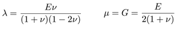
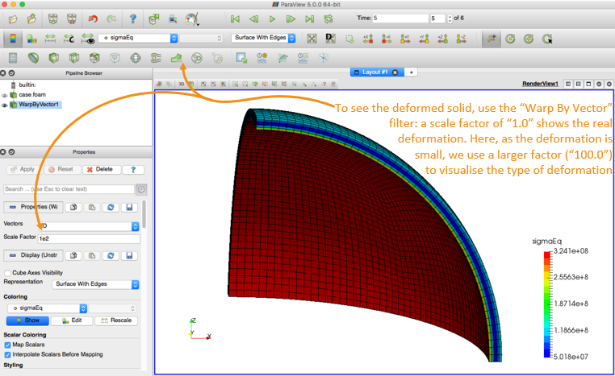
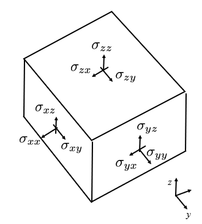
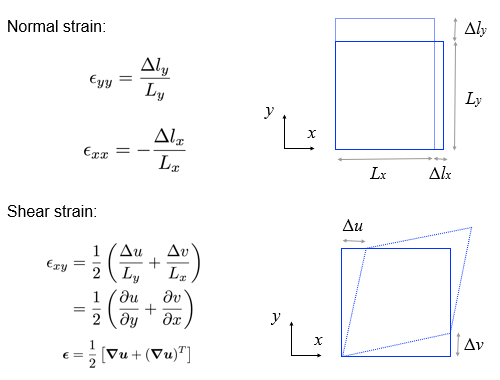
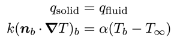
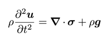
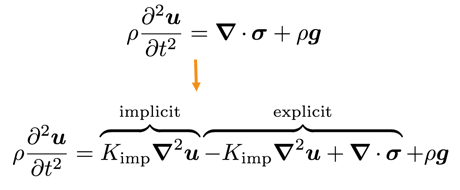
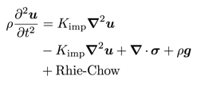
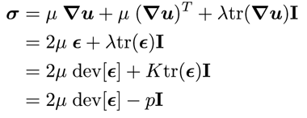

# **My First Solid Case**: hotSphere


## Case Overview


This case analyses the stresses and displacements generated in a spherical pressure vessel subjected to an increasing internal pressure and temperature.

The problem is 1-D axisymmetric in nature, but for demonstration purposes one eighth of the vessel is modelled here and symmetry planes are used.

The outer surface of the vessel is stress/traction free and the heat flux is given by Newton’s law of cooling (a simplified convection boundary condition).

*internal pressure and temperature are a function of time

## Expected Results


## Theory

- We expect the vessel to deform due to the applied pressure and also due to the thermal gradient.

- The deformations (strains/rotations) are expected to be “small”: this means we can use a small strain (linear geometry) approach, where the displacements are assumed not to affect the material geometry.

- The conservation equations are linear momentum (linear geometry form) and energy (heat equation form):


- Finally we will assume the deformation to be elastic (no permanent deformation) and the stress to be given by the Duhamel-Neumann form of Hooke’s law (i.e. Hooke’s law with thermal stress term):


- Three mechanical properties must be specified: Elastic/Young’s modulus (E), Poisson’s ratio (ν) and the coefficient of linear thermal expansion (α). The Lamé parameters are then calculated as:



### Theory: solution methodology

- This case employs a segregated solution methodology, where a loop is performed over the momentum equation (solved for displacement) and the energy equation (solved for temperature) until convergence is achieved. This loop is performed within each time-step resulting in an overall method that is implicit in time.

```
for all time-steps
    do
        solve energy equation for T (terms depending on D
        are calculated explicitly)

        solve momentum equation for D (terms depending on
        T are calculated explicitly)
    while not converged
end
```
### Running the Case

The solids4foam tutorials are organised into fluids, solids and fluid-solid interaction cases, where the solid tutorials are further categorised by physical phenomena:

```
tutorials
├── …
├── fluidSolidInteraction
│   └── …
├── fluids
│   └── …
└── solids
    ├── elastoplasticity
    ├── fracture
    ├── hyperelasticity
    ├── linearElasticity
    ├── multiMaterial
    ├── poroelasticity
    ├── thermoelasticity
    └── viscoelasticity
```

Change directory to the “run” directory (create the directory if needed):
```
$> mkdir -p $FOAM_RUN && run
```

Copy the solids4foam tutorials to the run directory; note: it is assumed here that solids4foam is installed at “$FOAM_RUN/..”, like in the Docker image:
```
$> cp -r ../solids4foam/tutorials .
```

Change directory into the hotSphere tutorial case:
```
$> cd tutorials/solids/thermoelasticity/hotSphere
```

Run the case using the Allrun script and look at the results in ParaView:
```
$> ./Allrun
$> paraFoam   # or “paraFoam -nativeReader”
$> # or “touch case.foam && paraview case.foam”
```
If you are using the solids4foam docker image, it is not possible to directly open ParaView from within the image; so a workaround is to copy the tutorials to the shared directory in the docker container “/home/app/foam/app-4.0/sharedRun”: this directory points directly to the $HOME directory on your physical computer:
```
$> run
$> cd ../sharedRun
$> cp -r ../solids4foam/tutorials .
```

You can now open a second terminal (on your physical computer, NOT in the docker container) and use ParaView installed on your physical computer to view the cases in your $HOME directory.

Example of using ParaView on your physical computer to view cases created in the docker container:

- Docker terminal
```
$> mkdir -p $FOAM_RUN && run
$> cd ../sharedRun
$> cp -r ../solids4foam/tutorials .
$> cd tutorials/solids/thermoelasticity/hotSphere
$> ./Allrun
```
- Followed by: Physical computer terminal
```
$> cd
$> cd tutorials/solids/thermoelasticity/hotSphere
$> touch case.foam && paraview case.foam
$> # or paraFoam
$> # or paraFoam -nativeReader
```



The stress tensor has 6 components




The von Mises stress (aka equivalent stress, sigmaEq) is commonly used to assess regions closest to failure:


The strain tensor also has 6 components; and we can define an equivalent strain compatible with the equivalent stress.




*These definitions of strain are only correct when the strains AND rotations are small; otherwise, see large/finite strain measures (e.g. Green strain, true strain) in e.g. Mase, Male, 1999, Continuum Mechanics for Engineers

---
### **Let us examine the hotSphere case structure in more detail …**

```
hotSphere
├── 0
│   ├── D
│   └── T
├── Allclean
├── Allrun
├── constant
│   ├── dynamicMeshDict
│   ├── g
│   ├── mechanicalProperties
│   ├── physicsProperties
│   ├── polyMesh
│   │   └── …
│   ├── solidProperties
│   ├── thermalProperties
│   ├── timeVsPressure
│   └── timeVsTemperature
├── hotSphere.msh
└── system
    ├── controlDict
    ├── fvSchemes
    └── fvSolution

```
#### In this case, there are two primitive variables:

- displacement (vector)
- temperature (scalar)
```
├── 0
│   ├── D   displacement vector field
│   └── T   temperature scalar field
```
For displacement, we specify a zero-traction condition on the outer wall:
```
outside
{
    type            solidTraction;
    traction        uniform ( 0 0 0 );
    pressure        uniform 0;
    value           uniform (0 0 0);
}
```
Note: pressure here is referring to the normal component of the boundary traction vector: in general, this is not the same as the hydrostatic pressure. The total applied traction is: *appliedTraction = traction - n\*pressure*
where n is the boundary unit normal field
and a time-varying traction condition on the inside wall:
```
inside
{
    type            solidTraction;
    traction        uniform ( 0 0 0 );
    pressureSeries
    {
        fileName “$FOAM_CASE/constant/timeVsPressure";
        outOfBounds clamp;
    }
    value           uniform (0 0 0);
}
```
where *timeVsPressure* specifies time vs pressure:
```
(
    ( 0 0 )
    ( 5 1e6 )
)
```
For the temperature field, we specify a convection condition (Newton’s law of cooling) on the outside:
```
outside
{
    type            thermalConvection;
    alpha           uniform 90;
    Tinf            300;
    value           uniform 300;
}
```


and a time-varying temperature on the inside wall:
```
inside
{
    type            fixedTemperature;
    temperatureSeries
    {
       fileName "$FOAM_CASE/constant/timeVsTemperature";
       outOfBounds clamp;
    }
    value           uniform 300;
}
```
where *timeVsTemperature* specifies time vs temperature:
```
(
    ( 0 300 )
    ( 5 500 )
)
```
Each tutorial contains an *Allrun* and *Allclean* script to run and clean/reset the case, e.g.
```
$> Allrun
```
Examining the *Allrun* script, this case requires two steps to run: create the mesh, and run the the *solids4Foam* solver:
```
$> fluentMeshToFoam hotSphere.msh
$> solids4Foam
```
Note: the mesh can be created in any external meshing software and then imported into OpenFOAM

---
#### All *solids4foam* cases require the **physicsProperties** dictionary; this allows the user to specify a **fluid** analysis, **solid** analysis, or **fluid-solid interaction** analysis:
```
│   ├── dynamicMeshDict
│   ├── g
│   ├── mechanicalProperties
│   ├── physicsProperties
│   ├── polyMesh
│   │   └── …
│   ├── solidProperties
│   ├── thermalProperties
│   ├── timeVsPressure
│   └── timeVsTemperature
├── hotSphere.msh
└── system
```

```
//type  fluid;
type    solid;
//type  fluidSolidInteraction;
```
In this case, we can see it is a solid analysis.

If a solid analysis is selected in the **physicsProperties** dictionary, then *solids4Foam* will look for the **solidProperties** dictionary in the constant directory.

Similarly, the **fluidProperties** dictionary is required for a fluid analysis, and the **fsiProperties** dictionary for a fluid-solid interaction analysis.

These dictionaries let us specify the details of what type of solid, fluid or fluid-solid interaction analysis is to be performed.

The **solidProperties** dictionary specifies:
```
solidModel
thermalLinearGeometry;

thermalLinearGeometryCoeffs
{
    nCorrectors          10000;

    solutionTolerance    1e-6;

    alternativeTolerance 1e-7;

    infoFrequency        100;
}
```
The **thermalLinearGeometry** is a solid mathematical model where the heat equation is solved (**thermal-**) and a linear geometry (**-LinearGeometry**) mechanical approach is taken.

A **linear geometry** approach is also known as a “small strain” or “small strain/rotation” approach and means that we assume the cell geometry (volumes, face areas, etc.) to be **independent of the displacement field**.

This assumption is typically OK when the deformation is “small”. *Nonlinear geometry approaches (large strain approaches) are outside the scope of this training*.

Remember the equations discussed previously in the “Theory” section; we will go through the relevant code later, and also the meaning of these settings.

A “solid” analysis requires the definition of the mechanical properties via the **mechanicalProperties** dictionary; in this case the *thermoLinearElastic* law is specified (Duhamel-Nuemann form of Hooke’s law):


```
mechanical
(
    steel
    {
        type  thermoLinearElastic;
        rho   rho [1 -3 0 0 0 0 0] 7750;
        E     E [1 -1 -2 0 0 0 0] 190e+9;
        nu    nu [0 0 0 0 0 0 0] 0.305;
        alpha alpha [0 0 0 -1 0 0 0] 9.7e-06;
        T0    T0 [0 0 0 1 0 0 0] 300;
    }
);
```
As we are performing a heat analysis, we also need to specify the thermal properties via the **thermalProperties** dictionary; in this case the constant law is specified (Fourier’s conduction law) by specific heat (C) and thermal conductivity (k):


```
thermal
{
    type      constant;
    C         C [0 2 -2 -1 0 0 0] 486;
    k         k [1 1 -3 -1 0 0 0] 20;
}
```
In all cases, we must also specify a *dynamicMeshDict*; in this case, it is set to *staticFvMesh*, which does not change the mesh during the simulation:
```
dynamicFvMesh   staticFvMesh;
```
and the gravity field (g) must be specified: here we set it to zero to disable it. Try set it (0 -9.81 0) and see how it affects the results.
```
dimensions      [0 1 -2 0 0 0 0];
value           ( 0 0 0 );
```

---
### **hotSphere**: running the solver

Let us now examine the output from the solids4Foam solver; first clean the case and prepare the mesh:
```
$> ./Allclean && fluentMeshToFoam hotSphere.msh
```

Next run the solids4Foam solver:
```
$> solids4Foam
```

We will look at the solver output …
```
Time = 1

Evolving thermal solid solver
Solving coupled energy and displacements equation for T and D
    Corr, res (T & D), relRes (T & D), matRes, iters (T & D)
    100, 3.37856e-10, 9.48897e-06, 0, 3.1907e-05, 0, 0, 12
    200, 1.97288e-10, 2.07022e-06, 0, 7.17093e-06, 0, 0, 10
    300, 9.26738e-10, 4.86841e-07, 0, 1.6726e-06, 0, 0, 10
    The residuals have converged
    337, 1.64639e-10, 2.83573e-07, 0, 9.86025e-07, 0, 0, 12

Max T = 340
Min T = 301.118
Max magnitude of heat flux = 321505
Max epsilonEq = 0.000254994
Max sigmaEq (von Mises stress) = 5.56883e+07
ExecutionTime = 8.73 s  ClockTime = 9 s
```

In general, the solver checks 3 types of residuals for the “solid”:
- res (linear solver residual)
- relRes (relative residual: change of the primitive variable)
- matRes (material residual: for nonlinear material laws)

where the tolerance is specified in the solidProperties dictionary. In this case, there are residuals for T and D;  also, the material residual is zero because a linear mechanical law was selected (no need to iterate)

### **hotSphere**: running the solver in parallel

To run the *solids4Foam* solver in parallel for solid and fluid cases (we will examine fluid-solid interaction later), copy the *decomposeParDict* into the case:
```
$> cp $FOAM_UTILITIES/parallelProcessing/decomposePar/decomposeParDict system/
```

Edit the *decomposeParDict* (e.g. using emacs - in the docker container, you can install emacs or vim using e.g. “apt-get install vim”) to use the “simple” method with 4 cores:
```
numberOfSubdomains  4;
method              simple;
simpleCoeffs
{
    n           (2 2 1);
    delta       0.001;
}
```

Then decompose the case (the cellist option creates a field for visualisation in ParaView showing the decomposition):
```
$> decomposePar -cellDist
```

Run the solver in parallel:
```
$> mpirun -np 4 solids4Foam -parallel
```

View the results in ParaView in parallel, or reconstruct the results first and view them in serial:
```
$> reconstructPar
$> paraFoam # or “paraFoam -nativeReader”
$> # or “touch case.foam && paraview case.foam”
```
### **hotSphere**: parallelisation


## Case Settings
Next, we will explain the purpose of different **numerical settings** (physical properties, such as *g*, *mechanicalProperties* and *thermalProperties* are explained previously):
- solidProperties
- fvSchemes
- fvSolution
```
hotSphere
├── 0
│   ├── D
│   └── T
├── Allclean
├── Allrun
├── constant
│   ├── dynamicMeshDict
│   ├── g
│   ├── mechanicalProperties
│   ├── physicsProperties
│   ├── polyMesh
│   │   └── …
│   ├── solidProperties
│   ├── thermalProperties
│   ├── timeVsPressure
│   └── timeVsTemperature
├── hotSphere.msh
└── system
    ├── controlDict
    ├── fvSchemes
    └── fvSolution
```

### Case numerical settings: solidProperties
As noted previously, the chosen *solidModel* is specified in the *solidProperties* dictionary; additionally, numerical settings and tolerances for the chosen *solidModel* can be specified (most be default to a good choice). Examining the *hotSphere* case, we see:
```
solidModel     thermalLinearGeometry;

thermalLinearGeometryCoeffs
{
    // Maximum number of correctors
    nCorrectors     10000;

    // Solution tolerance
    solutionTolerance 1e-6;

    // Alternative solution tolerance
    alternativeTolerance 1e-7;

    // Write frequency for the residuals
    infoFrequency  100;
}
```
- These four settings refer to the outer loop around the momentum (and heat) equation.
Iterations will continue until either the D (and T) have converged to the specific **tolerances**, or the maximum number of correctors has been reached. If **nCorrectors** is reached, this means the equations have not converged to the required tolerance!
The frequency of writing residuals to the standard output is controlled by **infoFrequency**.

---

### Case numerical settings: fvSchemes
Switching between **steadyState** and **transient** analyses requires changing the *d2dt2* and *ddt* schemes.


The **gradient** schemes should almost always be “leastSquares” as the standard “Gauss linear” method can produce large errors in the stress field for skewed cells.

```
d2dt2Schemes
{
    default            Euler; // or steadyState
}

ddtSchemes
{
    default            Euler; // or steadyState
}

gradSchemes
{
    default            leastSquares;
}

divSchemes
{
    default            Gauss linear;
}

laplacianSchemes
{
    default            Gauss linear corrected;
}

snGradSchemes
{
    default            corrected;
}

interpolationSchemes
{
    default            linear;
}
```


---
### Case numerical settings: fvSolution

The D (and T) equations are very similar to the p equation in standard CFD approaches; as such, the conjugate gradient (PCG) or the algebraic multi-grid (GAMG) **linear solvers** tend to work best. The relTol can set be 0.1 as outer iterations are performed over the momentum equation until convergence.

In general, the D equation and field do not require **under-relaxation**; however, in some cases (e.g. in contact analysis) equation relaxation can help, or for poor meshes, field relaxation can help.

Relaxation factors less than 0.1 will be result in a prohibitively slow solution procedures.
```
solvers
{
    "D|DD|T"
    {
        solver          PCG;
        preconditioner  FDIC;
        tolerance       1e-09;
        relTol          0.1;
    }
}

relaxationFactors
{
    equations
    {
        //D    0.999;
    }
    fields
    {
        //D    0.7;
    }
}
```

---

## Code

#### *hotSphere*: examining the code

The *solids4foam* toolbox structure is similar to that of OpenFOAM:
```
solids4foam
├── Allwclean
├── Allwmake
├── README.md
├── ThirdParty
├── applications
│   ├── solvers
│   │   └── solids4Foam
│   └── utilities
├── filesToReplaceInOF
├── src
│   ├── …
│   └── solids4FoamModels
└── tutorials
```
- Scripts to compile and clean the toolbox:
    ```
    $> ./Allwmake
    $> ./Allwclean
    ```

    The README file briefly describes the toolbox.

    *solids4foam* requires some ThirdParty code (e.g. Eigen header library): this is automatically downloaded (and compiled if needed) in the ThirdParty directory
- The *applications* directory contains the solver and utilities: there is only one solver, it is called *solids4Foam*.

    The utilities are for pre- and post-processing.


    *filesToReplaceInOF* contains source code files from the main OpenFOAM libraries with bug-fixes: the *Allwmake* script will ask you to copy these into place.
- The src directory contains the *solids4FoamModels* library (as well as others) used by the *solids4Foam* solver, including the fluid, solid and fluidSolidInteraction algorithms.


    As discussed previously, the *tutorial* directory contains example cases for fluid, solid and fluidSolidInteraction analyses.

Let us examine the solids4Foam solver code:

>solids4foam/applications/solvers/solids4Foam/solids4Foam.C

```
int main(int argc, char *argv[])
{
#   include "setRootCase.H"
#   include "createTime.H"
#   include "solids4FoamWriteHeader.H"

    // Create the general physics class
    // This is a run-time selectable class, so within the case we can decide to
    // solve a fluid, solid or fluid-solid interaction model
    autoPtr<physicsModel> physics = physicsModel::New(runTime);
    while (runTime.run())
        {
            // Update deltaT, if desired, before moving to the next step
            // Fluid or solid methodologies may have time-step limitations

            physics().setDeltaT(runTime);

            runTime++;

            Info<< "Time = " << runTime.timeName() << nl << endl;

            // This is where the mathematical model equations will be solved, e.g.
            // fluid equations, solid equations, or both for fluid-solid interaction

            physics().evolve();

            // This function lets the physics model know we have reached the end of
            // of the time-step, in case it needs to update fields

            physics().updateTotalFields();
            if (runTime.outputTime())
        {
            // Solid physics models often create and write extra fields when
            // fields are being written
            physics().writeFields(runTime);
        }

        Info<< "ExecutionTime = " << runTime.elapsedCpuTime() << " s"
            << "  ClockTime = " << runTime.elapsedClockTime() << " s"
            << nl << endl;
    } // end of time loop

    // Let the physics model know it is the end of the simulation in case it needs
    // to clean anything up
    physics().end();

    Info<< nl << "End" << nl << endl;

    return(0);
}
```
---
#### Physics Model
The physicsModel is an abstract base class, where there are currently three derived classes:
- fluidModel
- solidModel
- fluidSolidInterface, where fluidSolidInterface creates its own fluidModel and solidModel

Each of these three classes are also abstract base classes, where specific fluid, solid, and fluid-solid interaction implementations derive from them: see next slide.

---
#### *hotSphere*: **examining the code**

Examining the *solids4FoamModels* library structure:
solids4foam
```
├── ...
└── src
    ├── …
    └── solids4FoamModels
        ├── ...
        ├── dynamicFvMesh
        ├── fluidModels
        ├── fluidSolidInterfaces
        ├── functionObjects
        ├── materialModels
        ├── numerics
        ├── physicsModel
        └── solidModels
```
The fluidModels, solidsModels and fluidSolidInterfaces are stored in separate directories.

In addition, the physicsModel is located here.

---
#### Physics Model: Fluid Models

For example, there are currently a number of fluid models implementations that derive from the fluidModel base class:
- *icoFluid*
- *pUCoupledFluid*
- *pisoFluid*
- *transientSimpleFluid*
- *interFluid*
- *buoyantBoussinesqPimpleFluid*
- *...*

Each of these fluidModels corresponds to a standard fluid solver in OpenFOAM, which has been repackaged into a class form.

#### Physics Model: Solis Models
The solid models implementations, deriving from the solidModel base class, include:
- *linGeomSolid*
- *thermalLinGeomSolid*
- *coupledUnsLinGeomLinearElasticSolid*
- *nonLinGeomTotalLagSolid*
- *nonLinGeomUpdatedLagSolid*
- *poroLinGeomSolid*
- *...*

#### Physics Model: Fluid-Solid Interaction Models
The fluid-solid interaction models implementations, deriving from the fluidSolidInterface base class, include:
- *fixedRelaxationCouplingInterface*
- *AitkenCouplingInterface*
- *IQNILSCouplingInterface*
- *weakCouplingInterface*
- *oneWayCouplingInterface*
- *...*

Each method employs a different approach for coupling the fluid and the solid domains.


#### hotSpere: code
For the hotSphere test case, we have selected a “solid” analysis in the physicsProperties dictionary: this means a solidModel class will be selected; then, we specify the actual solidModel class to be the thermoLinGeomSolidModel class.

The code for the thermoLinGeomSolidModel class is located at:
>solids4foam/src/solids4FoamModels/solidModels/thermalLinGeomSolid/thermalLinGeomSolid.C


Let us examine the “evolve” function of this class to see the equations solved…

```
bool thermalLinGeomSolid::evolve()
{
    Info<< "Evolving thermal solid solver" << endl;

    int iCorr = 0;
    lduSolverPerformance solverPerfD;
    lduSolverPerformance solverPerfT;
    blockLduMatrix::debug = 0;

    Info<< "Solving coupled energy and displacements equation for T and D"
        << endl;

    // Momentum-energy coupling outer loop
    do
    {
        // Store fields for under-relaxation and residual calculation
        T().storePrevIter();

        // Heat equation
        fvScalarMatrix TEqn
        (
            rhoC_*fvm::ddt(T_)
         == fvm::laplacian(k_, T_, "laplacian(k,T)")
          + (sigma() && fvc::grad(U()))
        );
...
```
- Note: U in the code is velocity and D is displacement; however, in the slides u represents displacement


```
        // Under-relaxation the linear system
        TEqn.relax();

        // Solve the linear system
        solverPerfT = TEqn.solve();

        // Under-relax the field
        T_.relax();

        // Update gradient of temperature
        gradT_ = fvc::grad(T_);

        // Store fields for under-relaxation and residual calculation
        D().storePrevIter();

        // Linear momentum equation total displacement form
        fvVectorMatrix DEqn
        (
            rho()*fvm::d2dt2(D())
         == fvm::laplacian(impKf_, D(), "laplacian(DD,D)")
          - fvc::laplacian(impKf_, D(), "laplacian(DD,D)")
          + fvc::div(sigma(), "div(sigma)")
          + rho()*g()
          + mechanical().RhieChowCorrection(D(), gradD())
        );
...
```


- Also, we add an additional diffusion term to quell numerical oscillations (e.g. checker-boarding) based on Rhie-Chow correction:




```
        // Under-relaxation the linear system
        TEqn.relax();

        // Solve the linear system
        solverPerfT = TEqn.solve();

        // Under-relax the field
        T_.relax();

        // Update gradient of temperature
        gradT_ = fvc::grad(T_);

        // Store fields for under-relaxation and residual calculation
        D().storePrevIter();

        // Linear momentum equation total displacement form
        fvVectorMatrix DEqn
        (
            rho()*fvm::d2dt2(D())
         == fvm::laplacian(impKf_, D(), "laplacian(DD,D)")
          - fvc::laplacian(impKf_, D(), "laplacian(DD,D)")
          + fvc::div(sigma(), "div(sigma)")
          + rho()*g()
          + mechanical().RhieChowCorrection(D(), gradD())
        );
...
```


```
        // Under-relaxation the linear system
        DEqn.relax();

        // Solve the linear system
        solverPerfD = DEqn.solve();

        // Under-relax the field
        relaxField(D(), iCorr);

        // Update increment of displacement
        DD() = D() - D().oldTime();

        // Update velocity
        U() = fvc::ddt(D());

        // Update gradient of displacement
        mechanical().grad(D(), gradD());

        // Update gradient of displacement increment
        gradDD() = gradD() - gradD().oldTime();

        // Calculate the stress using run-time selectable mechanical law
        mechanical().correct(sigma());
...
```
- Stress is calculated by run-time selectable *mechanicalLaw*, chosen in the *mechanicalProperties* dictionary
```
        // Update impKf to improve convergence
        // Note: impK and rImpK are not updated as they are used for traction
        // boundaries
        if (iCorr % 10 == 0)
        {
            impKf_ = mechanical().impKf();
        }
    }
    while
    (
        !converged(iCorr, solverPerfD, solverPerfT, D(), T_)
     && ++iCorr < nCorr()
    ); // loop around TEqn and DEqn

    // Interpolate cell displacements to vertices
    mechanical().interpolate(D(), pointD());

    // Increment of displacement
    DD() = D() - D().oldTime();

    // Increment of point displacement
    pointDD() = pointD() - pointD().oldTime();

    return true;
}
```
- Choice of impK can affect convergence (but not the answer - assuming convergence is achieved) i.e. tangent matrix in finite element analysis

#### MechanicalLaw: code

For the *hotSphere* test case, we have selected the *thermoLinearElastic* mechanical law in the case *mechanicalProperties* dictionary: this class will perform the calculation of stress for the solid.

The code for the **thermoLinearElastic** mechanical law class is located at:
>solids4foam/src/solids4FoamModels/materialModels/mechanicalModel/mechanicalLaws/linearGeometryLaws/thermoLinearElastic/thermoLinearElastic.C


Let us examine the “correct” function of this class to see how the stress is calculated …


Duhamel-Neumann form of Hooke’s law:


```
void Foam::thermoLinearElastic::correct(volSymmTensorField& sigma)
{
    // Calculate linear elastic stress
    linearElastic::correct(sigma);

    if (TPtr_.valid())
    {
        // Add thermal stress component
        sigma -= 3.0*K()*alpha_*(TPtr_() - T0_)*symmTensor(I);
    }
    else
    {
        // Lookup the temperature field from the solver
        const volScalarField& T = mesh().lookupObject<volScalarField>("T");

        // Add thermal stress component
        sigma -= 3.0*K()*alpha_*(T - T0_)*symmTensor(I);
    }
}
```
As **thermoLinearElastic** derives from the **linearElastic law**, we will also examine the “correct” function for this class:
>solids4foam/src/solids4FoamModels/materialModels/mechanicalModel/mechanicalLaws/linearGeometryLaws/linearElastic/linearElastic.C
```
void Foam::linearElastic::correct(volSymmTensorField& sigma)
{
   // Calculate total strain
    if (incremental())
    {
        // Lookup gradient of displacement increment
        const volTensorField& gradDD =
            mesh().lookupObject<volTensorField>("grad(DD)");

        epsilon_ = epsilon_.oldTime() + symm(gradDD);
    }
    else
    {
        // Lookup gradient of displacement
        const volTensorField& gradD =
            mesh().lookupObject<volTensorField>("grad(D)");

        epsilon_ = symm(gradD);
    }
    // For planeStress, correct strain in the out of plane direction
        if (planeStress())
        {
            if (mesh().solutionD()[vector::Z] > -1)
            {
                FatalErrorIn
                (
                    "void Foam::linearElasticMisesPlastic::"
                    "correct(volSymmTensorField& sigma)"
                )   << "For planeStress, this material law assumes the empty "
                    << "direction is the Z direction!" << abort(FatalError);
            }

            epsilon_.replace
            (
                symmTensor::ZZ,
            -(nu_/E_)
            *(sigma.component(symmTensor::XX) + sigma.component(symmTensor::YY))
            );
        }
        // Hooke's law : standard form
    //sigma = 2.0*mu_*epsilon_ + lambda_*tr(epsilon_)*I + sigma0_;

    // Hooke's law : partitioned deviatoric and dilation form
    const volScalarField trEpsilon = tr(epsilon_);
    calculateHydrostaticStress(sigmaHyd_, trEpsilon);
    sigma = 2.0*mu_*dev(epsilon_) + sigmaHyd_*I + sigma0_;
}
```
Standard Hooke’s law can be expressed in a number of equivalent forms:



---
