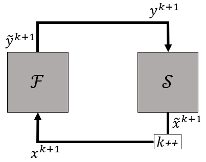
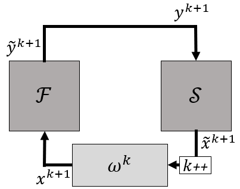
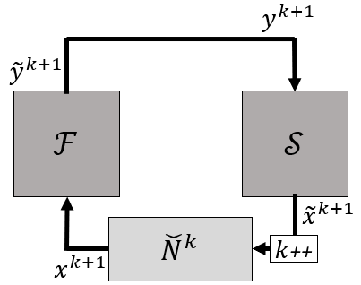
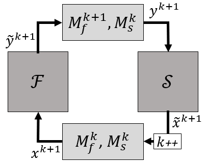

# Coupled solvers

This documentation describes the different types of coupled solvers which are available. A coupled solver refers to a coupling algorithm used to couple two solvers, typically a flow and a structural solver.
Some of these coupled solvers make use of one or more [models](models/models.md). An odd one out is `test_single_solver` which allows to test only one solver by coupling it to a dummy solver. 
All coupled solvers inherit from the class `CoupledSolver`.

In the parameter JSON file, the dictionary `coupled_solver` holds the `type` and the dictionary `settings`, but also the dictionary `predictor`, the dictionary `convergence_criterion` and the list `solver_wrappers` containing dictionaries (one for each solver wrapper, typically two). More information on these last three can be found in the [predictors](../predictors/predictors.md), [convergence criteria](../convergence_criteria/convergence_criteria.md) and the [solver wrappers](../solver_wrappers/solver_wrappers.md) documentation, respectively.

In the following subsections, explanatory schematics will be shown. In those schematics, $\mathcal{F}$ is the first solver with input $x$ and output $\widetilde{y}$ and $\mathcal{S}$ is the second solver with input $y$ and output $\widetilde{x}$. Typically, these solvers are a flow and structural solver, respectively.
Note that the column vectors such as $x$ and $y$ typically contain different components of the same variables or even different variables.
Often, the vectors $x$ and $\widetilde{x}$ contain the three components of displacement, whereas the vectors $y$ and $\widetilde{y}$ contain the pressure and the three components of traction. However, this has no importance for the coupled solver, as long as the in- and outputs of both solvers correspond to each other.
Further, the superscript $k=0\dots$ denotes the iteration, where $k+1$ is the current iteration.
Finally, the difference between the output $\widetilde{x}^k$ and input $x^k$ in the same iteration is defined as the residual $r^k=\widetilde{x}^k-x^k$, which is used to monitor the convergence of the calculation.

## The class CoupledSolver

This class is the base class for all coupled solvers.
The following parameters need to be included in the `settings` dictionary. Here they are listed in alphabetical order.

|                      parameter | type  | description                                                                                                                                                                                                                                                                                                                                                                                         |
|-------------------------------:|:-----:|-----------------------------------------------------------------------------------------------------------------------------------------------------------------------------------------------------------------------------------------------------------------------------------------------------------------------------------------------------------------------------------------------------|
|                    `anonymous` | bool  | (optional) Default: `false`. If `true`, the data field `info`, which contains the hostname of the machine, is not saved, see [results pickle file](#save-results).                                                                                                                                                                                                                                  |
|                        `debug` | bool  | (optional) Default: `false`. The data `solution_x` and `solution_y` are saved every iteration except of every time step (see [results pickle file](#save-results)). Residual distribution is also saved in additional field `solution_r` for every iteration.                                                                                                                                       |
|                      `delta_t` | float | Fixed time step size used in both solvers. For a steady simulation typically a value of 1 is taken.                                                                                                                                                                                                                                                                                                 |
|                    `case_name` |  str  | (optional) Default: `"case"`. Name of the case. This name is used to store a [pickle](https://docs.python.org/3/library/pickle.html) file with results (_`<case_name>_results.pickle`_) and a restart file (_`<case_name>_restart_ts<time_step>.pickle`_). If a files already exists, it is overwritten with the exception of the results file upon restart. In that case the new data is appended. |
|                 `restart_case` |  str  | (optional) Default: `case_name`. Only used when restart is performed (`timestep_start` > 0). Refers to the case which has to be restarted. The following pickle file will be used: _`<restart_case>_restart_ts<timestep_start>.pickle`_. This file path starts in the folder from where the simulation is performed.                                                                                |
|                 `save_restart` |  int  | (optional) Default: `-1`. Indicates the time step interval at which a restart pickle file has to be saved. A minus sign indicates only the file from the last interval is retained. A save of restart information also triggers a [results save](#save-results), if `save_results` is non-zero.                                                                                                     |
|                 `save_results` |  int  | (optional) Default: `0`. Time step interval at which a pickle file is written containing some main [results](#save-results) for ALL previous time steps. If `0`, no such information is stored and no pickle file is written.                                                                                                                                                                       |
| <nobr>`time_step_start`</nobr> |  int  | Time step number to (re)start a transient FSI calculation. If `0` is given, the simulation starts from scratch. Otherwise, the code looks for the relevant files to start from the corresponding time step. Not every solver wrapper implements restart, see the corresponding documentation for more information. For a steady simulation, the value should be `0`.                                |

`timestep_start` and `delta_t` are necessary parameters (also in a steady simulation), but can also be defined in the solver wrapper directly (e.g. for standalone testing).
If they are defined both here and in the solver wrapper, then the former value is used and a warning is printed.

**These parameters should also be specified for the coupled solvers inheriting from `CoupledSolver`.**

## Gauss-Seidel

The `type` for this coupled solver is `coupled_solvers.gauss_seidel`.

Gauss-Seidel or fixed-point iterations are the simplest way of coupling two solvers: the output of one solver is given to the other one without adjustment.

The following figure shows the basic methodology.



Gauss-Seidel iterations are very simple, but unstable for cases with incompressible flow and high added-mass.
A considerable convergence stabilization and acceleration is obtained by modifying the input to one or both of the solvers using derivative information, as will be shown further.

No additional settings are required, besides those for the [class `CoupledSolver`](#the-class-coupledsolver).

## Relaxation

The `type` for this coupled solver is `coupled_solvers.relaxation`.

Gauss-Seidel iterations are very simple, but are unstable for cases with incompressible flow and high added-mass.
A simple approach to mitigate this is applying relaxation, also called simple mixing. In this coupling method the output of first solver is still given to the other one without adjustment, but the output of the second solver is relaxed as follows:
$$
x^{k+1}=(1-\omega)x^k+\omega\widetilde{x}^k=x^k+\omega r^k
$$
with $x^k$ and $\widetilde{x}^k$, respectively the input for the first solver and the output of the second solver in iteration $k$.
The difference between both is called the residual $r^k=\widetilde{x}^k-x^k$.
The mixing or relaxation factor is $\omega$.

A symbolic schematic is given in the following figure.


This method is again quite simple, but able to stabilize some cases that fail with Gauss-Seidel iterations.
One can see that a lower $\omega$ corresponds to a larger portion of the previous solution to be used. This increases stability, but decreases convergence speed.
For more challenging problems, with incompressible flow and high added-mass, this approach will result in a very slow convergence, if it converges at all.

Beside the parameters required in the [class `CoupledSolver`](#the-class-coupledsolver), the following parameter needs to be included in the `settings` dictionary.

| parameter | type  | description        |
|----------:|:-----:|--------------------|
|   `omega` | float | Relaxation factor. |

## Aitken

The `type` for this coupled solver is `coupled_solvers.aitken`.

Gauss-Seidel iterations are very simple, but are unstable for many cases.
An approach to mitigate this is applying relaxation. However, the choice of a relaxation factor can be difficult: a high factor leads to a higher degree of stability, but a lower convergence speed. In more challenging cases there will be no acceptable value for $\omega$.
In this coupling method a dynamic relaxation factor is used. The output of the first solver is still given to the other one without adjustment, but the output of the second solver is relaxed as follows:
$$
x^{k+1}=(1-\omega^k)x^k+\omega^k\widetilde{x}^k=x^k+\omega^k r^k
$$
with $x^k$ and $\widetilde{x}^k$, respectively the input for the first solver and the output of the second solver in iteration $k$.
The difference between both is called the residual $r^k=\widetilde{x}^k-x^k$.
The mixing or relaxation factor is $\omega^k$ is dynamic in the sense that its value changes between iterations.

A symbolic schematic is given in the following figure.



The value of $\omega^k$ is determined by applying the secant method for scalars directly to vectors and projecting it on $r^k-r^{k-1}$
as follows
$$
\omega^k=-\omega^{k-1}\frac{(r^{k-1})^T(r^k-r^{k-1})}{(r^k-r^{k-1})^T(r^k-r^{k-1})}.
$$

The first relaxation factor in a time step is equal to the last relaxation factor from the previous time step $\omega^n$, but limited to $\omega^{max}$.
$$
\omega^0=\textrm{sign}(\omega^n)\min(|\omega^n|,\omega^{max}).
$$
The relaxation factor in the first time step is equal to $\omega^{max}$.

This method improves convergence speed drastically compared to Gauss-Seidel iterations, but even faster convergence can be obtained using quasi-Newton methods, which can be interpreted as using different relaxation factors for different Fourier modes of the output of the second solver.

Beside the parameters required in the [class `CoupledSolver`](#the-class-coupledsolver), the following parameter needs to be included in the `settings` dictionary.

|   parameter | type  | description                |
|------------:|:-----:|----------------------------|
| `omega_max` | float | Maximal relaxation factor. |

## IQNI

The `type` for this coupled solver is `coupled_solvers.iqni`.

The abbreviation IQNI refers to _interface quasi-Newton with inverse Jacobian_. In this type of coupling algorithm, the combination of the two solvers is seen as one system.
The input of the first solver $\mathcal{F}$ in iteration $k$ is denoted by $x^k$. The output of this solver is transferred unchanged to the second solver. The output of the second solver is denoted $\widetilde{x}^k$. The difference between output and input is called the residual $r^k=\widetilde{x}^k-x^k$.

A residual operator $\mathcal{R}(x)$ is defined, which returns the residual $r^k$ as a function of $x^k$. The goal is to find $x$ for which $\mathcal{R}(x)=0$, i.e. the root. This system of non-linear equations is solved using Newton-Raphson iterations as follows
$$
\Delta x^k=\mathcal{R}'^{-1}(x^k)\Delta r,
$$
where $\mathcal{R}'$ is the Jacobian of $\mathcal{R}$ with respect to $x$, $\Delta x^k=x^{k+1}-x^k$ is the difference between the input of two subsequent iterations 
and $\Delta r^k=0-r^k=-r^k$ is the difference between the desired and the current residual.
The iteration update can also be written as
$$
x^{k+1}=x^k-\mathcal{R}'^{-1}(x^k)r^k.
$$

However, this Jacobian is not accessible and therefore has to be approximated. Instead of approximating $\mathcal{R}'$, solving the linear system can be avoided by approximating its inverse directly.

The approximation procedure typically results in a low-rank Jacobian.
Whereas, a full rank Jacobian is required for the Newton-Raphson update to function properly. Therefore, the inverse Jacobian of an altered residual operator $\widetilde{\mathcal{R}}$ is approximated.
This altered residual operator is defined as follows
$$
r^{k+1}=\widetilde{\mathcal{R}}(\widetilde{x}^{k+1})=\mathcal{R}(\widetilde{x}^{k+1}-r^{k+1}).
$$
The inverse of both Jacobians are linked by
$$
\widetilde{\mathcal{R}}'^{-1}=\mathcal{R}'^{-1}+I,
$$
where $\widetilde{\mathcal{R}}'$ is the Jacobian of $\widetilde{\mathcal{R}}$ with respect to $\widetilde{x}$ and $I$ is the identity matrix.
For this Jacobian the following is valid
$$
\Delta \widetilde{x}^k=\widetilde{\mathcal{R}}'^{-1}(x^k)\Delta r^k,
$$
where $\Delta\widetilde{x}^k=\widetilde{x}^{k+1}-\widetilde{x}^k$ is the difference between the output of two subsequent iterations.
This Jacobian is also not known, but is approximated using a `model` and denoted by $\widetilde{N}^k$. The type of `model` and its settings are specified in the `settings` dictionary. This model returns an estimation of $\Delta\widetilde{x}^k$ given a value $\Delta r^k=-r^k$
$$
\Delta\widetilde{x}^k=\widetilde{N}^k \Delta r^k.
$$
Finally resulting in the update formula
$$
x^{k+1}=x^k+(\widetilde{N}^k-I)\Delta r^k=x^k-\widetilde{N}^k r^k+r^k.
$$

A symbolic schematic is given in the following figure.



For more information with respect to the approximation of the Jacobian, refer to the [models' documentation](models/models.md).
More information about residual operator methods can be found in [[1](#1), [3](#3)].

Beside the parameters required in the [class `CoupledSolver`](#the-class-coupledsolver), the following parameters need to be included in the `settings` dictionary. They are listed in alphabetical order.

| parameter | type  | description        |
|----------:|:-----:|--------------------|
|   `model` | dict  | Model component.   |
|   `omega` | float | Relaxation factor. |

## IBQN

The `type` for this coupled solver is `coupled_solvers.ibqn`.

The abbreviation IBQN refers to _interface block quasi-Newton_.
In type of coupling iteration, the system 
$$
\begin{cases}
    \mathcal{F}(x)-y=0
    \newline
    \mathcal{S}(y)-x=0
\end{cases}
$$
is solved in block form.
Again, $\mathcal{F}$ is the first solver with input $x$ and output $\widetilde{y}$ and $\mathcal{S}$ is the second solver with input $y$ and output $\widetilde{x}$. In this iteration scheme, the output of each solver is altered before being transferred to the other one.
Solving the system in block Newton-Raphson iterations results in
$$
	\begin{bmatrix}
		\mathcal{F}'(x) & -I
		\newline
		-I &   \mathcal{S}'(y)
	\end{bmatrix}
	\begin{bmatrix}
		\Delta x
		\newline
		\Delta y
	\end{bmatrix}
	=-
	\begin{bmatrix}
		\mathcal{F}(x)-y
		\newline
		\mathcal{S}(y)-x
	\end{bmatrix},
$$
where $\mathcal{F}'$ and $\mathcal{S}'$ denote the Jacobians of the first and second solver, respectively.
These Jacobians are, however, not accessible and are approximated using a `model` as specified in the `settings` dictionary. To the first and second solver correspond `model_f`, denoted here by $M_f$, and `model_s`, denoted bye $M_s$, respectively. For example, `model_f` returns an estimation of $\Delta\widetilde{y}^k=\widetilde{y}^{k+1}-\widetilde{y}^k$ given $\Delta x^k=x^{k+1}-x^k$
$$
\Delta\widetilde{y}^k=M_f^k \Delta x^k.
$$

Solving for $x^{k+1}=x^k+\Delta x^k$ requires solving the system
$$
\left(I-M_s^k M_f^k\right)\Delta x^k
=\widetilde{x}^k-x^k+M_s^k(\widetilde{y}^k-y^k)
$$
for $\Delta x^k$.
This is done matrix-free using the Generalized minimal residual method (GMRES).
Analogously, the input $y^{k+1}=y^k+\Delta y^k$ for the structural solver by solving 
$$
\left(I-M_f^{k+1}M_s^k\right)\Delta y^k
=\widetilde{y}^{k+1}-y^k+M_f^{k+1}(\widetilde{x}^k-x^{k+1})
$$
for $\Delta y^k$.

A symbolic schematic is given in the following figure.



The actual approximation of the Jacobian occurs with the same [models](models/models.md) as before.
More information about block methods can be found in [[1](#1)].

Beside the parameters required in the [class `CoupledSolver`](#the-class-coupledsolver), the following parameters need to be included in the `settings` dictionary. They are listed in alphabetical order.

|                               parameter | type  | description                                                 |
|----------------------------------------:|:-----:|-------------------------------------------------------------|
|              `absolute_tolerance_gmres` | float | Absolute tolerance used in the GMRES method.                |
|                               `model_f` | dict  | Model component corresponding to the first solver wrapper.  |
|                               `model_s` | dict  | Model component corresponding to the second solver wrapper. |
|                                 `omega` | float | Relaxation factor.                                          |
| <nobr>`relative_tolerance_gmres`</nobr> | float | Relative tolerance used in the GMRES method.                |

## IQNISM

The `type` for this coupled solver is `coupled_solvers.iqnism`.
This coupled solver is linked to the IQN-ILSM framework [[2](#2), [3](#3)].

The abbreviation IQNISM refers to _interface quasi-Newton with inverse Jacobian from surrogate model_.
This coupled solver belongs in the same category as the IQNI coupled solver: the combination of the two solvers is seen as one system, where the input of the first solver is transferred unchanged to the second solver.
The difference between output and input of this system is called the residual $r^k=\widetilde{x}^k-x^k$.

Just like for IQNI, a residual operator $\mathcal{R}(x)$ is defined and the root of this system of non-linear equations is solved using Newton-Raphson iterations, as follows
$$
x^{k+1}=x^k-\widetilde{N}^k r^k+r^k,
$$
where $\widetilde{N}^k$ is an approximation of the inverse Jacobian of $\mathcal{R}$ with respect to $\widetilde{x}$.

As in IQNI, this approximation is obtained using the `model` components.
Only here, two of them ar used: a `surrogate` model is used, in addition to a secant model.
The type of the models and their settings are specified in the `settings` dictionary:
The key of the surrogate model is `surrogate`, the key of the secant model is simply `model`.
Both of them are required. However, a dummy model can be used to disable one of them.
It is not recommended to disable the secant model (key `model`), as this model provides a Jacobian which is based on the actual problem.

The `surrogate` model solves a surrogate coupling problem at the start of every time step. The solution of this surrogate problem can be used as prediction (see [surrogate predictor](../predictors/predictors.md#surrogate)) and its Jacobian can be used here.
More information with respect to this type of model can be found in the [models' documentation](models/models.md).
If only the solution is to be used, the parameter `surrogate_modes` has to be set to `0`. This parameter denotes the number of modes from the surrogate Jacobian that should be used (starting from the first determined mode(s)).
Whether the surrogate solution is used for prediction, is determined by the `predictor` settings of the coupled solver. If the surrogate model does not provide a surrogate solution (only a surrogate Jacobian), surogate prediction is not possible.

The two models are combined as follows.
The secant model is used as before, but, as the secant Jacobian is defective (not full-rank), part of the residual is not _treated_ by this Jacobian.
For the modes corresponding to the part of the residual, not covered by the secant Jacobian, the surrogate Jacobian is used.
Note that, in this way, the secant Jacobian has preference over the surrogate Jacobian.

If the coupled solver in the surrogate model uses IQNISM as well, a nested surrogate construction is created, where for the part of residual not treated by the first surrogate Jacobian the second surrogate is used.

Next to the parameters required in the [class `CoupledSolver`](#the-class-coupledsolver), the following parameters need to be included in the `settings` dictionary. They are listed in alphabetical order.

|                            parameter | type  | description                                                                                                                                                                              |
|-------------------------------------:|:-----:|------------------------------------------------------------------------------------------------------------------------------------------------------------------------------------------|
|                              `model` | dict  | Model component.                                                                                                                                                                         |
|                              `omega` | float | (optional) Default: `1`. Relaxation factor for when the modes not covered by the surrogate model, when the secant model is not yet active.                                               |
|                          `surrogate` | dict  | Surrogate component.                                                                                                                                                                     |
|                    `surrogate_modes` |  int  | (optional) Default: all modes. The number of modes from the surrogate Jacobian that should be used in the Jacobian approximation (starting from the first determined surrogate mode(s)). |
| <nobr>`surrogate_synchronize`</nobr> | bool  | (optional) Default: `true`. Whether or not the surrogate model is synchronized at the end of the time step (only if the surrogate offers this capability).                               |

This coupled solver is closely related to the IQN-ILSM framework described in [[2](#2)].
The settings structure for the different surrogate models discussed in this work are:

=== "previous time steps (e.g. 50) (=reuse)"

    ``` json
	{
	  "type": "coupled_solvers.iqnism",
	  "settings": {
		"omega": 0.01,
		"model": {
		  "type": "coupled_solvers.models.mvmf",
		  "settings": {
			"q": 50
		  }
		},
		"surrogate": {
		  "type": "coupled_solvers.models.dummy_model"
		},
		...
	  },
	  ...
	}
    ```

=== "other surrogate model"

    ``` json
	{
	  "type": "coupled_solvers.iqnism",
	  "settings": {
		"model": {
		  "type": "coupled_solvers.models.mvmf",
		  "settings": {
			"q": 0
		  }
		},
		"surrogate": {
		  "type": "coupled_solvers.models.surrogate",
		  "settings": {
			...
		  }
		},
		...
	  },
	  ...
	}
    ```

=== "previous time steps + other surrogate model"

	``` json
	{
	  "type": "coupled_solvers.iqnism",
	  "settings": {
		"model": {
		  "type": "coupled_solvers.models.mvmf",
		  "settings": {
			"q": 50
		  }
		},
		"surrogate": {
		  "type": "coupled_solvers.models.surrogate",
		  "settings": {
			...
		  }
		},
		...
	  },
	  ...
	}
	```


## Explicit

The `type` for this coupled solver is `coupled_solvers.explicit`.

In contrast to the coupled solvers presented above, which implement strongly coupled or implicit techniques,
the explicit coupled solver does not iterate between the solvers within a time step.
Instead, the solvers are only evaluated once per time step.
Therefore, equilibrium between fluid and structure is not exactly satisfied. 
This technique is suitable for problems with low added mass, such as aeroelastic problems.
For problems with high added mass, they will fail due to stability issues.

No additional parameters are required besides the parameters required in the [class `CoupledSolver`](#the-class-coupledsolver).
For this coupled solver, the `convergence_criteria` are ignored.
The key `convergence_criteria` is still required, but it may remain empty.

## One-way

The `type` for this coupled solver is `coupled_solvers.one_way`.

In the one-way coupled solver the fluid forces are coupled to the structural model without feedback of the structural deformation to the fluid solver.
This coupled solver can be used when the structural deformation due to the fluid forces may be neglected.

No additional parameters are required besides the parameters required in the [class `CoupledSolver`](#the-class-coupledsolver).
For this coupled solver, the `convergence_criteria` and `preditors` are ignored.
The keys `convergence_criteria` and `predictors` are still required, but they may remain empty.

## Test single solver

The solver `test_single_solver` can be used to test new cases and solver settings. The idea behind this component is to only test one of the two solvers, while the other one is replaced by a dummy. This test environment inherits from the class `CoupledSolver`. The `type` for this coupled solver is `coupled_solvers.test_single_solver`.

### Dummy solver

To test only one solver, a dummy solver must be used. Such a dummy solver is implemented by a test class in the file _`dummy_solver.py`_.
Its path starts in the folder from where the simulation is performed, e.g. the same folder level as _`run_simulation.py`_. Upon run-time an instance of this class is made.
The test class can be setup in two ways (in order of priority):

1. Using a method named `get_input(interface_input_to, n)`, which sets the given `interface` to the desired value. This can, for example, be done using a pickle file from a previous calculation.
2. Using methods of the form `calculate_<variable>(x, y, z, n)`, with `<variable>` being a variable required by the tested solver, e.g. `displacement`, `pressure` or `traction`. The coordinates are the coordinates of the data location in the undeformed state and `n` is the time step. How these variables are defined inside these methods, is up to the user. However, the methods need to return the right format: a 3-element list or numpy array for vector variables and a 1-element list or numpy array for scalar variables.

Optionally, the test class can also have an `initialize(interface_input_to, solver_index)` method. If so, it will be called at the start of the simulation, with as `interface_input_to` the input `interface` of the tested solver. This is especially useful when the first approach is followed.
Some clarifying examples are given in the example [test_single_solver](../../examples/test_single_solver/test_single_solver.md). The test class name is provided in the JSON settings as a string. If no test class is provided or the value `None` is used, zero input will be used.

The JSON file requirements for the class `CoupledSolverTestSingleSolver` are different from the other coupled solvers in the sense that they only require the `type`, which is `coupled_solvers.test_single_solver`, the dictionary `test_settings` and the list `solver_wrappers` containing at least one solver wrapper. The keys for the `test_settings` dictionary are listed in alphabetical order below.

|                     parameter | type  | description                                                                                                                                                                                                                                                                                                             |
|------------------------------:|:-----:|-------------------------------------------------------------------------------------------------------------------------------------------------------------------------------------------------------------------------------------------------------------------------------------------------------------------------|
|                       `debug` | bool  | (optional) Default: `false`. Residual distribution is also saved in additional field `solution_r` for every iteration (see [results pickle file](#save-results)).                                                                                                                                                       |
|                     `delta_t` | float | (optional) Time step size to be used in the test. Is optional as long as this value is defined in the `settings` dictionary. If a different value is defined in both dictionaries, the one defined in `test_settings` is chosen.                                                                                        |
|                   `case_name` |  str  | (optional) Name of the case used to store a [pickle](https://docs.python.org/3/library/pickle.html) file with results. The pickle file will have the name _`<case_name>_<test_solver_working_directory>_results.pickle`_. If not provided, the value from `settings` is used or if `settings` is not present: `"case"`. |
|                `save_results` |  int  | (optional) Default: `0`. Time step interval at which a pickle file is written containing some main [results](#save-results) for ALL previous time steps. If `0`, no such information is stored and no pickle file is written. If not provided, the value from `settings` is used or if `settings` is not present: `0`.  |
|                `solver_index` |  int  | Has a value `0` or `1` and indicates the solver that one wants to test. `0` indicates the first solver wrapper that appears in the JSON-file, `1` the second one.                                                                                                                                                       |
|                  `test_class` |  str  | (optional) Refers to the class to use in the *`dummy_solver.py`*. If not provided or `null`, zero input will be used.                                                                                                                                                                                                   |
| <nobr>`timestep_start`</nobr> |  int  | (optional) Time step to start from. If not provided the value defined in the `settings` dictionary is used. If the `settings` dictionary is not present, zero is used.                                                                                                                                                  |

Other dictionaries, used for the actual calculation can be kept, but will not be used, with the possible exception of the `settings` dictionary.
The `settings` dictionary is used to look up `delta_t`, `timestep_start`, `save_results` and `case_name` if not provided in `test_settings`. Note that `test_settings` has priority over the parameters defined in `settings`. This means a calculation can be tested, by only adding the `test_settings` dictionary and changing the coupled solver `type` to `coupled_solvers.test_single_solver` and without altering anything else.
An illustration can be found in the example [test_single_solver](../../examples/test_single_solver/test_single_solver.md).

The optional pickle file, which saves some [results](#save-results), uses the name as specified by the JSON settings followed by an underscore and the solver working directory.

During run time, the norm of $x$ and $y$ are printed. A residual does not exist here. The arrays $x$ and $y$ do not necessarily have a physical meaning, but are the in- and output of the first solver, which is typically the flow solver. Then, the vector $y$ will contain pressure and traction components for all points. Nonetheless, these values can be useful to verify that the solver wrapper runs.

The test environment `test_single_solver` tests only the `solver_wrapper` itself, no mapping is included.

## Save results

In each coupled solver, a positive non-zero value can be assigned to the `save_results` parameter, in order to save some results into a [pickle](https://docs.python.org/3/library/pickle.html) file. The key `case_name` dictates the name of this file as explained above. The pickle file is written corresponding to the time step interval as dictated by `save_results`, but contains information for all time steps.
In other words, if the parameter is non-zero, it only controls the writing frequency and not the content of the file. If `save_results` is zero, no result are kept and no file is written.
For a non-zero value of `save_restart`, a save for [restart purposes](#saving-restart-files) also triggers the saving of the results file.
The pickle file may be used by the postprocessing files included with the examples. It contains a dictionary with the following keys:

|                            key | value type  | description                                                                                                                                                                                                                                                                                                                   |
|-------------------------------:|:-----------:|-------------------------------------------------------------------------------------------------------------------------------------------------------------------------------------------------------------------------------------------------------------------------------------------------------------------------------|
|                   `solution_x` | numpy array | Contains the values of the vector $x$ (typically displacement) for every time step as columns of a 2 dimensional np-array. The initial value is included as well, such that the number of column will be one higher than the number of calculated time steps. The vector $x$ refers to the input of the first solver wrapper. |
|                   `solution_y` | numpy array | Contains the values of the vector $y$ (typically pressure and traction) for every time step as columns of a 2 dimensional np-array, similar to `solution_x`. The vector $y$ refers to the input of the second solver wrapper.                                                                                                 |
|                  `interface_x` |  interface  | Interface object used as input for the first solver wrapper.                                                                                                                                                                                                                                                                  |
|                  `interface_y` |  interface  | Interface object used as input for the second solver wrapper.                                                                                                                                                                                                                                                                 |
|                   `iterations` |    list     | Contains the performed number of coupling iterations for every time step.                                                                                                                                                                                                                                                     |
|                     `residual` |    list     | Nested list, which contains for each time step a list, on its turn containing residuals, one for every iteration of that time step.                                                                                                                                                                                           |
|                     `run_time` |    float    | Equals the total computation time, i.e. the time between initialization and finalization (excluding initialization).                                                                                                                                                                                                          |
| <nobr>`time_allocation`</nobr> |    dict     | Dictionary containing a detailed overview of the time spent in the different components for the current simulation. Upon restart, the time allocation of previous runs are stored in sequence under the key `previous_calculations`.                                                                                          |                                                                                                                                                                                                       
|                      `delta_t` |    float    | Equals the used time step size.                                                                                                                                                                                                                                                                                               |
|               `timestep_start` |     int     | Equals the used start time step.                                                                                                                                                                                                                                                                                              |
|                    `case_name` |     str     | Name of the case.                                                                                                                                                                                                                                                                                                             |
|                         `info` |     str     | Additional info, such as date, restart history and hostname of machine on which simulation is run. Can be disabled using the optional parameter `anonymous`.                                                                                                                                                                  |

In simulations with a large number of points on the interface and a very large number of time steps, this file might take up a larger amount of storage.

Finally, there is also a debug option, which can be activated by setting the boolean `self.debug` on `true` in the code file itself. Then, the above information is stored every iteration. Additionally, the residual vector is saved as well using the key `solution_r`, analogously to `solution_x` and `solution_y`. Note, however, that the pickle file can be become very large in that case.
This option is only meant for debugging a new coupling algorithm. It should not be used in combination with restart.

## Restart

The restart functionality is very useful to continue a calculation which has been stopped, either intentionally or unintentionally.
The goal is to continue as if the code had never been interrupted.

In order to restart from time step $n$, the coupled solver instructs the predictor and possibly one or more models to save the necessary data in the state at the end of time step $n$ in a pickle file.
By saving the predictor, the initial guess at the start of the first time step(s) will be the same, as the predictor typically extrapolates the solution from the previous time step(s) in some way.
The model(s) are saved such that the behavior of the coupling algorithm is the same.
This is only important if the model behavior depends on data from previous time steps, e.g. models with reuse ($q>0$).

Besides restarting the exact same simulation, it could be useful to change the settings from the coupled solver or occasional model(s) when restarting.
This is possible, refer to the [models](models/models.md#restart) documentation for more details.
Changing the type of coupled solver or occasional model is also possible, but no information will be transferred between the different types, meaning that for example all information from previous time steps is lost.

For the predictors the same is true, except for the extrapolators for which there is information transfer.
See the documentation of the [predictors](../predictors/predictors.md#restart) for more details.

The following table gives an overview of the coupled solvers which save one or more additional components or values.

|                     type | additional components saved for restart |
|-------------------------:|-----------------------------------------|
| `coupled_solvers.aitken` | `omega`                                 |
|   `coupled_solvers.iqni` | `model`                                 |
|   `coupled_solvers.ibqn` | `model_f` and `model_s`                 |
| `coupled_solvers.iqnism` | `model` and `surrogate`                 |

However, not only the predictor and coupling algorithm depend on previous time steps; this is typically also the case for the solvers.
Therefore, it is the responsibility of the solver wrappers, to set up the solvers correctly for restart: they need to ensure that the variables in the whole computational domain are set to the value of time step $n$.
Moreover, its vital that they reconstruct the exact same model parts as in the initial calculation.
In other words, the undeformed coordinates must be the same.
Conversely, they are not required to initialize the interfaces with the correct data from time step $n$, as this taken care of by the predictor in the coupled solver.
Only when both solver wrappers allow restart, is it possible to restart a calculation!

### Saving restart files

During a calculation it is possible to save restart pickle files.
As described above the pickle file for restart has a name (_`<case_name>_restart_ts<time_step>.pickle`_), based on the setting `case_name`.

The frequency of saving a restart pickle file is determined by the `save_restart` interval as described above.
Remark that it is only useful to save the restart pickle file, when the solver data are saved as well.
Therefore, the `save_restart` parameter is transferred automatically to the solver wrappers.

If `save_results` is non-zero, a save of restart information also triggers the saving of the [results pickle file](#save-results), to avoid discontinuity of this file.

### Performing restart

To restart a case, `timestep_start` has to be a positive integer above zero.
The first time step that will be calculated is `timestep_start` plus one.
The methodology described above does not allow to change any settings of the predictor or model(s), nor the type of coupled solver.
Upon restart, this condition is checked, as well as the presence of the pickle file for restart.
This file is identified by the setting `restart_case` as _`<restart_case>_restart_ts<timestep_start>.pickle`_.
Additionally, it is checked that the new model parts are exactly the same as the previous ones.

It is important to realize that the pickle file only makes sure that the initial guess and coupling algorithm work as before.
The physical effect of previous time steps dealt with by the solver wrappers.
**Therefore, in order to be able to perform a restart, the solver files for the corresponding time step also need to be present!**

When performing restart, the new data will be neatly appended to the already existing results pickle file, leaving out existing time step data after the new time step start.
As a result, the results pickle file looks exactly as if the calculation was never stopped, except the fields `run_time`, `time_allocation` and `info`.
The latter provides a very short log of when restart is performed.

If the results pickle file would not be found for any reason, the user is informed and a new one is made, with the correct `timestep_start`.
Note that the presence of the restart pickle file on the other hand is required. If the `case_name` is changed, the restart can still be performed by providing the case name for restart using `restart_case` (see explanation above).

## References

<a id="1">[1]</a> 
[Delaissé N., Demeester T., Fauconnier D. and Degroote J., "Comparison of different quasi-Newton techniques for coupling of black box solvers", in ECCOMAS 2020, Proceedings, Paris, France, 2021.](http://hdl.handle.net/1854/LU-8685199)

<a id="2">[2]</a>
[Delaissé N., Demeester T., Fauconnier D. and Degroote J., "Surrogate-based acceleration of quasi-Newton techniques for fluid-structure interaction simulations", Computers & Structures, vol. 260, pp. 106720, 2022.](http://hdl.handle.net/1854/LU-8728347)

<a id="3">[3]</a> 
[Delaissé N., Demeester T., Haelterman R. and Degroote J., "Quasi-Newton methods for partitioned simulation of fluid-structure interaction reviewed in the generalized Broyden framework", Archives of Computational Methods in Engineering, vol. 30, pp. 3271-3300, 2023.](https://doi.org/10.1007/s11831-023-09907-y)
