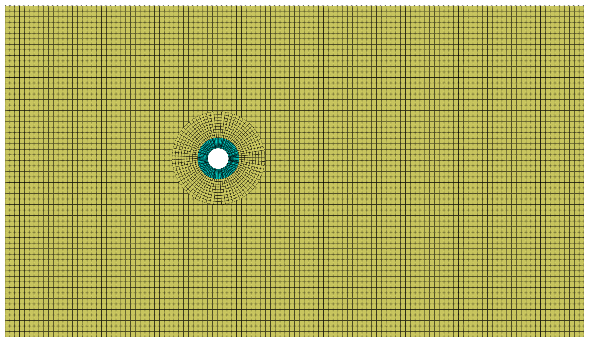

# Fluid-solid interaction tutorial using preCICE: `flexibleOversetCylinder`

---

## Tutorial Aims

- Demonstrate how to use preCICE to couple `solids4Foam` and `overPimpleDyMFoam`
  overset solver for a fluid-solid interaction problem.
- Show how to extend a standard fluid dynamics OpenFOAM tutorial to include
  fluid-solid interaction using solids4foam with preCICE.

---

## Case Overview

This case is an extension of the overset
[cylinder](https://develop.openfoam.com/Development/openfoam/-/tree/master/tutorials/incompressible/overPimpleDyMFoam/cylinder)
tutorial present in the OpenFOAM ESI versions, which uses the
`overPimpleDyMFoam` solver. The original tutorial consists of air flowing over a
cylinder (diameter = 1 m), where the cylinder is included using an overset
(chimera) meshing approach. In the current tutorial, the rigid cylinder is
replaced by moving a deformable ring, resulting in a fluid-solid interaction
problem (Figure 1). For demonstration purposes, this tutorial shows how to solve
the problem using the standard `overPimpleDyMFoam` solver coupled to a
solids4foam solid solver using [preCICE](https://precice.org), which is an
open-source coupling library for partitioned multi-physics simulations.


**Figure 1: `flexibleOversetCylinder` case mesh showing the fluid domain
(yellow) and the solid domain (cyan)**

The fluid domain consists of air (density = 1 kg/m3, viscosity = 1.48e-5 m2/s)
entering the domain inlet at 10 m/s. The solid domain is an isotropic elastic
ring (outer diameter = 1 m, inner diameter = 0.5 m) with a Young's modulus of
0.2 MPa and a Poisson's ratio of 0.45; this broadly corresponds to soft rubber.
Small strains are assumed in the solid, where the
`linearGeometryTotalDisplacement` solids4foam solid model is chosen. A
time-varying displacement is prescribed on the inner boundary of the solid ring
according to a sine curve about the starting point with an amplitude of 1 m in
the vertical direction and 0.5 m in the horizontal direction.

Coupling between the solid and fluid domain is achieved by preCICE using a
partitioned Dirichlet-Neumann approach, which is accelerated using the IQN-ILS
Quasi-Newton scheme in the current case. See the
[preCICE documentation](https://precice.org/configuration-acceleration.html) for
further details. This is the same IQN-ILS approach that is implemented within
solids4foam. Mapping of the fields between the solid and fluid interfaces is
performed using
[radial-basis function mapping](https://precice.org/configuration-mapping.html#radial-basis-function-mapping).

The first-order Euler time scheme is used for the solid and fluid equations. The
time step is 5 ms, and the total time is 2 s.

---

## Running the Case

To run a fluid-solid interaction case using OpenFOAM and preCICE, the solid and
fluid solvers are started independently, where communication is controlled using
preCICE function objects. To run an OpenFOAM or solids4foam case with preCICE
requires the following modifications:

- Fluid case
  - Add the preCICE OpenFOAM adapter function object to `system/controlDict`,
    for example:

    - ```c++
      preCICE_Adapter
      {
          type preciceAdapterFunctionObject;
          libs ("libpreciceAdapterFunctionObject.so");
      }
      ```

  - Add the `preciceDict` to the `system` directory; for example, see the
    preCICE
    [perpendicular-flap tutorial OpenFOAM fluid case](https://github.com/precice/tutorials/blob/master/perpendicular-flap/fluid-openfoam/system/preciceDict).
  - Use the `displacementLaplacian` mesh motion solver; this means that the
    `pointDisplacement` field needs to be specified in the 0 directory, where
    the interface condition is set to `fixedValue`;
  - Optionally, add the `solids4Foam::removeEmptyDirs` bash call to the end of
    the Allrun script; the purpose of this function is to remove empty time
    directories which are inadvertently created by preCICE.
- Solid case
  - Add the preCICE OpenFOAM adapter function object to `system/controlDict`,
    the same as for the fluid case.
  - Add the `preciceDict` to the `system` directory; for example, see the
    preCICE
    [perpendicular-flap tutorial solids4foam case](https://github.com/precice/tutorials/blob/master/perpendicular-flap/solid-solids4foam/system/preciceDict).
  - Use the `solidForce` boundary condition for the interface in the
    displacement solution field:

    ```c++
    interface
    {
        type            solidForce;
        forceField      solidForce;
        value           uniform (0 0 0);
    }
    ```

  - As in the fluid case, you can optionally add the
    `solids4Foam::removeEmptyDirs` bash call to the end of the Allrun script.

You can see these modifications in the tutorial at
`solids4foam/tutorials/fluidSolidInteraction-preCICE/flexibleOversetCylinder`.

To run the tutorial, we suggest using two terminal tabs: one for the solid; and
one for the fluid. Note that the solid and fluid cases can use different
versions of OpenFOAM as long as they are supported by the preCICE adapter
function object. In the solid terminal, start the solid solver with the included
Allrun script, i.e. `./Allrun.solid`; while in the fluid terminal, start the
fluid solver, i.e. `./Allrun.fluid`. Notice that just like in the original
OpenFOAM tutorial, the fluid directory contains two sub-directories:
`cylinderMesh`; and `cylinderAndBackground`.

---

## Expected Results

The time-varying velocity field in the fluid and hydrostatic stress in the solid
are shown in Video 1. A bouncing type behaviour can be seen in the solid in the
early stages of the simulation, where the acceleration on the solid is greatest
(Figure 2).



**Video 1: Velocity field within the fluid domain and hydrostatic stress field
within the solid domain in the `flexibleOversetCylinder` tutorial**


**Figure 2: Snapshot of the solid deformation in the early stages of the
`flexibleOversetCylinder` tutorial**
