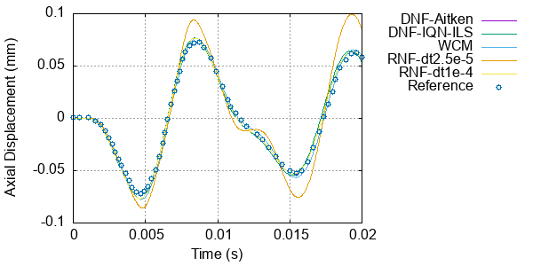
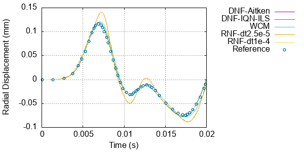
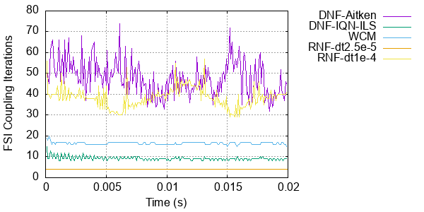

# My fourth tutorial: `3dTube`

---

## Case overview

This case consists of a flow pulse moving in an elastic thick tube. It demonstrates different formulations and models available in solids4foam for fluid-solid interaction (FSI). A schematic of the case is shown in the figure below.


The fluid is assumed incompressible and Newtonian, with a density of 1000.0 kg/m3 and kinematic viscosity 3e-6 m2/s, flowing due to a pressure wave, with peak 1333.3 Pa, applied at the tube inlet for a duration of 3e-3 s.

The tube wall is assumed an isotropic elastic body under the small-strain regime, modelled with Hooke's law, for consistency with the original publication that proposed this benchmark. The density is 1200.0 kg/m3, Young's modulus is 300 kPa, and  Poisson's ratio is 0.3.

The case demonstrates a situation where the coupling between the fluid and the solid is strong. This strong coupling is caused by the closeness of the fluid and solid densities. Rigorously, this situation occurs when the ratio 'solid density/fluid density' is near 1.0. When this situation occurs, and you are using a *partitioned strategy* to solve the FSI coupling, i.e. where the fluid and solid sub-problems are solved separately as is the case in solids4foam, the so-called 'added-mass operator' renders the problem difficult to solve numerically due to numerical instabilities.

The solution to improve the convergence is applying a coupling algorithm to stabilise the solution. The typical strongly-coupled Dirichlet-Neumann
coupling algorithm is of the form:

```pseudocode
for all time-steps
    do
        solve fluid domain
        pass fluid interface forces to the solid interface
        solve solid domain
        pass solid interface velocities to the fluid
        interface using under-relaxation
        update the fluid mesh
    while not converged
end
```

For this tutorial, you can use at least three coupling approaches:

1. **Dirichlet-Neumann formulation with an incompressible fluid**: We use the `pimpleFluid` model, the `newMovingWallVelocity` BC in the 'wall' boundary for the flow velocity, and the `zeroGradient` BC on the 'wall' boundary for the pressure.  This configuration is the typical partitioned approach for handling FSI problems. To accelerate the convergence of the FSI iterations, two approaches are implemented:
    a. Aitken's dynamic relaxation;
    b. the IQN-ILS algorithm. 

2. **Dirichlet-Neumann formulation with a weakly compressible fluid**: The convergence of the FSI coupling can be improved by using a compressible fluid model, where the compressibility is controlled by the bulk modulus. Incompressible behaviour is approached as the bulk modulus tends to infinity. We use the `sonicLiquidFluid` fluid model in solids4foam to achieve this weakly compressible behaviour with the same boundary conditions as in approach (1). Either Aitken's dynamic relaxation or the IQN-ILS algorithms can accelerate the FSI coupling. In the tutorial, we employed a fluid bulk modulus of 1 MPa. More information on this weakly compressible law and its effect on FSI computations can be found at, for example, [E. Tandis and A. Ashrafizadeh, “A numerical study on the fluid compressibility effects in strongly coupled fluid–solid interaction problems,” Engineering with Computers, 2019, doi: 10.1007/s00366-019-00880-4.](https://doi.org/10.1007/s00366-019-00880-4)

3. **Robin-Neumann formulation with an incompressible fluid**: In this approach, which is currently only available when using solids4foam with foam-extend-4.1, the added-mass effect is directly approximated in the fluid interface boundary conditions. It leads to a Robin boundary condition for the fluid pressure field on the FSI interface. Support for this is implemented in the `pimpleFluid` model, where we also need to apply special interface boundary conditions:
    - `elasticWallPressure` for the fluid pressure field;
    - `elasticWallVelocity` for the fluid velocity field. 

In all three approaches, the solid domain setup is exactly the same. The momentum and continuity equations are solved for the fluid flow and the momentum equation for the solid. In this case, the solid is solved using an incremental small strain formulation (the `linearGeometry` solid model). One-quarter of the tube's cross-section is considered, although the case could actually be modelled as 2-D axisymmetric. The test is run for 0.02 s.

---

## Running the case

The tutorial case can be run using the included `Allrun` scripts: `Allrun.pimpleFluid` for approaches 1 and 3, i.e.`> ./Allrun.pimpleFluid`, and `> ./Allrun.sonicLiquidFluid` for approach 2. These scripts update the case with links to the correct files to be used by each approach.

Additionally, for approach 1, you can use the Aitken or IQN-ILS coupling algorithm, which is specified in the `constant/fsiProperties` file. 

If running approach 3 (Robin-Neumann formulation), you should change the boundary conditions in the `0/fluid/p` and `0/fluid/U` files
to the `elastic*` versions. 

```tip
Remember that a tutorial case can be cleaned and reset using the included `Allrun` script, i.e. `./Allclean`.
```

---

## Expected results

This case has been proposed as a benchmark for FSI problems. The solution for point A's axial and radial displacement (see figure above) is available in: [A. Lozovskiy, M. A. Olshanskii, and Y. V. Vassilevski, “Analysis and assessment of a monolithic FSI finite element method,” Computers and Fluids, vol. 179, pp. 277–288, 2019, doi: 10.1016/j.compfluid.2018.11.004.](https://doi.org/10.1016/j.compfluid.2018.11.004)

We compare the solution for the three approaches in the two figures below:

- DNF-Aitken: Dirichlet-Neumann formulation with Aitken's acceleration;
- DNF-IQN-ILS: Dirichlet-Neumann formulation with IQN-ILS acceleration;
- WCM: weakly compressible formulation;
- RNF: Robin-Neumann formulation.




Overall, all solutions agree well with the reference solution. Only the Robin-Neumann formulation solution shows discrepancies for different time-step values (dt in the legend). This behaviour is expected due to the first-order approach used for the temporal discretisation, as detailed in [Ž. Tuković, M. Bukač, P. Cardiff, H. Jasak, and A. Ivanković, “Added Mass Partitioned Fluid–Structure Interaction Solver Based on a Robin Boundary Condition for Pressure,” OpenFOAM, pp. 1–22, 2019, doi: 10.1007/978-3-319-60846-4_1.](https://link.springer.com/chapter/10.1007/978-3-319-60846-4_1).

The figure below shows the performance comparison among the different strategies in terms of the number of FSI coupling iterations.



---

## Tips for fluid-solid analyses

All the tips provided in the beamInCrossFlow tutorial also apply to this case. But note from this case that different coupling algorithms may perform much better; however, they may only sometimes help, and you have to play with the settings to find a converging/stable solution.
