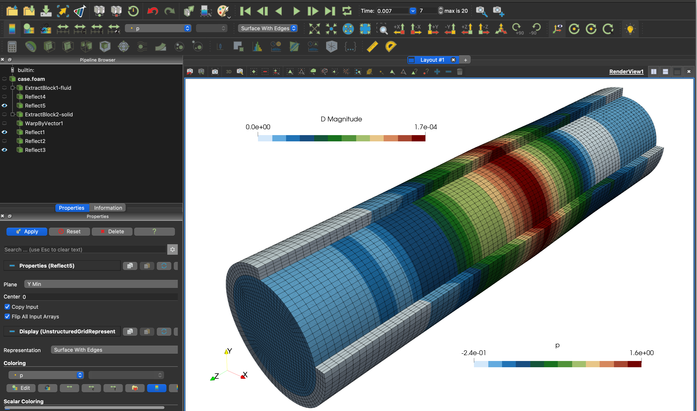

# My fourth tutorial: `3dTube`

You can find the files for this tutorial under
[`tutorials/fluidSolidInteraction/3dTube`](https://github.com/solids4foam/solids4foam/tree/master/tutorials/fluidSolidInteraction/3dTube).

---

## Tutorial Aims

- Demonstrate the solution of an internal flow fluid-solid interaction problem;
- Demonstrate the fluid-solid interaction coupling approaches available in
  solids4foam;
- Provide insight into the relative performance of the different coupling
  approaches for internal flows;
- Examine the effect of time-step on the performance of the coupling approaches.

## Case Overview

This case consists of a pressure pulse applied in a thick-walled elastic tube
(Figure 1).


### Figure 1: Wave propagation in an elastic pipe

The fluid is assumed incompressible, Newtonian and isothermal, with a density of
1000.0 kg/m3 and kinematic viscosity of 3e-6 m2/s. A pressure wave, with a peak
of 1333.3 Pa, is applied at the tube inlet for a duration of 3e-3 s. The outlet
pressure is held at 0 Pa throughout.

The tube wall is assumed to be an isotropic elastic body under the small-strain
regime, modelled with Hooke's law, for consistency with the original publication
that proposed this benchmark. The density is 1200.0 kg/m3, Young's modulus is
300 kPa and Poisson's ratio is 0.3.

The case demonstrates a strong coupling between the fluid and the solid due to
the high fluid-to-solid density ratio. When using a partitioned solution
approach (as in solids4foam), the so-called 'added-mass operator' makes the
problem difficult to solve due to numerical instabilities.

Currently, in solids4foam, there are two classes of approaches for partitioned
FSI coupling:

- **Dirichlet-Neumann coupling**, where a Dirichlet condition is applied to the
  fluid velocity and Neumann conditions to the fluid pressure and solid
  displacement. This approach **does not** require modification of the
  underlying fluid solver; see
  [Tuković Ž, Karač A, Cardiff P, Jasak H, Ivanković A, 2018, OpenFOAM finite
  volume solver for fluid–solid interaction. Trans FAMENA,
  42(3):1–31.10.21278/TOF.42301](https://hrcak.srce.hr/206941);

- **Robin-Neumann coupling**, where a Dirichlet condition is applied to the
  fluid velocity, a Robin condition to the fluid pressure, and a Neumann
  condition to the solid displacement. This approach **does** require
  modification of the underlying fluid solver, and hence, it cannot be considered
  a _black-box_ coupling approach; see
  [Tuković Ž, Bukač M, Cardiff P, Jasak H, Ivanković A, 2018, Added mass
  partitioned fluid–structure interaction solver based on a robin boundary
  condition for pressure. In: OpenFOAM selected papers of the 11th workshop.
  Springer, Berlin, pp 1–23](https://doi.org/10.1007/978-3-319-60846-4_1).

For each of these two classes of approaches, we can employ different methods to
accelerate the FSI iteration loop convergence; within solids4foam, we can use:

- Aitken's dynamic relaxation;

- the IQN-ILS algorithm of
  [Joris Degroote, Robby Haelterman, Sebastiaan Annerel, Peter Bruggeman, Jan
  Vierendeels, Performance of partitioned procedures in fluid–structure
  interaction, Computers & Structures, 88, 7–8, 2010,
  10.1016/j.compstruc.2009.12.006](https://www.sciencedirect.com/science/article/abs/pii/S0045794909003022).

As well as using these acceleration algorithms, we can also use a **weakly
compressible** fluid model rather than the standard **fully incompressible**
model; for FSI, weakly compressible fluid models how been shown to improve
convergence, for example, see
[E. Tandis and A. Ashrafizadeh, “A numerical study on the fluid compressibility
effects in strongly coupled fluid–solid interaction problems,” Engineering with
Computers, 2019, doi: 10.1007/s00366-019-00880-4.](https://doi.org/10.1007/s00366-019-00880-4).

In this tutorial, we will compare six variants of the approaches above:

1. **Dirichlet-Neumann formulation with Aitken's acceleration and an
   incompressible fluid model**: We use the `pimpleFluid` fluid model.
2. **Dirichlet-Neumann formulation with IQNILS acceleration and an
   incompressible fluid model**: We use the `pimpleFluid` fluid model.
3. **Dirichlet-Neumann formulation with Aitken's acceleration and a weakly
   compressible fluid model**: We use the `sonicLiquidFluid` fluid model.
4. **Dirichlet-Neumann formulation with IQNILS acceleration and a weakly
   compressible fluid model**: We use the `sonicLiquidFluid` fluid model.
5. **Robin-Neumann formulation with an incompressible fluid**: Support for this
   approach is implemented in the `pimpleFluid` model, where we apply special
   interface boundary conditions: `elasticWallPressure` for the fluid pressure
   field, and `elasticWallVelocity` for the fluid velocity field.
6. **Dirichlet-Neumann formulation with IQNILS acceleration and an
   incompressible fluid model using preCICE**: This approach is the same as
   approach 1, except the [preCICE](http://precice.org) coupling implementation
   is used. preCICE is an open-source coupling library for partitioned
   multi-physics simulations. In this case, `solids4Foam` is used as the solid
   solver, and standard `pimpleFoam` is used as the fluid solver (as opposed to
   solids4foam's `pimpleFluid` fluid model). Due to implementation differences,
   this preCICE IQNILS approach may perform differently than the built-in
   solids4foam approach.

In all approaches, the solid domain setup is the same, where an
incremental small strain formulation is used (the `linearGeometry` solid model).
One-quarter of the tube's cross-section is considered, although the case could
be modelled as 2-D axisymmetric. The test is run for 0.02 s. A
relatively tight FSI loop tolerance of 1e-6 is used for all approaches based on
the interface motion. For approach 6 (preCICE), the relative displacement
tolerance was set to 1e-6, and the relative force tolerance was set to 1e-3.

In all cases, the first-order Euler time scheme is used for the solid and fluid.

---

## Running the Case

For approaches 1 to 5, the tutorial case is located at `solids4foam/tutorials/fluidSolidInteraction/3dTube`.
The tutorial case can be run using the included `Allrun` script, i.e.
`> ./Allrun`. In this case, the `Allrun` script is

```bash
#!/bin/bash

# Source tutorial run functions
. $WM_PROJECT_DIR/bin/tools/RunFunctions

# Example usage
# ./Allrun
# ./Allrun sonicLiquidFluid
# ./Allrun robin

# Select approach
if [[ "$1" == "sonicLiquidFluid" ]]; then
    # Dirichlet-Neumann sonicLiquidFluid approach
    echo "Using the Dirichlet-Neumann sonicLiquidFluid approach"
    for file in $(find ./0 ./constant ./system -name '*.sonicLiquidFluid')
    do
        ln -vnsf ${file##*/} ${file%.*}
    done
elif [[ "$1" == "robin" ]]; then
    # Robin-Neumann pimpleFluid approach
    echo "Using the Robin-Neumann sonicLiquidFluid approach"
    for file in $(find ./0 ./constant ./system -name '*.robin')
    do
        ln -vnsf ${file##*/} ${file%.*}
    done
else
    # Dirichlet-Neumann pimpleFluid approach
    echo "Using the Dirichlet-Neumann pimpleFluid approach"
    for file in $(find ./0 ./constant ./system -name '*.pimpleFluid')
    do
        ln -vnsf ${file##*/} ${file%.*}
    done
fi

# Source solids4Foam scripts
source solids4FoamScripts.sh

# Check case version is correct
solids4Foam::convertCaseFormat .

# Check fvSolution for foundation version
if [[ $WM_PROJECT = "OpenFOAM" ]] && [[ $WM_PROJECT_VERSION != *"v"* ]]
then
    if [[ -f "${CASE_DIR}"/system/fluid/fvSolution ]]
    then
        echo "OpenFOAM.org specific: replacing 'residualControl' with"
        echo " 'outerCorrectorResidualControl' in system/fluid/fvSolution"
        sed -i "s/residualControl/outerCorrectorResidualControl/g" \
            "${CASE_DIR}"/system/fluid/fvSolution
    fi
fi

# Create meshes
solids4Foam::runApplication -s solid blockMesh -region solid
solids4Foam::runApplication -s fluid blockMesh -region fluid

# Run solver
solids4Foam::runApplication solids4Foam

# Create plots
if command -v gnuplot &> /dev/null
then
    echo "Generating plots"
    gnuplot -p displacement.gnuplot &> /dev/null
    gnuplot -p fsiConvergence.gnuplot &> /dev/null
else
    echo "Please install gnuplot if you would like to generate the plots"
fi
```

As can be seen above, the `Allrun` script can be run with different values for
the first argument `$1` passed to the script. Running the script without any
argument (i.e., `./Allrun`) uses the FSI coupling approach 1 (Aitken's) or 2
(IQNILS), depending on the value of `fluidSolidInterface` in `constant/fsiProperties`;
for example, `fluidSolidInterface    IQNILS;`. The weakly compressible fluid
model (approaches 3 and 4) can be used by running the `Allrun` script with the
argument `sonicLiquidFluid`, i.e. `./Allrun sonicLiquidFluid`. Once again,
switching between approach 3 (Aitken's) and 4 (IQNILS) is controlled via the
`fluidSolidInterface` setting in `constant/fsiProperties`. Finally, the
Robin-Neumann coupling approach (approach 5) can be used by executing the
`Allrun` script as `./Allrun robin` for approach 5. Examining the `U` and `p`
files in `0/fluid.robin/` shows that the Robin approach uses the custom
conditions `elasticWallVelocity` and `elasticWallPressure` at the interface.

The `Allrun` script updates the case with links to the correct files to be used
by each approach. The Allrun script runs the OpenFOAM `blockMesh` utility to
generate the meshes in the solid and fluid domains, followed by running the
`solids4Foam` solver. Subsequently, if `gnuplot` is installed, three figures will
be generated in the case directory:

- `axialDisplacement.pdf`: this plots the axial displacement of point A vs time.
- `radialDisplacement.pdf`: this plots the radial displacement of point A vs
  time.
- `fsiConvergence.pdf`: this plots the number of FSI iterations per time step.

The tutorial case for approach 6, which uses preCICE, is located at
`solids4foam/tutorials/fluidSolidInteraction-preCICE/3dTube`; once again, the
`Allrun` script runs the case.

```tip
Remember that a tutorial case can be cleaned and reset using the included
 `Allrun` script, i.e. `./Allclean`.
```

---

## Analysing the Results

As in the `beamInCrossFlow` tutorial, the case can be opened in ParaView (Figure
2) by creating an empty `case.foam` file in the case directory (e.g.,
`touch case.foam`) and opening it in ParaView (e.g., _File -> Open ->
case.foam_). The _Extract Block_ ParaView filter can be used to extract the solid
region, and a second instance of the _Extract Block_ filter can extract the fluid
region. In that way, the fluid region can be coloured by a fluid field (e.g. `p`
or `U`) and the solid region by a solid field (e.g. `D` or `sigmaEq`). In Figure
2, multiple instances of the _Reflect_ filter are used to display the entire
fluid domain (rather than one quarter of it) and three quarters of the solid
domain.



### Figure 2: The solid displacement and fluid pressure in ParaView

As noted above, if `gnuplot` is installed, the files `axialDisplacement.pdf`,
`radialDisplacement.pdf` and `fsiConvergence.pdf` will be available in the case
directory. You can open these figures using a PDF viewer, e.g.
`evince axialDisplacement.pdf` in Linux or `open axialDisplacement.pdf` in macOS.
The `axialDisplacement.pdf` (Figure 3) figure plots the axial displacement of
point A (see Figure 1) vs time, while `radialDisplacement.pdf` plots the radial
displacement of point A. The `fsiConvergence.pdf` (Figure 4) file plots the
number of FSI iterations per time step.


### Figure 3: `axialDisplacement.pdf`


### Figure 4: `fsiConvergence.pdf`

---

## Expected Results

This case has been proposed as a benchmark for FSI problems. The solution for
point A's (see Figure 1) axial and radial displacement is available in:
[A. Lozovskiy, M. A. Olshanskii, and Y. V. Vassilevski, “Analysis and assessment of a monolithic FSI finite element method,” Computers and Fluids, vol. 179, pp. 277–288, 2019, doi: 10.1016/j.compfluid.2018.11.004.](https://doi.org/10.1016/j.compfluid.2018.11.004)

### Large Time Step

Initially, we compare the solutions using a relatively large time step size of
1e-4 s. Figure 5 shows the radial displacement at point A vs time, Figure 6
shows the axial displacement at point A vs time, and Figure 7 shows the
iterations per time step. In the figures, the approaches are designated as:

- DNF-Aitken: Dirichlet-Neumann formulation with Aitken's acceleration and an
  incompressible fluid model;
- DNF-IQNILS: Dirichlet-Neumann formulation with IQNILS acceleration and an
  incompressible fluid model;
- WC-DNF-Aitken: Dirichlet-Neumann formulation with Aitken's acceleration and a
  weakly compressible fluid model;
- WC-DNF-IQNILS: Dirichlet-Neumann formulation with IQNILS acceleration and a
  weakly compressible fluid model;
- RNF: Robin-Neumann formulation with an incompressible fluid;
- preCICE-DN-IQNILS: Dirichlet-Neumann formulation with IQNILS acceleration and
  an incompressible fluid model using preCICE.


### Figure 5: Axial displacement at point A vs time with deltaT = 1e-4 s


### Figure 6: Radial displacement at point A vs time with deltaT = 1e-4 s


### Figure 7: Number of FSI iterations per time-step with deltaT = 1e-4 s

The predictions from all approaches agree closely. Examining the number of FSI
 iterations per time step, both implementations (solids4foam and preCICE) of
 Dirichlet-Neumann coupling with IQN-ILS acceleration is seen to require the
 the fewest number of iterations. The weakly compressible approach is the next
 best performing approach, while the incompressible Aitken's-accelerated
 Dirichlet-Neumann and Robin-Neumann approaches are seen to perform the poorest.
 The reason that the solids4foam and preCICE IQN-ILS implementations show
 different numbers of iterations may be attributed to differences in the coupling
 configurations and implementation; for example, the preCICE IQN-ILS is
 configured in this case to use the results from the previous 15 time steps,
 whereas solids4foam here uses results from two time steps; in addition,
 implementations of the residual convergence checks are different.

### Small Time Step

To observe the effect of the time step size, the cases were re-run with a
a smaller time step of 2.5e-5 s, where Figures 8, 9 and 10 show the radial
displacement, axial displacement and the number of iterations.


### Figure 8: Axial displacement at point A vs time with deltaT = 2.5e-5 s


### Figure 9: Radial displacement at point A vs time with deltaT = 2.5e-5 s


### Figure 10: Number of FSI iterations per time-step with deltaT = 2.5e-5 s

Unlike the larger time step, the Robin-Neumann approach now requires the least
number of iterations per time step (exactly 4 for every time step). The weakly
compressible approaches are the next best, where the IQNILS-accelerated
compressible model outperforms the Aitken's-accelerated compressible model. The
incompressible IQNILS approaches are the next best (both solids4foam and
preCICE). Finally, in this case, the Aitken's-accelerated incompressible model
shows the poorest performance, requiring an order of magnitude greater number of
iterations than the best approach. The impressive performance of the
Robin-Neumann approach can also be observed for smaller time steps; in general,
for cases like this, if the time step is sufficiently small, the Robin-Neumann
approach requires minimal iterations; however, once the time step is large,
the Robin approach diverges or becomes uncompetitive.

### First-Order Euler vs Second-Order Backward Time Schemes

Finally, we demonstrate the effect of the time scheme by comparing the
first-order `Euler` and second-order `backward` time schemes, where both the
solid and fluid use the same time schemes. For this, we re-run the case with
five time step sizes: 8e-4, 4e-4, 2e-4, 1e-4 and 5e-5 s. Figure 11 shows the
first-order Euler radial displacement results. Figure 12 shows the second-order
backward results and Figure 13 compares both. The second-order scheme shows
small time discretisation errors for each time step and is seen to converge more
quickly as the time step size is reduced, as expected. The results were
generated using the weakly compressible fluid model and Aitken's coupling;
however, the same behaviour is expected with the other modelling and coupling
approaches.


### Figure 11: Time step effects when using the first-order `Euler` scheme


### Figure 12: Time step effects when using the second-order `backward` scheme


### Figure 13: Comparing the `Euler` and `backward` schemes

Table 1 gives the total clock time for each model when running these models in
serial. Surprisingly, the fastest model is the backward method with the smallest
time step (5e-5 s). The fastest Euler model uses the largest time step (8e-4 s),
but the next fastest model uses the second smallest time step (1e-4 s). The
explanation for this is that when using larger time steps, a much greater number
of outer fluid-solid interaction iterations are required, whereas for smaller
time steps, much fewer iterations are required, possibly resulting in a lower
overall clock time. If the time step sizes were reduced further, it would be
expected that at some point, the models would start to become slower (e.g., as
shown by the Euler method when going from 1e-4 to 5e-5 s); however, these
results highlight the importance of selecting a sufficiently small time step
size for fluid-solid interaction simulations.

| Time Step Size (in s) | Euler (in s) | backward (in s) |
| --------------------- | ------------ | --------------- |
| 8e-4                  | 1568         | 2233            |
| 4e-4                  | 2618         | 2710            |
| 2e-4                  | 3009         | 2451            |
| 1e-4                  | 2021         | 1999            |
| 5e-5                  | 2718         | 1648            |

**Table 1: Clock times for the Euler and backward with different time step
sizes**

## Data Availability

The results and gnuplot scripts used to generate the figures above are available
in the
[solids4foam tutorials benchmark data](https://github.com/solids4foam/solids4foam-tutorials-benchmark-data)
repository.

## What next?

If you are interested in more tutorial cases, check out the cases described in
the [more tutorials](https://www.solids4foam.com/tutorials/more-tutorials/)
section. In addition, the [documentation](https://www.solids4foam.com/documentation/)
section contains further implementation and theory details.
