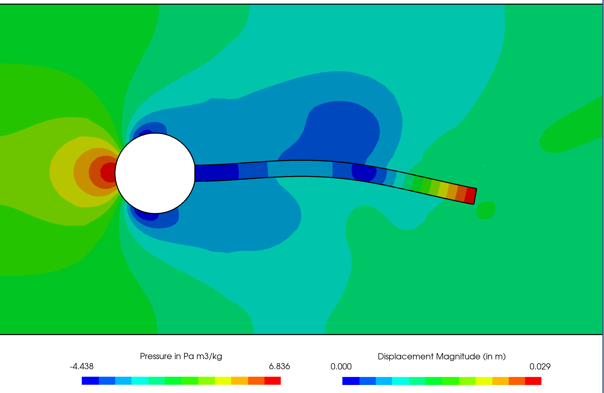
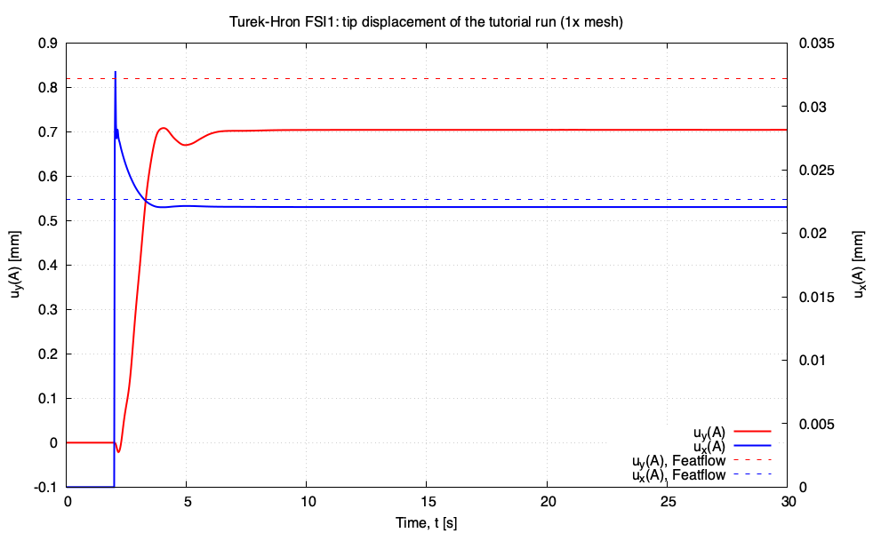

# Hron_Turek fluid-solid interaction benchmark: `HronTurek`

---

Prepared by Željko Tuković and Philip Cardiff

---

## Tutorial Aims

- Demonstrates how to simulate the well-known Turek and Hron [1] fluid-solid
  interaction benchmark in its three variants, `FSI1`, `FSI2` and `FSI3`.

---

## Case Overview

An elastic plate behind a rigid cylinder is a well-known benchmark fluid-solid
interaction case proposed by Turek and Hron [1]. The geometry (Figure 1)
consists of a horizontal channel of 0.41 m in height and 2.5 m in length,
containing a rigid cylinder with a radius of 0.05 m; the centre of the cylinder
is positioned 0.2 m away from the bottom and inlet (left) boundaries of the
channel. An elastic plate of 0.35 m in length and 0.02 m in height is attached
to the right-hand side of the rigid cylinder.

Fluid enters the channel from the left-hand side with a parabolic velocity
profile. A constant pressure is imposed at the channel outlet, and a no-slip
boundary condition is applied at the walls. The fluid flow is assumed to be
laminar, and the plate deformation is computed under the plane strain
assumption. Turek and Hron [1] examined three variants of this case, which
differ in the inflow velocity and the plate material (Table 1):

- `FSI1` has a low inflow velocity (`Re = 20`), and the flow and the plate
  settle to a steady state;
- `FSI2` has a heavy, soft plate that flaps periodically with a large
  amplitude (`Re = 100`);
- `FSI3` has the highest inflow velocity (`Re = 200`) and a stiffer plate,
  which oscillates periodically with a smaller amplitude and a higher
  frequency.

`FSI3` is the default variant of the tutorial. For `FSI3`, the inlet velocity
profile is applied without a gradual increase in the mean velocity, so that
the periodic motion is reached quickly. For `FSI1` and `FSI2`, it is ramped
over 2 s with the smooth ramp of the benchmark. In all three variants, the
coupling between the fluid and the solid is activated after 2 s.

The tutorial describes the plate with the `neoHookeanElastic` law. The
benchmark specifies the St. Venant-Kirchhoff law, which the verification
study uses (see below). The tutorial keeps `neoHookeanElastic`, which is used
by its regression test and has recorded reference values across the supported
OpenFOAM versions.


**Figure 1: Computational domain with a structural detail for the elastic plate
case. All dimensions are in m.**

### Table 1: Problem Physical Parameters

|            Parameter             | FSI1 | FSI2  | FSI3 |   Units    |
| :------------------------------: | :--: | :---: | :--: | :--------: |
|    Fluid density, $$\rho_F$$     | 1000 | 1000  | 1000 | kg/m$$^3$$ |
|    Fluid viscosity, $$\nu_F$$    | 0.001 | 0.001 | 0.001 | m$$^2$$/s  |
| Mean inlet velocity, $$\bar{u}$$ | 0.2  |   1   |  2   |    m/s     |
|    Solid density, $$\rho_S$$     | 1000 | 10000 | 1000 | kg/m$$^3$$ |
|  Solid Young's modulus, $$E_S$$  | 1.4  |  1.4  | 5.6  |    MPa     |
| Solid Poisson's ratio, $$\nu_S$$ | 0.4  |  0.4  | 0.4  |            |
|      Reynolds number, $$Re$$     |  20  |  100  | 200  |            |

---

## Expected Results

The benchmark reports the displacement of the plate tip point A at
`(0.6, 0.2)` and the drag and lift on the cylinder and plate together, per unit
depth. For the periodic variants they are given as `mean ± amplitude
[frequency]`, where the mean and amplitude are calculated from the maximum and
the minimum over the last period. Table 2 gives the Featflow reference values
[4] and the results of the verification study of this tutorial on its 2x mesh
(see [Verification Study](#verification-study)).

**Table 2: Displacement of point A and the force on the cylinder and plate.
The displacements are in mm and the forces in N/m. The periodic values are
given as mean ± amplitude [frequency in Hz]. For FSI3, only the quantities
recorded in the verification README are shown.**

| Variant | Quantity | solids4foam, 2x mesh | Featflow [4] |
| :-----: | :------: | :------------------: | :----------: |
| FSI1 | $$u_x$$ | 0.02248 | 0.02270 |
| FSI1 | $$u_y$$ | 0.7828 | 0.8209 |
| FSI1 | drag | 14.261 | 14.294 |
| FSI1 | lift | 0.7756 | 0.7637 |
| FSI2 | $$u_x$$ | −14.40 ± 12.46 [3.93] | −14.85 ± 12.70 [3.86] |
| FSI2 | $$u_y$$ | 1.25 ± 80.55 [1.96] | 1.30 ± 81.6 [1.93] |
| FSI2 | drag | 216.0 ± 79.2 [3.93] | 215.1 ± 77.7 [3.86] |
| FSI2 | lift | −0.9 ± 256.3 [1.96] | 0.6 ± 237.8 [1.93] |
| FSI3 | $$u_x$$ | −2.79 ± 2.66 | −2.88 ± 2.72 [10.93] |
| FSI3 | $$u_y$$ | ± 34.17 [5.52] | 1.47 ± 34.99 [5.46] |
| FSI3 | drag | 459.3 ± 28.1 | 460.5 ± 27.7 [10.93] |
| FSI3 | lift | ± 174.4 | 2.50 ± 153.9 [5.46] |

On the 2x mesh, the displacements, drag and frequencies are within about
`2–5%` of the reference, and the lift amplitude, which converges slowest, is
`8%` (FSI2) and `13%` (FSI3) high. The verification README gives the
acceptance criteria, the 1x results and the convergence between the meshes.

### FSI3

Figure 2 shows the plate deformation at the time instant when the plate tip
point (A) is at its highest position. Video 1 shows the time evolution of the
pressure field in the fluid and the displacement magnitude field in the solid.
Figures 3 and 4 show the plate tip displacement and the total force on the
plate and cylinder, after the periodic solution has been reached, from
Tuković et al. [2]. Figure 5 overlays the closing periods of the verification
run on the 2x mesh on the published reference history.

```note
Figures 3 and 4 were generated with the mesh and time settings used in
Tuković et al. [2], whereas Figure 2 and Video 1 were generated using the
default settings in the tutorial case.
```



**Figure 2: Snapshot of the pressure field in the fluid and the equivalent (von
Mises) stress field in the solid**



**Video 1: Time evolution of the pressure field in the fluid and the
displacement magnitude field in the solid.**


**Figure 3: Displacement of the plate tip point A for the elastic plate behind a
rigid cylinder case**


**Figure 4: Force on the plate and the cylinder for the elastic plate behind a
rigid cylinder case**


**Figure 5: FSI3 verification run on the 2x mesh (red) against the Turek-Hron
reference history (black), with time measured from the last maximum of
$$u_y$$**

### FSI2

The plate flaps with a tip amplitude of about 80 mm at about 1.9 Hz. The
flapping grows from rest after the coupling starts and saturates after about
7.5 s. Figure 6 overlays the closing periods of the verification run on the
2x mesh on the published reference history.

The fluid mesh distorts slowly while the plate flaps, and IQN-ILS eventually
stops converging: after about 11.4 s on the 2x mesh and 18.7 s on the 1x
mesh. The FSI2 variant therefore stops at 10.5 s.


**Figure 6: FSI2 verification run on the 2x mesh (red) against the Turek-Hron
reference history (black), with time measured from the last maximum of
$$u_y$$**

### FSI1

The plate settles to a steady deflection of about 0.8 mm. Figure 7 shows the
tip displacement of the tutorial run with `./Allrun fsi1` on the tutorial
(1x) mesh, which is within `0.1%` of its final value from about `t = 9 s`.
The steady `u_y(A)` of `0.705 mm` is `14%` below the Featflow value (dashed);
the error falls to `4.6%` on the 2x mesh of the verification study (Table 2).
The run took about 13 minutes in serial.



**Figure 7: FSI1 tip displacement history of the tutorial run, computed with
the tutorial settings.**

---

## Running the Case

The tutorial case is located at
`solids4foam/tutorials/fluidSolidInteraction/HronTurek`. The case can be run
using the included `Allrun` script, i.e. `> ./Allrun`, which runs the `FSI3`
variant. The `Allrun` script first executes `blockMesh` for both `solid` and
`fluid` domains (`> blockMesh -region fluid` and `> blockMesh -region solid`),
and the `solids4foam` solver is used to run the case (`> solids4Foam`).
Optionally, if `gnuplot` is installed, a file `deflection.pdf` will be created
with the displacement history of point A and a file `force.pdf` will be
created with the history of the force on the cylinder and plate.

The variant is selected with `fsi1`, `fsi2` or `fsi3` (the default):

```bash
./Allrun                   # FSI3, Dirichlet-Neumann IQN-ILS coupling
./Allrun fsi1              # FSI1
./Allrun fsi2 parallel     # FSI2 in parallel
./Allrun fsi3 robin        # FSI3 with Robin-Neumann coupling
```

The case is stored as `FSI3`. For `fsi1` and `fsi2`, `Allrun` edits the inlet
velocity and ramp (`0/fluid/U.*`), the plate density and Young's modulus
(`constant/solid/mechanicalProperties`) and the time step, end time and write
interval (`system/controlDict`), and restores the stored files when it exits.
`FSI1` runs as a pseudo-transient route to the steady state with
`Δt = 0.025 s` to `t = 30 s`. Its loads are 30 to 40 times smaller than those
of `FSI3`, so it also tightens the fluid solver tolerances to `1e-9` and uses
an interface tolerance `outerCorrTolerance` of `1e-5`. `FSI2` runs with
`Δt = 0.001 s` to `t = 10.5 s`. These settings are those of the 1x level of
the verification study. `Allclean` restores the stored files if a run was
interrupted.

By default, the case uses Dirichlet-Neumann coupling accelerated with the
IQN-ILS algorithm. The Robin-Neumann coupling of Tuković et al. [3], where the
fluid interface pressure uses the `elasticWallPressure` Robin condition with an
automatically selected coefficient and the interface iterations are unrelaxed
fixed-point iterations, can be selected with `robin`. Any variant can be run
in parallel by appending `parallel`. The Robin-Neumann variant is included for
comparison rather than for routine use: on `FSI3`, with a thin plate wetted on
both sides, every coupled time step needs of the order of 150 fixed-point
iterations against about 9 IQN-ILS iterations (see the verification README for
the reasons).

---

## Verification Study

The opt-in [`verification/`](verification/) directory runs each variant
through a mesh sweep and compares the results with the Featflow reference
values [4]. For `FSI2` and `FSI3`, it compares the mean, amplitude and
frequency of the point-A displacement and of the drag and lift on the
cylinder and plate, and overlays the published time history. For `FSI1`, it
compares the steady values. The verification copies use the St.
Venant-Kirchhoff law of the benchmark and integrate the force over both the
cylinder and the plate.

```bash
cd verification
./Allverify                          # FSI3 IQN-ILS sweep over the 1x and 2x meshes
./Allverify --benchmark fsi1         # the same for FSI1
./Allverify --benchmark fsi2         # the same for FSI2
./Allverify --coupling robin         # the FSI3 sweep with Robin-Neumann coupling
./Allverify --study coupling         # Robin-Neumann vs IQN-ILS on FSI3
```

The study is separate from `regressionTest.sh`, which checks the `FSI3`
variant, and it is not run by the normal tutorial test suites. See the
verification README for the mesh levels, options, acceptance criteria and
recorded results.

---

## References

[1]
[Turek, S., Hron, J. (2006). Proposal for Numerical Benchmarking of Fluid-Structure Interaction between an Elastic Object and Laminar Incompressible Flow. In: Bungartz, HJ., Schäfer, M. (eds) Fluid-Structure Interaction. Lecture Notes in Computational Science and Engineering, vol 53. Springer, Berlin, Heidelberg.](https://doi.org/10.1007/3-540-34596-5_15)

[2]
[Tuković, Ž., Jasak, H., Karač, A., Cardiff, P., Ivanković, A. (2018). OpenFOAM finite volume solver for fluid-solid interaction. Transactions of Famena. 2018, 42(3), pp. 1–31.](https://hrcak.srce.hr/206941)

[3]
[Tuković, Ž., Bukač, M., Cardiff, P., Jasak, H., Ivanković, A. (2019). Added mass partitioned fluid-structure interaction solver based on a Robin boundary condition for pressure. In: OpenFOAM: Selected Papers of the 11th Workshop. Springer, pp. 1–22.](https://doi.org/10.1007/978-3-319-60846-4_1)

[4]
[Featflow FSI benchmark: FSI tests.](https://wwwold.mathematik.tu-dortmund.de/~featflow/en/benchmarks/cfdbenchmarking/fsi_benchmark/fsi_tests/fsi_fsi_tests.html)
