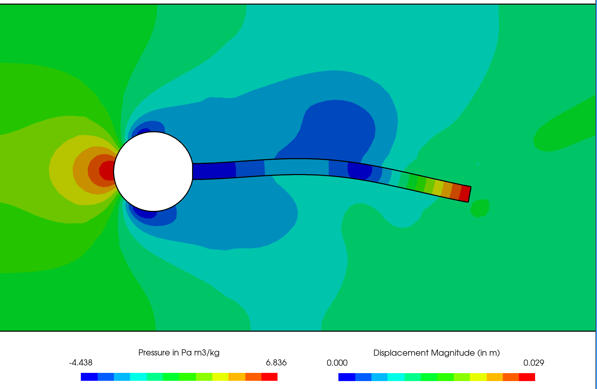

# Fluid-solid interaction benchmark between an elastic object and laminar incompressible flow: `HronTurekFsi3`

---

Prepared by Željko Tuković and Philip Cardiff

---

## Tutorial Aims

- Demonstrates how to simulate the well-known Turek and Hron [1] fluid-solid interaction benchmark.

---

## Case Overview

An elastic plate behind a rigid cylinder is a well-known benchmark fluid-solid interaction case proposed by Turek and Hron [1]. The geometry (Figure 1) consists of a horizontal channel of 0.41 m in height and 2.5 m in length, containing a rigid cylinder with a radius of 0.05 m; the centre of the cylinder is positioned 0.2 m away from the bottom and inlet (left) boundaries of the channel. An elastic plate of 0.35 m in length and 0.02 m in height is attached to the right-hand side of the rigid cylinder.

Fluid enters the channel from the left-hand side with a parabolic velocity profile. A constant pressure is imposed at the channel outlet, and a no-slip boundary condition is applied at the walls. The fluid flow is assumed to be laminar. The Saint Venant-Kirchhoff constitutive model with the plane strain assumption describes the elastic plate deformation. Turek and Hron [1] examined three variants of this case, designated `FSI1`, `FSI2` and `FSI3`: the `FSI3` variant is considered here. The fluid and elastic plate material properties are given in Table 1, together with the mean inlet velocity. In order to quickly reach the periodic motion of the plate, the inlet velocity profile is applied without a gradual increase in the mean velocity and the coupling between the fluid and the solid is activated after 2 s.

<div style="text-align: center;">
  
    <figcaption>
     <strong>Figure 1: Computational domain with a structural detail for the elastic plate case. All dimensions are in m. </strong>
    </figcaption>
</div>


**Table 1: Problem Physical Parameters**

| Parameter   | Value (FSI3)    | Units |
| :-----: | :---: | :---: |
| Fluid density, $$\rho_F$$ | 1000 | kg/m$$^3$$ |
| Fluid viscosity, $$\nu_F$$ | 0.001 | m$$^2$$/2 |
| Mean inlet velocity, $$\bar{u}$$ | 2 | m/s |
| Solid density, $$\rho_S$$ | 1000 | kg/m$$^3$$ |
| Solid Young's modulus, $$E_S$$ | 5.6 | MPa |
| Solid Poisson's ratio, $$\nu_S$$ | 0.4 ||


## Expected Results

Figure 2 shows the plate deformation at the time instant when the plate tip point (A) is at its highest position. Video 1 shows the time evolution of the pressure field in the fluid and the displacement magnitude field in the solid. Temporal variation in the plate tip point displacement, after the periodic solution has been reached, is shown in Figure 3. Similarly, the temporal variation in the total force exerted on the plate and cylinder is shown in Figure 4. A quantitative comparison with the corresponding benchmark solutions is given in Table 2. Mean values and amplitudes are calculated using the maximum and the minimum values after the periodic solution has been reached (around 4 s for the FSI3 case), where frequencies are calculated using the Fast Fourier Transform algorithm. The difference between the calculated and the benchmark results is around 3% in average for the amplitude and frequency of force and displacement. The relative difference for the mean value of the force y-component goes up to 40%, which can be attributed to the difficulty in calculating the mean value in the case when it is close to zero.
```note
The results in Figures 3 and 4 and Table 2 were generated with the mesh and time settings used in Tuković et al. [2], whereas Figure 2 and Video 1 were generated using the default settings in the tutorial case. 
```

<div style="text-align: center;">
  
    <figcaption>
     <strong>Figure 2: Snapshot of the pressure field in the fluid and the equivalent (von Mises) stress field in the solid.</strong>
    </figcaption>
</div>




**Video 1: Time evolution of the pressure field in the fluid and the displacement magnitude field in the solid.**


<div style="text-align: center;">
  
    <figcaption>
     <strong>Figure 3: Displacement of the plate tip point A for the elastic plate behind a rigid cylinder case.</strong>
    </figcaption>
</div>

<div style="text-align: center;">
  
    <figcaption>
     <strong>Figure 4: Force on the plate and the cylinder for the elastic plate behind a rigid cylinder case.</strong>
    </figcaption>
</div>

**Table 2: Displacement on point A and the force on the elastic plate. The values are given in the same format as in the benchmark paper [1] (mean ± amplitude [frequency]).
**

| Parameter   | solids4foam [2]    | Benchmark [1] |
| :-----: | :---: | :---: |
| $$u_x \times 10^{−3}$$ (in m) | −2.72 ± 2.58 [11.07] | −2.69 ± 2.53 [10.9] |
| $$u_y \times 10^{−3}$$ (in m) | 1.67 ± 33.84 [5.53] | 1.48 ± 34.38 [5.3] |
| $$F_x$$ (in N) | 459.18 ± 24.86 [11.07] | 457.3 ± 22.66 [10.9] |
| $$F_x$$ (in N) | 1.59 ± 155.9 [5.53] | 2.22 ± 149.78 [5.3] |


---

## Running the Case

The tutorial case is located at `solids4foam/tutorials/fluidSolidInteraction/HronTurekFsi3`. The case can be run using the included `Allrun` script, i.e. `> ./Allrun`.  The `Allrun` script first executes `blockMesh` for both `solid` and `fluid` domains (`> blockMesh -region fluid` and `> blockMesh -region solid` ), and the `solids4foam` solver is used to run the case (`> solids4Foam`).  Optionally, if `gnuplot` is installed, a file `deflection.pdf` will be created with the displacement history of point A and a file `force.pdf` will be created with the history of the force on the cylinder and plate.

---

## References

[1] [Turek, S., Hron, J. (2006). Proposal for Numerical Benchmarking of Fluid-Structure Interaction between an Elastic Object and Laminar Incompressible Flow. In: Bungartz, HJ., Schäfer, M. (eds) Fluid-Structure Interaction. Lecture Notes in Computational Science and Engineering, vol 53. Springer, Berlin, Heidelberg.](https://doi.org/10.1007/3-540-34596-5_15)

[2] [Tuković, Ž., Jasak, H., Karač, A., Cardiff, P., Ivanković, A. (2018). OpenFOAM finite volume solver for fluid-solid interaction. Transactions of Famena. 2018, 42(3), pp. 1–31.](https://hrcak.srce.hr/206941)