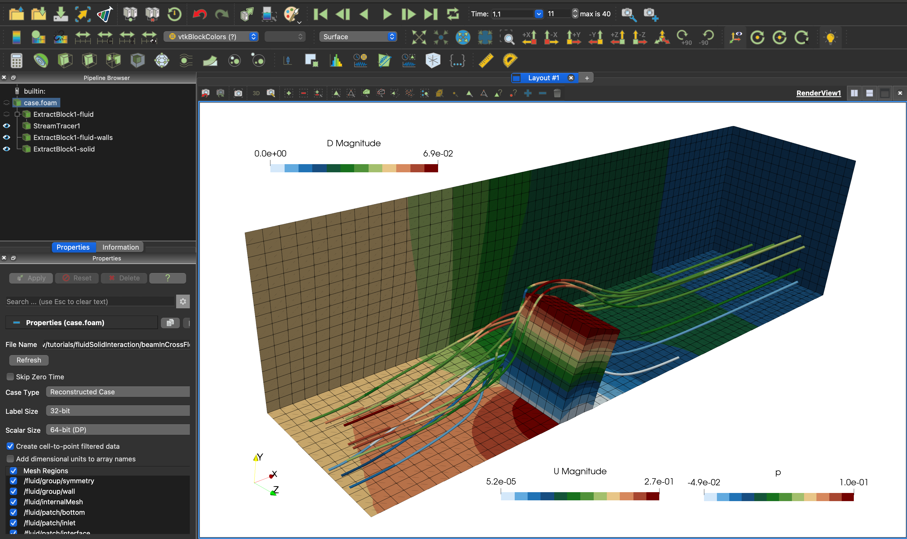

# My third tutorial: `beamInCrossFlow`

You can find the files for this tutorial under
[`tutorials/fluidSolidInteraction/beamInCrossFlow`](https://github.com/solids4foam/solids4foam/tree/master/tutorials/fluidSolidInteraction/beamInCrossFlow).

---

## Tutorial Aims

- Demonstrate the solution of an external flow fluid-solid interaction problem;
- Explain how to run a fluid-solid interaction simulation in solids4foam.

## Case Overview


**Case geometry and mesh**

This case consists of a thick elastic plate attached to the bottom surface of a
rectangular channel (see the figure above). Due to symmetry, only half of the
spatial domain is considered. An incompressible viscous fluid with a density of
1000 kg/m3 and kinematic viscosity of 0.001 m2/s enters the channel from the
left-hand side with a parabolic velocity profile.

This case can be analysed in two forms:

- The original form, proposed by
  [Richter](https://onlinelibrary.wiley.com/doi/10.1002/nme.4943): The peak
  inlet velocity is 0.2 m/s, corresponding to Re = 40 with respect to the plate
  height (h = 0.2 m). The peak inlet velocity gradually increases from zero at t
  = 0 s to its maximum value at t = 4 s using the following transition function
  $$0.2 [1 − \cos(\pi t/4)]/2$$. A constant pressure is imposed at the channel
  outlet, and a no-slip boundary condition is applied on the channel walls. The
  elastic plate has a density of 1000 kg/m3, Young’s modulus of 1.4 MPa (shear
  modulus of 0.5 MPa), and a Poisson’s ratio of 0.4.
- A modified form, analysed by
  [Gillebaart et al.](https://doi.org/10.1016/j.cma.2015.09.025) and
  [Tuković et al.](https://hrcak.srce.hr/206941): The peak inlet velocity is
  increased to 0.3 m/s, and the Young’s modulus of the solid beam is reduced to
  10 kPa. In addition, the velocity reaches its maximum value at 1 s, and the
  simulation continues until the beam reaches steady-state. The purpose of these
  changes is to demonstrate large solid displacements and fluid mesh motion.

The fluid is described by incompressible Newtonian isothermal laminar flow,
where the Navier-Stokes governing equations take the form:

$$
\nabla \cdot \boldsymbol{v} = 0
$$

$$
\frac{\partial \boldsymbol{v}}{\partial t}
+ \nabla \cdot (\boldsymbol{v} \boldsymbol{v})
= \nu \nabla^2 \boldsymbol{v}
- \frac{1}{\rho} \nabla \textcolor{red}{p}
+ \boldsymbol{f_b}
$$

For the solid, we assume finite strains (though a small strain assumption would
be OK in the the original form of the case) with the material behaviour
described by the neo-Hookean hyperelastic law:

$$
\rho \frac{\partial^2 \boldsymbol{u}}{\partial t^2} =
\nabla \cdot \boldsymbol{\sigma} + \rho \boldsymbol{g}
$$

$$
\boldsymbol{\sigma} = \frac{1}{J}
\left[ \frac{K}{2} (J^2 - 1) \mathbf{I}
+ \mu J^{-\frac{2}{3}} \mathrm{dev} \left[ \mathbf{F}
\cdot \mathbf{F}^T \right] \right]
$$

$$
\mathbf{F} = \mathbf{I} + (\nabla_0 \boldsymbol{u})^T \qquad J =
\det [\mathbf{F}]
$$

Kinematic and dynamic conditions hold at the interface between the fluid and
solid regions. The kinematic conditions state that the velocity and displacement
must be continuous across the interface:

$$
\boldsymbol{v}_{\mathrm{fluid}}^{[i]} = \boldsymbol{v}_{\mathrm{solid}}^{[i]}
\qquad
\boldsymbol{u}_{\mathrm{fluid}}^{[i]} = \boldsymbol{u}_{\mathrm{solid}}^{[i]}
$$

The dynamic conditions follow from linear momentum conservation and state that
the forces are in equilibrium:

$$
\boldsymbol{n}^{[i]} \cdot \boldsymbol{\sigma}_{\mathrm{fluid}}^{[i]}
= \boldsymbol{n}^{[i]} \cdot \boldsymbol{\sigma}_{\mathrm{solid}}^{[i]}
$$

A partitioned approach is adopted for enforcing these interface conditions where
the fluid and solid regions are solved separately. A strongly-coupled
Dirichlet-Neumann coupling algorithm is used:

```pseudocode
for all time-steps
    do
        solve fluid domain
        pass fluid interface forces to the solid interface
        solve solid domain
        pass solid interface velocities to the fluid
        interface using under-relaxation
        update the fluid mesh
    while not converged
end
```

---

## Expected Results

The incoming flow imparts pressure and viscous forces on the plate, causing it
to bend. Following some initial transient effects, the flow and beam reach a
steady-state. In the modified form of the case, with an increased peak inlet
velocity of 0.3 m/s and reduced Young’s modulus of 10 kPa, displacement of point
A is pexected to be (0.01463, 0.005, −0.000447) m at steady state. Further
details of the case can be found in
[Ž. Tuković, A. Karač, P. Cardiff, H. Jasak, A. Ivanković (2018) OpenFOAM Finite
Volume Solver for Fluid-Solid Interaction](https://hrcak.srce.hr/206941);
in particular, see Fig. 28 therein. The figure below shows the displacement
field in the beam, the fluid velocity streamlines, and the fluid pressure on the
channel ground, wall and outlet.


**Expected results**

---

## Running the Case

The tutorial case can be run using the included `Allrun` script, i.e.
`> ./Allrun`. In this case, the `Allrun` script is

```bash
#!/bin/bash

# Source tutorial run functions
. $WM_PROJECT_DIR/bin/tools/RunFunctions

# Source solids4Foam scripts
source solids4FoamScripts.sh

# Check case version is correct
solids4Foam::convertCaseFormat .

# Create meshes
solids4Foam::runApplication -s solid blockMesh -region solid
solids4Foam::runApplication -s fluid blockMesh -region fluid

# Run solver
if [[ "$1" == "parallel" ]]; then
    # Run parallel
    solids4Foam::runApplication -s fluid decomposePar -region fluid
    solids4Foam::runApplication -s solid decomposePar -region solid
    solids4Foam::runParallel solids4Foam
    solids4Foam::runApplication -s fluid reconstructPar -region fluid
    solids4Foam::runApplication -s solid reconstructPar -region solid
else
    # Run serial
    solids4Foam::runApplication solids4Foam
fi

# Create plots
if command -v gnuplot &> /dev/null
then
    echo "Generating deflection.pdf using gnuplot"
    gnuplot deflection.gnuplot &> /dev/null
    echo "Generating force.pdf using gnuplot"
    gnuplot force.gnuplot &> /dev/null
else
    echo "Please install gnuplot if you would like to generate the plots"
fi
```

where the `solids4Foam::convertCaseFormat .` script makes minor changes to the
case to make it compatible with your version of OpenFOAM/foam-extend. As can be
seen, if the argument "parallel" is passed to the `Allrun` script (i.e.
`> ./Allrun parallel`) it will run the case in parallel. After the solver has
finished, `force.pdf` and `deflection.pdf` plots are generated if the `gnuplot`
program is installed.

```tip
Remember that a tutorial case can be cleaned and reset using the included
`Allrun` script, i.e. `> ./Allclean`.
```

---

## Analysing the Results

In the ParaView, both the solid and fluid regions are loaded by default. The
_Extract Block_ filter in ParaView can be used to extract the solid region, and
a second instance of the _Extract Block_ filter for the fluid region. In that
way, the fluid region can be coloured by a fluid field (e.g. `p` or `U`) and the
solid region by a solid field (e.g. `D` or `sigmaEq`). As an alternative to
using the _Extract Block_ filter, two instances of the case can be opened (File
-> Open -> case.foam), where one opens the “fluid/internalMesh” and the other
opens the “solid/internalMesh”.



**Displacement of the beam, pressure on the fluid walls, and streamlines
coloured by velocity**

---

## Delving Deeper

---

If you would like to learn more about the case, please continue; if not, how
about you check out another tutorial.

---

### Case Structure

The case follows the typical multi-region (e.g. as used by
`chtMultiRegionSimpleFoam`) case structure:

```bash
beamInCrossFlow
├── 0
│   ├── fluid
│   │   └── ...
│   └── solid
│   │   └── ...
├── Allclean
├── Allrun
├── constant
│   ├── fluid
│   │   └── ...
│   ├── fsiProperties
│   ├── physicsProperties
│   └── solid
│       └── ...
└── system
    ├── fluid
    │   └── ...
    └── solid
       └── ...
```

where `fluid` and
`solid' sub-directories are present in the`0`,`constant`and`system`
directories.

As in all solids4foam cases, the `constant/physicsProperties` dictionary must be
present, where, in this case, a fluid-solid interaction analysis is specified:

```c++
type   fluidSolidInteraction;
```

As a fluid-solid interaction, a `constant/fsiProperties` dictionary must also be
present, where, in this case, the Aitken's accelerated coupling algorithm is
specified:

```c++
fluidSolidInterface Aitken;

AitkenCoeffs
{
   // ...
}
```

Coupling algorithm parameters are given here, e.g. solid interface patch(es),
fluid interface patch(es), maximum number of FSI correctors, FSI tolerance, etc.

---

### Solver Output

During a partitioned fluid-solid interaction analysis, the `solids4Foam` solver
will perform multiple outer FSI iterations per time-step, where both the fluid
and solid and solved within each FSI iteration. Several types of information
will be printed to the log, including

- Fluid model residual information, e.g. `U` and `p` residuals and iteractions
- Fluid mesh motion information
- Solid model residual information
- FSI residual and iteration numbers
- Force(s) on the FSI interface(s)

For example:

```bash
Time = 0.1, iteration: 15
Current fsi under-relaxation factor (Aitken): 0.980175
Maximal accumulated displacement of interface points: 8.51423e-07
Evolving fluid model: icoFluid
Courant Number mean: 0.00184822 max: 0.0346019 velocity magnitude: 0.00487047
time step continuity errors : sum local = 9.26048e-10, global = -2.65049e-11,
cumulative = -2.74836e-09
time step continuity errors : sum local = 2.0302e-10, global = -1.72198e-11,
cumulative = -2.76558e-09
time step continuity errors : sum local = 1.11805e-10, global = 6.68802e-12,
cumulative = -2.7589e-09
Setting traction on solid patch
Total force (fluid) = (-0.147015 0.378642 -0.38067)
Total force (solid) = (0.146715 -0.378943 0.380941)
Evolving solid solver
Solving the updated Lagrangian form of the momentum equation for DD
    Corr, res, relRes, matRes, iters
    Both residuals have converged
    2, 5.23068e-07, 7.10068e-07, 0, 2

Current fsi relative residual norm: 5.70921e-07
Alternative fsi residual: 5.70555e-07
```

---

### Tips for Fluid-Solid Analyses

#### Problem 1

When I view the fluid and solid in ParaView, there is a gap between
the fluid and solid interface: the solid domain does not align with the fluid
domain

```tip
**Solution 1**: some of the solidModels use a non-moving mesh formulation so, by
default, some solids may not move at all when shown in ParaView. To show the
solid domain deformation/motion in ParaView, select the solid case and use the
“Warp By Vector” filter with the displacement (`D` or `pointD`) field. If there
is still a gap between the fluid and solid, see Solution 2 below.
```

```tip
**Solution 2**: if the FSI loop does not converge then the FSI interface
constraints (see below) may not be strictly enforced; examine the “fsi residual”
in the log file and check if the maximum number of FSI iterations is being
reached. If the FSI method is not converging to the required tolerance, then
increases the maximum number of FSI correctors and/or decrease the initial
relaxation factor (in fsiProperties). In addition, you can try a different FSI
coupling procedure. If the FSI loop is converging but there is still a gap
between the fluid and solid, see the next points on the following slide.
```

```tip
**Solution 3**: if the FSI loop is converging but there is still a gap between
the fluid and solid, then try increase the FSI solution tolerance (in
`fsiProperties`); you may also need to increase the maximum number of FSI
correctors to achieve a tighter tolerance. If this still does not help, see
Solution 4 below.
```

```tip
**Solution 4**: try create a conformal fluid-to-solid interface i.e. make the
fluid interface patch mesh exactly the same as the solid interface patch mesh.
```

```tip
**Solution 5**: if the FSI method is still struggling to converge, try make the
problem “easier” by setting the solid to be temporarily stiffer and denser (in
mechanicalProperties) by e.g. multiple orders of magnitude. If the problem works
with the artificially stiff/dense solid, then slowly decrease the solid
properties towards the real ones until you find the point at which the FSI
methods breaks; then try decreasing the starting FSI relaxation factor and/or
maximum number of FSI correctors and/or FSI coupling algorithm to determine the
critical/optimal algorithm variables.
```

#### Problem 2

The solid model is not converging

```tip
**Solution 1**: try use a lower under-relaxation factor in the solid fvSolution
relaxationFactors sub-dict; use a value of 0.1-1.0 for the `D` or `DD` fields
and/or 0.9-1.0 for the `D` or `DD` equations.
```

```tip
**Solution 2**: try a different (more robust) solid model e.g. linear geometry
solid models, such as `linGeomTotalDispSolid` and
`coupledUnsLinGeomLinearElasticSolid`, tend to converge better than the
non-linear geometry models.
```

#### General Tips

```tip
Perform independent analyses on the solid and fluid domains separately, before
enabling FSI coupling, to ensure all fluid and solid properties, meshes, schemes,
etc. are reasonable.
```

```tip
If you are having convergence issues, try prepare a more simple - but
representative - version of your case and make sure that works: it may provide
understanding of critical settings.
```

```tip
If you are having convergence issues, try use a conformal mesh at the fluid-to-
solid interface.
```

```tip
**Tip**: if you are having convergence issues, try a different (more robust)
fluid model and/or a different (more robust) solid model; the pUCoupledFoam
fluidModel tends to converge well and the linear geometry solid models (e.g.
`linGeomTotalDispSolid` or `coupledUnsLinGeomLinearElasticSolid`) tend to
converge better than the non-linear geometry models
```

---

### Code

#### `fluidSolidInterface`

For the `cylinderInChannel` test case, we have selected a “fluidSolidInterface”
analysis in the `physicsProperties` dictionary: this means a
`fluidSolidInterface` class will be selected; then, we specify the actual
`fluidSolidInterface` class to be the `AitkenCouplingInterface` class.

The code for the `AitkenCouplingInterface` class is located at:

```bash
solids4foam/src/solids4FoamModels/fluidSolidInterfaces/AitkenCouplingInterface/AitkenCouplingInterface.C
```

Let us examine the code, in particular, the “evolve” function of this class, to
see how the FSI procedure is implemented.

```c++
bool AitkenCouplingInterface::evolve()
{
    initializeFields();

    updateInterpolator();

    scalar residualNorm = 0;

    if (predictSolid_)
    {
        updateForce();

        solid().evolve();

        residualNorm = updateResidual();
    }

    do
    {
        outerCorr()++;

        // Transfer the displacement from the solid to the fluid
        updateDisplacement();

        // Move the fluid mesh
        moveFluidMesh();

        // Solve fluid
        fluid().evolve();

        // Transfer the force from the fluid to the solid
        updateForce();

        // Solve solid
        solid().evolve();

        // Calculate the FSI residual
        residualNorm = updateResidual();
    }
    while (residualNorm > outerCorrTolerance() && outerCorr() < nOuterCorr());

    solid().updateTotalFields();

    return 0;
}
```
