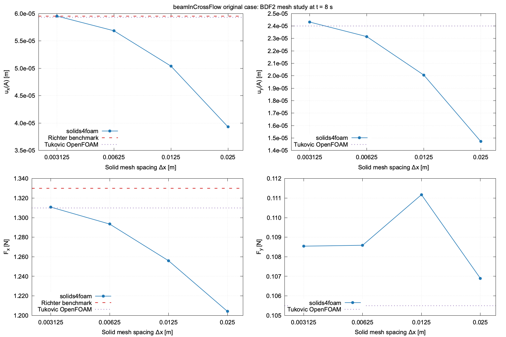
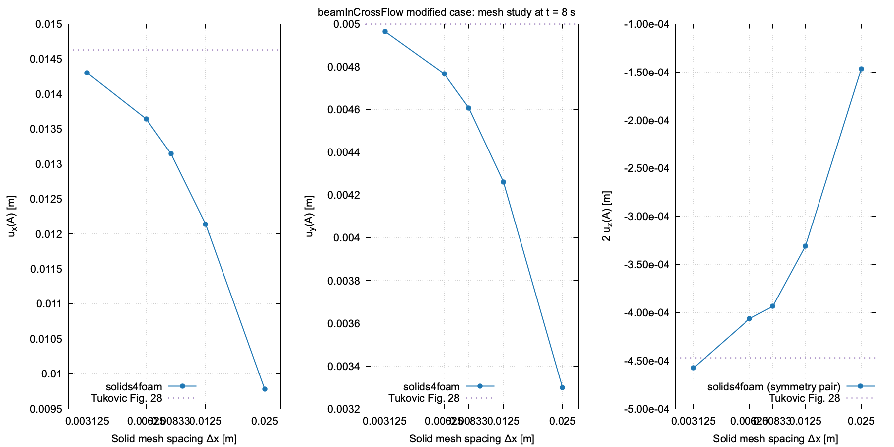

# beamInCrossFlow verification studies

This directory contains opt-in numerical-verification studies for the
`beamInCrossFlow` tutorial. It is deliberately separate from `regressionTest.sh`:
the regression test checks that the existing tutorial remains numerically stable,
whereas these studies check mesh convergence against published benchmark
quantities. Nothing here is run by `tutorials/Alltest` or
`tutorials/Alltest-regression`.

Source a supported OpenFOAM environment, build solids4foam with PETSc, and run
from either this directory or the repository root:

```bash
source ~/bin/load-openfoam v2512
cd tutorials/fluidSolidInteraction/beamInCrossFlow/verification
./Allverify --case original --study mesh
./Allverify --case modified --study mesh
# Optional steady-solution acceleration diagnostic
./Allverify --case original --study mesh --time-scheme Euler
```

From the repository root, invoke the same driver as
`./tutorials/fluidSolidInteraction/beamInCrossFlow/verification/Allverify ...`.

The driver requires `python3`, `blockMesh`, `solids4Foam`, and (for the mesh
study) `gnuplot`; it stops with an actionable error if one is unavailable.

Each run is a complete copy under `verification/work/`, so the tutorial itself,
its symlinks, and its normal regression tests are not modified. Results are
written to `verification/postProcessing/` as CSV plus `verification_summary.md`.
Both directories are ignored by Git and are retained to make a failed run
diagnosable.

## Studies and acceptance criteria

The reference data and initial tolerances are in
`reference/beamInCrossFlow_verification_references.json`. They are
intentionally moderate:
the verification signal is convergence toward the reference, not bitwise
reproduction across OpenFOAM versions, PETSc configurations, or hardware.

- `original --study mesh` uses the Richter/Tukovic small-deformation form with
  St Venant-Kirchhoff elasticity and clean runs to `t = 8 s`. The inlet reaches
  its peak at `t = 4 s`; the additional interval is required because the
  published comparison is steady-state. It runs the supplied mesh and uniform
  2x/4x/8x cell-count refinements. The time step is reduced with linear mesh
  refinement (`0.05`, `0.025`, `0.0125`, and `0.00625 s`) so the finer mesh
  results are not contaminated by a larger local Courant number. It extracts
  point-A displacement and total interface force, and reports the observed
  order from `u_x(A)`. The finest result is checked against the published
  primary quantities `u_x(A)=5.95e-5 m` and `F_x=1.33 N`; `u_y` and `F_y` use
  the additional Tukovic OpenFOAM values as diagnostics only. The CSV also
  records both literature columns: the Richter benchmark (`u_x`, `F_x`) and
  the Tukovic OpenFOAM calculation (`u_x`, `u_y`, `F_x`, `F_y`), each with its
  own relative error.
- `modified --study mesh` uses the large-deformation form shown in Tukovic's
  Figure 28: `maxVelocity = 0.3`, a 1 s ramp, `E = 1e4 Pa`, and
  St Venant-Kirchhoff elasticity. It runs 1x/2x/3x/4x/8x uniform refinements
  to `t = 8 s`, with time steps `0.05`, `0.025`, `0.0166667`, `0.0125`, and
  `0.00625 s`. Its primary checks are the Figure 28 values
  `u_x(A)=0.01463 m`, `u_y(A)=0.005 m`, and `u_z(A)=-0.000447 m`.
  The tutorial represents one side of the `z = 0` symmetry plane, whereas the
  published transverse value is verified here as the symmetry-paired quantity
  `2 u_z(A)`. The CSV retains both raw `u_z(A)` and
  `uz_symmetry_difference = 2 u_z(A)`, making that convention explicit.

The tutorial and every verification copy use `StVenantKirchhoffElastic`; the
driver does not change the constitutive model.

`Allverify` returns zero only when every primary quantity on the finest mesh
is within 5% of its published reference and its reference error decreases from
the coarsest to the finest mesh with positive net order. For the original form
the primaries are the Richter `u_x(A)` and `F_x`; for the modified form they
are the Tukovic Figure 28 `u_x(A)`, `u_y(A)`, and symmetry-paired `2u_z(A)`.
This checks convergence toward the reference without requiring a fixed
numerical regression value, so a future solver improvement is not rejected
merely for changing a result.

The original levels have approximately 1x, 8x, 64x, and 512x cells. The
modified sequence additionally includes a 3x level, which is close in overall
cell count to the published calculation.
The published Tukovic calculation used a 273,539-cell unstructured fluid mesh
and a 6,661-cell solid mesh; it visibly concentrates resolution around the
plate. The supplied tutorial uses a reproducible structured mesh instead, so
the uniform refinement family is retained as the primary verification study.
The mesh sweep is therefore expected to bracket, rather than reproduce, the
published mesh at an identical cell count. Runtime is highly
machine- and coupling-dependent: the original 8x mesh has roughly 7.6 million
cells and took about 11 hours on 64 cores in the reference run. Schedule either
mesh study only on resources appropriate for its final 8x member.

## Case variants and parallel runs

The driver selects the tutorial's `iqnils` coupling variant for every study so
that a sweep changes only mesh resolution and time step. Each form is set
explicitly in its isolated copy, including its inlet ramp and Young's modulus;
both use `StVenantKirchhoffElastic`.

Pass `--cores N` to use `N` MPI ranks for every case. `--cores auto` (the
default) uses 1, 4, 8, and 64 ranks for the original 1x, 2x, 4x, and 8x mesh
levels respectively. For the modified 1x, 2x, 3x, 4x, and 8x levels it uses
8, 4, 16, 8, and 64 ranks respectively, matching the completed reference
runs. Override this with `--cores N` when a scheduler allocation requires a
single rank count.
The selected count is written to the CSV. For a shared machine, choose `N` from
the available physical cores and available memory; do not launch multiple sweep
members concurrently unless those resources are reserved.

By default, verification copies write fields and function-object data only at
the final/evaluation time. This substantially reduces parallel reconstruction
cost without losing the quantities used by these studies. Use
`--write-interval N` when an intermediate history is needed.

`backward` is the default time scheme, matching the second-order backward
scheme reported by Tukovic et al. `--time-scheme Euler` remains available as an
opt-in diagnostic, but is not a substitute for the published-discretisation
verification. A literal `steadyState` fluid/solid scheme is not offered: in
this coupled PIMPLE configuration it removes the stabilising transient storage
and diverges during the inlet ramp.

The mesh driver automatically writes a PNG comparison of predictions and
published references: four panels for the original form and three displacement
panels for the modified form. Regenerate them manually, if needed, with:

```bash
gnuplot scripts/plotMeshConvergence.gnuplot
gnuplot scripts/plotModifiedMeshConvergence.gnuplot
```

The scripts write `original_mesh_sweep.png` and `modified_mesh_sweep.png` to
`verification/postProcessing/`. They use the initial solid spacing of `0.025 m`
and the time-step-to-refinement relationship from the sweep configuration.

## Reference results

The following plots are versioned with this verification setup. They record the
successful backward/BDF2 studies at `t = 8 s` and provide visual references for
future local or manually dispatched reproductions.

### Original small-deformation form



### Modified large-deformation form


