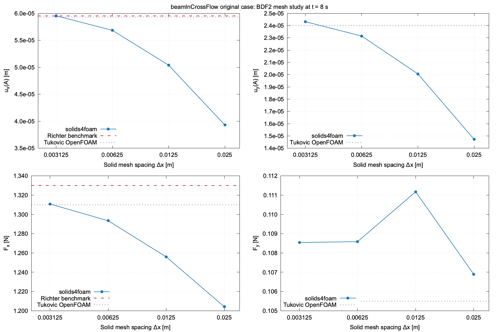
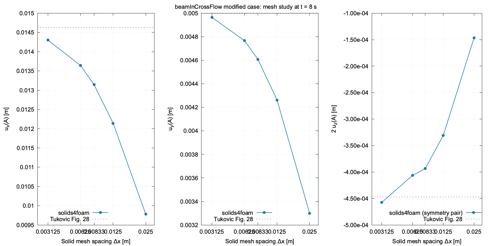

# beamInCrossFlow verification studies

This directory contains opt-in numerical-verification studies for the
`beamInCrossFlow` tutorial. It is deliberately separate from `regressionTest.sh`:
the regression test checks that the existing tutorial remains numerically stable,
whereas these studies check mesh convergence against published benchmark
quantities. Nothing here is run by `tutorials/Alltest` or
`tutorials/Alltest-regression`.

Source a supported OpenFOAM environment, build solids4foam with PETSc, and run
from either this directory or the repository root:

```bash
cd tutorials/fluidSolidInteraction/beamInCrossFlow/verification
./Allverify --case original --study mesh
./Allverify --case modified --study mesh
# Fixed-time-step, parametrically graded verification family
./Allverify --case original --study mesh --family graded
./Allverify --case modified --study mesh --family graded
# Temporal check on the graded 4x mesh
./Allverify --case original --study temporal --family graded
# Compare base-mesh Robin and IQNILS solutions
./Allverify --case original --study coupling
./Allverify --case modified --study coupling
# Optional steady-solution acceleration diagnostic
./Allverify --case original --study mesh --time-scheme Euler
```

From the repository root, invoke the same driver as
`./tutorials/fluidSolidInteraction/beamInCrossFlow/verification/Allverify ...`.

The driver requires `python3`, `blockMesh`, `solids4Foam`, and (for the mesh
study) `gnuplot`; it stops with an actionable error if one is unavailable.

Each run is a complete copy under `verification/work/`, so the tutorial itself,
its symlinks, and its normal regression tests are not modified. Results are
written to `verification/postProcessing/` as CSV plus `verification_summary.md`.
Both directories are ignored by Git and are retained to make a failed run
diagnosable.

## Problem and quantity definitions

The computational fluid half-domain is
`[0, 1.5] x [0, 0.4] x [-0.4, 0] m`; reflection about the `z = 0` symmetry
plane gives the physical `0.8 m` width. The initially undeformed solid occupies
`[0.45, 0.55] x [0, 0.2] x [-0.2, 0] m`: it is `0.1 m` thick in the flow
direction and `0.2 m` high and half-wide. Its `y = 0` face is clamped and its
`z = 0` face has solid-symmetry conditions. Fluid inlet, outlet and interface
are at `x = 0`, `x = 1.5` and the wetted beam surface respectively; the
remaining channel faces are no-slip except for `z = 0` symmetry. Outlet
pressure is zero gauge.

Both forms use fluid density `1000 kg/m3`, kinematic viscosity `0.001 m2/s`,
solid density `1000 kg/m3`, Poisson ratio `0.4` and St Venant--Kirchhoff
elasticity. The original form uses `E = 1.4 MPa`, peak inlet velocity
`0.2 m/s` and a cosine ramp ending at `4 s`. The modified form uses
`E = 10 kPa`, `0.3 m/s` and a `1 s` ramp. The driver otherwise leaves the
physical case, BDF2/PIMPLE and solid schemes, solver tolerances and IQN-ILS
coupling unchanged. IQN-ILS uses direct interface mapping, prediction,
`outerCorrTolerance = 1e-6` and at most 100 outer iterations.

Point A is `(0.45, 0.15, -0.15) m` in the half-domain. `u_x(A)`, `u_y(A)` and
`u_z(A)` are the components written by `solidPointDisplacement`. `F_x`, `F_y`
and `F_z` are the pressure-plus-viscous forces exerted by the fluid on the
half-beam interface, as written by the OpenFOAM `forces` function object;
positive `x` is downstream and positive `y` is upward. Tukovic's published
modified transverse difference is compared with `2 u_z(A)` because the two
physical points are related by symmetry. All studies evaluate the solution at
`t = 8 s`. The reported steady diagnostic is each principal QoI's relative
change over `t = 7...8 s`; a change below 0.5% is treated as steady for the
reported precision.

## Mesh audit and graded family

The original structured mesh has 14,592 fluid cells and 256 solid cells. Its
uniform `0.025 m` spacing gives only four solid cells through the plate
thickness and eight cells along each half-interface direction. The first fluid
cell normal to every beam face is also `0.025 m` wide, placing its centre
`0.0125 m` from the undeformed interface. Four downstream blocks hold
9,728 fluid cells (two thirds of the fluid mesh), yet use the same spacing from
the beam to the outlet. Uniform refinement therefore spends most added cells
away from the beam while refining the interface-normal velocity and pressure
gradients no faster than the whole domain. This topology, the persistent
changes in both displacement and force, and the different pressure/viscous
contributions to `F_y` motivate local refinement; they do not by themselves
prove that a conventional boundary layer is the only error source.

On the completed original graded L2 solution at `t = 8 s`, OpenFOAM
post-processing locates both the maximum velocity-gradient magnitude
(`34.13 1/s`) and kinematic pressure-gradient magnitude (`6.412 m/s2`, or
`6.412 kPa/m` at the specified density) in the cell centred at approximately
`(0.4487, 0.1969, -0.1969) m`, immediately upstream
of the beam's free outer corner. This directly supports local body refinement,
while also pointing to the sharp corner/free-end region rather than uniquely
to a smooth-wall boundary layer.

The graded family retains the same conformal 11-block fluid topology and the
same solid topology. It changes the base fluid counts and applies fixed total
block expansion ratios: `xUp = 0.125`, `xDown = 8`, `yOuter = 6` and
`zOuter = 1/6`. Cells are clustered on both flow-normal beam faces, at the free
end and side face, and through the near wake, then grow toward the inlet,
outlet and outer channel boundaries. Every count is multiplied by the level
factor 1, 2, 4 or 8, so the controlling spacings refine consistently by about
two while the topology and expansion ratios remain fixed. The solid and both
interface directions use the same level factor.

| Level | F | Fluid | Solid | Near (m) | Far (m) | Thick. | Face y x z |
| --- | ---: | ---: | ---: | ---: | ---: | ---: | ---: |
| L0 | 1 | 7,584 | 256 | 0.0108071 | 0.0927085 | 4 | 8 x 8 |
| L1 | 2 | 60,672 | 2,048 | 0.00548932 | 0.0466999 | 8 | 16 x 16 |
| L2 | 4 | 485,376 | 16,384 | 0.00276512 | 0.0234344 | 16 | 32 x 32 |
| L3 | 8 | 3,883,008 | 131,072 | 0.00138756 | 0.0117380 | 32 | 64 x 64 |

`Near` is the full interface-adjacent cell width. The corresponding nominal
first-cell-centre distances are half those values: `0.005404`, `0.002745`,
`0.001383` and `0.000694 m`. They are geometric distances, not wall-function
`y+` values.

The mesh study holds `deltaT = 0.00625 s` at every level, instead of following
the old combined space--time path. The separate temporal command runs
`deltaT = 0.0125 s` on L2; it is compared with the L2
`deltaT = 0.00625 s` result already produced by the mesh command, avoiding a
duplicate fine-time-step run. The old uniform family remains available with
`--family uniform` and is retained as evidence about the cost and inefficiency
of global refinement.

Full `checkMesh -allTopology -allGeometry` checks were run on both regions at
the family endpoints. L0/L3 maximum fluid aspect ratios were 8.159/7.904;
maximum non-orthogonality was zero and maximum skewness was
`4.75e-14`/`5.16e-13`. The uniform solid meshes had aspect ratio one, zero
non-orthogonality and comparable round-off-level skewness. Both endpoints
reported `Mesh OK`; the fixed grading and improving aspect ratio rule out a
level-dependent quality deterioration. Exact results are in
`reference/graded_mesh_quality.csv`.
The L3 64-rank decomposition is balanced: the largest-to-smallest per-rank
cell-count ratios are 1.0202 in the fluid and 1.0197 in the solid. A gross
decomposition imbalance therefore does not explain its coupling failure.

## Studies and acceptance criteria

The reference data and initial tolerances are in
`reference/beamInCrossFlow_verification_references.json`. They are
intentionally moderate:
the verification signal is convergence toward the reference, not bitwise
reproduction across OpenFOAM versions, PETSc configurations, or hardware.

The `coupling` study runs base-mesh IQNILS and Robin cases with otherwise
identical settings. It checks every primary quantity for the selected benchmark
form and requires the Robin result to agree with IQNILS within 1%. It also
checks the recorded residual history to ensure every Robin time step terminates
with the displacement, pressure-change, and leakage-flux residuals below their
configured tolerances. Unlike the mesh study, this comparison does not require
`gnuplot`.

- `original --study mesh` uses the Richter/Tukovic small-deformation form with
  St Venant-Kirchhoff elasticity and clean runs to `t = 8 s`. The inlet reaches
  its peak at `t = 4 s`; the additional interval is required because the
  published comparison is steady-state. It runs the supplied mesh and uniform
  2x/4x/8x cell-count refinements. The time step is reduced with linear mesh
  refinement (`0.05`, `0.025`, `0.0125`, and `0.00625 s`) so the finer mesh
  results are not contaminated by a larger local Courant number. It extracts
  point-A displacement and total interface force, and reports the observed
  order from `u_x(A)`. The finest result is checked against the published
  primary quantities `u_x(A)=5.95e-5 m` and `F_x=1.33 N`; `u_y` and `F_y` use
  the additional Tukovic OpenFOAM values as diagnostics only. The CSV also
  records both literature columns: the Richter benchmark (`u_x`, `F_x`) and
  the Tukovic OpenFOAM calculation (`u_x`, `u_y`, `F_x`, `F_y`), each with its
  own relative error.
- `modified --study mesh` uses the large-deformation form shown in Tukovic's
  Figure 28: `maxVelocity = 0.3`, a 1 s ramp, `E = 1e4 Pa`, and
  St Venant-Kirchhoff elasticity. It runs 1x/2x/3x/4x/8x uniform refinements
  to `t = 8 s`, with time steps `0.05`, `0.025`, `0.0166667`, `0.0125`, and
  `0.00625 s`. Its primary checks are the Figure 28 values
  `u_x(A)=0.01463 m`, `u_y(A)=0.005 m`, and `u_z(A)=-0.000447 m`.
  The tutorial represents one side of the `z = 0` symmetry plane, whereas the
  published transverse value is verified here as the symmetry-paired quantity
  `2 u_z(A)`. The CSV retains both raw `u_z(A)` and
  `uz_symmetry_difference = 2 u_z(A)`, making that convention explicit.

The tutorial and every verification copy use `StVenantKirchhoffElastic`; the
driver does not change the constitutive model.

## Reference provenance and limitations

Richter's 2012 source paper, *Goal-oriented error estimation for
fluid--structure interaction problems* (doi:10.1016/j.cma.2012.02.014),
reports five uniform finite-element levels in Table 5. The finest has
7,600,775 unknowns, `F_x = 1.3380 N` and `u_x(A) = 5.9202e-5 m`. Table 6
extrapolates the finest three levels to `1.327 +/- 0.01 N` and
`5.924e-5 +/- 1e-7 m`, with claimed relative accuracy of at most 1%. The
commonly quoted `1.33 N` and `5.95e-5 m` are rounded benchmark values, not
results from one unidentified level.

This is not an exact problem match. Richter places the beam at
`x = 0.4...0.5 m`, samples `A = (0.45, 0.15, +0.15) m`, and states a peak
inlet speed of `0.3 m/s`. The solids4foam form places the beam at
`x = 0.45...0.55 m`, samples its upstream face at
`A = (0.45, 0.15, -0.15) m`, and uses peak speed `0.2 m/s`. It also approaches
steady state through a transient ramp, whereas Richter solves a stationary
problem. The independent finite-element values are therefore evidence for a
closely related configuration, not a strong exact-definition reference.
The `z` sign is only the symmetry-half convention; the important point
difference is that Richter samples at mid-thickness in `x`, while the current
solids4foam point is on the upstream face. The graded study intentionally
preserves that existing point so mesh and benchmark-definition changes are not
mixed; reconciliation is left to a separate follow-up.

Tukovic et al. (2018, doi:10.21278/TOF.42301) supply the values used for both
forms, but they are from the same finite-volume code lineage and a single
locally concentrated mesh. Gillebaart's 2016 dissertation
(doi:10.4233/uuid:c078909a-a39c-47b5-8ca6-2cbc9e04486e), section 2.3.4, uses
the modified dimensions, properties and peak velocity but holds the solid
fixed to `t = 5 s` and ramps the applied fluid load over `t = 5...6 s`. It
does not tabulate matching steady point-A values. The modified reference must
therefore remain classified as weak/same-lineage pending an independent result
for the exact present definition.

For a completed sweep, `Allverify` returns zero only when every primary
quantity on the finest mesh
is within 5% of its published reference and its reference error decreases from
the coarsest to the finest mesh with positive net order. For the original form
the primaries are the Richter `u_x(A)` and `F_x`; for the modified form they
are the Tukovic Figure 28 `u_x(A)`, `u_y(A)`, and symmetry-paired `2u_z(A)`.
This checks convergence toward the reference without requiring a fixed
numerical regression value, so a future solver improvement is not rejected
merely for changing a result.
Because of the provenance limitations above, a pass is a regression/convergence
diagnostic and must not be described as exact independent validation.

The old uniform original levels have approximately 1x, 8x, 64x, and 512x
cells. The old modified sequence additionally includes a 3x level, which is
close in overall cell count to the published calculation.
The published Tukovic calculation used a 273,539-cell unstructured fluid mesh
and a 6,661-cell solid mesh; it visibly concentrates resolution around the
plate. The supplied tutorial uses a reproducible structured mesh instead, so
the historical uniform family remains available for comparison and the graded
family is the efficient spatial-verification path. Neither structured family
reproduces the published unstructured mesh at an identical cell count. Runtime
is highly machine- and coupling-dependent: old uniform original 8x has roughly
7.6 million cells and took about 11 hours on 64 cores in the reference run.
Schedule any requested levels only on suitable resources.

## Graded-family findings

The original L0--L2 calculations completed at fixed `deltaT = 0.00625 s`.
L3 reached the unchanged 100-iteration coupling limit on its first time step;
that failed result is retained rather than weakening the tolerance. The
completed results are:

| L | Cells | `u_x(A)` (m) | `u_y(A)` (m) | `u_z(A)` (m) |
| --- | ---: | ---: | ---: | ---: |
| 0 | 7,840 | 4.08348e-5 | 1.56846e-5 | -3.18602e-7 |
| 1 | 62,720 | 5.21672e-5 | 2.10399e-5 | -7.38201e-7 |
| 2 | 501,760 | 5.79343e-5 | 2.36525e-5 | -9.26181e-7 |

| L | `F_x` (N) | `F_y` (N) | `F_z` (N) |
| --- | ---: | ---: | ---: |
| 0 | 1.197706 | 0.1077488 | -0.0417130 |
| 1 | 1.279401 | 0.1065742 | -0.0463250 |
| 2 | 1.308220 | 0.1082129 | -0.0504448 |

The L0--L2 local orders are 0.975 for `u_x(A)`, 1.035 for `u_y(A)`,
1.158 for `u_z(A)` and 1.503 for `F_x`. These are useful three-point trends,
not proof of an asymptotic range: the last displacement changes remain
11--25%, and L3 did not converge. `F_y` is non-monotone and `F_z` has only
order 0.163, so neither supports extrapolation. No Richardson estimate is
reported.

At the same solid/interface factors, graded-fluid `u_x(A)` differs from the
old uniform results by 4.11%, 3.76% and 1.82% on L0--L2. This supports the
near-body fluid-resolution diagnosis, but does not establish it as the sole
error: graded L2 has a slightly finer near-body cell than old uniform 8x while
using only the old 4x solid/interface resolution, and its displacement remains
2.70% lower. Displacement, pressure-dominated `F_x`, and cancellation-sensitive
`F_y` must therefore be assessed separately.

On original L2, halving `deltaT` from 0.0125 to 0.00625 s changes `u_x(A)`,
`u_y(A)`, `F_x` and `F_y` by 0.035%, 0.039%, 0.020% and 0.071%. Time error is
subordinate to the reported spatial changes. Graded L2 uses 501,760 cells and
completed in about 0.99 h on 64 ranks; old uniform 8x uses 7,602,176 cells,
has a 13% coarser near-body spacing, and took about 11 h on the same machine.
The graded allocation is therefore materially cheaper, even though its finest
successful level does not yet prove asymptotic convergence.

Modified L0--L2 also completed at fixed `deltaT = 0.00625 s`. All six QoIs
are monotone. Their local orders (`u_x`, `u_y`, `u_z`, `F_x`, `F_y`, `F_z`)
are 0.978, 1.146, 1.549, 1.432, 1.921 and 0.320. Finest changes remain
9.6--15.6% for displacement and 2.1--3.9% for force, so no Richardson estimate
is justified. L2 lies 4.51%, 2.55% and 1.72% below Tukovic's `u_x`, `u_y` and
symmetry-paired `2u_z` values. This is convergence toward a same-code-lineage
reference, not independent validation. At L2 all components except `F_z`
change by at most 0.42% over `t = 7...8 s`; `F_z` changes by 0.93%.

## Case variants and parallel runs

The driver selects the tutorial's `iqnils` coupling variant for every study so
that a sweep changes only mesh resolution and time step. Each form is set
explicitly in its isolated copy, including its inlet ramp and Young's modulus;
both use `StVenantKirchhoffElastic`.

Pass `--cores N` to use `N` MPI ranks for every case. `--cores auto` (the
default) uses 1, 4, 8, and 64 ranks for the original 1x, 2x, 4x, and 8x mesh
levels respectively. For the modified 1x, 2x, 3x, 4x, and 8x levels it uses
8, 4, 16, 8, and 64 ranks respectively, matching the completed reference
runs. Override this with `--cores N` when a scheduler allocation requires a
single rank count.
The selected count is written to the CSV. For a shared machine, choose `N` from
the available physical cores and available memory; do not launch multiple sweep
members concurrently unless those resources are reserved.

By default, verification copies write volume fields only at the final/evaluation
time, while retaining the compact point-displacement and force histories needed
to check that the final state is steady. Use `--write-interval N` when
intermediate volume fields are needed.

`backward` is the default time scheme, matching the second-order backward
scheme reported by Tukovic et al. `--time-scheme Euler` remains available as an
opt-in diagnostic, but is not a substitute for the published-discretisation
verification. A literal `steadyState` fluid/solid scheme is not offered: in
this coupled PIMPLE configuration it removes the stabilising transient storage
and diverges during the inlet ramp.

The mesh driver automatically writes a PNG comparison of predictions and
published references: four panels for the original form and three displacement
panels for the modified form. Regenerate them manually, if needed, with:

```bash
gnuplot scripts/plotMeshConvergence.gnuplot
gnuplot scripts/plotModifiedMeshConvergence.gnuplot
```

The output names include the selected family and study. The mesh plots use the
representative near-body cell size recorded in the CSV, so uniform and graded
families share the same plotting scripts.

## Reference results

The following plots are versioned with this verification setup. They record the
successful backward/BDF2 studies at `t = 8 s` and provide visual references for
future local or manually dispatched reproductions.

### Original small-deformation form



### Modified large-deformation form


