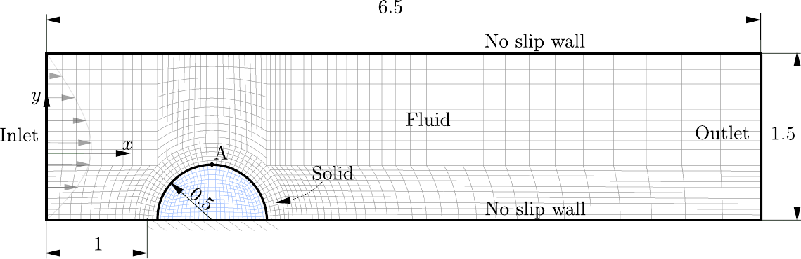
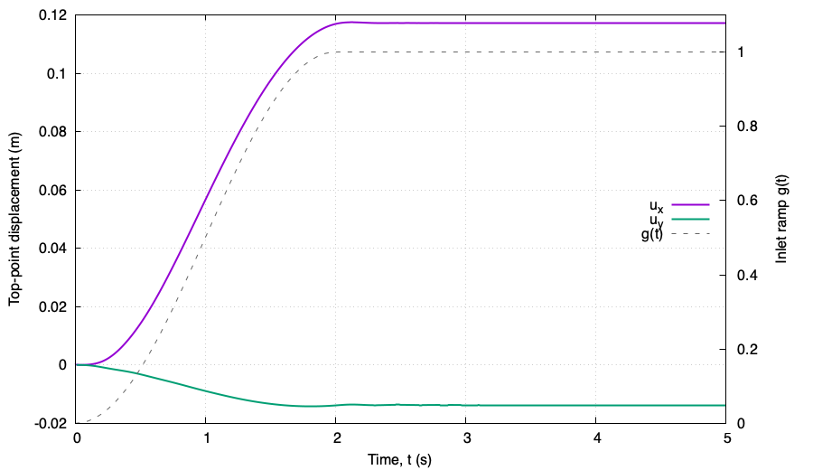
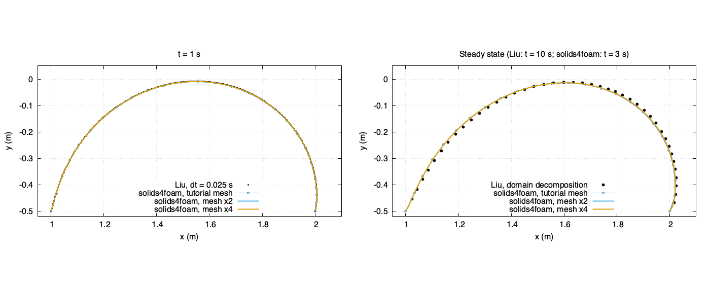

# An elastic half cylinder in a highly viscous channel flow: `blobInTreacle`

## Tutorial Aims

- Demonstrates a partitioned fluid-solid interaction simulation with a strong
  added-mass effect: the solid and fluid densities are equal.
- Demonstrates IQN-ILS coupling with the interface predictor.
- Reproduces the temporal-accuracy case of Liu, Jaiman and Gurugubelli [1].

## Case Overview

A linear elastic half cylinder of radius $$0.5\,\mathrm{m}$$, centred at
$$(1.5, -0.5)\,\mathrm{m}$$, is attached to the floor of the channel
$$[0, 6.5] \times [-0.5, 1]\,\mathrm{m}$$ [1]. The inlet velocity is

$$u_x = g(t)\,(1 + 2y)(1 - y), \qquad
g(t) = \tfrac{1}{2}\left[1 - \cos\left(\tfrac{\pi t}{2}\right)\right]
\ \text{for}\ t \le 2\,\mathrm{s}, \quad g(t) = 1\ \text{for}\ t > 2\,\mathrm{s},$$

a parabola with a peak of $$1.125\,\mathrm{m/s}$$ at $$y = 0.25\,\mathrm{m}$$,
set with the `transitionalParabolicVelocity` condition. The walls and the
fluid-solid interface are no-slip, the outlet is traction free (zero pressure
and zero velocity gradient), and the base of the half cylinder is fixed
(Figure 1).



**Figure 1: Geometry (in m) and boundary conditions, with the top point A of
the half cylinder; the mesh drawn is finer than the tutorial mesh**

| Parameter | Value |
| :--- | :--- |
| Fluid density, $$\rho_f$$ | $$1\,\mathrm{kg/m^3}$$ |
| Fluid kinematic viscosity, $$\nu_f$$ | $$1\,\mathrm{m^2/s}$$ |
| Solid density, $$\rho_s$$ | $$1\,\mathrm{kg/m^3}$$ |
| Lamé constants, $$\lambda_s$$ and $$\mu_s$$ | $$500$$ and $$50\,\mathrm{Pa}$$ |
| Young's modulus, $$E_s$$ (plane strain) | $$145.45\,\mathrm{Pa}$$ |
| Poisson's ratio, $$\nu_s$$ (plane strain) | $$0.4545$$ |

The Reynolds number is of order one, so the flow is dominated by viscosity,
hence the name. Liu et al. [1] describe the solid as linearly elastic, and the
preprint of the same work [2] lists it as "linear"; the tutorial therefore uses
the `linearGeometryTotalDisplacement` solid model with a `linearElastic` law.

The fluid is solved with `pimpleFluid` and the solid with a segregated solver.
The coupling is IQN-ILS with the interface predictor (`predictor yes` in
`constant/fsiProperties`): with equal densities, the first coupling iterate of
each time step otherwise sees a large added-mass error. Both regions use the
second-order `backward` time scheme with $$\Delta t = 0.01\,\mathrm{s}$$, and
the case runs to $$t = 10\,\mathrm{s}$$, by which time the flow has been steady
for several seconds.

The fluid mesh has 480 cells and the solid mesh 120 cells.

---

## Running the case

The case is run with `./Allrun`, which creates both meshes with `blockMesh`
and runs `solids4Foam`; `./Allrun parallel` decomposes both regions and runs in
parallel instead. It takes about three minutes on one core. When `gnuplot` is
installed, `deflection.pdf` and `force.pdf` show the displacement of the top of
the half cylinder and the force on the interface.

---

## Results

The displacement of the top of the half cylinder, initially at
$$(1.5, 0)\,\mathrm{m}$$, is written to
`postProcessing/0/solidPointDisplacement_pointDisp.dat`, and the force on the
interface to `postProcessing/fluid/forces/0/force.dat`. The half cylinder leans
downstream as the inflow ramps up and settles once the ramp ends
(Figure 2). The steady top-point displacement is
$$(0.1172, -0.0137)\,\mathrm{m}$$ and the steady interface force
$$(15.8, -25.0)\,\mathrm{N}$$ per metre of span; the vertical force is
dominated by the pressure, which is about $$25\,\mathrm{Pa}$$ at the half
cylinder because of the viscous pressure drop along the channel.



**Figure 2: Displacement of the top of the half cylinder and the inlet ramp
$$g(t)$$**

Liu et al. [1] report only the self-convergence of their errors in time, not
the solution itself. The preprint [2] shows the deformed interface at
$$t = 1\,\mathrm{s}$$ and the deformed solid mesh in the steady state
($$t = 10\,\mathrm{s}$$), both drawn as vector graphics; the verification study
extracts them to compare with. Figure 3 shows the comparison from that study.
At $$t = 1\,\mathrm{s}$$ the tutorial mesh reproduces the published interface
to within about 2% of the interface displacement. In the steady state the
published half cylinder leans further downstream: the steady top-point
displacement of [2] is $$(0.1297, -0.0117)\,\mathrm{m}$$, about 10% more than
on the tutorial mesh. The difference shrinks with mesh refinement, and the
remaining offset is discussed in the verification README.

The published data for this case are limited to self-convergence norms and
the coarse-mesh figures of the preprint, so an independent reference solution,
e.g. from COMSOL, LS-DYNA or ANSYS, would be valuable; one is being arranged.



**Figure 3: Deformed interface at $$t = 1\,\mathrm{s}$$ and in the steady
state, compared with the preprint of Liu et al. [2]**

---

## Verification and Convergence Study

The opt-in [`verification/`](verification/) directory contains a mesh study,
which compares the steady top-point displacement and interface shape with [2],
and a time-step study, which checks the second-order temporal accuracy that
this case was designed to test [1]:

```bash
cd verification
./Allverify
```

The study is separate from `regressionTest.sh` and is not run by the tutorial
test suites. See the verification README for the levels, options, tolerances
and results.

---

## References

[1] [Liu, J., Jaiman, R.K., and Gurugubelli, P.S. A stable second-order scheme
for fluid-structure interaction with strong added-mass effects. Journal of
Computational Physics, 270, 687-710 (2014)](https://doi.org/10.1016/j.jcp.2014.04.020)

[2] [Liu, J. Combined field formulation and a simple stable explicit interface
advancing scheme for fluid structure interaction. arXiv:1401.0082
(2014)](https://arxiv.org/abs/1401.0082)
