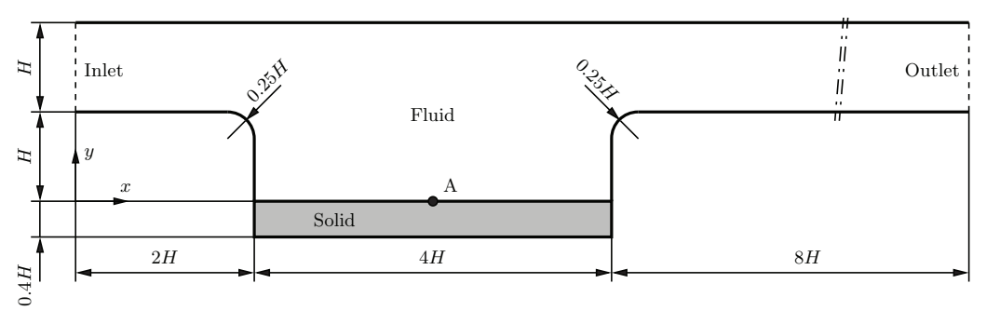
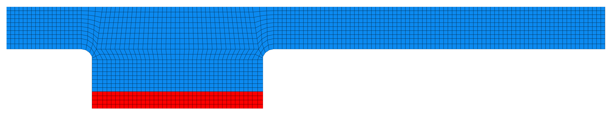
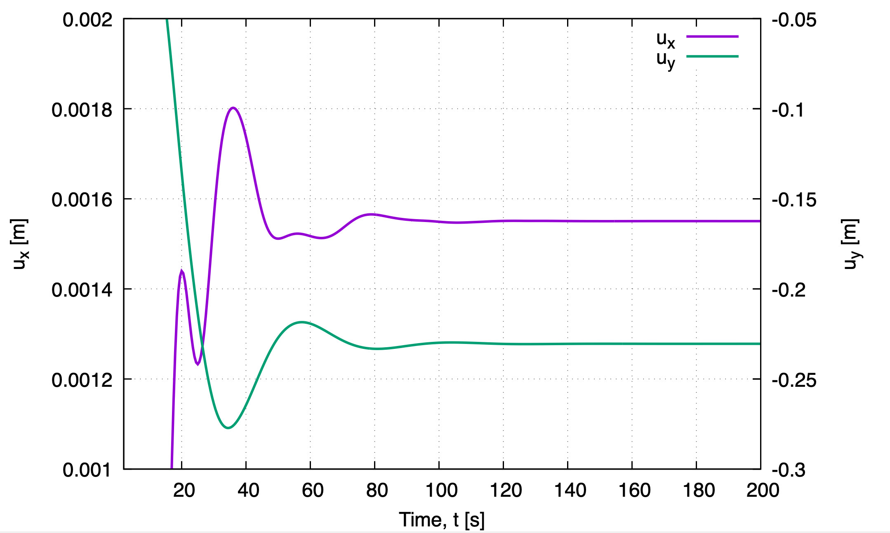
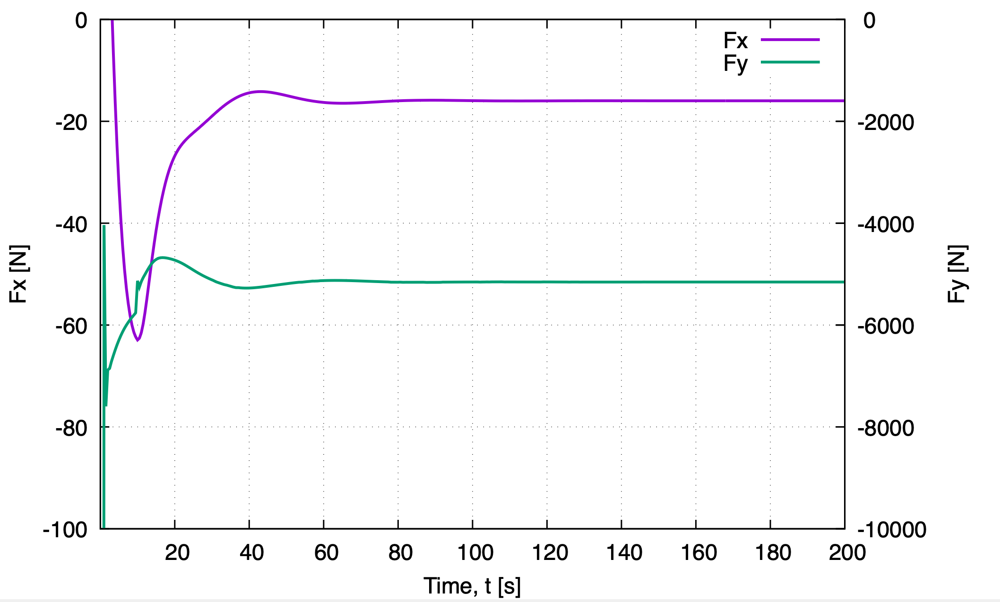
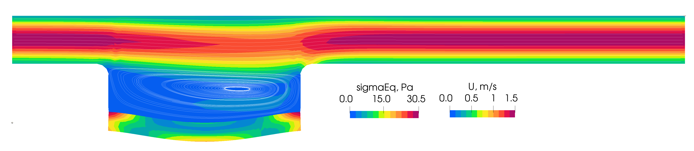
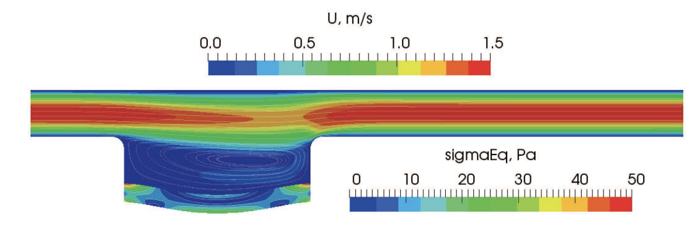
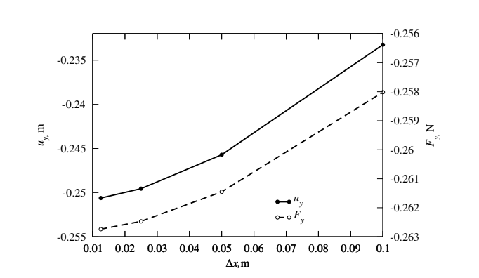

# Channel flow over a cavity with a flexible bottom: `cavityFlexibleBottom`

Prepared by Aaron Mullen-Hales, Philip Cardiff and Ivan Batistić
## Tutorial Aims
* Demonstrates how to perform a internal flow fluid-solid interaction simulation
## Case Overview
This case involves a laminar flow of an incompressible fluid over with a parabolic velocity profile at the inlet which flows through a 2D channel with a flexible cavity in the bottom wall of the channel. The geometry of the fluid and solid parts are shown in Fig. 1. The height of the performed calculations is $H=1$ m. The case involves a fluid with a desnsity of $1$ kg/m$^3$ and a kinematic viscosity of $0.01$ m$^2$ /s flowing into the channel from the left hand side with a parabolic velocity profile with a mean inlet velocity of $1$ m/s. This corresponds too a Reynolds number of 100 with respect to the channel height. A constant pressure is imposed at the outlet of the channel and a no-slip boundary condition is applied to the channel walls. The flexible elastic plate at the bottom of the cavity has a density of $1000$ kg/m$^3$, Young's modulus of $500$ N/m$^2$, Poisson's ratio of $\nu=0.4$ and its deformation is described by the Saint Venant-Kirchhoff constitutive model. Case is solved as transient until steady-state is achieved. Accordingly, 1st order `Euler` time discretisation schemes was chosen for the fluid and solid. In addition, damping is added to the solid (`dampingCoeff` in `constant/solid/solidProperties`) to speed-up convergence to the steady state and damp oscillations.

**Figure 1: Geometry of the spatial computational domain for the channel flow over a cavity with a flexible bottom [1]**

**Figure 2: Discretised domain (solid is coloured with red, fluid with blue)**

---

## Running the case
The tutorial case is located at
`solids4foam/tutorials/fluidSolidInteraction/HronTurekFsi3`. The case can be run
using the included `Allrun` script, i.e. `> ./Allrun`. The `Allrun` script first
executes `blockMesh` for both `solid` and `fluid` domains
(`> blockMesh -region fluid` and `> blockMesh -region solid` ), and the
`solids4foam` solver is used to run the case (`> solids4Foam`). Optionally, if
`gnuplot` is installed, a file `deflection.pdf` will be created with the
displacement history of point A and a file `force.pdf` will be created with the
history of the force on the interface. 

---

## Analysing Results

The vertical displacement of point A (`(4 -1 0)`) are recorded in `postProcessing/0/solidPointDisplacement_displacement.dat`
 via the function object defined in `system/controlDict`. The forces on the interface are also recorded in the `postProcessing/fluid/forces/0/force.dat` via the `forces` function object.  
Figure 3 shows convergence history of the displacement of point A whereas figure 4 shows convergence
of interface force components. As one can see, steady state solution is achieved after $t=120$ s. 
Figure 5 shows velocity field in the fluid and equivalent stress in the solid part. This is in good agreement with 
results from [1] showed at Fig. 6. Results at Fig 6 are presented for finer mesh which is the reason why stress
in solid have higher values at corners where plate exhibits stress concentration.

**Figure 3: Convergence of the horizontal and vertical displacement of point A**

**Figure 4: Convergence of the interface total force components**

**Figure 5: Velocity field in the fluid and equivalent stress in the solid part at the final time step**

---

## Results from the literature

The Tukovic et. Al. paper [1]  gives similar results when compared with results from `solids4foam`. In Figure 6 we see the papers results for the velocity field and equivalent stress, in Figure 7 we see the plots for the displacement and force convergence. Force from [1] is by multiple orders of magnitude lower becouse of the different domain thicness. The mesh used in `solids4foam` simulation corresponds to the firs mesh in [1] with $\Delta x=0.1$ m. Vertical displacement from [1] for the first mesh is $\approx 0.232$ m (from diagram) whereas `solids4foam` prediction is $-0.2305$ m.

**Figure 6: Velocity field in the fluid and equivalent stress in the solid part at the final time step, from [1].  Mesh spacing  0.025 m**

**Figure 6: Displacement of point A and force at the plate as a funcion of cell size [1]**

---

## References
[1]
[[Tuković, Ž., Karač, A., Cardiff, P., Jasak, H., and Ivanković, A. 
OpenFOAM finite volume solver for fluid-solid interaction.
 Transactions of FAMENA, 42(3), 1-31. (2018)](https://doi.org/10.21278/TOF.42301)

