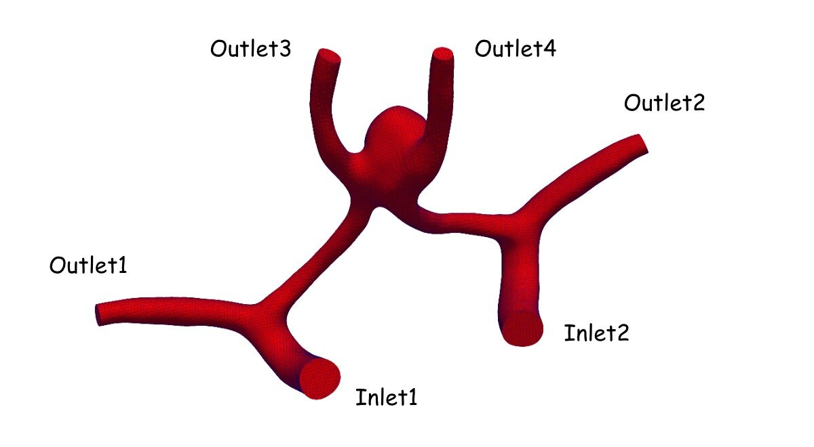
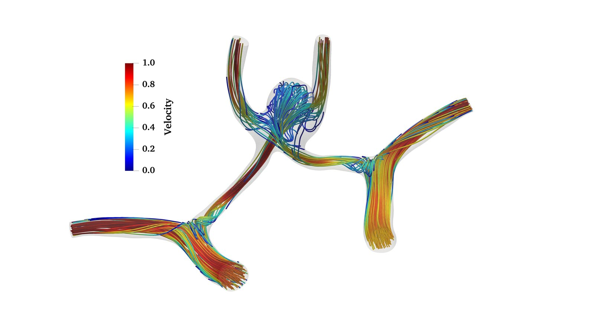
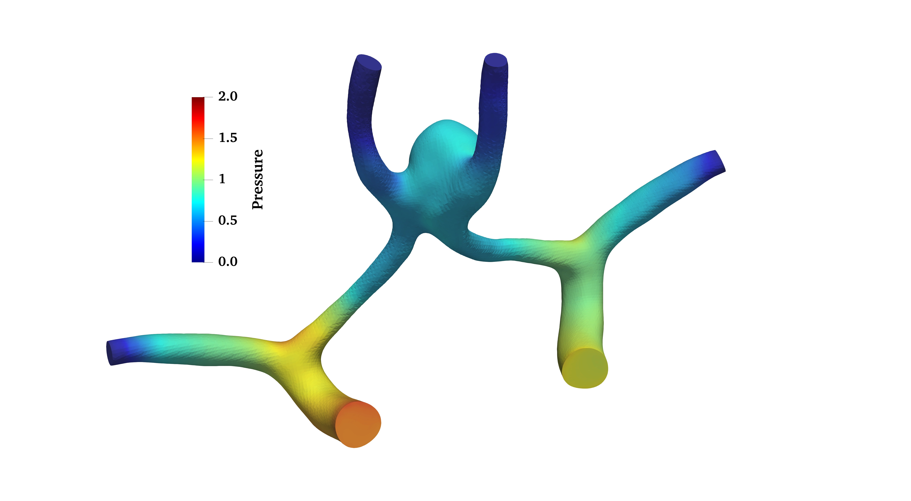
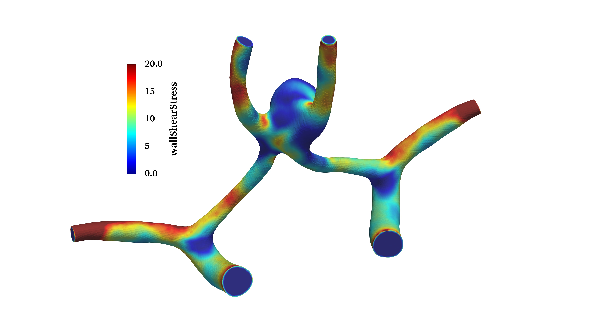

# Cerebral aneurysm fluid-solid interaction: `cerebralAneurysm`

Prepared by Chanikya Valeti

## Tutorial Aims

- Demonstrate a patient-specific vascular fluid-solid interaction simulation
  using `solids4foam`.
- Demonstrate fluid and arterial-wall mesh generation using `cartesianMesh` and
  `extrudeMesh`.

## Case Overview

This case models pulsatile blood flow and compliant-wall deformation in a
cerebral arterial geometry containing an aneurysm. The geometry is based on
model `0199_H_CERE_CA` from the
[Vascular Model Repository](https://vascularmodel.com/dataset.html), which is
categorised as a growing anterior communicating artery aneurysm.



**Figure 1: Patient-specific vascular geometry and inlet/outlet boundaries.**

Blood is represented as an incompressible Newtonian fluid with a density of
$$1050\,\mathrm{kg\,m^{-3}}$$ and a dynamic viscosity of
$$3.5\times10^{-3}\,\mathrm{Pa\,s}$$. A representative pulsatile internal
carotid artery flow-rate waveform based on values reported in the literature is
prescribed at both inlets. The waveform is not patient-specific; consequently,
the case demonstrates the numerical workflow and is not intended as a
clinically validated prediction.

The arterial wall is represented as a linear-elastic material with a density of
$$1200\,\mathrm{kg\,m^{-3}}$$, Young's modulus of $$640\,\mathrm{kPa}$$ and
Poisson's ratio of $$0.45$$. A uniform wall thickness of $$0.3\,\mathrm{mm}$$
is discretised using three cells through the thickness.

## Mesh Generation

The vascular surface is converted from STL to the `.fms` format using

```bash
surfaceFeatureEdges geometry.stl geometry.fms
```

and stored in `constant/triSurface`. The fluid mesh is generated by
`cartesianMesh` using `system/meshDict`. The solid arterial-wall mesh is then
created by extruding the fluid `Wall` patch using `extrudeMesh` and
`system/extrudeMeshDict`.

Minimal root-level `fvSchemes` and `fvSolution` dictionaries are included
because the standard `extrudeMesh` utility requires them when constructing its
temporary default-region mesh. The simulation itself uses the region-specific
dictionaries under `system/fluid` and `system/solid`. After extrusion,
`createPatch` renames the solid interface and external boundaries to
`innerWall` and `outerWall`, respectively.

## Numerical Approach

- **Fluid:** incompressible Newtonian flow using `pimpleFluid`.
- **Solid:** total-displacement linear-geometry formulation with a
  linear-elastic material.
- **Coupling:** partitioned fluid-solid interaction using fixed relaxation.
- **Interface:** `Wall` in the fluid region and `innerWall` in the solid region.
- **Duration:** one cardiac cycle of $$1\,\mathrm{s}$$.

## Expected Results

The flow divides between the arterial branches and develops a recirculating,
lower-velocity region inside the aneurysm sac. The pressure and wall shear
stress vary spatially across the vascular surface, while the structural
solution predicts elevated wall stress around the aneurysm region. The images
below show representative fields from the simulation.



**Figure 2: Fluid velocity streamlines coloured by velocity magnitude.**



**Figure 3: Pressure distribution in the fluid domain.**



**Figure 4: Wall shear stress distribution on the vascular wall.**

These results are for illustrative purpose only.

## Running the Case

From the tutorial directory, run

```bash
./Allclean
./Allrun
```

The `Allrun` workflow is

```text
cartesianMesh -> extrudeMesh -> createPatch -> checkMesh -> solids4Foam
```

## References

1. [Vascular Model Repository](https://vascularmodel.com/dataset.html), model
   `0199_H_CERE_CA`.
2. [solids4foam tutorial documentation](https://www.solids4foam.com/tutorials/).
