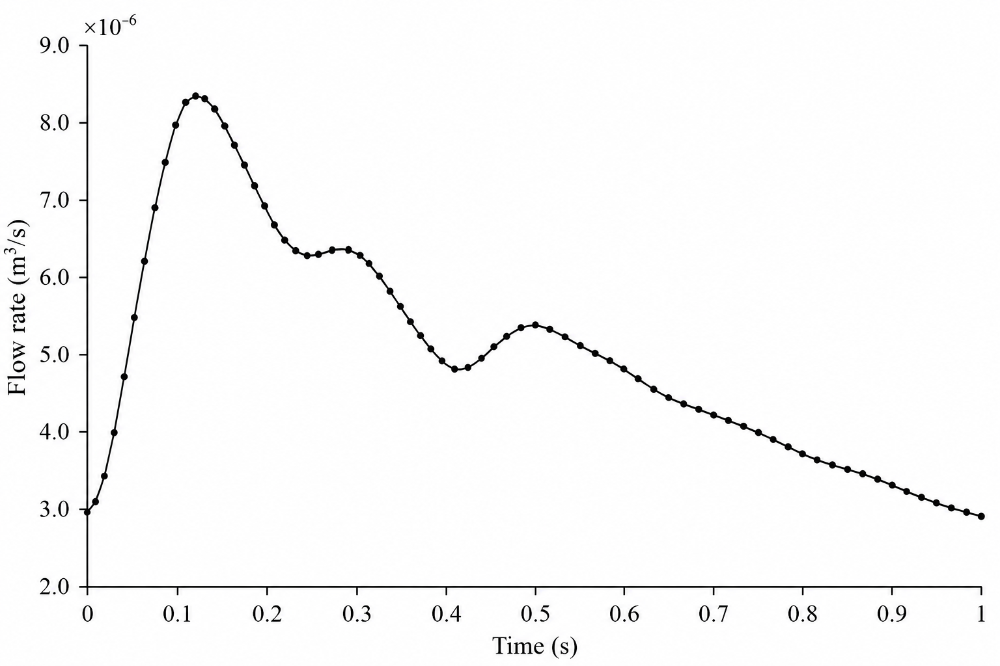
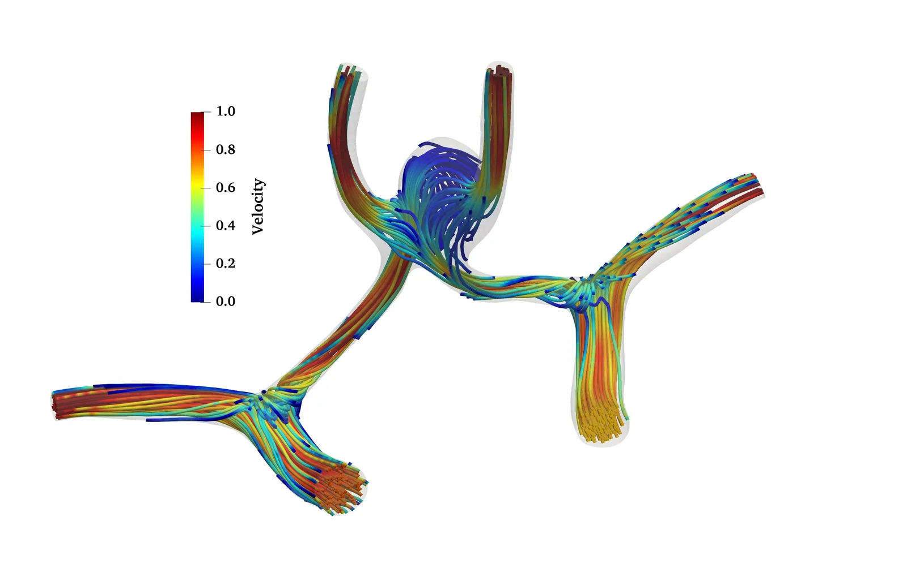
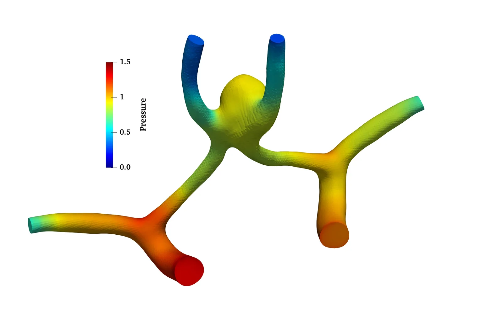
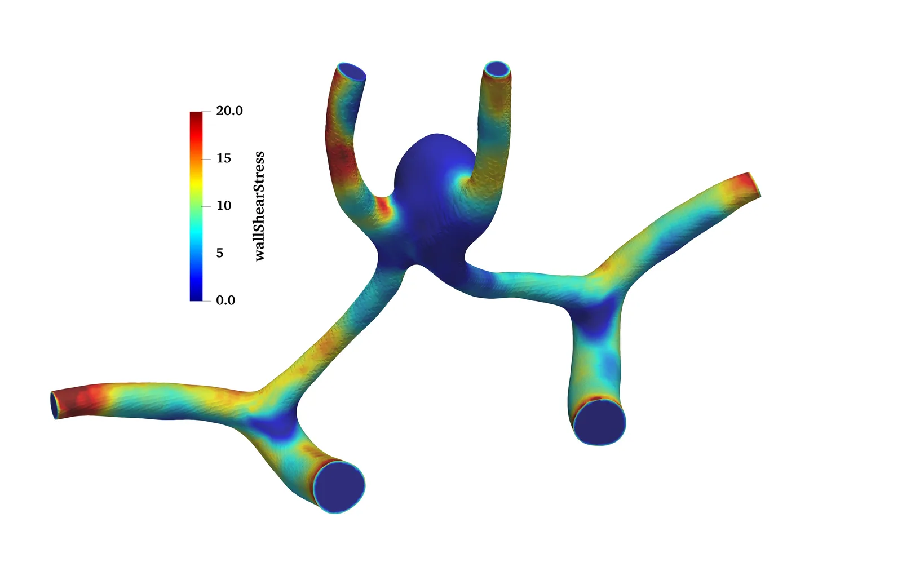
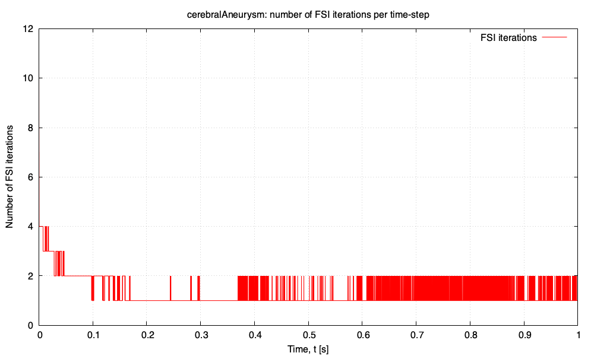

----
sort: 9
----

# Cerebral aneurysm fluid-solid interaction: `cerebralAneurysm`

Prepared by Chanikya Valeti, Philip Cardiff, and Ivan Batistić

## Tutorial Aims

- Demonstrate a patient-specific vascular fluid-solid interaction simulation
  using `solids4foam`.
- Demonstrate fluid and arterial-wall mesh generation using `cartesianMesh` and
  `extrudeMesh`.

## Case Overview

This case models pulsatile blood flow and compliant-wall deformation in a
cerebral arterial geometry containing an aneurysm. The geometry is based on
model `0199_H_CERE_CA` from the
[Vascular Model Repository](https://vascularmodel.com/dataset.html), which is
categorised as a growing anterior communicating artery aneurysm.


**Figure 1: Patient-specific vascular geometry and inlet/outlet boundaries.**

Blood is represented as an incompressible Newtonian fluid with a density of
$$1050\,\mathrm{kg\,m^{-3}}$$ and a dynamic viscosity of
$$3.5\times10^{-3}\,\mathrm{Pa\,s}$$. A representative pulsatile internal
carotid artery flow-rate waveform based on values reported in the literature is
prescribed at both inlets (Figure 2). Each of the four outlets uses a
three-element Windkessel condition (`windkesselPressure` in `0/fluid/p`) to
represent the downstream vasculature. The waveform is not patient-specific;
consequently, the case demonstrates the numerical workflow and is not intended
as a clinically validated prediction.



**Figure 2: Prescribed inlet volumetric flow-rate waveform over one cardiac
cycle.**

The arterial wall is represented as a linear-elastic material with a density of
$$1200\,\mathrm{kg\,m^{-3}}$$, Young's modulus of $$640\,\mathrm{kPa}$$ and
Poisson's ratio of $$0.45$$. A uniform wall thickness of $$0.3\,\mathrm{mm}$$
is discretised using three cells through the thickness.

## Mesh Generation

The vascular surface is converted from STL to the `.fms` format using

```bash
surfaceFeatureEdges geometry.stl geometry.fms
```

and stored in `constant/triSurface`. The fluid mesh is generated by
`cartesianMesh` using `system/meshDict`. The solid arterial-wall mesh is then
created by extruding the fluid `wall` patch using `extrudeMesh` and
`system/extrudeMeshDict`.

Minimal root-level `fvSchemes` and `fvSolution` dictionaries are included
because the standard `extrudeMesh` utility requires them when constructing its
temporary default-region mesh. The simulation itself uses the region-specific
dictionaries under `system/fluid` and `system/solid`. After extrusion,
the exposed inner face of the extruded mesh is named `innerWall` (via
`exposedPatchName` in `system/extrudeMeshDict`), and `createPatch` with
`system/createPatchDict.solid` renames the outer face to `outerWall`.

## Numerical Approach

- **Fluid:** incompressible Newtonian flow using `pimpleFluid`.
- **Solid:** total-displacement linear-geometry formulation with a
  linear-elastic material, solved with PETSc SNES using a Jacobian-free
  Newton-Krylov (JFNK) approach [3]. HYPRE BoomerAMG preconditions the
  linear solves.
- **Coupling:** partitioned fluid-solid interaction using fixed relaxation and
  a Robin pressure boundary condition. This added-mass procedure improves the
  stability of the partitioned coupling for the strongly coupled blood-wall
  system [2]. The case uses `constantHs 5e-4` and permits up to 30 FSI
  correctors per time step. The `fixedRelaxation` coupling uses a relaxation
  factor of 1.0, i.e. no additional under-relaxation is applied, as the Robin
  condition already provides the required stability.
- **Interface:** `wall` in the fluid region and `innerWall` in the solid region.
- **Duration:** one cardiac cycle of $$1\,\mathrm{s}$$.

The fixed time step is $$5\times10^{-5}\,\mathrm{s}$$, giving 20,000 time
steps over the cardiac cycle. As the time step is fixed, the Courant number
follows the flow-rate waveform: over the cycle it peaks at 8.84 near peak
systole ($$t\approx0.098\,\mathrm{s}$$), with a cycle-averaged value of 4.32.
The implicit PIMPLE fluid solution and the FSI coupling remain stable at these
Courant numbers, requiring an average of 1.8 FSI correctors per time step
(see Figure 6).

The `endTime` in `system/controlDict` is currently `1`, which corresponds to
one cardiac cycle. To simulate additional cycles, increase `endTime`; for
example, `endTime 4;` runs four cycles. The inlet-flow-rate table in
`0/fluid/U` uses `outOfBounds repeat;`, so the waveform repeats for each
additional cycle.

## Using a Nonlinear Geometry (Finite Strain) Formulation

The case is configured with a linear geometry (small strain, small rotation)
solid formulation. Switching to a nonlinear geometry (finite strain)
formulation requires only two changes:

1. In `constant/solid/solidProperties`, change the solid model from
   `linearGeometryTotalDisplacement` to a nonlinear geometry model, for example
   `nonLinearGeometryTotalLagrangianTotalDisplacement`, and rename the
   corresponding `...Coeffs` sub-dictionary to match:

   ```cpp
   solidModel nonLinearGeometryTotalLagrangianTotalDisplacement;

   nonLinearGeometryTotalLagrangianTotalDisplacementCoeffs
   {
       solutionAlgorithm PETScSNES;

       predictor         yes;

       stabilisation
       {
           momentum
           {
               type        RhieChow;
               scaleFactor 0.5;
           }
       }
   }
   ```

2. In `constant/solid/mechanicalProperties`, replace the small-strain
   mechanical law with a finite-strain law, for example `neoHookeanElastic`:

   ```cpp
   mechanical
   (
       artery
       {
           type            neoHookeanElastic;
           rho             rho [1 -3 0 0 0 0 0]  1200;
           E               E   [1 -1 -2 0 0 0 0] 640e3;
           nu              nu  [0 0 0 0 0 0 0]   0.45;
       }
   );
   ```

   The `neoHookeanElastic` law takes the same `E` and `nu` parameters as
   `linearElastic`, so it needs no additional material data. Other
   finite-strain laws, such as `StVenantKirchhoffElastic`, may be used in the
   same way. Note that the mechanical law must be consistent with the solid
   model: small-strain laws are for linear geometry solid models, whereas
   finite-strain laws are for nonlinear geometry solid models.

No changes are needed to the fluid settings, the FSI coupling settings, or the
boundary conditions. For the wall stiffness and pressure levels used here, the
wall strains remain small, and the nonlinear geometry solution is close to the
linear geometry one; the finite-strain formulation becomes important for
larger deformations, such as softer walls or higher transmural pressures.

## Expected Results

The flow divides between the arterial branches and develops a recirculating,
lower-velocity region inside the aneurysm sac. The pressure and wall shear
stress vary spatially across the vascular surface, while the structural
solution predicts elevated wall stress around the aneurysm region. The images
below show representative fields from the simulation.



**Figure 3: Fluid velocity streamlines coloured by velocity magnitude.**



**Figure 4: Pressure distribution in the fluid domain.**



**Figure 5: Wall shear stress distribution on the vascular wall.**



**Video 1: Time evolution of the equivalent (von Mises) stress distribution
in the arterial wall over a cardiac cycle. The deformation has been scaled
by a factor of 5.**

The number of FSI (outer) iterations performed in each time step is recorded in
`postProcessing/fsiResiduals.dat`. `Allrun` post-processes this file with
`fsiIterations.gnuplot` to produce `fsiIterations.pdf` and `fsiIterations.png`
(this step is skipped if `gnuplot` is not installed).



**Figure 6: Number of fluid-solid interaction iterations per time step over one
cardiac cycle.**

The partitioned coupling is inexpensive once the initial transient has passed:
11 iterations are needed in the first time step, after which the count settles
to one or two iterations, averaging 1.8 over the cardiac cycle. The limit of 30
FSI correctors per time step is never reached.

## Running the Case

From the tutorial directory, run

```bash
./Allclean
./Allrun parallel
```

The case is configured for 16 subdomains by default
(`system/decomposeParDict` and its `fluid` and `solid` counterparts); change
`numberOfSubdomains` in all three to run on a different number of cores. Omit
`parallel` to run in serial.

As a representative run time, the full cardiac cycle (20,000 time steps of
$$5\times10^{-5}\,\mathrm{s}$$) completed in 9209 s of wall-clock time
(approximately 2 hours 34 minutes) using **8 cores**, i.e. with
`numberOfSubdomains` reduced from the default 16 to 8. The hardware was an
Apple Mac Studio with an M1 Ultra chip (20 cores: 16 performance and 4
efficiency) and 64 GB of unified memory, running macOS 26.5 and OpenFOAM
v2512. This timing excludes mesh generation, which takes a few seconds.
Performance varies with hardware and through the cardiac cycle, as the cost per
time step follows the FSI iteration count shown in Figure 6.

The `Allrun` workflow is

```text
cartesianMesh -> extrudeMesh -> createPatch -> checkMesh -> solids4Foam
```

## Regression Test

The case includes a `regressionTest.sh` script:

```bash
./regressionTest.sh
```

Because the full cardiac cycle takes hours, the script copies the case inputs
to `cerebralAneurysm/regressionTests/main/`, reduces `endTime` to
$$5\times10^{-4}\,\mathrm{s}$$ (the first 10 time steps of the initial
transient) and runs the case in serial there; the tutorial directory itself is
untouched. On the hardware above, the check takes approximately two minutes.

The following quantities are then compared with stored reference values, within
loose tolerances:

- the largest `innerWall` displacement component from
  `postProcessing/0/solidDisplacementsinnerWall.dat`,
- the `innerWall` normal force from
  `postProcessing/0/solidForcesinnerWall.dat`.

Pass `--check-only` to re-check an existing regression run without re-running
the case. If PETSc or `cartesianMesh` is unavailable, `Allrun` exits silently
and the script skips the checks rather than reporting a failure.

## References

1. N. M. Wilson, A. K. Ortiz, and A. B. Johnson, "The Vascular Model
   Repository: A Public Resource of Medical Imaging Data and Blood Flow
   Simulation Results," *Journal of Medical Devices*, 7(4), 040923 (2013).
   <https://doi.org/10.1115/1.4025983>. Model `0199_H_CERE_CA`,
   [Vascular Model Repository](https://vascularmodel.com/dataset.html).
2. Ž. Tuković, M. Bukač, P. Cardiff, H. Jasak, and A. Ivanković (2019).
   "Added Mass Partitioned Fluid–Structure Interaction Solver Based on a
   Robin Boundary Condition for Pressure." In: J. Nóbrega and H. Jasak (eds),
   *OpenFOAM®*. Springer, Cham. <https://doi.org/10.1007/978-3-319-60846-4_1>.
3. P. Cardiff, D. Armfield, Ž. Tuković, and I. Batistić, "A Jacobian-Free
   Newton-Krylov Method for Cell-Centred Finite Volume Solid Mechanics,"
   *International Journal for Numerical Methods in Engineering*, 127(3),
   e70268 (2026). <https://doi.org/10.1002/nme.70268>.
