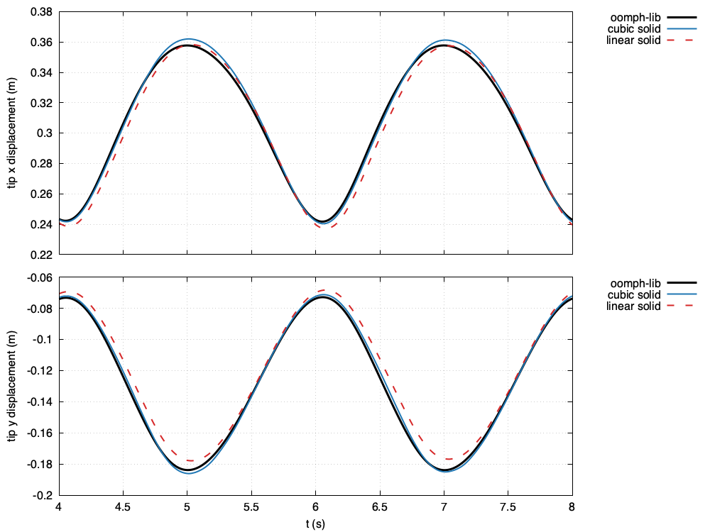

# Channel with an elastic leaflet: `channelLeaflet`

---

## Tutorial Aims

- Demonstrates a strongly coupled internal-flow fluid-solid interaction case
  with a thin, light, highly flexible leaflet wetted on both faces and loaded
  by a pulsatile flow at Reynolds number 200.
- Compares the leaflet motion, code to code, with solutions of the same
  problem computed with the open-source finite-element library
  [oomph-lib](https://oomph-lib.github.io/oomph-lib/), which models the
  leaflet as a Kirchhoff-Love beam.
- Compares the second-order and the high-order (cubic) solid discretisations
  on a leaflet that bends through a large rotation.

## Case Overview

A two-dimensional channel of height $$a = 1\,\mathrm{m}$$ is partly blocked
by a vertical elastic leaflet of height $$0.5\,\mathrm{m}$$ and thickness
$$h = 0.05\,\mathrm{m}$$, centred on $$x = 1\,\mathrm{m}$$ and clamped at its
base. The channel extends $$1\,\mathrm{m}$$ upstream and $$7\,\mathrm{m}$$
downstream of the leaflet. A pulsatile Poiseuille flow,
$$u = 6\,y\,(1 - y)\,q(t)$$ with $$q(t) = 1.5 - 0.5\cos(\pi t)$$, enters on
the left, so that the flux varies between 1 and $$2\,\mathrm{m^2/s}$$ with a
period of $$2\,\mathrm{s}$$. The fluid starts from rest and the flux is ramped
up as $$(1 - \cos(\pi t))/2$$ over the first second. The outflow is parallel
and axially traction-free.

| Quantity | Value |
| --- | --- |
| Fluid density, kinematic viscosity | 1 kg/m^3, 0.005 m^2/s |
| Reynolds number $$Re = U a/\nu$$ (and $$Re\,St$$) | 200 |
| Leaflet Young's modulus $$E$$, Poisson's ratio $$\nu_s$$ | 4550 Pa, 0.3 |
| Plane-strain modulus $$E/(1-\nu_s^2)$$ | 5000 Pa |
| Leaflet density | 1 kg/m^3, as the fluid (regularising, see below) |
| Time step, end time | 0.01 s, 8 s |

After about two periods the leaflet oscillates periodically, with the period
of the inflow and a large amplitude: its tip moves between
$$x \approx 1.24$$ and $$1.36\,\mathrm{m}$$. The monitored quantity is the
displacement of the centre of the leaflet's top face, written by the
`solidPointDisplacement` function object `tip`.

### Relation to the published case

The configuration is that of the oomph-lib tutorial
[Flow in a 2D channel with an elastic leaflet](https://oomph-lib.github.io/oomph-lib/doc/interaction/fsi_channel_with_leaflet/html/index.html),
also a test case of Heil, Hazel & Boyle (2008), with $$Re = 200$$,
$$Q = 10^{-6}$$ and $$H = 0.05$$. Four things are changed:

1. **A longer downstream section**, 7 rather than 3 channel heights, which
   removes the artificial outflow boundary layer that the oomph-lib tutorial
   warns of. Over the first 2.4 s oomph-lib gives the same tip history for
   7 and 11 heights to 0.01%.
2. **A start from rest** with a ramped flux, instead of a sequence of steady
   solves up to $$Re = 200$$. The periodic state does not depend on the
   start: from the fourth period on, the oomph-lib solutions for both starts
   agree to 0.04% of the tip displacement.
3. **A leaflet of finite thickness.** The published leaflet is a
   Kirchhoff-Love beam loaded on its midplane, so the fluid sees a line of
   zero thickness. Here it is a plane-strain St Venant-Kirchhoff continuum of
   thickness $$h$$, with $$E = E_{eff}(1 - \nu_s^2)$$ so that its bending and
   axial stiffness, $$E_{eff} h^3/12$$ and $$E_{eff} h$$, are the beam's
   ($$E_{eff} = \mu U/(a Q) = 5000\,\mathrm{Pa}$$).
4. **A regularising leaflet density,** $$\rho_s = \rho_f$$. The published
   leaflet is massless, which the partitioned coupling cannot solve; lighter
   leaflets, $$\rho_s/\rho_f = 0.1$$ and $$0.3$$, fail in the first period.
   The oomph-lib reference is computed with the same density,
   $$\Lambda^2 = \rho_s U^2/E_{eff} = 2\times10^{-4}$$; the density moves the
   oomph-lib periodic state by 0.4% of the tip displacement.

The last two points make this a **code-to-code comparison with a model
difference**, not a verification against the beam solution: the fluid domain
differs near the leaflet and at its tip by $$O(h)$$, and the leaflet-thickness
study below shows that this difference is not removed by thinning the leaflet
on the tutorial mesh.

## Solid discretisation, coupling and mesh motion

The leaflet uses the total-Lagrangian solid model solved with PETSc SNES and
the least-squares reconstruction of the high-order finite-volume method,
preconditioned with its assembled Jacobian, factorised with LU:

- `./Allrun` uses a cubic reconstruction, `polynomialOrder 3`;
- `./Allrun linear` uses a linear reconstruction, `polynomialOrder 1`, i.e. a
  second-order discretisation.

The preconditioner is rebuilt at every Newton step, because the leaflet
rotates by tens of degrees within a period.

The coupling is Dirichlet-Neumann with Aitken relaxation
(`constant/fsiProperties`, initial relaxation 0.05, `predictSolid no`),
about 16 FSI iterations per time step. It is the only partitioned coupling
that completed this case:

- IQN-ILS diverges during the first large deflection of the leaflet,
  $$0.36 < t < 0.54\,\mathrm{s}$$, with every setting tried;
- Robin-Neumann (`elasticWallPressure` and `elasticWallVelocity`) does not
  converge in the first time step from rest, but restarted from the Aitken
  solution at $$t = 1\,\mathrm{s}$$ it converges, in about 60 iterations per
  step, and agrees with Aitken to 0.1%.

The fluid mesh follows the leaflet with the radial-basis-function mesh motion
solver (`RBFMeshMotionSolver`, thin-plate splines, every boundary face a
control point), which interpolates the interface displacement from the
initial mesh. The `velocityLaplacian` solver accumulates the mesh motion of
each time step, and its mesh drifts by about 0.02 m every two periods, which
grows the difference from oomph-lib over the run.

## Running the case

```bash
./Allrun           # cubic solid, about 2.5 hours in serial
./Allrun linear    # linear solid, about 2 hours in serial
```

The case needs OpenFOAM.com, for the radial-basis-function mesh motion, and
solids4foam built with PETSc. It runs in serial.

## Expected results

Figure 1 compares the tip displacement over the periodic state with the
oomph-lib solution at the same time step. With the cubic solid, the tip
history differs from oomph-lib by at most 1.1% of the largest tip
displacement (0.43 m) over the last period, and by 1.1-1.3% over the third and
fourth periods; the start-up transient differs by up to 5.5%. The linear solid
differs by 3.2-3.7%. The periodic state repeats to 0.5% between the third and
fourth periods.



### Figure 1: Leaflet tip displacement over the periodic state, against oomph-lib

## Code-to-code comparison

The `verification/` directory holds an opt-in study against oomph-lib; see
[`verification/README.md`](verification/README.md). In summary:

- the oomph-lib reference is good to about 0.2% of the tip displacement;
- the static deflection of the cubic solid is within 1.2% of the beam, for
  $$h$$ from 0.05 to 0.0125 m;
- the periodic-state difference from oomph-lib is 1.1-1.3% with the cubic
  solid, which is the model difference of the finite-thickness continuum on
  this mesh; its components could not be separated, because
  - thinning the leaflet at fixed bending stiffness does not bring the
    solution towards the beam model (2.5-2.8% at $$h = 0.025\,\mathrm{m}$$),
  - refined fluid meshes stall in the coupling during the first deflection;
- halving the time step changes the periodic state by 0.3%; time steps of
  0.02 and 0.0025 s fail in the solid Newton solve, so no order of
  convergence is claimed.

## Regression test

`regressionTest.sh` runs the tutorial to $$t = 1\,\mathrm{s}$$ and checks the
tip displacement at $$t = 0.5$$ and $$1\,\mathrm{s}$$ against stored values.

## References

- M. Heil, A. L. Hazel and J. Boyle, Solvers for large-displacement
  fluid-structure interaction problems: segregated versus monolithic
  approaches, *Computational Mechanics*, 43, 91-101, 2008.
- oomph-lib,
  [Flow in a 2D channel with an elastic leaflet](https://oomph-lib.github.io/oomph-lib/doc/interaction/fsi_channel_with_leaflet/html/index.html).
