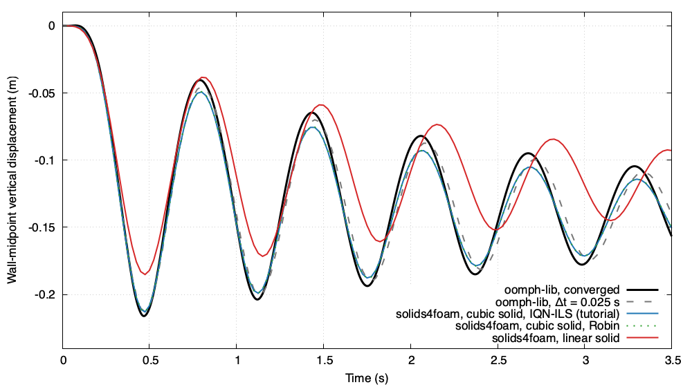

# Flow in a collapsible channel: `collapsibleChannel`

---

## Tutorial Aims

- Demonstrates a strongly coupled internal-flow fluid-solid interaction case
  with a very light, thin elastic wall.
- Verifies partitioned IQN-ILS and Robin-Neumann coupling against converged
  monolithic solutions computed with the open-source finite-element library
  [oomph-lib](https://oomph-lib.github.io/oomph-lib/), under mesh and
  time-step refinement.
- Compares the second-order and the high-order (cubic) solid discretisations
  on a thin wall that deforms in combined bending and stretching.

## Case Overview

Viscous fluid flows through a two-dimensional channel of width
$$a = 1\,\mathrm{m}$$. Part of the upper wall, $$5 < x < 15\,\mathrm{m}$$, is a
thin elastic wall of thickness $$h = 0.05\,\mathrm{m}$$, clamped at both ends
to rigid channel sections of length $$L_{up} = 5\,\mathrm{m}$$ upstream and
$$L_{down} = 10\,\mathrm{m}$$ downstream. The flow is driven by the inlet
pressure $$p_{in} = 12 \nu U (L_{up} + L + L_{down})/a^2 = 6\,\mathrm{m^2/s^2}$$
(kinematic) that sustains a Poiseuille flow of mean velocity
$$U = 1\,\mathrm{m/s}$$, with $$p = 0$$ at the outlet and parallel flow at both
ends. The fluid starts as that Poiseuille flow, the wall starts flat, and an
external pressure on the wall is ramped up as
$$p_{ext}(t) = 200\,(1 - \cos(\pi t/0.25))/2\,\mathrm{Pa}$$ over the first
$$0.25\,\mathrm{s}$$. The wall collapses into the channel, overshoots, and
performs a damped oscillation of period about $$0.8\,\mathrm{s}$$ about its
new equilibrium, pumping fluid in and out of the channel as it does so.

| Quantity | Value |
| --- | --- |
| Fluid density, kinematic viscosity | 1 kg/m^3, 0.02 m^2/s |
| Reynolds number $$Re = U a/\nu$$ (and $$Re\,St$$) | 50 |
| Wall thickness $$h$$, length $$L$$ | 0.05 m, 10 m |
| Wall Young's modulus $$E$$, Poisson's ratio $$\nu_s$$ | 455 MPa, 0.3 |
| Plane-strain wall modulus $$E/(1-\nu_s^2)$$ | 500 MPa |
| Wall density | 1 kg/m^3, as the fluid (regularising, see below) |
| External pressure $$p_{ext}$$ | 200 Pa, ramped over 0.25 s |
| Time step, end time | 0.025 s, 3.5 s |

The monitored quantity is the vertical displacement of the wall at 25%, 50%
and 75% of its length, $$x = 7.5$$, $$10$$ and $$12.5\,\mathrm{m}$$, written by
the `solidPointDisplacement` function objects `wallQuarter`, `wallMid` and
`wallThreeQuarter`.

### Relation to the published case

The configuration is that of the oomph-lib tutorial
[Flow in a 2D collapsible channel](https://oomph-lib.github.io/oomph-lib/doc/interaction/fsi_collapsible_channel/html/index.html),
itself a version of the problem studied by Jensen & Heil (2003), Heil (2004)
and Heil, Hazel & Boyle (2008): the same geometry, Reynolds number, flow
driving, boundary conditions, initial condition and monitored wall
displacement. Four things are changed, the first three so that a
finite-volume continuum can represent the wall, the fourth so that the
partitioned coupling works at every time step and mesh:

1. **No pre-stress.** In the published cases the wall is a Kirchhoff-Love
   beam with an axial pre-stress $$\sigma_0 = 10^3$$ on the scale of its own
   modulus, i.e. a pre-strain of a thousand. A continuum cannot carry that as
   strain. solids4foam can impose an initial stress `sigma0` on a hyperelastic
   law, but the high-order solid supports no law that carries it, and the
   standard solid needs the geometric stiffness in its implicit operator, so
   this tutorial uses $$\sigma_0 = 0$$. The wall then deforms in combined
   bending and stretching, rather than as the tensioned membrane of the
   published cases, whose bending stiffness is $$10^{-8}$$ of its tension.
2. **A thicker wall, $$h/a = 1/20$$,** the value of Heil, Hazel & Boyle
   (2008), and an external pressure scaled to keep $$p_{ext}/(\mu U/a) = 10^4$$,
   as in the oomph-lib tutorial. The collapse at equilibrium is then about 14% of
   the channel width, against 12% there.
3. **Clamped ends and a ramped external pressure.** A continuum wall fixed on
   its end faces is clamped, not pinned; the ramp replaces the impulsive
   start, which limits the time-step convergence of the second-order schemes.
4. **A small regularising wall density.** The published wall is massless.
   Then the fluid's added mass, which grows as $$1/\Delta t^2$$, is the only
   inertia, and the partitioned coupling fails at time steps below
   $$0.025\,\mathrm{s}$$ and on fine fluid meshes. The wall is given the density
   of the fluid, $$\rho_s/\rho_f = 1$$, like a penalty bulk modulus for an
   incompressible solid: it moves the converged oomph-lib solution by 0.28% of
   the peak deflection, below the precision of the reference, and the
   reference is computed with the same density. The density sweep in
   `verification/README.md` gives the rationale.

The non-dimensional parameters, on the oomph-lib scales (lengths on $$a$$,
velocities on $$U$$, stresses on $$E/(1-\nu_s^2)$$), are $$Re = Re\,St = 50$$,
$$Q = \mu U/(a E_{eff}) = 4\times10^{-11}$$, $$H = h/a = 0.05$$,
$$\sigma_0 = 0$$, $$\Lambda^2 = \rho_s U^2/E_{eff} = 2\times10^{-9}$$,
$$P_{ext} = 4\times10^{-7}$$ and
$$P_{up} = 12(L_{up} + L + L_{down}) = 300$$.

### From the beam to a continuum

The reference wall is oomph-lib's geometrically nonlinear Kirchhoff-Love beam
with an incrementally linear constitutive law: the axial second Piola-Kirchhoff
stress is $$E_{eff}\,\gamma$$, with $$\gamma$$ the Green strain of the
midplane. The solids4foam wall is a two-dimensional (plane-strain)
St Venant-Kirchhoff continuum of the same thickness, whose second
Piola-Kirchhoff stress is linear in the Green strain. In plane strain with a
traction-free top and bottom, its axial stiffness and bending stiffness per
unit width are $$E h/(1-\nu_s^2)$$ and $$E h^3/(12(1-\nu_s^2))$$, which equal the
beam's $$E_{eff} h$$ and $$E_{eff} h^3/12$$ when $$E = E_{eff}(1 - \nu_s^2)$$.
The fluid acts on the bottom face of the continuum, at $$y = 1$$, and on the
midplane of the beam, also at $$y = 1$$, so both see the same fluid domain.

The continuum converges to the beam only as $$h/L \to 0$$. Here
$$h/L = 0.005$$: the neglected transverse shear, the offset between the loaded
face and the midplane, and the clamping of the whole end face rather than the
midplane are all of order $$h/L$$ or smaller, below the tolerances used in the
verification.

## Solid discretisations

Both solid variants use the total-Lagrangian solid model solved with PETSc
SNES (Jacobian-free Newton-Krylov) and the least-squares reconstruction of the
high-order finite-volume method, preconditioned with its assembled Jacobian:

- `./Allrun` uses a cubic reconstruction, `polynomialOrder 3`
  (`constant/solid/solidProperties.highOrder`);
- `./Allrun linear` uses a linear reconstruction, `polynomialOrder 1`, i.e. a
  second-order discretisation (`constant/solid/solidProperties.linear`).

The high-order solid is the default because the wall bends. Solved alone
under the full external pressure, the wall-midpoint deflection of the clamped
oomph-lib beam is $$-0.14363\,\mathrm{m}$$, and the continuum gives:

| Solid mesh (length x thickness) | Linear | Cubic |
| --- | ---: | ---: |
| 80 x 8 (tutorial) | -16.7% | +0.21% |
| 160 x 8 | -6.0% | +0.08% |
| 320 x 8 | -1.1% | +0.06% |
| 640 x 8 | -0.22% | +0.05% |
| 160 x 4 | +1.7% | -0.25% |

A negative error means the wall is too stiff. The cubic solid is within 0.25%
on every mesh, and converges to a value 0.05% from the beam, which is the
continuum-beam difference. The linear solid stiffens as the cells become
elongated, and needs eight times the in-plane resolution to match the cubic
solid on the tutorial mesh; in the coupled problem its too-stiff wall
collapses 14% too little. The `static` study in `verification/`
reproduces this table.

The standard finite-volume solid is not practical on this wall. With its
segregated solution algorithm it needs about 34,000 outer iterations per solid
solve on the tutorial mesh. With PETSc SNES, preconditioned by its
compact-stencil Jacobian, it needs thousands of Krylov iterations per Newton
step, fails on refined meshes, and is 9% too stiff on the tutorial mesh.

The solid solve needs the assembled high-order Jacobian as the
preconditioner: with the compact Jacobian, even factorised exactly, GMRES
stalls. hypre BoomerAMG works on the high-order Jacobian but is several
times slower than LU. The cubic solid does not converge through sixteen or
more cells across the wall thickness, where its linear solves diverge; the
verification therefore keeps eight cells across the thickness.

## Fluid-solid coupling

Two partitioned couplings are provided, both with the fluid interface
velocity from the solid motion.

**IQN-ILS** (the default, `constant/fsiProperties.iqnils`, with
`newMovingWallVelocity`). Because the wall is so light, the fluid's added
mass dominates its inertia and the coupling is very strong:

- `predictor yes` extrapolates the interface at the start of each time step;
- `predictSolid no`: solving the light wall first with the old fluid load
  would jump it towards the new external pressure, and passing that jump to
  the fluid unrelaxed gives a large added-mass pressure;
- `relaxationFactor 0.005` for the first two iterations of each time step,
  roughly the wall stiffness over the added mass divided by $$\Delta t^2$$;
  it must shrink with $$\Delta t^2$$ when the time step is refined;
- `relMinSignificant 1e-2`, `qrSolveTolerance 1e-3` and
  `reorthogonalizeCouplingColumns yes` filter and regularise the
  least-squares update; without them round-off or a near-singular update
  could tangle the fluid mesh;
- `couplingReuse 0`: re-using the secant modes of previous time steps made
  the coupling diverge or stall on some meshes and platforms;
- `outerCorrTolerance 1e-4`, relative to the largest interface displacement,
  i.e. about $$2\times10^{-5}\,\mathrm{m}$$.

IQN-ILS runs the tutorial in about 15 iterations per time step, but fails at
smaller time steps and on the finest fluid mesh even with the regularising
density.

**Robin-Neumann** (`./Allrun robin`, `constant/fsiProperties.robin`, with
`elasticWallPressure` and `elasticWallVelocity` on the fluid interface and
unrelaxed fixed-point iterations). The Robin coefficient is the wall density
times a virtual thickness from the default secant model, so it needs the
nonzero wall density. Robin needs about 18 iterations per time step on the
tutorial and 20-24 at smaller time steps and on finer meshes, and completes
every time step and fluid mesh of the verification study. Where both
complete, Robin and IQN-ILS agree to 0.1-0.25% of the peak deflection.

## Running the case

```bash
./Allrun               # IQN-ILS, high-order (cubic) solid, about 10 minutes
./Allrun linear        # IQN-ILS, second-order (linear) solid, about 4 minutes
./Allrun robin         # Robin-Neumann, cubic solid, about 8 minutes
./Allrun robin linear  # Robin-Neumann, linear solid, about 5 minutes
```

The case runs in serial: in parallel, the Krylov solves of the solid fail to
converge with every preconditioner tried, including an exact parallel LU,
which suggests a parallel inconsistency in the high-order residual (see
`verification/README.md`).

## Expected results

Figure 1 compares the wall-midpoint displacement with the oomph-lib solution
of the same problem, both at the tutorial time step and converged in space
and time (see `verification/`). With the high-order solid the first trough,
$$-0.2129\,\mathrm{m}$$ at $$t = 0.47\,\mathrm{s}$$, matches oomph-lib at the
same time step ($$-0.2130\,\mathrm{m}$$) and is within 1.4% of the converged
$$-0.2160\,\mathrm{m}$$; the later oscillations are slightly over-damped and
lag by a few hundredths of a second, as the oomph-lib solution at the same
time step does. The Robin and IQN-ILS histories coincide to within 0.3%. The
linear solid, too stiff on this mesh, collapses 14% too little and
oscillates too fast.



### Figure 1: Vertical displacement of the wall midpoint, $$x = 10\,\mathrm{m}$$

## Verification

The `verification/` directory holds an opt-in study against oomph-lib
solutions of the same problem; see
[`verification/README.md`](verification/README.md). In summary:

- the static wall deflection of the cubic solid is within 0.25% of the beam
  on every solid mesh, and converges to 0.05%;
- in the coupled problem the solid discretisation error of the cubic solid
  is 0.44% on the tutorial mesh, against 17% for the linear solid;
- with Robin coupling at $$\Delta t = 0.00625\,\mathrm{s}$$, refining the
  fluid mesh up to four times brings the wall-midpoint history to within 0.5%
  of oomph-lib (4.65% on the tutorial mesh), the reference precision;
- the time-step study converges with an observed order of 1.8 to 2.0, as
  oomph-lib does, with a difference of 0.34% between the two finest steps.

## Regression test

`regressionTest.sh` runs the tutorial (IQN-ILS, cubic solid) to
$$t = 1\,\mathrm{s}$$ and checks the wall-midpoint displacement at the first
trough and at $$t = 1\,\mathrm{s}$$ against stored values.

## References

- O. E. Jensen and M. Heil, High-frequency self-excited oscillations in a
  collapsible-channel flow, *Journal of Fluid Mechanics*, 481, 235-268, 2003.
- M. Heil, An efficient solver for the fully coupled solution of
  large-displacement fluid-structure interaction problems, *Computer Methods
  in Applied Mechanics and Engineering*, 193, 1-23, 2004.
- M. Heil, A. L. Hazel and J. Boyle, Solvers for large-displacement
  fluid-structure interaction problems: segregated versus monolithic
  approaches, *Computational Mechanics*, 43, 91-101, 2008.
- oomph-lib, [Flow in a 2D collapsible channel](https://oomph-lib.github.io/oomph-lib/doc/interaction/fsi_collapsible_channel/html/index.html).
