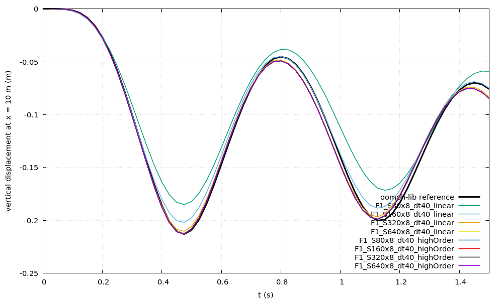
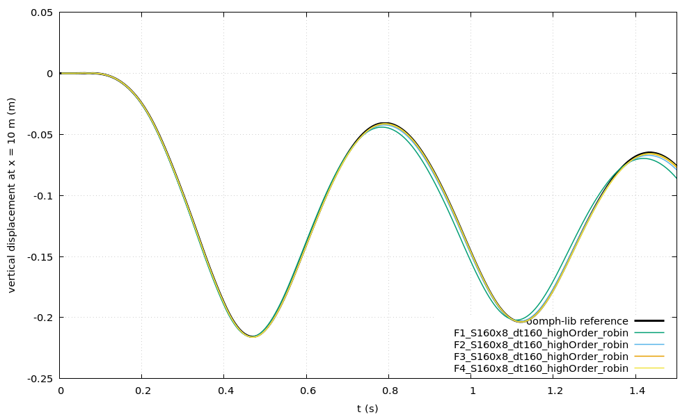
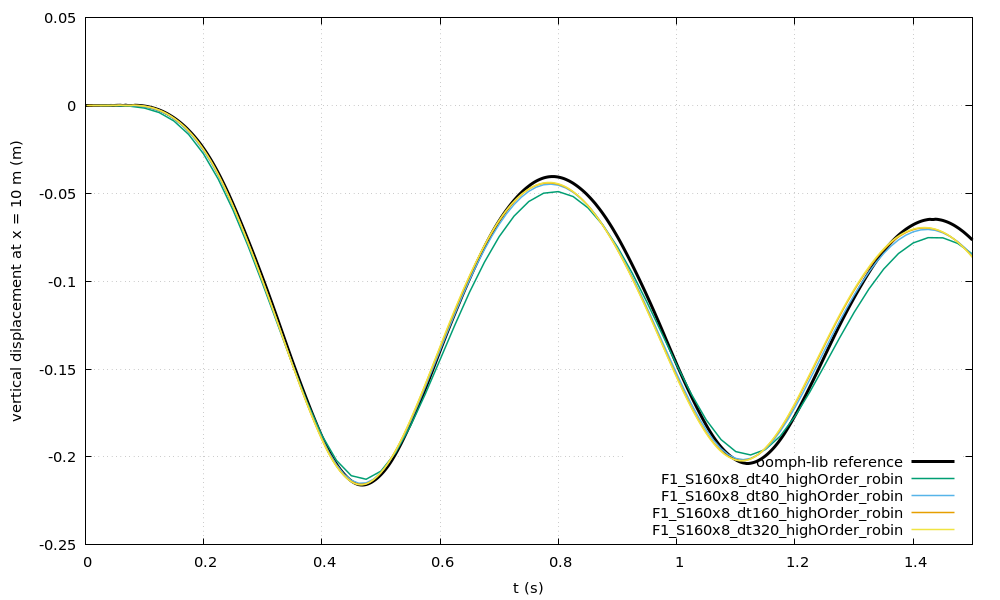

# collapsibleChannel verification study

This opt-in study compares the wall displacement of the `collapsibleChannel`
tutorial with solutions of the same problem computed with
[oomph-lib](https://oomph-lib.github.io/oomph-lib/), under solid, fluid-mesh
and time-step refinement, and compares the second-order (linear) and
high-order (cubic) solid discretisations. It is separate from
`regressionTest.sh`, and nothing here is run by `tutorials/Alltest` or
`tutorials/Alltest-regression`.

## Running

Source an OpenFOAM.com environment with solids4foam built with PETSc, and
run:

```bash
cd tutorials/fluidSolidInteraction/collapsibleChannel/verification
./Allverify                    # all studies: static, solid, mesh and time
./Allverify --study time       # one study: static, solid, mesh or time
./Allverify --quick            # smoke test: the coarsest cases to t = 0.5 s
./Allverify --cores 6          # run six cases at a time
./Allverify --reuse            # resume a sweep without re-running cases
./Allverify --list             # list the cases and exit
```

Each case is a complete copy of the tutorial under the ignored
`verification/work/` directory. Results are written to the ignored
`verification/postProcessing/` directory: a CSV per study, a
`verification_summary.md`, and, when `gnuplot` is available, a plot of each
FSI study's wall-midpoint history against its reference. `--reuse` accepts a
case only if a fingerprint of the tutorial inputs, the case settings, the
driver and the solver matches, and the run finished with complete, finite
histories.

Each case runs in serial, because the solid does not converge in parallel
(see "Solid solver" below); `--cores` sets how many cases run at the same
time. The full sweep takes about 2.5 hours with one case per core; the
largest case, the finest fluid mesh, takes 70 minutes.

## The verification problem: a regularised wall density

The published problem and the oomph-lib tutorial have a massless wall. With
a massless wall the fluid's added mass is the only inertia, and it grows as
$$1/\Delta t^2$$: the partitioned coupling then fails at time steps below
the tutorial's and on the finest fluid mesh, with IQN-ILS and Robin-Neumann
alike (see the density sweep below).

The verification problem therefore gives the wall a small regularising
density, $$\rho_s = \rho_f = 1\,\mathrm{kg/m^3}$$, in the same spirit as a
penalty bulk modulus for an incompressible solid: it barely changes the
dynamics but makes the partitioned solution well posed. The oomph-lib
reference is computed for the same wall density, with the timescale ratio
$$\Lambda^2 = \rho_s U^2/E_{eff} = 2\times10^{-9}$$ (`--lambdasq`), so the
comparison is exact. The regularisation moves the converged reference by
0.28% of the peak deflection, below the 0.3% precision of the reference.
The massless reference is kept as
`reference/collapsibleChannel_oomph_massless_reference.csv`.

### Density sweep

High-order solid on the tutorial solid mesh refined twice along its length
(160 x 8), $$t \le 1.5\,\mathrm{s}$$. "Shift" is the largest change in the
converged oomph-lib wall-midpoint history from the massless one, relative to
the peak deflection; it scales linearly with the density. "dt" columns are
the tutorial fluid mesh at that time step; "F4" is the fluid mesh refined
four times at $$\Delta t = 0.00625\,\mathrm{s}$$ (at $$0.025\,\mathrm{s}$$ its
Courant number is about 40 and every run fails). Entries are the mean FSI
iterations per time step, or the time at which the coupling (IQN-ILS or
Robin) stalled at 200 iterations or the solid Newton solve failed.

IQN-ILS:

| ρs/ρf | Shift | dt 0.0125 | dt 0.00625 | dt 0.003125 | F4 |
| ---: | ---: | ---: | ---: | ---: | ---: |
| 0 | 0 | fails 0.20 s | fails 0.11 s | – | fails 0.7 s (dt 0.025) |
| 1e-3 | 0.0003% | fails 0.13 s | fails 0.02 s | fails 0.01 s | fails 0.7 s |
| 1e-2 | 0.002% | fails 0.13 s | fails 0.09 s | fails 0.01 s | fails 0.7 s |
| 1e-1 | 0.024% | fails 0.13 s | fails 0.13 s | fails 0.01 s | fails 0.7 s |
| 0.3 | 0.08% | fails 0.19 s | fails 0.13 s | fails 0.09 s | – |
| 1 | 0.28% | fails 0.23 s | 37 | fails 0.24 s | fails 0.25 s |
| 3 | 0.78% | 16 | 20 | fails 0.26 s | fails 0.85 s |

Robin-Neumann:

| ρs/ρf | Shift | dt 0.0125 | dt 0.00625 | dt 0.003125 | F4 |
| ---: | ---: | ---: | ---: | ---: | ---: |
| 1e-3 | 0.0003% | fails 0.025 s (dt 0.025) | fails 0.006 s | – | – |
| 1e-2 | 0.002% | 97 (dt 0.025) | 81 | – | – |
| 1e-1 | 0.024% | 35 (dt 0.025) | fails 0.01 s | – | – |
| 0.3 | 0.08% | 32 | 36 | 33 | – |
| 1 | 0.28% | 24 | 24 | 20 | 24 |
| 3 | 0.78% | 17 | 15 | 12 | 15 |

The Robin rows for ρs/ρf ≤ 0.1 are the linear solid to
$$t = 0.6\,\mathrm{s}$$, and "–" was not run. The massless IQN-ILS row is the
study of the first version of this tutorial; for the massless wall the
secant Robin coefficient, proportional to the wall density, vanishes.

- **IQN-ILS never completes the whole study.** Even at ρs/ρf = 3 it fails at
  the smallest time step, when the solid Newton solve does not converge
  during the collapse, and on the finest fluid mesh.
- **Robin-Neumann completes every time step and every fluid mesh from
  ρs/ρf = 1.** At 0.3 it completes the time steps (the finest mesh was not
  run); at 0.1 and below its Robin coefficient, which is proportional to the
  wall density, is too small and the iterations stall or diverge.

ρs/ρf = 1 is the smallest density tested for which the Robin coupling
completes the whole study, and its reference shift, 0.28%, is below the
reference precision. It is the verification definition. ρs/ρf = 3 converges
faster but moves the reference by 0.8%.

Where both couplings complete, Robin and IQN-ILS agree to 0.08-0.23% of the
peak (0.1% on the tutorial mesh and time step, 0.23% at
$$\Delta t = 0.00625\,\mathrm{s}$$, 0.21% on the fluid mesh refined three
times at ρs/ρf = 3), below the reference precision. The difference does not
shrink with mesh or time-step refinement, as it did on Turek-Hron FSI3; at
this level it is of the order of the coupling tolerances.

## The reference solutions

The reference beam is computed with oomph-lib's monolithic Newton solver:
Crouzeix-Raviart (Q2P-1) Navier-Stokes elements on an algebraically updated
mesh, geometrically nonlinear Hermite Kirchhoff-Love beam elements, BDF2 in
time for the fluid and Newmark for the wall.
`reference/oomph-lib/collapsible_channel_ref.cc` is the oomph-lib demo
driver `fsi_collapsible_channel.cc` with the parameters, a clamped option,
the pressure ramp and the wall inertia exposed on the command line; the
header of the file lists every change. To regenerate the references, build
oomph-lib (its `oomph_build.py`; on macOS pass
`--ext-OOMPH_BUILD_OPENBLAS OFF`
`--ext-OOMPH_USE_OPENBLAS_FROM $(brew --prefix openblas)`), then:

```bash
cd reference/oomph-lib
cmake -G Ninja -B build -DOOMPH_INSTALL=<oomph-lib>/install
cmake --build build
mkdir -p run
./build/collapsible_channel_ref_CR --out run --refine 1 --dt 0.003125 \
    --sigma0 0 --h 0.05 --q 4e-11 --pext 4e-7 --clamped 1 --tramp 0.25 \
    --lambdasq 2e-9 --tmax 3.5
```

`--refine 1` is the resolution of the oomph-lib tutorial: 100 x 16 fluid
elements and 40 beam elements, 17,356 unknowns. The static beam deflection
used by the `static` study is computed with `--q 0 --steady 20`: the wall
alone, without fluid loading, under the external pressure raised in 20 steps.

`scripts/oomph_trace_to_csv.py` writes the reference CSV files:

- `collapsibleChannel_oomph_reference.csv`, the converged reference to
  $$t = 3.5\,\mathrm{s}$$, is the Richardson extrapolation in time of the runs
  at $$\Delta t = 0.003125$$ and $$0.0015625\,\mathrm{s}$$;
- `collapsibleChannel_oomph_dt40.csv` to `_dt320.csv` are the runs at
  $$\Delta t = 0.025$$ to $$0.003125\,\mathrm{s}$$, so that a solids4foam case
  can be compared with oomph-lib at its own time step.

Precision of the references, on the wall midpoint up to
$$t = 1.5\,\mathrm{s}$$, against a peak displacement of $$0.216\,\mathrm{m}$$:

| Check | Largest difference (m) | Relative to peak |
| --- | ---: | ---: |
| Refinement 1 vs 2 (200 x 32 elements), $$\Delta t = 0.025$$ | 5.7e-4 | 0.26% |
| Crouzeix-Raviart vs Taylor-Hood elements | 1.4e-7 | < 0.001% |
| Richardson correction of the converged reference | 1.2e-4 | 0.06% |
| $$\Delta t = 0.0031$$ vs $$0.0016$$ | 2.4e-4 | 0.11% |
| Static deflection, refinement 1 vs 3 | 1.8e-4 | 0.13% |

The references are good to about 0.3% of the peak displacement, dominated by
the spatial error at the oomph-lib tutorial resolution. oomph-lib's own
error against the converged reference is 6.3%, 1.8% and 0.49% at
$$\Delta t = 0.025$$, $$0.0125$$ and $$0.00625\,\mathrm{s}$$, an observed order
of 1.8 and 1.9.

## Studies and acceptance criteria

All FSI cases run to $$t = 1.5\,\mathrm{s}$$, which covers the collapse, the
first trough, the rebound and the second trough. Errors are the largest
difference in the wall-midpoint displacement history, relative to the peak
displacement of the reference, $$0.216\,\mathrm{m}$$.

- `static`: the wall alone under the full external pressure, raised in 20
  steps, against the static oomph-lib beam deflection
  $$-0.143628\,\mathrm{m}$$. The cubic solid must be within 0.5% on every
  mesh; the linear solid within 1% on its finest mesh, 640 x 8.
- `solid`: the tutorial fluid mesh, time step and IQN-ILS coupling with solid
  meshes from 80 x 8 to 640 x 8, for both solids. On this fluid mesh the
  comparison with oomph-lib carries a fluid discretisation error of about 4%,
  common to all cases, so the solid discretisation error is measured as the
  difference from the finest cubic solid: at most 1% for the cubic solid on
  every mesh, and for the linear solid on 640 x 8. Every cubic case must also
  be within 5% of oomph-lib at the same time step.
- `mesh`: fluid meshes refined 1 to 4 times, with the 160 x 8 cubic solid,
  Robin coupling and $$\Delta t = 0.00625\,\mathrm{s}$$, against oomph-lib at
  the same time step. The error must decrease and the finest must be within
  1%, about three times the reference precision.
- `time`: the tutorial fluid mesh with the 160 x 8 cubic solid and Robin
  coupling at $$\Delta t = 0.025$$ to $$0.003125\,\mathrm{s}$$. The error against
  the converged reference carries the spatial error of the mesh (about 4.4%),
  so the temporal convergence is measured between successive time steps:
  every step must complete, the observed order must be at least 1.5, and the
  difference between the two finest steps at most 0.5%.

## Recorded results

Recorded with OpenFOAM v2412 and PETSc 3.24 on Linux, one case per core on a
Slurm node (the static study also on macOS with PETSc 3.22, with identical
results); `./Allverify` passes.

### Static wall

| Solid mesh | Linear | Cubic |
| --- | ---: | ---: |
| 80 x 8 (tutorial) | -16.7% | +0.21% |
| 160 x 8 | -6.0% | +0.08% |
| 320 x 8 | -1.1% | +0.06% |
| 640 x 8 | -0.22% | +0.05% |
| 160 x 4 | +1.7% | -0.25% |

The cubic solid converges to 0.05% of the beam, which is the continuum-beam
difference at $$h/L = 0.005$$. The linear solid is too stiff on elongated
cells, converging at about second order in the in-plane spacing.

### Solid discretisation in the coupled problem

IQN-ILS, tutorial fluid mesh, $$\Delta t = 0.025\,\mathrm{s}$$. "Trough" is the
first trough of the wall midpoint, "It." the mean number of FSI iterations
per time step and "s" the run time in seconds. oomph-lib at the same time
step has its first trough at $$-0.21296\,\mathrm{m}$$.

| Solid mesh | Solid | vs oomph-lib | vs finest cubic | Trough (m) | It. | s |
| --- | --- | ---: | ---: | ---: | ---: | ---: |
| 80 x 8 | linear | 15.6% | 17.4% | -0.18511 | 11.8 | 131 |
| 160 x 8 | linear | 5.8% | 5.6% | -0.20201 | 14.3 | 331 |
| 320 x 8 | linear | 3.9% | 1.1% | -0.21048 | 16.8 | 795 |
| 640 x 8 | linear | 4.2% | 0.30% | -0.21219 | 18.4 | 1814 |
| 80 x 8 | cubic | 4.2% | 0.44% | -0.21308 | 18.2 | 413 |
| 160 x 8 | cubic | 4.2% | 0.13% | -0.21284 | 17.8 | 722 |
| 320 x 8 | cubic | 4.3% | 0.04% | -0.21277 | 17.6 | 1385 |
| 640 x 8 | cubic | 4.3% | - | -0.21278 | 17.6 | 2888 |

On the tutorial mesh the cubic solid is as accurate as the linear solid on a
mesh eight times finer, at a quarter of its cost; the high-order solid pays
off for this bending wall, unlike for the tension-dominated Mok membrane.



### Fluid mesh

Robin coupling, 160 x 8 cubic solid, $$\Delta t = 0.00625\,\mathrm{s}$$,
against oomph-lib at the same time step:

| Fluid level | Fluid cells | vs oomph-lib | Trough (m) | It. | s |
| ---: | ---: | ---: | ---: | ---: | ---: |
| 1 (tutorial) | 3,200 | 4.65% | -0.21566 | 23.8 | 1711 |
| 2 | 12,800 | 1.43% | -0.21592 | 23.9 | 2022 |
| 3 | 28,800 | 0.53% | -0.21605 | 23.8 | 2785 |
| 4 | 51,200 | 0.50% | -0.21610 | 23.9 | 4205 |

The error falls with an observed order of 1.7 and 2.4, and then levels off
at 0.5% on the two finest meshes, i.e. at the precision of the reference
(0.3%, dominated by oomph-lib's own spatial error). The FSI iteration count
does not grow with the mesh.



### Time step

Robin coupling, tutorial fluid mesh, 160 x 8 cubic solid:

| Δt (s) | vs converged oomph-lib | vs next finer Δt | Trough (m) | It. | s |
| ---: | ---: | ---: | ---: | ---: | ---: |
| 0.025 | 4.82% | 4.56% | -0.21283 | 23.5 | 526 |
| 0.0125 | 4.07% | 1.33% | -0.21510 | 24.1 | 968 |
| 0.00625 | 4.44% | 0.34% | -0.21566 | 23.8 | 1777 |
| 0.003125 | 4.58% | - | -0.21589 | 20.2 | 2796 |

The solids4foam solutions converge in time with an observed order of 1.8 and
2.0, as oomph-lib does (6.3%, 1.8% and 0.49% at the first three steps,
orders 1.8 and 1.9). The error against the converged reference levels off at
about 4.5%: the spatial error of the tutorial fluid mesh, which the mesh
study removes.



The two studies are separate refinements: the mesh study at
$$\Delta t = 0.00625\,\mathrm{s}$$, and the time-step study on the tutorial
fluid mesh. Together they show that the spatial error falls to the reference
precision on the finest mesh (0.5% against oomph-lib at the same time step),
and that the temporal error at $$\Delta t = 0.00625\,\mathrm{s}$$ is about
0.3% on the tutorial mesh; the temporal error on the finest mesh was not
measured separately.

## Solid solver

The solid is solved with PETSc SNES in matrix-free mode (`snes_mf_operator`)
with the high-order residual. On the static wall (20 load steps; "Krylov" is
the mean number of Krylov iterations per Newton step):

| Matrix | Preconditioner | Mesh | Newton | Krylov | s |
| --- | --- | --- | ---: | ---: | ---: |
| high-order | LU | 80 x 8 | 103 | 14 | 9 |
| high-order | LU | 320 x 8 | 101 | 18 | 23 |
| high-order | hypre A | 80 x 8 | 89 | 342 | 53 |
| high-order | hypre B | 80 x 8 | 85 | 145 | 35 |
| high-order | hypre B | 320 x 8 | 85 | 149 | 104 |
| high-order | hypre C | 320 x 8 | 84 | 140 | 102 |
| compact | LU | 80 x 8 to 640 x 4 | fails | > 1000 | - |
| compact | hypre B | 80 x 8 | fails | > 5000 | - |

"Matrix" is the matrix the preconditioner is built from: the assembled
high-order Jacobian, or the compact-stencil Jacobian. LU is block Jacobi
with LU in serial, i.e. an exact factorisation. hypre A is BoomerAMG with
the settings used elsewhere in the tutorials (strong threshold 0.7, HMIS,
ext+i, aggressive coarsening); hypre B uses strong threshold 0.9, HMIS,
ext+i with at most 4 interpolation entries, nodal coarsening and two
l1-scaled SOR sweeps; hypre C uses strong threshold 0.25, PMIS and
symmetric SOR.

- **The compact Jacobian does not work here.** As a preconditioner for the
  cubic residual on these cells, of aspect ratio 1.6 to 12, even its exact
  LU factorisation leaves GMRES stalling, on every mesh tried. The assembled
  high-order Jacobian is needed.
- **hypre BoomerAMG works but is slower than LU.** It needs 140-150 Krylov
  iterations per Newton step with a high strong threshold (0.9), HMIS
  coarsening, ext+i interpolation, nodal coarsening and two l1-scaled SOR
  sweeps, against 340 with the settings used elsewhere in the tutorials, and
  14-18 with LU. The iteration count does not grow from 80 x 8 to 320 x 8.
- **The solid does not converge in parallel.** On 2, 4 and 8 ranks every
  preconditioner fails in the first Newton step, including a parallel exact
  LU (MUMPS), additive Schwarz with overlap 8 and hypre, on both meshes and
  for both the cubic and the linear reconstruction. With MUMPS the Krylov
  iterations fail although the preconditioner is exact, and with the linear
  reconstruction a solve that did converge on 4 ranks gave a wrong
  displacement. This points to a parallel inconsistency of the high-order
  residual or Jacobian rather than a weak preconditioner. It needs a C++
  investigation and is left open.
