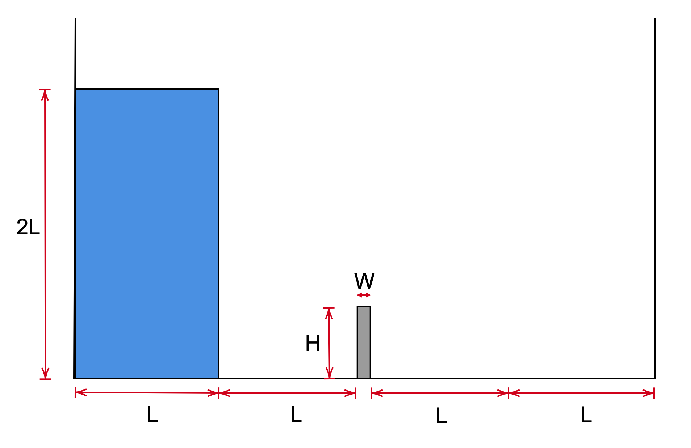
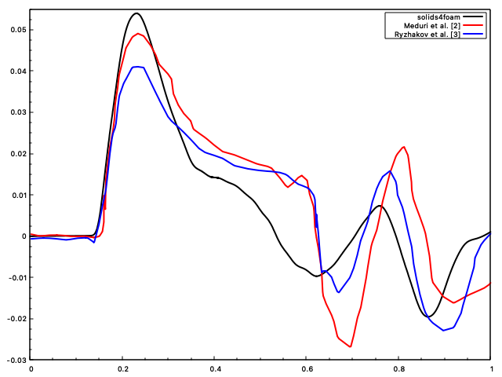

# Dam break against a flexible wall: `flexibleDamBreak`

---

Prepared by Amirhossein Taran

---

## Tutorial Aims

- How to perform a FSI simulation

---

## Case Overview

One way to validate the implemented Fluid-Structure Interaction (FSI) model is by examining a scenario involving the rupture of a dam against a deformable obstacle. This particular benchmark was originally introduced by Walhorn et al. [1] and subsequently replicated Meduri et al. [2], and Ryzhakov et al. [3]. The initial configuration of this example is illustrated in Figure 1, where, at the start of the computation, the fluid has the freedom to flow towards the solid wall. There is a flexible wall positioned on the middle of domain, its horizontal displacement tracked over time as it is impacted by the fluid column. Table 1 provides the material properties and geometry data for reference. The solid component employs a Neo-Hookean large strain constitutive law.

  
    <figcaption>
     <strong>Figure 1: damBreak Problem </strong>
    </figcaption>

| Parameter   | Value    |
| :-----: | :---: |
| Solid Youngs' Modules (E) | 1 Mpa   |
| Solid Density ($$\rho$$) | 2500 $$kg/m^3$$   |
| Solid Poisson Ratio ($$\nu$$) | 0   |
| Fluid Viscosity ($$\mu$$) | 0.001 Pa.s   |
| Fluid Density ($$\rho$$) | 1000 $$kg/m^3$$   |
| gravity | 9.81  $$m/s^2$$   |
| L | 0.0146 m   |
| H | 0.080 m   |
| W | 0.012 m   |

**Table 1 : Simulation and physical Prameters**

## Results

Upon starting the solution, the water column collapses due to gravity and will hit the flexible obstacle in front of it.
The results of `solids4foam` are being compared with other numerical solutions on Literature in Figure 2.

  
    <figcaption>
     <strong>Figure 2: Displacement over time, for top-right corner of solid obstacle 	</strong>
    </figcaption>

---

## Running the Case

The tutorial case is located at `solids4foam/tutorials/fluidSolidInteraction/flexibleDamBreak`. The case can be run using the included `Allrun` script, i.e. `> ./Allrun`.  The `Allrun` script first executes `blockMesh` for both `solid` and `fluid` domains (`> blockMesh -region fluid` and `> blockMesh -region solid` ) and the `solids4foam` solver is used to run the case (`> solids4Foam`).  Optionally, if `gnuplot` is installed, the displacement history of the top-right edge of the obstacle
Optionally, in order to create postProcessing plots, it is possible to use `solidPointDisplacement` functionObjects, it will keep track of the specified point during solution. if `gnulot` is installed, the displacement history in comparison with the verification solution will be plotted for `1s` of simulation.

---

### References

[1] [E. Walhorn et al. “Fluidstructure coupling within a monolithic model involving free surface flows”.
Computers & Structures. Vol. 25-26, pp. 2100–2111 , 2005.](https://www.sciencedirect.com/science/article/pii/S0045794905001768)

[2] [S. Meduri et al. “A partitioned fully explicit Lagrangian finite element method for highly nonlinear
fluidstructure-interaction problems”. Internat. J. Numer. Methods Engrg. Vol. 113, pp. 43–64 ,
2017.](https://onlinelibrary.wiley.com/doi/abs/10.1002/nme.5602)

[3] [P.B. Ryzhakov et al. “A monolithic Lagrangian approach for fluidstructure interaction problems”.
Computational Mechanics. Vol. 46, pp. 883–899 , 2010.](https://link.springer.com/article/10.1007/s00466-010-0522-0)
