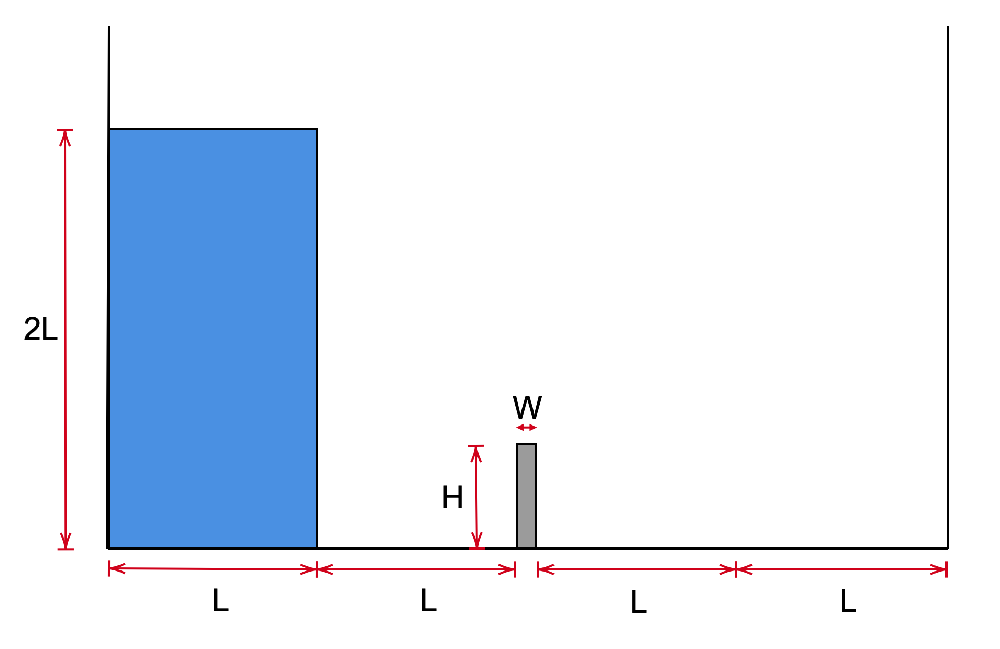

# Dam break against a flexible wall: `flexibleDamBreak`

---

Prepared by Amirhossein Taran and Philip Cardiff

---

## Tutorial Aims

- Demonstrates how to perform a multi-phase fluid-solid interaction simulation

---

## Case Overview

This case extends the traditional OpenFOAM `damBreak` tutorial to include a
flexible dam. This benchmark has been examined several times in literature,
including by Walhorn et al. [1], Meduri et al. [2], and Ryzhakov et al. [3]. The
initial configuration of this example is shown in Figure 1, where a column of
water is at rest located behind a membrane on the left side of a tank. At time
$$t = 0$$, the membrane is removed, and the column of water collapses. During
the collapse, the water impacts a flexible obstacle (the "dam") at the bottom of
the tank, causing it to deflect elastically. For benchmarking, the horizontal
displacement of the dam is tracked over time. Table 1 provides the material
properties and geometry data for reference. The solid component employs a
neo-Hookean large strain constitutive law. The total Lagrangian solid model
(`nonLinearGeometryTotalLagrangianTotalDisplacement`) is used as the solid
solver, and the volume-of-fluid incompressible multiphase fluid model
(interFluid) is used as the fluid solver.

### Figure 1: Problem geometry and initial conditions

### Table 1: Problem Physical Parameters

|           Parameter           |       Value        |
| :---------------------------: | :----------------: |
| Solid Young's Modules ($$E$$) |       1 MPa        |
|   Solid Density $$(\rho)$$    | 2500 kg m$$^{-3}$$ |
| Solid Poisson Ratio $$(\nu)$$ |         0          |
|   Fluid Viscosity$$(\mu)$$    |     0.001 Pa s     |
|   Fluid Density $$(\rho)$$    | 1000 kg m$$^{-3}$$ |
|            gravity            | 9.81 m $$s^{-2}$$  |
|               L               |      0.0146 m      |
|               H               |      0.080 m       |
|               W               |      0.012 m       |

## Results

Upon starting the solution, the water column collapses due to gravity and will
hit the flexible dam. Video 1 shows the time evolution of the volume-of-fluid
field in the fluid domain and the displacement field in the solid domain. The
`solids4foam` predictions for the deflection of the top-right corner of the dam
are compared with numerical solutions from the literature in Figure 2, showing
reasonable agreement. For better agreement, a mesh and time-step independence
study should be performed.

 **Figure 2: Displacement over time for the top-left corner of flexible obstacle
 (the "dam")**



**Video 1: Evolution of the volume-of-fluid field in the fluid domain and the
displacement field in the solid domain**

---

## Running the Case

The tutorial case is located at
`solids4foam/tutorials/fluidSolidInteraction/flexibleDamBreak`. The case can be
run using the included `Allrun` script, i.e. `> ./Allrun`. The `Allrun` script
first executes `blockMesh` for both `solid` and `fluid` domains
(`> blockMesh -region fluid` and `> blockMesh -region solid` ), and the
`solids4foam` solver is used to run the case (`> solids4Foam`). Optionally, if
`gnuplot` is installed, the displacement history of the top-right edge of the
obstacle Optionally, to create post-processing plots, it is possible to use
`solidPointDisplacement` functionObjects, which will keep track of the specified
point during the solution.

---

### References

[1]
[E. Walhorn et al. “Fluid-structure coupling within a monolithic model involving free surface flows”. Computers & Structures. Vol. 25-26, pp. 2100–2111, 2005.](https://www.sciencedirect.com/science/article/pii/S0045794905001768)

[2]
[S. Meduri et al. “A partitioned fully explicit Lagrangian finite element method for highly nonlinear fluid-structure-interaction problems”. Internat. J. Numer. Methods Engrg. Vol. 113, pp. 43–64, 2017.](https://onlinelibrary.wiley.com/doi/abs/10.1002/nme.5602)

[3]
[P.B. Ryzhakov et al. “A monolithic Lagrangian approach for fluid-structure interaction problems”. Computational Mechanics. Vol. 46, pp. 883–899 , 2010.](https://link.springer.com/article/10.1007/s00466-010-0522-0)
