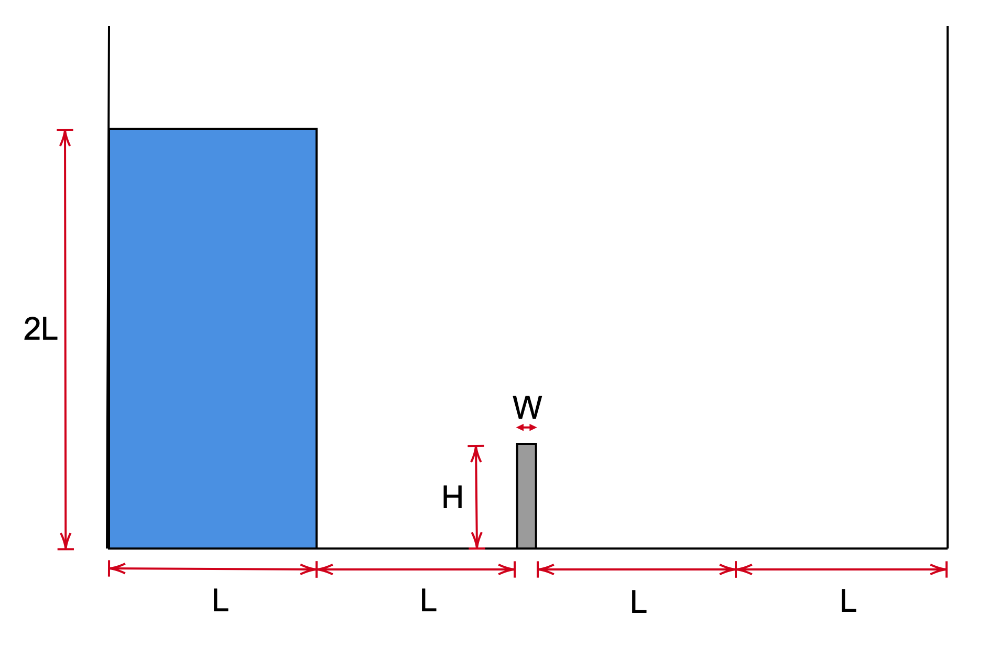
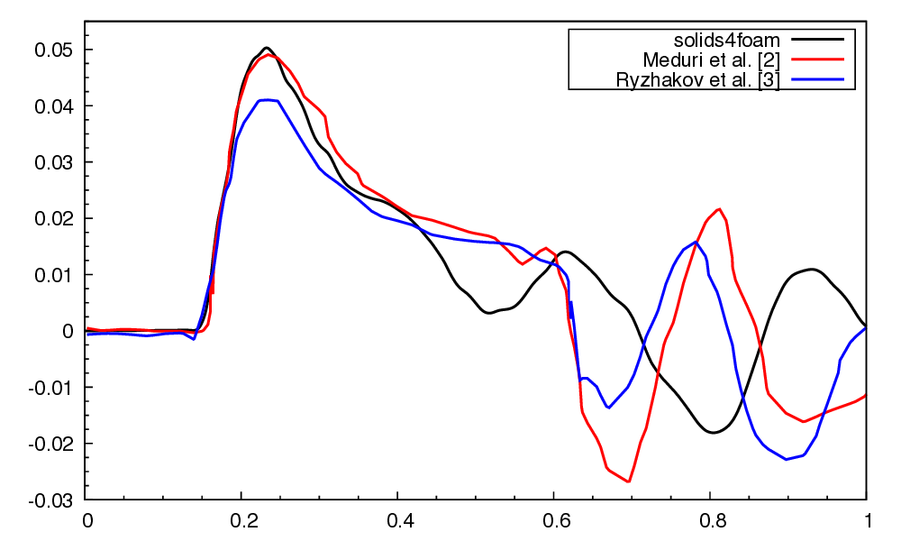

# Dam break against a flexible wall: `flexibleDamBreak`

---

Prepared by Amirhossein Taran and Philip Cardiff

---

## Tutorial Aims

- Demonstrates how to perform a multi-phase fluid-solid interaction simulation
- Demonstrates the use of a large strain solid model within an FSI case
- Compares the `solids4foam` prediction against published benchmark solutions

---

## Case Overview

This case extends the traditional OpenFOAM `damBreak` tutorial to include a
flexible dam. This benchmark has been examined several times in the literature,
including by Walhorn et al. [1], Meduri et al. [2], and Ryzhakov et al. [3]. The
initial configuration of this example is shown in Figure 1, where a column of
water of width $$L$$ and height $$2L$$ is initially at rest behind a membrane on
the left side of a tank of width $$4L$$. At time $$t = 0$$, the membrane is
removed, and the column of water collapses. During the collapse, the water
impacts a flexible obstacle (the "dam") standing at a distance $$2L$$ from the
left wall, causing it to deflect elastically. For benchmarking, the horizontal
displacement of the top-left (upstream) corner of the dam is tracked over time.
Table 1 provides the material properties and geometry data for reference. The
solid component employs a neo-Hookean large strain constitutive law. The total
Lagrangian solid model
(`nonLinearGeometryTotalLagrangianTotalDisplacement`) is used as the solid
solver, and the volume-of-fluid incompressible multiphase fluid model
(`interFluid`) is used as the fluid solver.

### Figure 1: Problem geometry and initial conditions

### Table 1: Problem Physical Parameters

| Parameter                       |       Value        |
| :------------------------------ | :----------------: |
| Solid Young's modulus ($$E$$)   |       1 MPa        |
| Solid density $$(\rho_s)$$      | 2500 kg m$$^{-3}$$ |
| Solid Poisson's ratio $$(\nu)$$ |         0          |
| Water viscosity $$(\mu)$$       |     0.001 Pa s     |
| Water density $$(\rho)$$        | 1000 kg m$$^{-3}$$ |
| Air viscosity $$(\mu)$$         |   1.48e-05 Pa s    |
| Air density $$(\rho)$$          |   1 kg m$$^{-3}$$  |
| Gravity $$(g)$$                 | 9.81 m s$$^{-2}$$  |
| Water column width ($$L$$)      |      0.146 m       |
| Dam height ($$H$$)              |      0.080 m       |
| Dam thickness ($$W$$)           |      0.012 m       |

The tank is $$4L$$ wide, the water column is $$L \times 2L$$, and the dam stands
at a distance $$2L$$ from the left wall, as shown in Figure 1.

---

## Results

Upon starting the solution, the water column collapses due to gravity and will
hit the flexible dam. Video 1 shows the time evolution of the volume-of-fluid
field in the fluid domain and the displacement field in the solid domain. The
`solids4foam` predictions for the deflection of the top-left corner of the dam
are compared with numerical solutions from the literature in Figure 2.

The impact, the peak deflection and the subsequent decay are captured well. From
about $$t = 0.6$$ s, once the water has run up the right wall and the reflected
wave returns to the dam, the predicted response lags the reference solutions.
Note that the two reference solutions also differ noticeably from one another
over this later period. The fluid mesh used here is the coarse mesh inherited
from the standard `damBreak` tutorial, and refining it is the main lever for
improving the late-time agreement; a full mesh and time-step independence study
should be performed before drawing quantitative conclusions.

**Figure 2: Displacement over time for the top-left corner of the flexible
obstacle (the "dam")**



**Video 1: Evolution of the volume-of-fluid field in the fluid domain and the
displacement field in the solid domain**

---

## Running the Case

The tutorial case is located at
`solids4foam/tutorials/fluidSolidInteraction/flexibleDamBreak`. The case can be
run using the included `Allrun` script, i.e. `> ./Allrun`. The `Allrun` script
first executes `blockMesh` for both the `solid` and `fluid` domains
(`> blockMesh -region solid` and `> blockMesh -region fluid`), then initialises
the water volume fraction with `> setFields -region fluid`, and finally runs the
case with `> solids4Foam`. To remove the generated results and return the case
to its initial state, use `> ./Allclean`.

The displacement history of the tracked point is recorded by the
`solidPointDisplacement` functionObject, configured in `system/controlDict`,
which writes to
`postProcessing/0/solidPointDisplacement_displacement.dat`. If `gnuplot` is
installed, `Allrun` uses this data to produce `displacement.pdf`, comparing the
`solids4foam` prediction with the reference solutions.

---

### References

[1]
[E. Walhorn et al. “Fluid-structure coupling within a monolithic model involving free surface flows”. Computers & Structures. Vol. 83, Issues 25–26, pp. 2100–2111, 2005.](https://www.sciencedirect.com/science/article/pii/S0045794905001768)

[2]
[S. Meduri et al. “A partitioned fully explicit Lagrangian finite element method for highly nonlinear fluid-structure-interaction problems”. Internat. J. Numer. Methods Engrg. Vol. 113, pp. 43–64, 2017.](https://onlinelibrary.wiley.com/doi/abs/10.1002/nme.5602)

[3]
[P.B. Ryzhakov et al. “A monolithic Lagrangian approach for fluid-structure interaction problems”. Computational Mechanics. Vol. 46, pp. 883–899, 2010.](https://link.springer.com/article/10.1007/s00466-010-0522-0)
