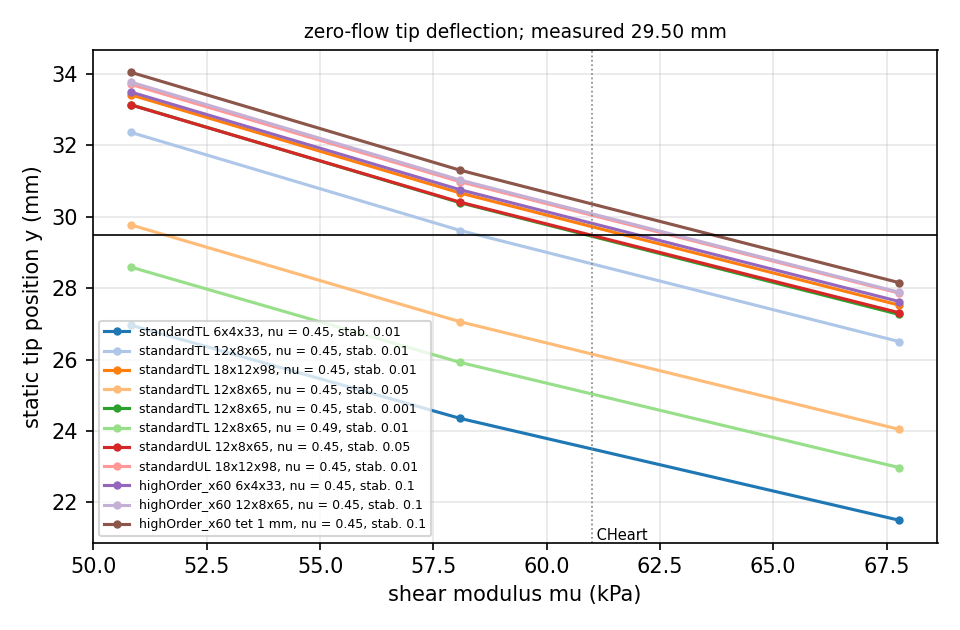
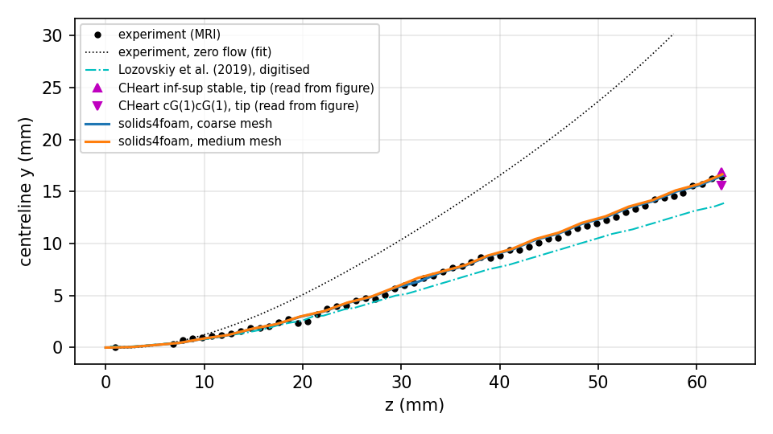
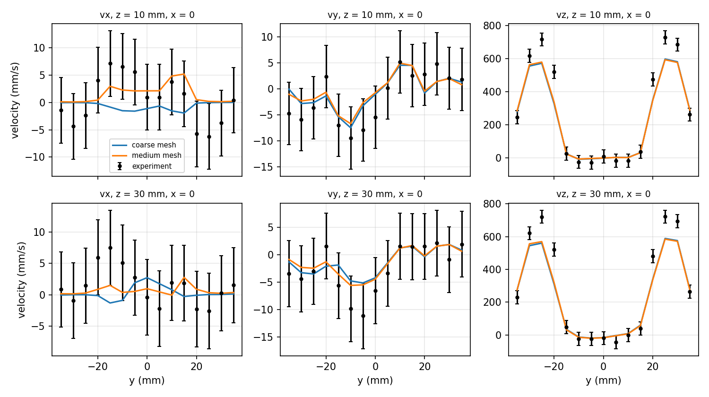
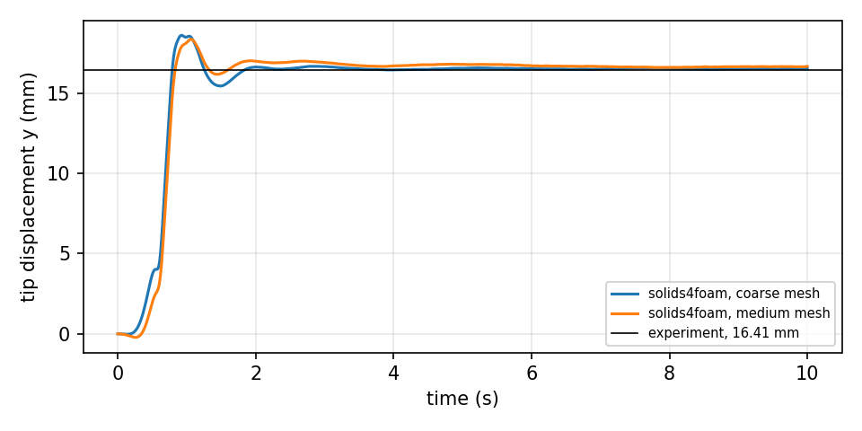

# Hessenthaler et al. 3D FSI experiment: `hessenthalerFsi`

Prepared by Philip Cardiff

## Tutorial Aims

- Validate `solids4foam` against a three-dimensional fluid-solid interaction
  (FSI) experiment: Phase I (steady inflow) of Hessenthaler et al. (2017) [1].
- Demonstrate a fluid mesh from a published surface with `cfMesh`
  (`cartesianMesh`), a non-conforming fluid-solid interface with AMI mapping,
  and buoyancy through a net solid body force.

## Case Overview

A silicone flap of 11 x 2 x 65 mm is clamped to the wall where two inlet pipes
(diameter 21.9 mm, centres at y = ±27.15 mm) merge into one outlet pipe
(diameter 76.2 mm). The z-axis points downstream, gravity acts in −y, and the
origin is at the centre of the clamped end of the flap. An aqueous glycerol
solution flows in through both inlets.

| Quantity | Value |
| --- | --- |
| Fluid density | 1163.3 kg/m³ |
| Fluid viscosity | 12.50 mPa s |
| Solid density | 1058.3 kg/m³ |
| Inflow | parabolic, peak 630 mm/s (upper) and 615 mm/s (lower) |
| Reynolds number | 1283 |

The flap is about 9 % lighter than the fluid, so buoyancy lifts it to a tip
deflection of 29.50 mm without flow [1]. The steady Phase I flow pushes the
tip back down to 16.41 mm. The flow and the flap position were measured by
magnetic resonance imaging (MRI).

The measured data are the CC0 data set of the experiment [2]:

- the deformed centreline of the flap under flow (59 points);
- the three velocity components on the planes z = 10 and 30 mm (278
  points), from phase-contrast MRI with voxels of 1.302 x 1.302 x 6 mm;
- a uniaxial tensile test of the silicone.

They are stored as CSV files in `validation/reference`, with their source and
licence. The published fluid-domain surface is `geometry/fluidDomain.vtk.gz`,
from the same data set.

## Model

### Buoyancy

The fluid is solved without gravity (`constant/fluid/g` is zero), so that its
kinematic pressure excludes the hydrostatic part. This is the change of
variables used by Hessenthaler, Röhrle and Nordsletten [3]; it also keeps the
traction-free outlet consistent. The buoyancy of the flap is then applied to
the solid as the net body force, with

```c++
g_eff = (rho_s - rho_f)/rho_s*g = (0 0.9733 0) m/s^2
```

in `constant/solid/g`, so that the solid still has its own inertia. No code is
needed for this. The function object in `system/gravityRamp` ramps `g_eff` in
smoothly over the first 0.5 s, from the straight flap.

### Fluid

`pimpleFluid`, laminar, second-order `backward` time integration. Both inlets
have parabolic profiles (`codedFixedValue` in `0/fluid/U`), ramped in with
`3s² − 2s³` over the first 0.5 s at the same time as the buoyancy, as in [3].
The ramp printed in [3], `24t³ − 8t²`, is negative for t < 1/3 s and is
taken to be a misprint.

The outlet has a fixed pressure and `inletOutlet` velocity, which sets the
velocity of re-entering fluid to zero and so stabilises backflow. The outlet
pipe is extended by 250 mm, since [3] found that a 50 mm extension changed
the flow near the flap.

### Solid

The flap is a neo-Hookean solid (`neoHookeanElastic`), solved with the total
Lagrangian form (`nonLinearGeometryTotalLagrangianTotalDisplacement`), the
standard second-order discretisation and PETSc SNES, with a momentum
stabilisation scale factor of 0.01. The shear modulus is calibrated to the
zero-flow deflection, as recommended in [1], because the silicone keeps curing
(see [Calibration](#calibration)): μ = 58.45 kPa with ν = 0.45.

### Coupling

Dirichlet-Neumann IQN-ILS with the fluid and solid predictors
(`constant/fsiProperties`). The interface meshes do not conform, so the
interface data are transferred with AMI (`interfaceTransferMethod AMI`); GGI
is the foam-extend equivalent. The fluid interface velocity is
`newMovingWallVelocity`. The fluid mesh moves with the `velocityLaplacian`
motion solver and a quadratic inverse-distance diffusivity.

## Meshes

`Allrun` builds the meshes:

1. `makeFluidSurface.py` reads the published surface, splits it into the
   patches `upperInlet`, `lowerInlet`, `outlet`, `wall` and `interface` (the
   five faces of the flap cavity), adds the 250 mm outlet extension and writes
   `constant/triSurface/fluidDomain.stl`. It needs only the Python 3 standard
   library.
2. `cartesianMesh` builds the fluid mesh from `system/meshDict.coarse` or
   `system/meshDict.medium`.
3. `blockMesh` builds the solid mesh (`system/solid/blockMeshDict`).

| Mesh | Cells | Wall and jets | Flap region | Flap surface |
| --- | --- | --- | --- | --- |
| fluid, coarse | 0.23 M | 2 mm | 1 mm | 0.5 mm |
| fluid, medium | 0.81 M | 1 mm | 1 mm | 0.5 mm |
| solid | 6240 | | | 12 x 8 x 65 hexahedra |

## Running

The case requires PETSc, `cartesianMesh` (cfMesh, part of OpenFOAM.com) and
`python3`. It does not run with foam-extend.

```bash
./Allrun                    # coarse fluid mesh, serial
./Allrun medium parallel    # medium fluid mesh, using the decomposeParDicts
./Allclean
```

The case is expensive: the default 10 s of simulated time (5000 time steps)
took 4.7 h on 24 cores for the coarse mesh and 5.8 h on 32 cores for the
medium mesh, on MeluXina CPU nodes. The regression test runs only the first
five time steps.

In parallel, the solid uses block-Jacobi LU as checked in; the validation
driver switches it to an exact parallel LU (MUMPS) so that the solid solve
does not depend on the decomposition. Block-Jacobi LU, MUMPS and hypre
BoomerAMG all converged for this case and gave the same deflections.

## Calibration

The silicone keeps curing, so the shear modulus is calibrated to the measured
zero-flow tip deflection of 29.50 mm, as recommended in [1]. The calibration
study (`validation/Allvalidate --study calibration`) relaxes the flap alone,
under its net buoyancy, to its static deflection at three buoyancy levels,
which maps the static tip deflection against μ. The ν = 0.45 results are:

| Solid | Mesh | Stabilisation | Calibrated μ (kPa) |
| --- | --- | --- | --- |
| standard, total Lagrangian | 6 x 4 x 33 | 0.01 | below 51 |
| standard, total Lagrangian | 12 x 8 x 65 (tutorial) | 0.01 | 58.4 |
| standard, total Lagrangian | 18 x 12 x 98 | 0.01 | 61.7 |
| standard, total Lagrangian | 12 x 8 x 65 | 0.05 | 51.6 |
| standard, total Lagrangian | 12 x 8 x 65 | 0.001 | 60.9 |
| standard, updated Lagrangian | 12 x 8 x 65 | 0.05 | 60.9 |
| standard, updated Lagrangian | 18 x 12 x 98 | 0.01 | 62.7 |
| high-order, compact Jacobian | 6 x 4 x 33 | 0.1 | 62.0 |
| high-order, compact Jacobian | 12 x 8 x 65 | 0.1 | 62.8 |
| high-order, compact Jacobian | Gmsh tetrahedra, 1 mm | 0.1 | 63.6 |



**Figure 1: Static zero-flow tip position against the shear modulus.**

The calibrated μ converges to about 62–63 kPa with the mesh for every solid,
close to the 61 kPa that Hessenthaler, Röhrle and Nordsletten [3] calibrated
for their incompressible solid. The tutorial calibrates μ for its own solid
model and mesh, 58.45 kPa, so that the zero-flow deflection is reproduced; on
the tutorial mesh 61 kPa would give 28.6 mm. The neo-Hookean fit of the
uniaxial test gives 96.9 kPa, 60 % stiffer, which gives a tip deflection of
only about 21 mm: The test does not represent the flap at the time of the
experiment.

The standard solid is stiffer in bending on coarse meshes, and more so the
larger the momentum stabilisation, because the stabilisation scales with the
nearly incompressible bulk modulus; the total Lagrangian form is more
sensitive to it than the updated Lagrangian one. The tutorial uses 0.01,
which is within 4 % of 0.001 on its mesh.

ν = 0.49 makes the flap stiffer on this mesh (the tip reaches only 25.9 mm at
58 kPa, against 29.6 mm with ν = 0.45), needs about twice the Krylov
iterations, and its coupled run failed in the first time step with the
updated Lagrangian solid; the tutorial uses ν = 0.45.

Parallel calibration runs on 8 ranks, with block-Jacobi LU, MUMPS and hypre,
give the serial tip deflections to five digits.

### Choice of solid solver

The coupled case and the calibration are time-dependent, and in that setting
all three solids completed the calibration (times are from xenosim with
several runs at once, so they are only roughly comparable):

| Solid (6240 hexahedra unless noted) | Newton/step | Krylov/Newton | Time/step |
| --- | --- | --- | --- |
| standard, total Lagrangian, LU | 2.2 | 118 | 3.8 s |
| standard, total Lagrangian, hypre | 1.8 | 274 | 3.8 s |
| standard, total Lagrangian, 8 ranks, hypre | 1.8 | 257 | 0.8 s |
| standard, total Lagrangian, 8 ranks, block-Jacobi LU | 1.9 | 708 | 1.6 s |
| standard, total Lagrangian, 8 ranks, MUMPS | 2.2 | 116 | 2.1 s |
| standard, total Lagrangian, 792 hexahedra | 2.1 | 104 | 0.3 s |
| high-order, compact Jacobian, 792 hexahedra | 2.3 | 123 | 3.2–4.6 s |
| high-order, compact Jacobian, 6240 hexahedra | 2.3 | 109 | 34 s |
| high-order, compact Jacobian, 8350 tetrahedra | 2.4 | 90 | 22 s |

- **Total Lagrangian standard solid.** It converged in every step of every
  calibration run, with every preconditioner, in serial and in parallel. The
  failures reported earlier for it came from steady-state (static) solves,
  where neither standard nor high-order solids converge for this thin flap:
  without the inertia term the compact Jacobian is a poor preconditioner and
  the Krylov solver stalls. In the coupled case it is about 25 % cheaper per
  time step than the updated Lagrangian solid on the same cores.
- **High-order solid with the compact Jacobian.** The cubic least-squares
  stencil size is set by `faceStencilExtraCells`. With 40, 50 or 60 extra
  cells, the time-dependent calibration converges on the coarse hexahedral
  mesh, but 10–15 % of the linear solves stop at the 200-iteration limit and
  are accepted as inexact Newton steps; larger stencils did not remove this.
  On the 12 x 8 x 65 hexahedral mesh and on 1 mm Gmsh tetrahedra, 40 and 50
  extra cells stopped in the first time step and 60 converged, with 35–60 %
  of the linear solves inexact; on 1.5 mm tetrahedra all three stopped in the
  first time step. A static solve still stalls with 40 or 60. The high-order
  solid is the most accurate per cell, but costs 10–15 times more per cell
  than the standard solid.
- **Coupled high-order runs.** On the coarse fluid mesh with the 6 x 4 x 33
  high-order flap and 60 extra cells, 8 ranks with MUMPS ran to 10 s with no
  failed linear solve (3.0 Newton iterations and 81 Krylov iterations per
  solid solve) and passed the validation: tip 16.46 mm, centreline RMS
  difference 0.25 mm, d̄ = 0.050. Block-Jacobi LU on 8 ranks gave the same
  result (tip 16.48 mm) at 25 % more cost; MUMPS cost 6.5 s per time step,
  as much as the updated Lagrangian solid on the same 8 ranks. A Gmsh
  tetrahedral flap (1 mm) was stable to 3.3 s, at 25 s per time step. The
  parallel failure of issue #509 was not seen for this case.
- **Updated Lagrangian standard solid.** It also converged everywhere and
  gave the same Phase I results (see below), but it is less well tested and
  more expensive. On Gmsh tetrahedra it inverted cells at about 5 mm of
  deflection.

## Phase I results

The buoyancy and the inflow are ramped in together over 0.5 s from the
straight flap, as in [3]. The flap rises to about 18.5 mm at about 1 s and
then settles to a steady deflection within about 2 s, with a residual
fluctuation of the tip of about ±0.1 mm. Because the zero-flow deflection of
29.5 mm is never reached, the fluid mesh deforms much less than if the
buoyancy were applied first: the maximum non-orthogonality of the coarse mesh
grows from 39° to 64° at 1 s and is 58° at 10 s.

| Quantity | Experiment | Coarse | Medium |
| --- | --- | --- | --- |
| tip y (mm) | 16.41 | 16.54 | 16.66 |
| centreline RMS difference (mm) | | 0.23 | 0.28 |
| centreline maximum difference (mm) | | 0.59 | 0.62 |
| velocity d̄ (/630 mm/s) | | 0.050 | 0.048 |
| velocity d∞ (/630 mm/s) | | 0.34 | 0.32 |
| RMS difference of vz (mm/s) | | 48.6 | 47.6 |
| FSI iterations per time step, mean (max) | | 3.2 (12) | 3.3 (12) |
| wall time, ranks | | 4.7 h, 24 | 5.8 h, 32 |

The other solids give the same picture on the coarse mesh: the updated
Lagrangian solid (μ = 61 kPa) gives a tip of 16.55 mm (16.45 mm on the medium
mesh), and the high-order solid 16.46 mm, all with a centreline RMS
difference of about 0.25 mm and d̄ = 0.050.



**Figure 2: Phase I centreline of the flap: MRI [2], solids4foam, the tip
positions of CHeart [3] and the computed upper surface of Lozovskiy et al.
[4] lowered by 1 mm, both read from the published figures.**

The computed centreline lies within 0.62 mm of the measurement everywhere,
less than the MRI voxel of 0.977 mm, and the tip is within 0.25 mm. For
comparison, the CHeart inf-sup stable scheme [3] gives a tip about 0.5 mm above the
measurement and its cG(1)cG(1) scheme about 0.8 mm below; Lozovskiy et al.
[4] are about 2.5 mm below, with a coarse mesh, a short outlet and their own
solid parameters.



**Figure 3: Velocity at x = 0 on the planes z = 10 and 30 mm: voxel-averaged
solids4foam results and the MRI measurement, with error bars of 5 % of the
encoding velocity.**

The recirculation between the jets, the transverse components and the jet
positions agree with the measurement. The jet peaks are under-predicted: the
MRI shows about 720 mm/s at z = 10 and 30 mm, more than the peak inflow of
630 mm/s to which the parabolic inlet profiles are fitted, and [1] reports
that the MRI data do not conserve mass from slice to slice. These peaks
dominate d̄ and d∞, which hardly change from the coarse to the medium mesh.



**Figure 4: Tip displacement against time.**

## Phase II

Phase II, with pulsatile inflow, is not part of this tutorial yet. It needs a
separate calibration to its zero-flow deflection of 25.65 mm, the measured
inflow of the data set, and several cycles of 6 s to reach a periodic state.

## Independent solution

An independent COMSOL solution of Phase I has been requested and will be added
when it is available.

## References

[1] Hessenthaler A, Gaddum NR, Holub O, Sinkus R, Röhrle O, Nordsletten D.
Experiment for validation of fluid-structure interaction models and
algorithms. Int J Numer Meth Biomed Eng. 2017;33:e2848.
[doi:10.1002/cnm.2848](https://doi.org/10.1002/cnm.2848)

[2] Hessenthaler A, Gaddum NR, Holub O, Sinkus R, Röhrle O, Nordsletten D. FSI
benchmark data set. figshare, 2016, CC0 1.0.
[doi:10.6084/m9.figshare.4141836.v1](https://doi.org/10.6084/m9.figshare.4141836.v1)

[3] Hessenthaler A, Röhrle O, Nordsletten D. Validation of a non-conforming
monolithic fluid-structure interaction method using phase-contrast MRI. Int J
Numer Meth Biomed Eng. 2017;33:e2845.
[doi:10.1002/cnm.2845](https://doi.org/10.1002/cnm.2845)

[4] Lozovskiy A, Olshanskii MA, Vassilevski YV. Analysis and assessment of a
monolithic FSI finite element method. Comput Fluids. 2019;179:277–288.
[doi:10.1016/j.compfluid.2018.11.004](https://doi.org/10.1016/j.compfluid.2018.11.004)
