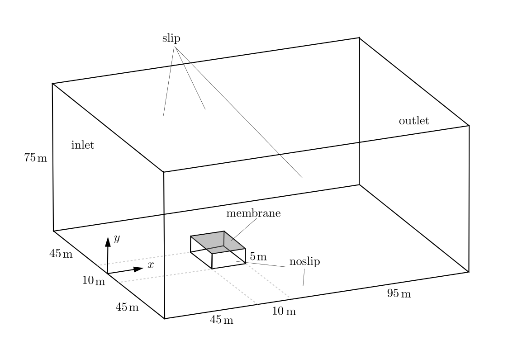
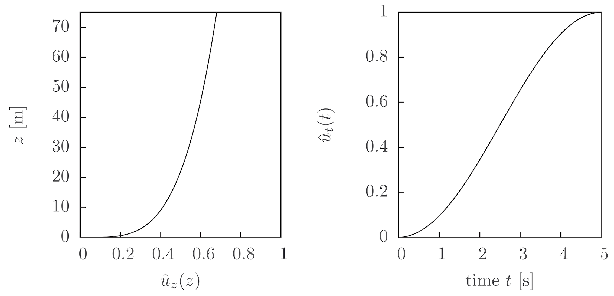
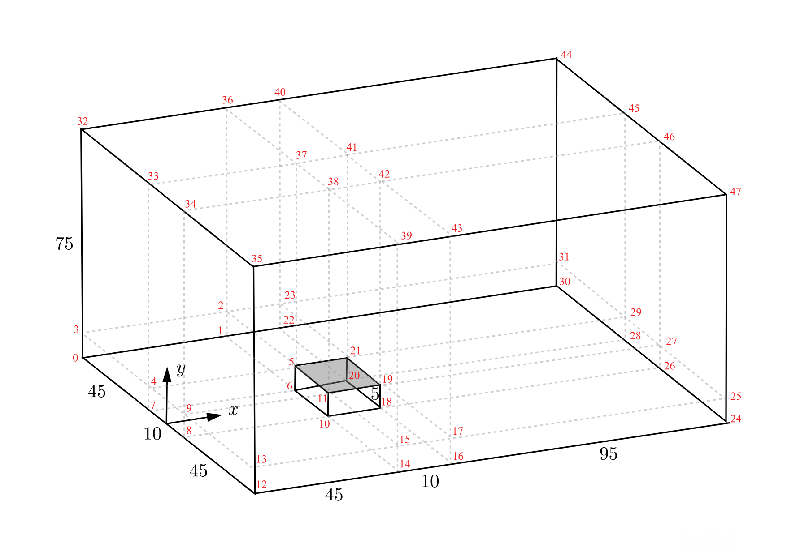
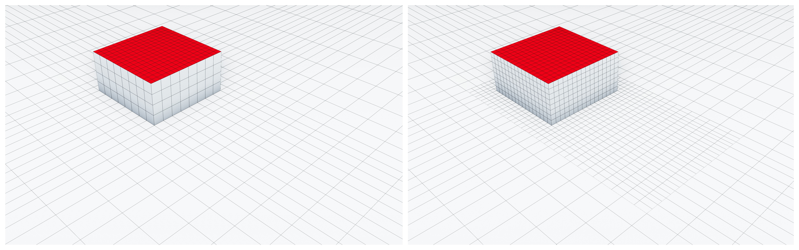
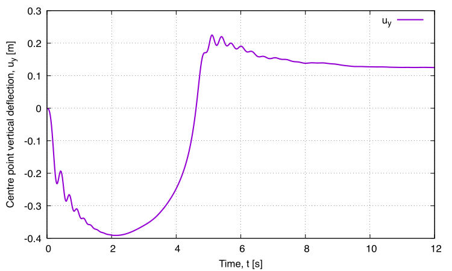

# Flow over a rectangular building with a flexible membrane roof: `membraneRoof`

Prepared by Philip Cardiff, Ivan Batistić

## Tutorial Aims

- Demonstrate a three-dimensional fluid-structure interaction benchmark with a
  very slender membrane roof.
- Show the partitioned Dirichlet-Neumann coupling and monolithic fluid-solid interaction 
  solver on a case with strong added-mass effects.

## Case Overview

This tutorial studies a rectangular building covered by a flexible
$10 \times 10$ m membrane roof and exposed to an incoming three-dimensional flow, see Fig 1.
The setup follows the membrane-roof example described in Section 5.1 of
von Scheven and Ramm paper [1], which extends the earlier two-dimensional benchmark
from [2]. With a roof length of $10$ m, this gives a length-to-thickness ratio of $1000$, so the structure is
extremely slender.

Problem Physical Parameters are:

- **Geometry**
  - Building base: $10 \times 10$ m
  - Building height: $5$ m
  - Overall domain size ($L \times W \times H$): $150 \times 100 \times 75$ m
  - Membrane thickness: $0.01$ m
  - Gravity ($g$): $0$ m/s$$^2$$
- **Solid**
  - St. Venant-Kirchhoff material model
  - Density ($\rho_s$): $1000$ kg/m$$^3$$
  - Young’s modulus ($E_s$): $1\cdot10^9$ Pa
  - Poisson’s ratio ($\nu_s$): $0$
- **Fluid**
  - Density ($\rho_f$): $1.25$ kg/m$$^3$$
  - Kinematic viscosity ($\nu_f$): $0.08$ m$$^2$$/s

Same as in the reference paper [1] the case is solved with `600` uniform time steps of $\Delta t = 0.02$ s
The published study reports
that the maximum inlet speed is $71.26$ m/s, reached at $z = 75$ m and
$t = 5$ s, corresponding to $Re \approx 8900$ when the roof length is used as
the characteristic length.



**Figure 1:** Geometry and boundary conditions for the membrane-roof benchmark.

At the inlet boundary ($x = 0$), the paper prescribes the streamwise velocity

$u_x(z, t) = 100 \hat{u}_t(t) \hat{u}_z(z)$.

From Equation (29) in [1], the spatial and temporal factors are

- $\hat{u}_z(z) = (z/350)^{0.22}$
- $\hat{u}_t(t) = 0.5 [ sin(\pi (t/5 - 0.5)) + 1 ]$ for $t < 5$ s
- $\hat{u}_t(t) = 1$ for $t >= 5$ s

In this tutorial mesh, the coordinate corresponding to the paper's vertical
`z` direction is the case `y` direction. For that reason, the compiled inlet
boundary condition evaluates the profile with the patch-face `y` coordinate,
not the case `z` coordinate.



**Figure 2:** Spatial and temporal variations of the inflow boundary condition.

The inlet condition is implemented as a tutorial-local library in
[`src/membraneRoofVelocityFvPatchVectorField`](/Volumes/OpenFOAM/work/solids4foam-dev-v2412/tutorials/fluidSolidInteraction/membraneRoof/src/membraneRoofVelocityFvPatchVectorField)
and loaded through `system/controlDict`. This avoids `codedFixedValue`, which
is not portable across all supported OpenFOAM forks.

The library is compiled automatically by `./Allrun` through `src/Allwmake`.

## Mesh Generation

The original publication used a fluid mesh with `163008` eight-node hexahedral
elements and a shell discretization with `144` bilinear shell elements [1].
The default `solids4Foam` tutorial uses a coarser mesh intended for routine
testing and demonstration.

For the fluid region, the mesh is generated with `blockMesh` and then refined
locally above and around the roof using `setSet` and `refineMesh`. The solid
region is generated separately with its own `blockMeshDict`. The relevant files
are

- `system/fluid/blockMeshDict`
- `system/fluid/refineMeshDict`
- `setSet.batch`
- `system/solid/blockMeshDict`

The figure below shows the block-structured layout used to generate the base
fluid mesh.



**Figure 3:** Base `blockMesh` layout for the fluid region.




**Figure 4:** Base `blockMesh` layout for the fluid region.

## Running the Case

From the case directory, run

```bash
./Allrun
```

This selects the partitioned Aitken-accelerated coupling by default. The case
also provides a monolithic option:

```bash
./Allrun monolithic
```

The `Allrun` script will

1. Compile the local inlet boundary-condition library.
2. Link the partitioned or monolithic case files.
3. Generate the fluid and solid meshes.
4. Refine the fluid mesh.
5. Run `solids4Foam`.

To clean the generated files, use

```bash
./Allclean
```

## Results

The coupled solution shows vortex shedding around the building and irregular
three-dimensional oscillation of the membrane roof, consistent with the
behaviour described in [1]. The benchmark is especially sensitive because the
roof is thin and light relative to the surrounding incompressible flow, so
small changes in discretization or coupling strategy can alter the detailed
response.

One useful quantity of interest is the membrane displacement at the roof apex.
In this case it is recorded by the `solidPointDisplacement` function object in
`system/controlDict`.

Other useful outputs are

- fluid pressure and velocity fields
- interface forces from the `forces` function object
- the number of fluid-structure coupling iterations per time step




**Figure 5:** Deflection of the roof centre point (50, 5, 0).

## References

[1] [M. von Scheven and E. Ramm, "Strong coupling schemes for interaction of
thin-walled structures and incompressible flows," *International Journal for
Numerical Methods in Engineering*, 87(1-5), 2011, pp. 214-231](
https://doi.org/10.1002/nme.3033)

[2] [P. Le Tallec and J. Mouro, "Fluid structure interaction with large
structural displacements," *Computer Methods in Applied Mechanics and
Engineering*, 190(24-25), 2001, pp. 3039-3067.](https://www.sciencedirect.com/science/article/abs/pii/S0045782500003819)
