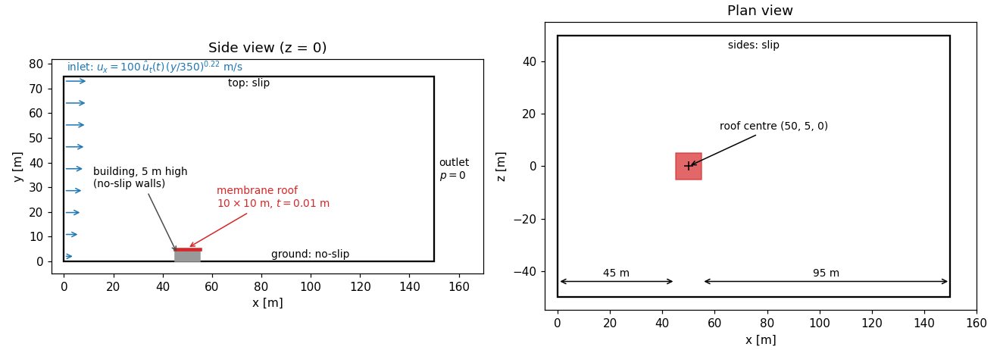
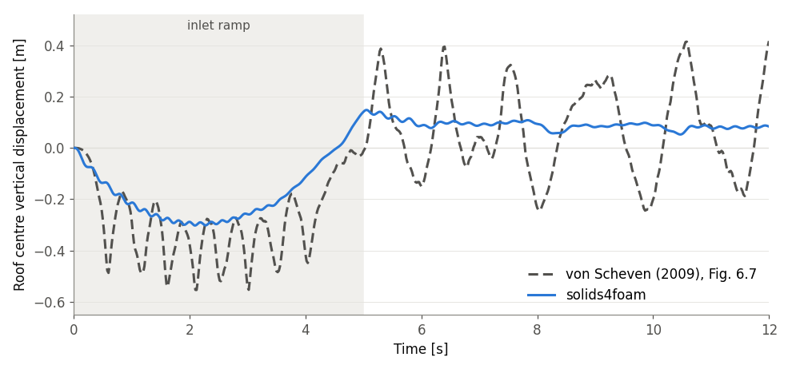
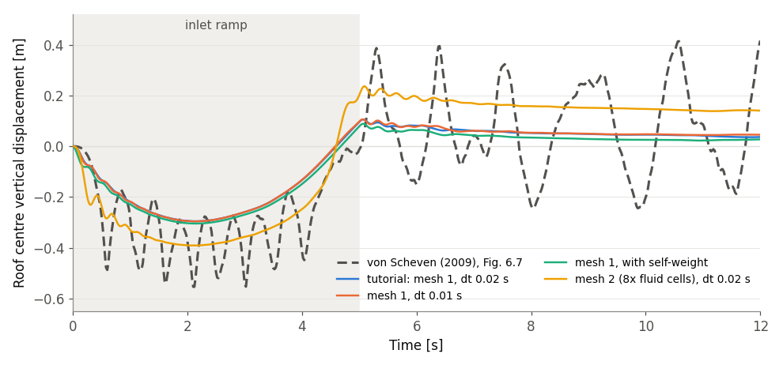

# Wind flow over a building with a membrane roof: `membraneRoof`

Prepared by Ivan Batistić and Philip Cardiff

## Tutorial Aims

- Demonstrates a three-dimensional fluid-solid interaction case with an
  extremely slender structure: a membrane roof with a length-to-thickness
  ratio of 1000.
- Demonstrates a time- and space-varying inlet velocity prescribed with the
  built-in `expression` `PatchFunction1`, with no compiled library.

## Case Overview

A $$10 \times 10 \times 5$$ m building stands on the ground in a
$$150 \times 75 \times 100$$ m ($$x \times y \times z$$) air domain (Figure 1).
Its flat roof is a $$0.01$$ m thick membrane whose four edge faces are fixed;
the references pin the edges of a shell. Wind
enters at $$x = 0$$, flows over the building, and loads the roof through the
pressure and viscous tractions on its upper surface. The building interior is
not modelled, so the underside of the roof is traction-free.

The case follows the membrane-roof example of von Scheven and Ramm [1, Sect.
5.1]. The same simulation is described in more detail in von Scheven's thesis
[2, Sect. 6.2], which also plots the roof-centre displacement history used
below. The vertical axis of the references is $$z$$; in this case it is $$y$$.



**Figure 1:** Geometry and boundary conditions. The case `y` axis is the
vertical `z` axis of the references.

The inlet velocity follows a power law in height and is ramped sinusoidally
from rest over the first $$5$$ s [1, Eq. 28-29]:

$$
u_x(y, t) = 100 \, \hat{u}_t(t) \left( \frac{y}{350} \right)^{0.22}
\mathrm{m/s}, \qquad
\hat{u}_t(t) = \frac{1}{2} \left[ \sin\left( \pi \left( \frac{\min(t, 5)}{5}
- \frac{1}{2} \right) \right) + 1 \right]
$$

This is prescribed in `0/fluid/U` with a `uniformFixedValue` condition and an
`expression` `PatchFunction1`, where `arg()` is the time and `pos()` the face
centre. The maximum inlet speed, $$71.26$$ m/s at the top of the domain, is
reached at $$t = 5$$ s. Based on the roof length, the Reynolds number is about
$$8900$$. The ground and the building walls are no-slip, the top and the two
sides are slip walls, and the outlet has a zero pressure. The flow is laminar.

### Table 1: Physical parameters

| Parameter | Value | Units |
| :-- | :--: | :--: |
| Fluid density, $$\rho_F$$ | 1.25 | kg/m$$^3$$ |
| Fluid kinematic viscosity, $$\nu_F$$ | 0.08 | m$$^2$$/s |
| Solid density, $$\rho_S$$ | 1000 | kg/m$$^3$$ |
| Solid Young's modulus, $$E_S$$ | $$10^9$$ | Pa |
| Solid Poisson's ratio, $$\nu_S$$ | 0 | |
| Roof thickness, $$t$$ | 0.01 | m |
| Time step, $$\Delta t$$ | 0.005 | s |
| End time | 12 | s |

The roof is a St. Venant-Kirchhoff solid, solved with the standard
total-Lagrangian finite volume solid model and PETSc, with a hypre BoomerAMG
preconditioner; the references use a 7-parameter shell. The partitioned
coupling uses IQN-ILS with a predictor, and the fluid mesh motion uses a
uniform diffusivity. The coupling tolerance (`outerCorrTolerance`) is
$$10^{-5}$$, relative to the interface displacement: after the ramp, a
tolerance of $$10^{-6}$$ stagnates at the level of the inner fluid and solid
solver tolerances.

The time schemes are chosen to add little numerical damping to the roof
oscillation, whose period is about $$0.2$$ s: the second-order `backward`
scheme in the fluid and the solid, the low-dissipation `LUST` convection
scheme in the fluid, and $$\Delta t = 0.005$$ s, i.e. about 40 steps per
period. The first-order `Euler` scheme in the fluid, or in the solid, and a
limited `linearUpwind` convection scheme damp the oscillation out (see
[Roof oscillation](#roof-oscillation)).

### Gravity

Gravity is switched off. The thesis [2] states that the self-weight of the
roof is included, but not how it is applied. Applying the self-weight
($$\rho_S g t \approx 98$$ Pa) from $$t = 0$$ lowers the roof centre by about
$$0.01$$-$$0.02$$ m throughout the run (Figure 3) and changes the roof
oscillation period by about $$2\%$$, which is small compared with the
differences from the reference.

## Mesh and Running

The fluid mesh is created with `blockMesh` and refined once, in all directions,
above and around the roof, with `setSet` and `refineMesh`, giving
$$28\,752$$ cells. The solid mesh has $$16 \times 2 \times 16$$ cells, i.e. 2
cells through the roof thickness: with 6 cells through the thickness the
roof-centre displacement changes by less than $$1$$ mm, at twice the cost.

Run the case with

```bash
./Allrun parallel
```

which uses 6 processes, or `./Allrun` for a serial run. The case needs
OpenFOAM.com v2012 or newer, for the expression inlet, and a solids4foam build
with PETSc,
for the solid solver; with other OpenFOAM variants, `Allrun` exits without
running. `Allrun` also writes `deflection.pdf` with gnuplot, comparing the
roof-centre displacement with the reference.

## Results

```warning
This is a qualitative comparison, not a verification. The reference is a
single simulation, on one mesh and one time step, with no convergence study and
no independent solution. After the ramp the reference response is irregular
and breaks symmetry, and the authors note that small changes in the data lead
to a completely different response [1].
```

Figure 2 compares the vertical displacement of the roof centre, point
`(50 5 0)`, with the thesis history [2, Fig. 6.7]. The reference curve was read
from the vector paths of the thesis PDF, so it reproduces the plotted curve
exactly; it is stored in `reference/vonScheven2009_dz.dat`.



**Figure 2:** Vertical displacement of the roof centre compared with von
Scheven [2, Fig. 6.7].

Only the first $$5$$ s, the inlet ramp, is a meaningful comparison. There, both
solutions show the same behaviour: the positive pressure on the roof while the
flow accelerates pushes it down into a concave shape, and as the inlet speed
approaches its maximum the roof is lifted by suction into a convex shape,
crossing zero at $$t = 4.5$$ s, against $$5.0$$ s in the reference. The mean
displacement between $$1$$ and $$4$$ s is $$-0.25$$ m, against $$-0.36$$ m for
the reference. The computed roof oscillates about this mean at its natural
period of about $$0.19$$ s, with a peak-to-peak amplitude of only about
$$0.02$$ m on this coarse mesh, whereas the reference oscillates between about
$$-0.18$$ and $$-0.55$$ m with a period of about $$0.48$$ s. After the ramp the
reference roof oscillates irregularly, with repeated snap-through, while the
computed roof settles to a convex shape with a small oscillation; a comparison
of individual peaks after $$5$$ s would not be meaningful for the reasons given
above.

The results in Figure 2 were produced with the tutorial settings (mesh as
above, $$\Delta t = 0.005$$ s) using OpenFOAM-v2412 on 6 processes of an Apple
M1 Ultra, in 31 min. The coupling took 6.2 iterations per time step on
average.

```note
The finer mesh 2 of Figure 3 (58 min on 32 processes) brings the mean
roof-centre displacement between 1 and 4 s to $$-0.35$$ m, against $$-0.36$$ m
for the reference and $$-0.25$$ m for the default mesh. Neither mesh
reproduces the reference oscillation, and the study below indicates that
refinement would not: its period is not consistent with the published roof
properties.
```

### Roof oscillation

Table 2 summarises a study of the roof oscillation during the ramp, run to
$$t = 5$$ s on the default mesh with one extra level of local refinement
around the leading edge and the roof ($$49\,668$$ fluid cells, cells of
$$0.31$$ m at the roof, $$32 \times 2 \times 32$$ roof cells). The
oscillation is the displacement minus its $$0.6$$ s moving mean, between $$1$$
and $$4.5$$ s. The first column gives the time schemes of the solid and the
fluid; the row with $$\Delta t = 0.005$$ s and `LUST` uses the tutorial
settings.

#### Table 2: Roof-centre oscillation during the ramp

| Solid, fluid | Convection | $$\Delta t$$ [s] | Peak to peak [m] | Period [s] |
| :-- | :-- | --: | --: | --: |
| Reference [2] | | 0.02 | 0.37 | 0.48 |
| `backward`, `Euler` | limited `linearUpwind` | 0.02 | 0.026 | 0.2, decaying |
| `backward`, `Euler` | limited `linearUpwind` | 0.005 | 0.057 | 0.20, decaying |
| `backward`, `backward` | `LUST` | 0.02 | 0.050 | 0.20 |
| `backward`, `backward` | `LUST` | 0.01 | 0.077 | 0.22 |
| `backward`, `backward` | `LUST` | 0.005 | 0.091 | 0.20 |
| `backward`, `backward` | `LUST` | 0.0025 | 0.089 | 0.20 |

Numerical damping, from the first-order `Euler` scheme and the limited
convection scheme in the fluid, is why the previous settings of this tutorial
damped the roof oscillation out. With the tutorial settings the oscillation is
sustained and converged in the time step, at the natural period of the roof in
air, about $$0.20$$ s. Its amplitude is still about four times smaller than
that of the reference, and its period is less than half.

The reference oscillates at about $$0.48$$ s ($$2.2$$ Hz) in both the
roof-centre displacement and the pressure [2, Figs. 6.6 and 6.7]. Membrane
theory and dry tests of the roof alone, in which a pressure is applied
suddenly, show that the published roof properties cannot give that period at
the reported sag: the dry period scales as $$p^{-1/3}$$ with the applied
pressure $$p$$ (0.25, 0.17 and 0.11 s for 500, 1500 and 4500 Pa), and a period
of about $$0.48$$ s with the fluid added mass would need about five times the
mass or a fifth of the tension. Applying the self-weight, or fixing only the
lower half of the roof edges to approximate the pinned edges of the reference,
changes the period by about $$2\%$$ or less. The reference oscillation is
therefore either a numerical artefact or the result of a model difference that
the references do not document, and it cannot be recovered by refining this
model.

### Sensitivity

Figure 3, computed with the previous, more dissipative settings of this
tutorial (`Euler` in the fluid, limited `linearUpwind` convection and
$$\Delta t = 0.02$$ s), shows the sensitivity of the mean response. It repeats
the comparison with half the time step and with the
self-weight applied from $$t = 0$$ (both with 6 cells through the roof
thickness), and on a finer mesh with twice as many cells in each direction in
the fluid ($$220\,804$$ cells) and in the two in-plane directions of the roof
($$32 \times 2 \times 32$$ cells). Halving the time step changes the result
very little. The finer mesh lowers the roof by about $$0.1$$ m during the ramp,
bringing the mean displacement between $$1$$ and $$4$$ s to $$-0.35$$ m,
against $$-0.36$$ m for the reference and $$-0.25$$ m for the tutorial mesh,
and it shows the first of the reference oscillations, near $$t = 0.4$$ s. It
still settles to a nearly steady shape after the ramp, so neither mesh resolves
the vortex shedding that drives the reference response. The finer mesh took 58
min on 32 processes of an AMD EPYC 9684X.



**Figure 3:** Sensitivity of the roof-centre displacement to the time step,
the self-weight and the mesh.

The regression test (`regressionTest.sh`) runs the first $$0.2$$ s (40 time
steps) and checks the roof-centre displacement and the vertical force on the
roof.

## References

[1] [M. von Scheven and E. Ramm, Strong coupling schemes for interaction of
thin-walled structures and incompressible flows, International Journal for
Numerical Methods in Engineering, 87, 2011, 214-231.](https://doi.org/10.1002/nme.3033)

[2] [M. von Scheven, Effiziente Algorithmen für die
Fluid-Struktur-Wechselwirkung, PhD thesis, Institut für Baustatik und
Baudynamik, Universität Stuttgart, 2009.](https://elib.uni-stuttgart.de/items/4428aaea-8eb0-434f-bc64-1ca208a83ef0)
