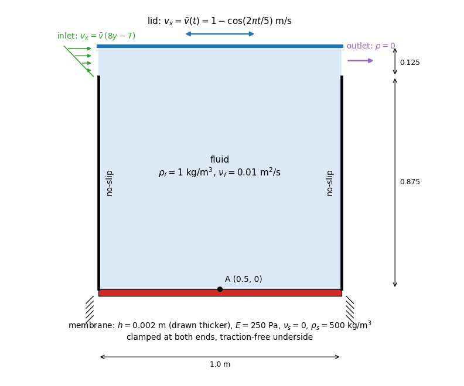
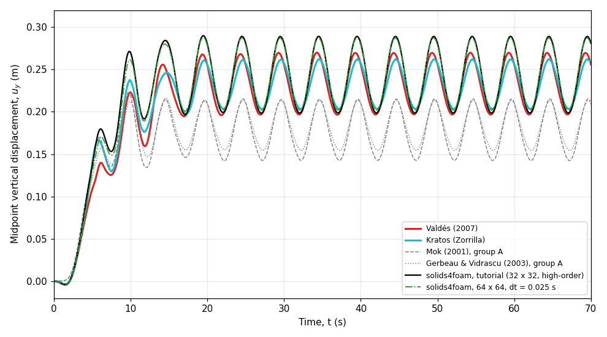

# Lid-driven cavity with a flexible bottom: `mokLidDrivenCavity`

---

Prepared by Philip Cardiff

---

## Tutorial Aims

- Demonstrates a strongly coupled, partitioned fluid-solid interaction
  benchmark with a very thin, very flexible membrane: the lid-driven cavity
  with a flexible bottom of Wall [1] and Mok [2].
- Demonstrates the high-order finite volume solid discretisation on a structure
  with a thickness-to-length ratio of 1:500.
- Demonstrates IQN-ILS Dirichlet-Neumann coupling with an interface predictor.

---

## Case Overview

A 1 m x 1 m cavity is filled with an incompressible fluid and driven by an
oscillating lid velocity (Figure 1, below)

$$\bar{v}(t) = 1 - \cos\left(\frac{2 \pi t}{5}\right) \ \mathrm{m/s}.$$

The bottom of the cavity is a flexible membrane, 0.002 m thick, clamped at both
ends; its underside is traction free. The top 0.125 m of each side wall is open:
the fluid enters through the left opening with the linear profile
$$v_x = \bar{v} (8y - 7)$$, rising from zero at the bottom of the opening to
$$\bar{v}$$ at the lid, and leaves through the right opening, where the pressure
is zero. The openings make the cavity volume free to change, so the membrane is
not constrained by the incompressibility of the fluid, and the outlet pressure
sets the absolute pressure that loads the membrane.

The membrane is two orders of magnitude denser than the fluid, but it is so
thin and soft that its mass per unit area is comparable with the fluid added
mass. It also has almost no bending stiffness: it carries the pressure as a
membrane, through its tension. After a transient of about 20 s the membrane
oscillates about a raised mean position with the 5 s period of the lid. The
monitored quantity is the vertical displacement of the membrane midpoint.

| Parameter | Value | Units |
| :--- | ---: | :--- |
| Fluid density, $$\rho_f$$ | 1 | kg/m$$^3$$ |
| Fluid kinematic viscosity, $$\nu_f$$ | 0.01 | m$$^2$$/s |
| Membrane thickness, $$h$$ | 0.002 | m |
| Membrane density, $$\rho_s$$ | 500 | kg/m$$^3$$ |
| Membrane Young's modulus, $$E$$ | 250 | Pa |
| Membrane Poisson's ratio, $$\nu_s$$ | 0 | |
| Time step, $$\Delta t$$ | 0.1 | s |
| End time | 70 | s |

**Table 1: Physical and numerical parameters.**

The published solutions of this problem fall into two groups that differ by
about 25% in the mean membrane position, because the openings have been
defined in two ways. The original definition of Wall [1] and Mok [2] leaves the
velocity unconstrained at the top two nodes of each side wall, which makes the
opening size depend on the mesh. Valdés [3], the Kratos Multiphysics example
[4] and later studies instead prescribe the linear inflow profile above over a
fixed 0.125 m opening and fix the outlet pressure. This tutorial uses the
second, fully specified definition. The
[verification README](verification/README.md) documents both groups and the
evidence behind this choice.

The membrane is modelled as a 2D plane-strain continuum with the
`nonLinearGeometryTotalLagrangianTotalDisplacement` solid model and the
`StVenantKirchhoffElastic` law. With $$\nu_s = 0$$ plane strain and plane
stress coincide, as in the plane-stress continuum models of [3] and [4]. The
membrane rises by about 0.27 m over a 1 m span, so geometric nonlinearity is
essential. The default solid discretisation is the high-order finite volume
method (a cubic least-squares reconstruction, `solidProperties.highOrder`);
the standard second-order method is available as `solidProperties.standard`.

The fluid is solved with `pimpleFluid` on a 32 x 32 mesh, with the second-order
backward scheme in time. The fluid and solid are coupled by the IQN-ILS
Dirichlet-Neumann algorithm with an interface predictor; Aitken relaxation is
available as an alternative. Because the membrane rises by about a quarter of
the cavity height, the fluid mesh motion uses a uniform diffusivity, which
spreads the compression over the whole cavity.

---

## Running the Case

The tutorial case is located at
`solids4foam/tutorials/fluidSolidInteraction/mokLidDrivenCavity` and is run
with the `Allrun` script:

```bash
./Allrun                      # IQN-ILS coupling, high-order solid
./Allrun standard             # standard second-order solid
./Allrun aitken               # Aitken coupling
./Allrun parallel             # run in parallel
```

The `Allrun` script links the selected `fsiProperties` and `solidProperties`,
creates the fluid and solid meshes with `blockMesh`, and runs `solids4Foam`. If
`gnuplot` is installed, `deflection.pdf` shows the midpoint displacement
history, which is written to
`postProcessing/0/solidPointDisplacement_midpoint.dat`.

The case requires solids4foam built with PETSc. It uses `codedFixedValue` for
the lid and inlet velocities, which foam-extend does not provide, so the case
is skipped on foam-extend.

---

## Expected Results

After a start-up transient of about 20 s, in which the membrane is first
pushed down slightly and then lifted by the developing cavity flow, the
membrane oscillates with the 5 s period of the lid (Figure 2). On the tutorial
mesh the midpoint oscillates between 0.198 m and 0.289 m, about a mean of
0.243 m; on the finest mesh of the verification study (96 x 96) it oscillates
between 0.204 m and 0.286 m.



**Figure 1: Geometry and boundary conditions (the membrane thickness is
exaggerated)**



**Figure 2: Vertical displacement of the membrane midpoint A compared with the
published solutions**

| Solution | Peak (m) | Trough (m) | Mean (m) |
| :--- | ---: | ---: | ---: |
| solids4foam, tutorial (32 x 32) | 0.289 | 0.198 | 0.243 |
| solids4foam, 96 x 96 | 0.286 | 0.204 | 0.245 |
| Valdés [3] | 0.270 | 0.197 | 0.232 |
| Kratos Multiphysics [4] | 0.262 | 0.203 | 0.232 |
| Mok [2] (other opening definition) | 0.215 | 0.143 | 0.177 |

**Table 2: Periodic response of the midpoint for $$t = 20$$-$$70$$ s.**

The trough and the mean agree with the solutions of Valdés and Kratos
Multiphysics to within 3% and 5% of their peak values, and the phase of the
oscillation agrees closely. The peak is 6.2% above the solution of Valdés and
9.2% above the Kratos solution: the solids4foam oscillation has a somewhat
larger amplitude than both. The published solutions themselves differ by
about 6% in their peaks and 20% in their amplitudes. The solution of Mok [2]
lies about 25% lower, because his openings are defined by unconstrained mesh
nodes rather than a prescribed inflow; see the verification README.

With IQN-ILS coupling a time step needs about four coupling iterations; Aitken
relaxation (`./Allrun aitken`) gives the same result with about ten. The
tutorial takes about 6 minutes in serial with the high-order solid and 3
minutes with the standard solid.

---

## Verification Study

The opt-in [`verification/`](verification/) directory holds a mesh study, a
time-step study and a comparison of the standard and the high-order solids,
all evaluated against the curves of Valdés [3] and Kratos Multiphysics [4]:

```bash
cd verification
./Allverify
```

The time step of 0.1 s is converged to 0.2% of the peak, the response changes
by 0.8% of the peak between the two finest meshes, and the standard and the
high-order solids agree to 0.04%. For this tension-dominated membrane the
high-order solid gives no accuracy benefit: the standard solid reaches the same
answer with two cells through the thickness, whereas the high-order solid needs
eight and costs 1.5 to 2.2 times as much. The study is separate from
`regressionTest.sh` and is not run by the normal tutorial test suites. See the
verification README for the benchmark definition, the reference quality, the
acceptance criteria and the recorded results.

---

## References

[1] Wall, W.A. (1999). Fluid-Struktur-Interaktion mit stabilisierten Finiten
Elementen. PhD thesis, Institut für Baustatik, Universität Stuttgart.

[2]
[Mok, D.P. (2001). Partitionierte Lösungsansätze in der Strukturdynamik und
der Fluid-Struktur-Interaktion. PhD thesis, Institut für Baustatik,
Universität Stuttgart.](https://elib.uni-stuttgart.de/handle/11682/164)

[3]
[Valdés Vázquez, J.G. (2007). Nonlinear analysis of orthotropic membrane and
shell structures including fluid-structure interaction. PhD thesis,
Universitat Politècnica de Catalunya.](https://www.tdx.cat/handle/10803/6866)

[4] [Kratos Multiphysics Examples: FSI lid driven
cavity.](https://github.com/KratosMultiphysics/Examples/tree/master/fluid_structure_interaction/validation/fsi_lid_driven_cavity)
