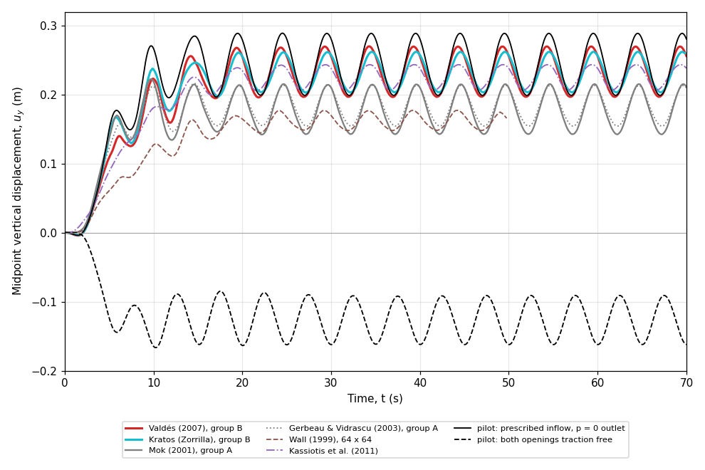

# mokLidDrivenCavity verification study

This opt-in study checks the `mokLidDrivenCavity` tutorial against the
published midpoint displacement histories of the lid-driven cavity with a
flexible bottom. It is separate from `regressionTest.sh`: the regression test
checks that the tutorial is numerically stable, whereas this study checks mesh
and time-step convergence, compares the high-order and the standard solid
discretisations, and compares the converged histories with the literature.
Nothing here is run by `tutorials/Alltest` or `tutorials/Alltest-regression`.

## Running

Source an OpenFOAM environment with solids4foam built with PETSc, and run:

```bash
cd tutorials/fluidSolidInteraction/mokLidDrivenCavity/verification
./Allverify                  # all three studies
./Allverify --study mesh     # one study: mesh, timestep or solid
./Allverify --quick          # smoke test: two members per study, to t = 10 s
./Allverify --reuse          # reuse members completed with the same settings
./Allverify --cores 4        # run every member on 4 MPI ranks
```

Each member is a complete copy of the tutorial under the ignored
`verification/work/` directory, so the tutorial and its regression test are
never modified. Results go to the ignored `verification/postProcessing/`
directory: one `<study>_study.csv` table and one `<study>_histories.csv` file
per study, `verification_summary.md`, and, when `gnuplot` is available, a
`<study>_histories.png` plot against the published curves. `Allverify` returns
zero only when every check passes. Each completed member records its settings,
rank count and a fingerprint of the tutorial inputs in
`verification_member.json`; `--reuse` reuses a member only when these match
and its solver log ends normally, and reruns it otherwise.

## Benchmark definition and reference quality

The benchmark was introduced by Wall (1999) and Mok (2001) and has since been
used in many studies of partitioned coupling. All sources agree on the cavity
(1 m x 1 m), the lid velocity $$1 - \cos(2 \pi t / 5)$$ m/s, the fluid
($$\rho_f = 1$$ kg/m$$^3$$, $$\nu_f = 0.01$$ m$$^2$$/s), the membrane
($$h = 0.002$$ m, $$E = 250$$ Pa, $$\nu_s = 0$$, $$\rho_s = 500$$ kg/m$$^3$$)
and the monitored midpoint displacement. They disagree on the openings, and
the published curves fall into two groups (see the figure below).

- **Group A**: Mok (2001, Bild 6.6), Gerbeau and Vidrascu (2003, Fig. 4) and
  Wall (1999, Bild 7.16). Mok's thesis defines the openings only through the
  mesh: its figures show in- and outflow arrows at the top corners, and
  Küttler and Wall (2008) state that "at each side there are two unconstrained
  nodes". Neither Mok nor Wall states the opening size, the inflow profile or
  how the fluid pressure level is fixed; only the external pressure on the
  underside, $$P_{ext} = 0$$, is given. The opening therefore depends on the
  mesh, and the group is not self-consistent: Wall's 64 x 64 solution has a
  peak of 0.177 m, Mok's 32 x 32 solution 0.215 m. Mok's thesis does not give a
  better-defined alternative to group B.
- **Group B**: Valdés (2007, Fig. 5.12), the Kratos Multiphysics example and
  Tiba et al. (2026, Table 3). They prescribe a linear inflow
  $$v_x = \bar{v}(8y - 7)$$ over a fixed 0.125 m opening on the left and
  $$p = 0$$ on the right opening, which fully specifies the problem. Valdés
  notes that his solution differs from Mok's because not all of Mok's boundary
  conditions are available. This study uses the group B definition.
- Kassiotis et al. (2011, Fig. 7a) use OpenFOAM with two unconstrained faces on
  each side wall and $$p = 0$$ at the outlet; their curve lies between the
  groups. They also note that imposing the pressure at both the inlet and the
  outlet gives a negative mean displacement.

Two pilot runs on the 32 x 32 mesh with the standard solid confirm which
definition each group corresponds to:

| Openings | Peak (m) | Trough (m) | Mean (m) | Reproduces |
|---|---|---|---|---|
| Linear inflow, $$p = 0$$ outlet (group B) | 0.289 | 0.199 | 0.243 | group B |
| Both openings traction free | -0.087 | -0.164 | -0.126 | neither group |

With traction-free openings on both sides the membrane moves down, out of the
cavity, as Kassiotis et al. observed, and matches neither group.



The curves are stored in `reference/`, each with a header recording its
source, figure and extraction method. The Valdés, Mok, Wall, Gerbeau and
Vidrascu, and Kassiotis curves are extracted exactly from the vector paths of
the PDF figures and calibrated against each figure's axis ticks or labels. The
Kratos curve is digitised from the example's 2400 x 1800 PNG, to about 0.5% of
the peak. The Valdés and Mok extractions agree with the independent
digitisations shipped with the CoCoNuT example to 1 mm and 2.3 mm (RMS). Over
the periodic window $$t = 20$$-$$70$$ s the references give:

| Reference | Group | Peak (m) | Trough (m) | Mean (m) |
|---|---|---|---|---|
| Valdés (2007) | B | 0.2695 | 0.1967 | 0.2321 |
| Kratos (Zorrilla) | B | 0.2619 | 0.2033 | 0.2316 |
| Tiba et al. (2026), Table 3 only | B | 0.2769 | - | 0.2466 |
| Kassiotis et al. (2011) | - | 0.2433 | 0.2066 | 0.2255 |
| Mok (2001) | A | 0.2149 | 0.1426 | 0.1773 |
| Gerbeau and Vidrascu (2003) | A | 0.2132 | 0.1545 | 0.1828 |
| Wall (1999), to 50 s | A | 0.1770 | 0.1474 | 0.1610 |

Within group B the peak spreads by 5.7% (Kratos to Tiba), the mean by 6.5%
and the peak-to-peak amplitude by 20% (Kratos 0.059 m, Valdés 0.073 m); the
largest history difference between Valdés and Kratos after $$t = 20$$ s is 6%
of the peak. None of the sources reports a mesh or time-step study. The
periods agree (5 s), and in every curve the membrane rises into the cavity.

## Studies

All members use the IQN-ILS coupling with the interface predictor, the FSI
tolerance $$10^{-5}$$, `pimpleFluid` with the second-order backward scheme, and
a uniform mesh-motion diffusivity, as the tutorial does. The comparison window
is $$t = 20$$-$$70$$ s, after the start-up transient. For each member the driver
records the mean peak and trough per lid period, the time-mean, their distance
outside the group B envelope, and the largest distance of the history from the
band between the Valdés and Kratos curves. In the tables below, "FSI its" is the
mean/maximum number of coupling iterations per time step, and "Time" the
wall-clock time in seconds.

- `mesh`: the fluid and solid meshes are refined together (16, 32, 64 and 96
  cells across the cavity and along the membrane, eight cells through the
  membrane), with the time step reduced with the cell size (0.2, 0.1, 0.05 and
  0.025 s), on the high-order solid.
- `timestep`: $$\Delta t = 0.1$$, 0.05 and 0.025 s on the 64 mesh, high-order
  solid.
- `solid`: the standard solid with two and eight cells through the thickness
  against the high-order solid with eight, on the 64 mesh at
  $$\Delta t = 0.1$$ s.

### Mesh study (high-order solid, eight cells through the membrane, 2 ranks)

| Mesh | $$\Delta t$$ (s) | Peak (m) | Trough (m) | Mean (m) | FSI its | Time |
|---|---|---|---|---|---|---|
| 16 x 16 | 0.2 | 0.2934 | 0.1942 | 0.2426 | 5.6/15 | 83 |
| 32 x 32 | 0.1 | 0.2890 | 0.1986 | 0.2427 | 4.3/11 | 239 |
| 64 x 64 | 0.05 | 0.2870 | 0.2022 | 0.2437 | 3.1/7 | 827 |
| 96 x 96 | 0.025 | 0.2861 | 0.2044 | 0.2445 | 2.5/6 | 3729 |

The response changes by 1.56%, 1.26% and 0.78% of the peak between successive
levels. The mean is mesh-independent to 0.8%, and the peak converges at an
observed order of about 1.2 (from the 16, 32 and 64 levels) towards about
0.285 m. The trough converges more slowly, at an observed order below 0.5, and
is still rising by 0.8% of the peak at the finest level; it is uncertain by
about 1-2% of the peak. The time step matters much less than the mesh (see
below), so halving it with each mesh level only removes a small contribution.

A 128 x 128 level was attempted and could not be completed. With both the
standard and the high-order solid, with $$\Delta t = 0.1$$ and 0.025 s, with an
initial relaxation factor of 0.02 and with eight PIMPLE outer correctors, the
coupled iteration diverges within a single time step and the solid PETSc SNES
solve then fails: at $$t = 4.3$$ s with $$\Delta t = 0.1$$ s, and at
$$t = 13.925$$ s in all three runs with $$\Delta t = 0.025$$ s. The 96 x 96
level therefore stands in for it. The cause was not isolated, and the
divergence is recorded as a known limitation.

### Time-step study (64 mesh, high-order solid, 2 ranks)

| $$\Delta t$$ (s) | Peak (m) | Trough (m) | Mean (m) | FSI its | Time |
|---|---|---|---|---|---|
| 0.1 | 0.2871 | 0.2027 | 0.2440 | 4.8/23 | 654 |
| 0.05 | 0.2870 | 0.2022 | 0.2437 | 3.1/7 | 829 |
| 0.025 | 0.2870 | 0.2021 | 0.2437 | 2.4/6 | 1225 |

The response changes by 0.17% and then 0.04% of the peak: the benchmark time
step of 0.1 s is already converged to well within the reference spread.

### Solid discretisation study (64 mesh, $$\Delta t = 0.1$$ s, serial)

| Solid | Cells in $$h$$ | Peak (m) | Trough (m) | Mean (m) | FSI its | Time |
|---|---|---|---|---|---|---|
| standard | 2 | 0.2870 | 0.2028 | 0.2441 | 4.8/32 | 828 |
| standard | 8 | 0.2870 | 0.2028 | 0.2441 | 4.8/18 | 845 |
| high-order | 8 | 0.2871 | 0.2027 | 0.2440 | 4.8/19 | 1268 |

The standard and the high-order solids give the same response to 0.04% of the
peak, and the standard solid needs only two cells through the thickness. The
membrane carries the pressure almost entirely through tension (its bending
stiffness is $$h^2 / (12 L^2) \approx 3 \times 10^{-7}$$ of $$EA L^2$$), so the
second-order finite volume solid does not suffer the slow convergence seen for
bending-dominated slender structures. The high-order solid gives no accuracy
benefit here and costs 1.5 times as much. It is also more demanding of the
mesh: on the 32 mesh, with two or four cells through the thickness its PETSc
SNES solve stalls within the first second, whereas eight cells work, so the
tutorial and the studies use eight. The high-order solid is the tutorial default
because it was requested; `./Allrun standard` selects the cheaper standard solid
with the same result.

### FSI iterations

With IQN-ILS and the predictor, a time step needs 4.3 coupling iterations on
average on the 32 mesh at $$\Delta t = 0.1$$ s (at most 11), and 4.8 on the 64
mesh at $$\Delta t = 0.1$$ s; halving the time step reduces this to 3.1 and
2.4. Aitken relaxation
(`./Allrun aitken`) gives the same response with 9.9 iterations per step on the
32 mesh. For comparison, at $$\Delta t = 0.1$$ s Mok (2001) reports 15
iterations in the first step without relaxation and 8 with the best fixed
relaxation factor 0.825, with Aitken and steepest-descent relaxation 1-2
iterations cheaper than that over the run; Küttler and Wall (2008, Fig. 4,
tolerance $$10^{-7}$$, constant predictor) report about 5-7 iterations for
Aitken and 2-4 for their Newton-Krylov variants; Kassiotis et al. (2011) report
a mean of 17 for Aitken at tolerance $$10^{-7}$$; Valdés (2007) reports 6-8
for Aitken at $$\Delta t = 0.01$$ s. Bogaers et al. (2014) do not use this
case. The residual definitions and tolerances differ, so the comparison is
indicative only: IQN-ILS needs fewer iterations than the published
relaxation methods, whereas the solids4foam Aitken implementation needs more.

## Acceptance criteria

`Allverify` returns zero only when every check passes. The numbers are in
`reference/mokLidDrivenCavity_verification_references.json`.

- `mesh` and `timestep`: the change in the periodic response (the larger of
  the peak and trough changes) between successive members decreases, or is
  already below 0.1% of the peak, and the last change is below 1% of the peak.
- `solid`: every member agrees with the high-order solid to 1% of the peak.
- For the finest `mesh` and `timestep` members and every `solid` member, the
  result is compared with the group B references rather than with any single
  one of them:
  - the peak, trough and mean must lie within 5% of the envelope spanned by
    Valdés, Kratos and Tiba et al. (Tiba gives only the peak and the mean):
    at most 5% above its maximum and at most 5% below its minimum. The
    envelopes are 0.2619-0.2769 m for the peak, 0.1967-0.2033 m for the trough
    and 0.2316-0.2466 m for the mean;
  - after $$t = 20$$ s, the history must stay within 10% of the peak of the
    band between the Valdés and Kratos curves, which at each time runs from
    the lower to the higher of the two. The peak used is the smaller of the
    two curve peaks.

Neither the published references nor this study can say which group B
solution is the most accurate, so the checks accept any result within the
spread of the independent group B codes plus a 5% allowance, and reject
results that leave it.

A `--quick` run exercises the two coarsest members of each study to
$$t = 10$$ s, before the periodic state, and checks only that they complete.

## Interpretation

- None of the published references demonstrates mesh or time-step
  insensitivity: each gives one solution on one mesh (32 x 32 fluid elements
  in Mok, Valdés, Kratos and Kassiotis et al., 64 x 64 in Wall) at one time
  step.
- The solids4foam solution is mesh- and time-step-converged: the peak changes
  by 0.3% of itself between the 64 and 96 meshes (the whole response by
  0.8% of the peak), and by 0.04% of the peak between
  $$\Delta t = 0.05$$ and 0.025 s. The standard and the high-order solids
  agree to 0.04%.
- The peak therefore lies 6-9% above the Valdés and Kratos peaks for reasons
  that cannot be attributed to the solids4foam discretisation. The trough and
  the mean lie inside the group B envelope, and the peak lies 3.3% above its
  upper end (the Tiba et al. value). The solids4foam result may be the more
  accurate one, since the published solutions use numerically dissipative
  time integrators (generalised-alpha and Bossak schemes, backward Euler in
  Mok) on single, coarse meshes, but this cannot be decided from the
  published data.
- An independent solution from a commercial finite element code (COMSOL,
  LS-DYNA or ANSYS) has been requested. It will be added to `reference/` and
  to the group B envelope when it is available.

## Recorded results

Recorded with OpenFOAM v2412 on an Apple Silicon Mac Studio shared with other
jobs. The three studies were run concurrently with
`./Allverify --study mesh --cores 2`, `./Allverify --study timestep --cores 2`
and `./Allverify --study solid`, and the combined summary was then written by
`./Allverify --reuse`, which passes every check. The margins of the finest
members to the acceptance limits are:

| Member | Check | Value | Outside envelope | Margin to limit |
|---|---|---|---|---|
| mesh96 | peak | 0.2861 m | +3.32% | 1.68% |
| mesh96 | trough | 0.2044 m | +0.56% | 4.44% |
| mesh96 | mean | 0.2445 m | inside | 5.85% |
| mesh96 | history band | 8.42% of peak | - | 1.58% |
| dt0.025 | peak | 0.2870 m | +3.64% | 1.36% |
| dt0.025 | trough | 0.2021 m | inside | 5.60% |
| dt0.025 | mean | 0.2437 m | inside | 6.18% |
| dt0.025 | history band | 8.70% of peak | - | 1.30% |
| highOrder_ny8 | peak | 0.2871 m | +3.68% | 1.32% |
| highOrder_ny8 | trough | 0.2027 m | inside | 5.30% |
| highOrder_ny8 | mean | 0.2440 m | inside | 6.06% |
| highOrder_ny8 | history band | 8.95% of peak | - | 1.05% |

The peak and the history are the binding checks; the trough and the mean lie
inside, or within 0.6% of, the group B envelope.

With `--quick` the driver runs the two coarsest members of each study to
$$t = 10$$ s, which took about 7 minutes on two ranks.

## Known limitations

- A 128 x 128 mesh level could not be completed (see the mesh study), so the
  finest mesh level is 96 x 96.
- The case uses `codedFixedValue`, so it does not run on foam-extend, where
  `Allrun` skips it. It has not been tested on OpenFOAM.org.
- Only one group B reference (Valdés) gives the full history from vector data;
  the Kratos curve is digitised from a raster image and Tiba et al. give scalar
  values only.

## References

- Wall, W.A. (1999). Fluid-Struktur-Interaktion mit stabilisierten Finiten
  Elementen. PhD thesis, Universität Stuttgart.
- Mok, D.P. (2001). Partitionierte Lösungsansätze in der Strukturdynamik und
  der Fluid-Struktur-Interaktion. PhD thesis, Universität Stuttgart.
- Gerbeau, J.-F., Vidrascu, M. (2003). A quasi-Newton algorithm based on a
  reduced model for fluid-structure interaction problems in blood flows.
  INRIA Research Report 4691.
- Förster, C., Wall, W.A., Ramm, E. (2007). Artificial added mass instabilities
  in sequential staggered coupling of nonlinear structures and incompressible
  viscous flows. Comput. Methods Appl. Mech. Engrg. 196:1278-1293.
- Valdés Vázquez, J.G. (2007). Nonlinear analysis of orthotropic membrane and
  shell structures including fluid-structure interaction. PhD thesis,
  Universitat Politècnica de Catalunya.
- Küttler, U., Wall, W.A. (2008). Fixed-point fluid-structure interaction
  solvers with dynamic relaxation. Comput. Mech. 43:61-72.
- Kassiotis, C., Ibrahimbegovic, A., Niekamp, R., Matthies, H.G. (2011).
  Nonlinear fluid-structure interaction problem. Part I: implicit partitioned
  algorithm, nonlinear stability proof and validation examples. Comput. Mech.
  47:305-323.
- Kratos Multiphysics Examples, FSI lid driven cavity (R. Zorrilla).
- Tiba, A. et al. (2026). Online adaptive non-intrusive model reduction via
  manifold interpolation and subspace updates: application to FSI convergence
  acceleration. arXiv:2609.16876.
