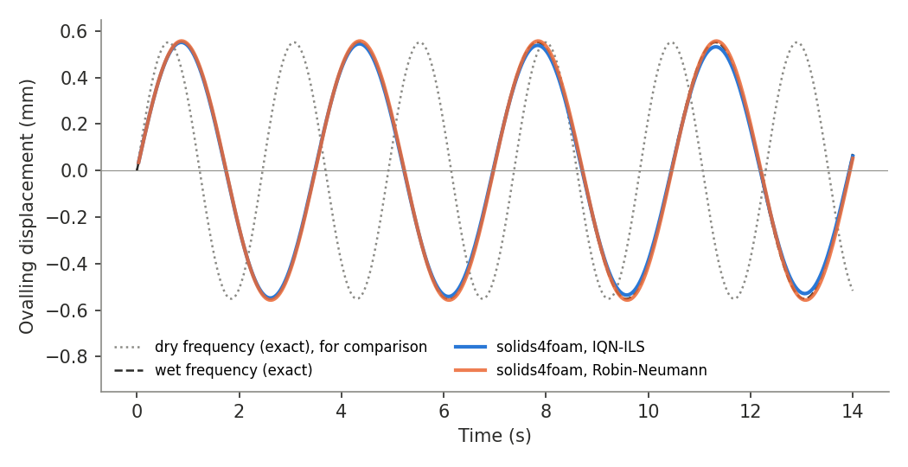

# Added mass on a vibrating ring: `ringAddedMass`

---

Prepared by Philip Cardiff

---

## Tutorial Aims

- Demonstrates partitioned fluid-solid interaction under a controllable,
  exactly known added-mass effect.
- Compares the IQN-ILS (Dirichlet-Neumann) and Robin-Neumann couplings.
- Shows how to set a spatially varying initial displacement with `#codeStream`.

---

## Case Overview

An elastic ring of mean radius $$a = 1$$ m and thickness $$h = 0.1$$ m
(plane strain) is surrounded by incompressible fluid in the annulus between
the ring's outer surface, $$R = 1.05$$ m, and a rigid outer cylinder of radius
$$b = 1.5$$ m (Figure 1). The inside of the ring is empty. The ring starts
undeformed, with the velocity of its $$n = 2$$ (ovalling) mode, and vibrates
freely with an amplitude of about $$5 \times 10^{-4} a$$.

The fluid has no natural frequency of its own: it is dragged along by the ring
and adds inertia, lowering the ring's natural frequency by an amount that
potential-flow theory gives exactly. For mode $$n$$, the fluid in the annulus
adds a mass per unit area of ring surface of

$$
m_a = \frac{\rho_f R}{n} \frac{b^{2n} + R^{2n}}{b^{2n} - R^{2n}},
$$

acting on the radial motion only; the tangential motion of the ring does not
couple to an inviscid fluid. A thin inextensional ring, whose modal mass
includes its tangential motion, then vibrates at

$$
\omega_{wet} = \omega_{dry}
\left[ 1 + \frac{n^2}{n^2 + 1} \frac{m_a R}{\rho_s h a} \right]^{-1/2},
\qquad
\omega_{dry}^2 = \frac{E h^3}{12 (1 - \nu^2)}
\frac{n^2 (n^2 - 1)^2}{\rho_s h a^4 (n^2 + 1)}.
$$

The ratio of added to structural modal mass, $$\mu$$, the bracketed term less
one, is about 1 for the tutorial's fluid density, so the fluid lowers the
frequency by about 30%. This is a strong added-mass effect: the fluid is as
heavy, dynamically, as the ring. The `verification` study also runs fluid
densities giving $$\mu = 0.1$$ and $$\mu = 10$$.

The n = 2 mode is symmetric about both axes, so only a quadrant is modelled,
with symmetry planes on the axes. The solid and fluid meshes are single-block
polar grids that match on the interface.


**Figure 1: Geometry, with the quarter solid and fluid meshes and the n = 2
mode shape (exaggerated).**

### Table 1: Problem Physical Parameters

|               Parameter               |  Value  |   Units    |
| :-----------------------------------: | :-----: | :--------: |
|      Ring inner radius, $$R_i$$       |  0.95   |     m      |
|      Ring outer radius, $$R$$         |  1.05   |     m      |
|        Wall radius, $$b$$             |   1.5   |     m      |
|     Solid density, $$\rho_s$$         |  1000   | kg/m$$^3$$ |
|   Solid Young's modulus, $$E$$        |    1    |    MPa     |
|   Solid Poisson's ratio, $$\nu$$      |   0.3   |            |
|     Fluid density, $$\rho_f$$         |   140   | kg/m$$^3$$ |
| Fluid kinematic viscosity, $$\nu_f$$  | 1e-7    | m$$^2$$/s  |

The small fluid viscosity keeps the oscillatory (Stokes) boundary layer
$$\sqrt{2 \nu_f / \omega}$$ below 0.1% of the gap, so the potential-flow
added mass applies; the exact viscous correction to the frequency is 0.03%.

---

## Numerical Set-up

- **Initial condition.** The ring starts undeformed with the velocity of the
  thin-ring mode shape, $$V_r = V_0 \cos 2\theta$$,
  $$V_\theta = V_0 \sin 2\theta (-1/2 + 3 (r - a) / 2a)$$, with
  $$V_0 = 1.5$$ mm/s. The velocity is set through the old-time displacements
  `0/solid/D_0` $$= -V \Delta t$$ and `0/solid/D_0_0` $$= -2 V \Delta t$$,
  which OpenFOAM reads as the history of the second-order time scheme; both
  are computed with `#codeStream`, which compiles a small piece of code on the
  first run, and read the time-step from `system/controlDict`. Starting from
  the undeformed shape keeps the solid and fluid meshes aligned. The fluid
  starts at rest, so, as for an impulsive start in an incompressible fluid,
  the first time-step shares the ring's momentum with the fluid, and the ring
  then vibrates freely with an amplitude of about $$5 \times 10^{-4} a$$. The
  frequency is unaffected.
- **Solid.** `linearGeometryTotalDisplacement` with the PETSc SNES solver and
  the cubic high-order residual (`constant/solid/solidProperties.highOrder`).
  The ring vibrates in bending, which the standard second-order residual
  resolves poorly on thin meshes: on the tutorial mesh (four cells through the
  thickness) the standard solid is 20% too stiff, whereas the high-order solid
  is within 0.02% of the exact frequency. The standard solid is selected with
  `./Allrun standard`.
- **Fluid.** `pimpleFluid`, with `newMovingWallVelocity` on the interface.
  The fluid is enclosed, so the pressure level is fixed at a reference point on
  the diagonal, where the n = 2 pressure vanishes.
- **Coupling.** IQN-ILS with the predictor (`constant/fsiProperties.iqnils`),
  or Robin-Neumann with `elasticWallPressure`, `elasticWallVelocity` and a
  fixed relaxation factor of 1 (`./Allrun robin`).
- **Time integration.** Second-order backward differencing (`backward`) in both
  regions, with 100 time-steps per wet period. The Euler scheme would damp the
  free vibration heavily.

---

## Running the Case

```bash
./Allrun              # IQN-ILS, high-order solid
./Allrun robin        # Robin-Neumann coupling
./Allrun standard     # standard (second-order) solid residual
./Allrun robin parallel
```

The tutorial runs four wet periods in about 75 s in serial and requires
solids4foam to be built with PETSc. Run `./Allclean` before switching to
another variant, as `Allrun` does not rerun a solver whose log exists.

---

## Expected Results

Figure 2 compares the ovalling displacement, $$(u_r(0) - u_r(90°))/2$$ at the
ring's outer surface, with a sine at the exact wet frequency, and with one at
the exact dry frequency to show the size of the added-mass effect. Measured
from the zero crossings over four periods, the IQN-ILS and Robin-Neumann
frequencies are 1.8034 and 1.8023 rad/s, against the exact 1.8045 rad/s,
i.e. within 0.06% and 0.12%; most of the difference is the error of the
second-order time scheme at 100 steps per period. The IQN-ILS solution loses
about 1.2% of its amplitude per period on this mesh, which halves with each
mesh refinement, whereas the Robin-Neumann solution is essentially undamped.



**Figure 2: Ovalling displacement against time.**

The `verification` directory contains an opt-in study with mesh and time-step
refinement for three added-mass levels, which compares the dry and wet
frequencies and their ratio with the exact continuum solution; see
`verification/README.md`.

---

## References

[1] C. E. Brennen, A review of added mass and fluid inertial forces, Report
CR 82.010, Naval Civil Engineering Laboratory, Port Hueneme, California, 1982.
