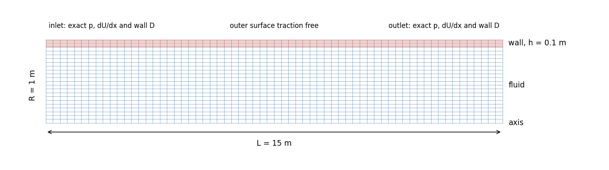
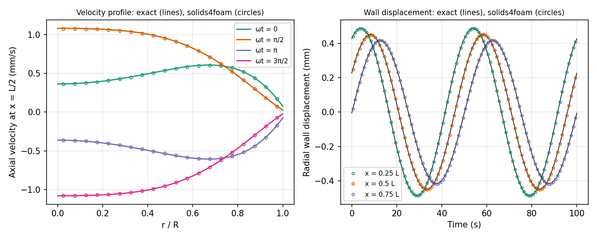

# Pulsatile flow in an elastic tube: `womersleyTube`

---

Prepared by Philip Cardiff

---

## Tutorial Aims

- Demonstrates pressure-wave propagation in a compliant, fluid-filled tube,
  with viscous effects, against an exact solution (Womersley flow).
- Shows how to impose a travelling-wave solution at the ends of a finite tube,
  so that nothing reflects, with coded boundary conditions and exact initial
  fields.
- Compares the IQN-ILS (Dirichlet-Neumann) and Robin-Neumann couplings.

---

## Case Overview

A harmonic pressure wave travels along a straight elastic tube filled with a
viscous incompressible fluid (Figure 1). Womersley (1955) gave the solution
for an infinitely long thin-walled tube: every field varies as
$$e^{i(\omega t - k x)}$$, with the Womersley velocity profile across the
tube and a complex wave number $$k$$ whose real part gives the wave speed,
$$c = \omega / \mathrm{Re}(k)$$, and whose imaginary part gives the viscous
attenuation. The tutorial models a segment of length $$L = 15$$ m, about a
third of a wavelength, over which the wave is delayed by 124° and attenuated
by 27%.

The wall of the tutorial is not thin ($$h / R = 0.1$$) and is free to move
axially, so the reference is the exact linear solution for a thick elastic
wall and the full (not long-wave) Navier-Stokes equations, computed by
`verification/scripts/womersley_exact.py`. Womersley's thin-wall wave speed
is 4.7% higher; see `verification/README.md`.

The problem is axisymmetric, so a 1° wedge about the $$x$$ axis is modelled,
with 20 radial and 64 axial cells in the fluid and 8 radial and 64 axial
cells in the wall. The meshes match on the interface.



**Figure 1: The fluid and wall meshes in the x-r plane (radial direction
exaggerated 2.5 times).**

### Table 1: Problem Physical Parameters

|               Parameter               |  Value  |   Units    |
| :-----------------------------------: | :-----: | :--------: |
|      Tube inner radius, $$R$$         |    1    |     m      |
|      Wall thickness, $$h$$            |   0.1   |     m      |
|      Tube length, $$L$$               |   15    |     m      |
|     Wall density, $$\rho_s$$          |  1000   | kg/m$$^3$$ |
|   Wall Young's modulus, $$E$$         |   20    |    kPa     |
|   Wall Poisson's ratio, $$\nu$$       |   0.3   |            |
|     Fluid density, $$\rho$$           |  1000   | kg/m$$^3$$ |
| Fluid dynamic viscosity, $$\mu$$      |    5    |    Pa s    |
|      Frequency, $$f$$                 |  0.02   |     Hz     |
| Pressure amplitude on the axis at $$x = 0$$ | 1 |     Pa     |

These give a Womersley number $$\alpha = R \sqrt{\omega \rho / \mu} = 5.0$$,
a wave speed of 0.873 m/s and a wavelength of 43.6 m ($$43.6 R$$). The
dimensionless groups are those of, for example, a 1 cm tube at 2 Hz; the
metre scale keeps the wall displacement (0.5 mm) well above the absolute
tolerances of the solvers.

---

## Numerical Set-up

- **Tube ends.** The exact solution is imposed at both ends: the fluid
  pressure (`codedFixedValue`), the normal gradient of the fluid velocity
  (`codedMixed`), and the wall displacement (`codedFixedValue`). A finite
  segment driven by the same travelling wave at both ends reproduces the
  infinite-tube solution, with no reflection. The code shared by these
  conditions is in `system/womersleyCode` and reads the exact solution's
  coefficients from `constant/womersleyProperties`, which is written by
  `verification/scripts/womersley_exact.py --write-case .`.
- **Initial fields.** The fluid velocity and pressure and the wall
  displacement, including the old-time displacements `D_0`, `D_0_0` and
  `D_0_0_0` read by the second-order time scheme, are set to the exact
  solution with `#codeStream`, so there is no start-up ramp. Both the
  boundary conditions
  and the initial fields compile a small library on the first run.
- **Wall.** `linearGeometryTotalDisplacement` with the PETSc SNES solver. The
  outer surface is traction free; the wall is not longitudinally tethered, as
  in Womersley's constrained tube, because the SNES solver does not enforce a
  mixed displacement-traction condition (see `verification/README.md` and
  [#511](https://github.com/solids4foam/solids4foam/issues/511)). The cubic
  high-order residual is not used: its moving-least-squares reconstruction
  requires an empty (not wedge) direction
  ([#512](https://github.com/solids4foam/solids4foam/issues/512)).
- **Fluid.** `pimpleFluid`, with `newMovingWallVelocity` on the interface.
- **Coupling.** IQN-ILS with the predictor (`constant/fsiProperties.iqnils`),
  or Robin-Neumann with `elasticWallPressure`, `elasticWallVelocity` and a
  fixed relaxation factor of 1 (`./Allrun robin`).
- **Time integration.** Second-order backward differencing (`backward`) in
  both regions, with 100 time-steps per period. The case runs two periods.

---

## Running the Case

```bash
./Allrun              # IQN-ILS
./Allrun robin        # Robin-Neumann coupling
./Allrun robin parallel
```

The tutorial requires solids4foam to be built with PETSc, and runs with
OpenFOAM.com (the coded conditions and the sampling are not available in
foam-extend, and the sampling syntax differs in OpenFOAM.org). It takes about
4 minutes in serial with IQN-ILS and half that with Robin-Neumann. Run
`./Allclean` before switching to another variant, as `Allrun` does not rerun
a solver whose log exists.

---

## Expected Results

Figure 2 compares the velocity profile at $$x = L/2$$ over the second period,
at four phases, and the radial wall displacement at $$x = L/4$$, $$L/2$$ and
$$3L/4$$, with the exact solution. Over the second period, the velocity
profile is within 0.5% of the largest exact velocity at every phase, the
flow rate at $$x = L/2$$ within 0.02% in amplitude and 0.001 rad in phase, the
wall displacement amplitude within 0.25% at the three stations, and the wave
speed fitted to the pressure along the tube within 0.15%. The attenuation,
$$\mathrm{Im}(k)$$, is within 0.9%. If `gnuplot` is installed,
`Allrun` also plots the wall displacement against the exact solution in
`wallDisplacement.pdf`.



**Figure 2: Velocity profile at x = L/2 and radial wall displacement against
the exact solution.**

The `verification` directory contains an opt-in study with mesh and time-step
refinement, which compares the velocity profile, the flow rate, the wall
displacement and the wave number with the exact solution and reports the
observed orders; see `verification/README.md`.

---

## References

[1] J. R. Womersley, Oscillatory motion of a viscous liquid in a thin-walled
elastic tube, I: The linear approximation for long waves, Philosophical
Magazine 46 (1955) 199-221.

[2] V. Filonova, C. J. Arthurs, I. E. Vignon-Clementel, C. A. Figueroa,
Verification of the coupled-momentum method with Womersley's Deformable Wall
analytical solution, International Journal for Numerical Methods in
Biomedical Engineering 36 (2020) e3266.
