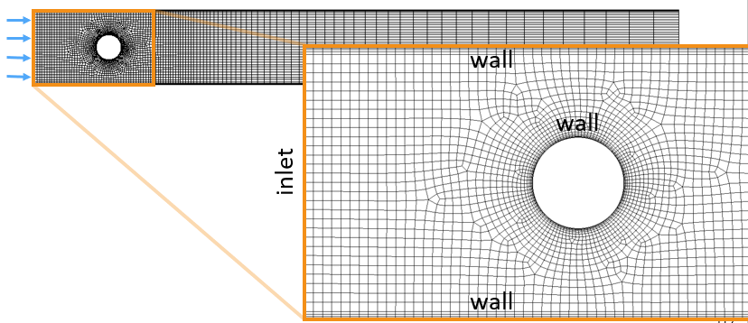
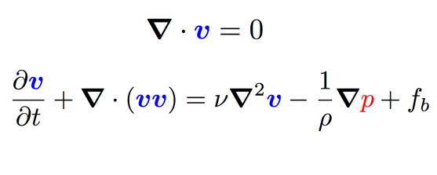

# My second tutorial: `cylinderInChannel`

---

## Tutorial Aims

- Demonstrate how to perform a fluid-only analysis in solids4foam;
- Explain how a solids4foam fluid case is different from a standard OpenFOAM fluid case.

## Case overview



This is the classic “flow over a cylinder in a channel” test case, as analysed by, for example, Ferziger and Peric (2002). The problem is modelled as 2-D. The inlet flow velocity profile is specified (coming in from the left) and the outlet (right) gauge pressure is zero. The upper wall, lower wall and cylinder are no slip walls.

We assume an incompressible Newtonian isothermal laminar fluid, where the Navier-Stokes governing equations take the form:



We will use the PIMPLE pressure-velocity coupling algorithm:
```pseudocode
for all time-steps
    do
        solve momentum equation for U (terms depending on p are calculated explicitly)
        solve pressure equation for p (terms depending on U are calculated explicitly)
    while not converged
end
```
---

## Expected results

For Re = 100, the flow is expected to be unsteady with vortices shedding from the cylinder.


---

## Running the case

The tutorial case can be run using the included `Allrun` script, i.e. `> ./Allrun`. In this case, the `Allrun` script is
```bash
#!/bin/bash

# Source tutorial clean functions
. $WM_PROJECT_DIR/bin/tools/RunFunctions

# Source solids4Foam scripts
source solids4FoamScripts.sh

# Check case version is correct
solids4Foam::convertCaseFormat .

# Create the mesh
solids4Foam::runApplication fluentMeshToFoam cylinderInChannel.msh
solids4Foam::runApplication changeDictionary

# Run the solver
solids4Foam::runApplication solids4Foam

# Create plots
if command -v gnuplot &> /dev/null
then
    if [[ -f "./postProcessing/forces/0/forces.dat" ]]
    then
        echo "Generating force.pdf using gnuplot"
        gnuplot force.of9.gnuplot &> /dev/null
    else
        echo "Generating force.pdf using gnuplot"
        gnuplot force.gnuplot &> /dev/null
    fi
else
    echo "Please install gnuplot if you would like to generate the plots"
fi
```
where the `solids4Foam::convertCaseFormat .` script makes minor changes to the case to make it compatible with your version of OpenFOAM/foam-extend. As can be seen, the mesh in the fluent format is converted to the OpenFOAM format before running the `solids4Foam` solver. After the solver has finished, a `force.pdf` plot is generated if the `gnuplot` program is installed. 

```tip
Remmber that a tutorial case can be cleaned and reset using the included `Allrun` script, i.e. `> ./Allclean`.
```

---

## Analysing the results

In the ParaView, a [von Kármán vortex street](https://en.wikipedia.org/wiki/Kármán_vortex_street) is clearly visible by viewing the pressure field `p`:


---

# Delving deeper

---

If you would like to learn more about the case, then please continue; if not, how about you check out **my third tutorial (LINK TO BE ADDED)**.

---

## Case structure

The case follows the typical `pimpleFoam` (or `pimpleDyMFoam`) case structure:

```
cylinderInChannel
├── 0
│   ├── U
│   └── p
├── Allclean
├── Allrun
├── constant
│   ├── RASProperties
│   ├── dynamicMeshDict
│   ├── fluidProperties
│   ├── physicsProperties
│   ├── polyMesh
│   │   └── …
│   ├── transportProperties
│   └── turbulenceProperties
├── cylinderInChannel.msh
└── system
    ├── changeDictionaryDict
    ├── controlDict
    ├── fvSchemes
    └── fvSolution
```
The only difference with a `pimpleFoam` case is that a `constant/physicsProperties` dictionary must be present, where the type of analysis is specified:
```
type     fluid;
//type   solid;
//type   fluidSolidInteraction;
```

In addition, as this is a "fluid" analysis, a `constant/fluidProperties` dictionary must also be present, where the PIMPLE algorithm for an incompressible isothermal fluid is specified:

```
fluidModel pimpleFluid;

pimpleFluidCoeffs
{}
```

```note
The `pimpleFluid` fluid model does not require any settings to be specified. Parameters related to the PIMPLE algorithm as instead specified in `system/fvSolution`, just like for the `pimpleFoam` solver.
```

Apart from specifying the `physicsProperties` and `fluidProperties` dictionaries, the case is equivalent to a standard `pimpleFOAM` case, e.g. in terms of `transportProperties`, `RASProperties`, `dynamicMeshDict`, `U`, `p`, `fvSchemes`, etc.

---

## Code

### `fluidModel` code

For the `cylinderInChannel` test case, we have selected a “fluid” analysis in the `physicsProperties` dictionary: this means a `fluidModel` class will be selected; then, we specify the actual `solidModel` class to be the `pimpleFluid` class.

The code for the pimpleFluid class is located at:
```
solids4foam/src/solids4FoamModels/fluidModels/pimpleFluid/pimpleFluid.C
```
and this code directly ports the `pimpleFoam` solver code; in particular, see the `evolve()` function with `pimpleFluid.C`.