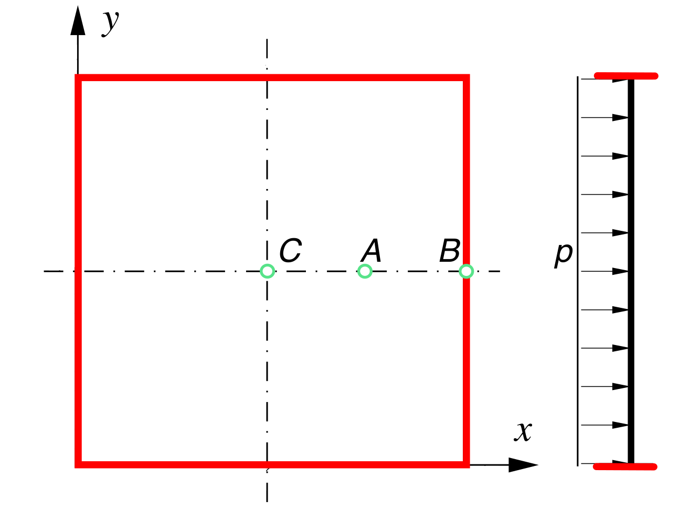
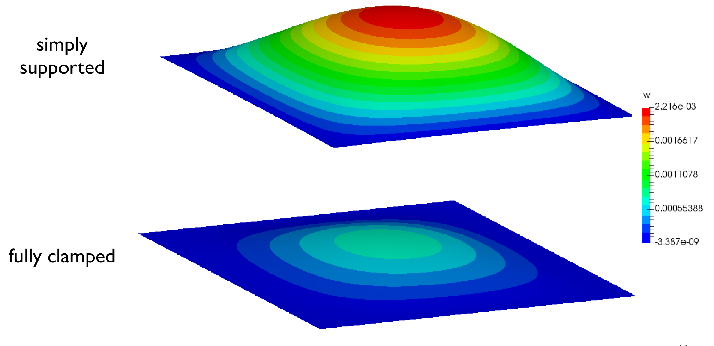
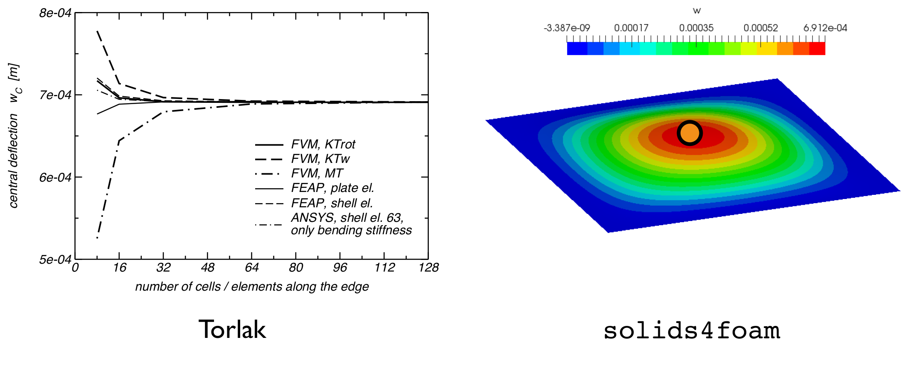
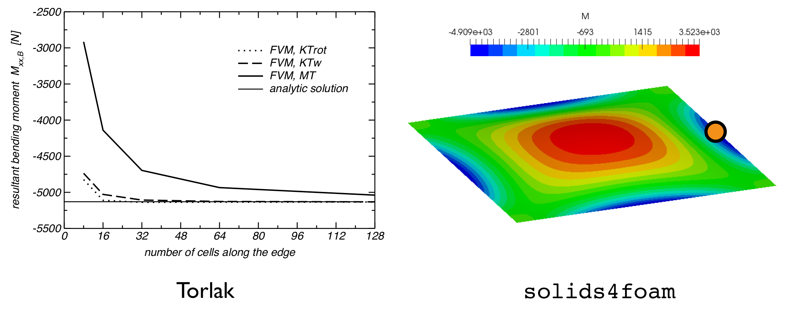
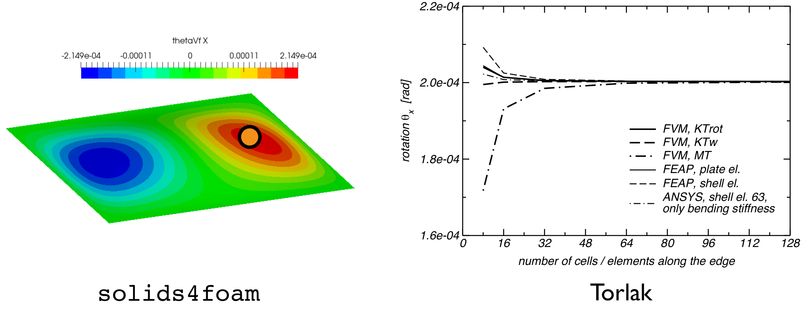

# Square plate with transverse pressure: `squarePlate`

---

Prepared by Philip Cardiff and Ivan Batistić

---

## Tutorial Aims

- Demonstrate the analysis of a simple plate-bending problem using Kirchoff-Love plate model.

---

## Some caveats on plate formulation

Two types of beam/shell theory are widely used:

- **Euler–Bernoulli** beam theory, corresponding to **Kirchhoff–Love** shell theory
  - the planes normal to the midline are assumed to remain plane and normal (no shear stress); this is also called engineering
    beam theory 	

- **Timoshenko beam** theory, corresponding to **Mindlin–Reissner** shell theory
  - the planes normal to the midline are assumed to remain plane, but not necessarily normal (shear stress may be non-zero); this
    is also called shear beam theory.

Kirchhoff–Love shell theory is a subset of Mindlin–Reissner shell theory i.e. Mindlin–Reissner is applicable is every case that Kirchhoff–Love shell theory is applicable, but Kirchhoff–Love theory is not application in every case that Mindlin–Reissner theory is applicable.

|                                   | Kirchhoff | Mindlin | 3-D continuum |
| --------------------------------- | :-------: | :-----: | :-----------: |
| **thin**: $$L/h > 10$$            |     ✓     |    ✓    |       ✓       |
| **moderately thick**: $$L/h > 5$$ |     x     |    ✓    |       ✓       |
| **thick**: $$L/h < 5$$            |     x     |    x    |       ✓       |

**Kirchhoff-Love plate formulation**   

For thin plates $$(L/h > 10)$$, Kirchhoff–Love shell theory allows conservation of momentum is be reformulated into a fourth-order Laplacian equation, where the unknown scalar, $$w$$, is the transverse displacement (displacement normal to the plate):
$$
\rho h \frac{\partial^2 w}{\partial t^2} = -D \nabla^2 \nabla^2 w + p,
$$
where$$\rho$$ is the plate density, $$h$$ is its thickness, $$D$$ is its bending stiffness (a function of $$E$$, $$\nu$$ and $$h$$), and $$p$$ is the applied external pressure (transverse direction).  The fourth-order equation can be re-written as two coupled second-order equations:
$$
\rho h \frac{\partial^2 w}{\partial t^2} =  \nabla^2 M + p, \qquad \text{where M is:}\qquad   M = - D \nabla^2 w.
$$
Above equations are the starting point for finite volume discretization.

---

## Case Overview

The dimensions of the plate are $$L \times L \times h = 10$$ m $$\times~10$$ m $$\times~0.1$$ m (the length-to-thickness ratio is $$L/h = 10$$). The plate is loaded by a uniform external pressure $$p = 1000$$ Pa; see Fig. 1. The plate weight is ignored. The elasticity modulus and the Poisson’s ratio of the material are $$200$$ GPa and $$0.3$$, respectively. The use of symmetry boundaries allows the reduction of the computational domain to a quarter of the plate. However, the symmetry planes are not used here so that the symmetric distribution of solution variables can be verified. Regarding the edges of the plates (colored red in Figure 1), two configurations are considered:

- The plate is clamped at all sides;
- All edges are simply supported;

<div style="text-align: center;">
  
    <figcaption>
     <strong>Figure 1: Problem geometry</strong>
    </figcaption>
</div>

---

## Expected Results

- The deflection in case at which edges are simply supported should be more pronounced, as shown in Fig. 2. 

  <div style="text-align: center;">
    
      <figcaption>
       <strong>Figure 2: Plate deflection in case of simply supported and fully clamped edges
  .</strong>
      </figcaption>
  </div>

  ```note
  By uncommenting the relevant lines in `0/M`, one can easily switch between the configurations of simply supported and fully clamped plate.
  ```

- The results for the case in which the plate has all edges clamped can be verified by comparing results with the ones presented in [1]. A comparison is illustrated in Figures 3, 4, and 5, showcasing deflection, bending moment, and rotation. The results obtained through `solids4foam` match with the results of the FVM implementation documented in [1].

<div style="text-align: center;">
  
    <figcaption>
     <strong>Figure 3: Deflection at the central point of the plate (point C).</strong>
    </figcaption>
</div>


<div style="text-align: center;">
  
    <figcaption>
     <strong>Figure 4: The bending moment at the midpoint of the right edge (point B).</strong>
    </figcaption>
</div>


<div style="text-align: center;">
  
    <figcaption>
     <strong>Figure 5: Rotation at point A (point with the coordinates x=7.5 m, y=5 m).</strong>
    </figcaption>
</div>

---

## Running the Case

The tutorial case is located at `solids4foam/tutorials/solids/beamsPlatesShells/squarePlate`. The case can be run using the included `Allrun` script, i.e. `> ./Allrun`.  In this case, the Allrun consists of creating the mesh using `blockMesh` (`> blockMesh`) after which `makeFaMesh` (`> makeFaMesh`) command is used to create finite area mesh. Finally,  the `solids4foam` solver is used to run the case (`> solids4Foam`). 

---

### References

[1]  M. Torlak, A Finite-Volume Method for Coupled Numerical Analysis of Incompressible Fluid Flow and Linear Deformation of Elastic Structures. PhD thesis, Technischen Universität Hamburg-Harburg, 2006.
