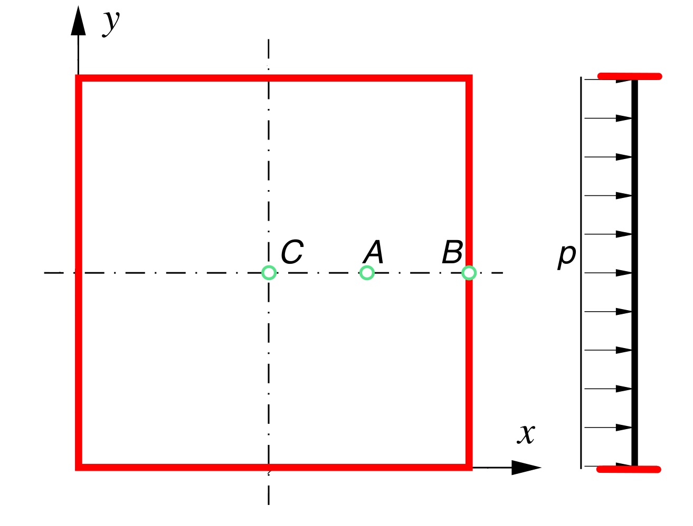

# Square plate with transverse pressure: `squarePlate`

---

Prepared by Philip Cardiff and Ivan Batistić

---

## Tutorial Aims

- Demonstrate analysing a simple plate-bending problem using a finite area
  implementation of a Kirchoff-Love plate model.

## Plate Theory Assumptions

Two types of beam/plate/shell theory are widely used:

- **Euler–Bernoulli** beam theory, corresponding to **Kirchhoff–Love** shell
  theory

  - The planes normal to the midline are assumed to remain plane and normal (no
    shear stress); this is also called engineering beam theory.

- **Timoshenko beam** theory, corresponding to **Mindlin–Reissner** shell theory
  - The planes normal to the midline are assumed to remain plane but not
    necessarily normal (shear stress may be non-zero); this is also called shear
    beam theory.

Kirchhoff–Love shell theory is a subset of Mindlin–Reissner shell theory, i.e.
Mindlin–Reissner is applicable in every case that Kirchhoff–Love shell theory is
applicable, but Kirchhoff–Love theory is not applicable in every case that
Mindlin–Reissner theory is applicable. The following table demonstrates the
valid length $$L$$ to thickness $$h$$ ranges for Kirchhoff and Mindlin
approaches relative to a 3-D continuum approach.

|                                   | Kirchhoff | Mindlin | 3-D continuum |
| --------------------------------- | :-------: | :-----: | :-----------: |
| **Thin**: $$L/h > 10$$            |     ✓     |    ✓    |       ✓       |
| **Moderately thick**: $$L/h > 5$$ |     x     |    ✓    |       ✓       |
| **Thick**: $$L/h < 5$$            |     x     |    x    |       ✓       |

Kirchhoff-Love Plate Formulation

For thin plates $$(L/h > 10)$$, Kirchhoff–Love shell theory allows the
conservation of momentum to be reformulated into a fourth-order partial
differential equation known as the
[biharmonic equation](https://en.wikipedia.org/wiki/Biharmonic_equation), where
the unknown scalar, $$w$$, is the transverse displacement (displacement normal
to the plate):

$$
\rho h \frac{\partial^2 w}{\partial t^2} = -D \nabla^2 \nabla^2 w + p,
$$

The plate density is $$\rho$$ , $$h$$ is its thickness, $$D$$ is its bending
stiffness (a function of the Young's modulus $$E$$, Poisson's ration $$\nu$$ and
$$h$$), and $$p$$ is the applied external pressure (transverse direction). This
fourth-order equation can be re-written as two coupled second-order equations:

$$
\rho h \frac{\partial^2 w}{\partial t^2} =  \nabla^2 M + p, \qquad \text{where
M is:}\qquad   M = - D \nabla^2 w.
$$

These coupled second order equations are the starting point for _finite area_
discretisation employed here, where the finite area method is a form of finite
volume method applied to surfaces in 3-D space.

---

## Case Overview

The dimensions of the plate are $$L \times L \times h = 10$$ m $$\times~10$$ m
$$\times~0.1$$ m (the length-to-thickness ratio is $$L/h = 10$$). The plate is
loaded by a uniform external pressure $$p = 1000$$ Pa (Figure 1). The plate
weight is ignored. The Young's modulus $$E$$ and the Poisson’s ratio $$\nu$$ of
the material are $$200$$ GPa and $$0.3$$, respectively. The use of symmetry
boundaries allows the reduction of the computational domain to a quarter of the
plate. However, the symmetry planes are not used here so that the symmetric
distribution of solution variables can be verified. Regarding the edges of the
plates (colored red in Figure 1), two configurations are considered:

- The plate is _clamped_ at all sides (zero displacement and zero rotation);
- All edges are simply supported (zero displacement and zero moment/torque).



Figure 1: Problem geometry

---

## Expected Results

The deflection in the simply supported case is expected to be larger as the
plate can more freely bend, as shown in Figure 2.


Figure 2: Plate deflection in case of simply supported and fully clamped edges
.

```note
By uncommenting the relevant lines in `0/M`, one can  switch between simply
supported and fully clamped boundary conditions.
```

The results for the fully clamped case can be compared with values from
literature [1]. Figures 3, 4, and 5 compare the predicted deflections, bending
moment, and rotations. The `solids4foam` predictions closley match the reference
results [1].

The `squarePlateAnalyticalSolution` function object in `system/controlDict` is
used to evaluate the analytical thin-plate solution. For the simply supported
case, it writes the analytical displacement field `analyticalD` and the
difference field `DDifference` in the time directories. For the clamped plate,
only the maximum deflection is printed because the analytical field is available
only for the simply supported case.

Analytical solution takes the following form (all edges supported):

$$
w = \frac{4\,p\,a^4}{\pi^5 D}
\sum_{m = 1,3,5,\dots}
\frac{(-1)^{\frac{m-1}{2}}}{m^5} \,
\cos\!\biggl(\frac{m\pi x}{a}\biggr)
\Biggl[
  1
  - \frac{\alpha_m \,\tanh(\alpha_m) \;+\; 2\,
  \cosh\!\bigl(\dfrac{m\pi y}{a}\bigr)}{2\,\cosh(\alpha_m)}
  \;+\;
  \frac{1}{2\,\cosh(\alpha_m)}\,\frac{m \pi y}{a}\,
  \sinh\!\bigl(\dfrac{m\pi y}{a}\bigr)
\Biggr].
$$

where $p$ is the applied pressure, $D$ is the plate bending stiffness, $a$ is
the plate length (in the $x$-direction) and $\alpha_m=\pi m b/(2a)$.

```c++
functions
{
    analyticalSolution
    {
        type    squarePlateAnalyticalSolution;

        a    10;    // Length of the plate (in x direction)
        b    10;    // Width of the plate (in y direction)
        h    0.1;   // Plate thickness
        p    1000;  // Applied transverse pressure
        E    2e11;  // Young's modulus
        nu   0.3;   // Poisson's ratio

        //boundaryConditions allEdgesSupported;
        boundaryConditions allEdgesClamped;
    }
}
```


Figure 3: Deflection at the central point of the plate (point C).


Figure 4: The bending moment at the midpoint of the right edge (point B).


Figure 5: Rotation at point A (point with the coordinates x=7.5 m, y=5 m).

---

## Running the Case

The tutorial case is located at
`solids4foam/tutorials/solids/beamsPlatesShells/squarePlate`. The case can be
run using the included `Allrun` script, i.e. `> ./Allrun`. In this case, the
`Allrun` script compiles the tutorial-local library in the `src` directory,
creates the mesh using `blockMesh` (`> blockMesh`), creates the finite area mesh
using `makeFaMesh` (`> makeFaMesh`), and runs the case with the `solids4foam`
solver (`> solids4Foam`).

---

### References

[1] M. Torlak, A Finite-Volume Method for Coupled Numerical Analysis of
Incompressible Fluid Flow and Linear Deformation of Elastic Structures. PhD
thesis, Technischen Universität Hamburg-Harburg, 2006.

[2] [Timoshenko, S., & Woinowsky-Krieger, S., Theory of plates and shells.
1959.](https://www.cap-recifal.com/ccs_files/articles/cuveaqua1_denisio/Timoshenko_-_Theory_of_plates_and_shells.pdf)
