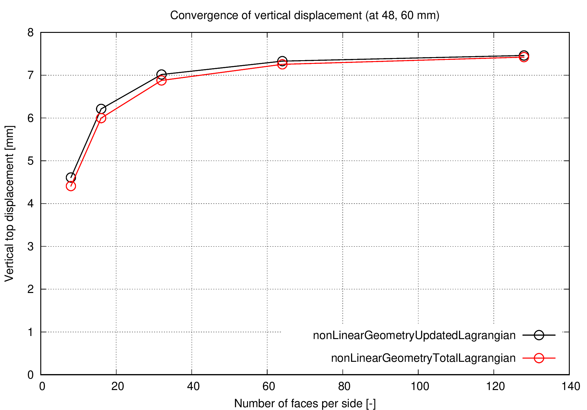
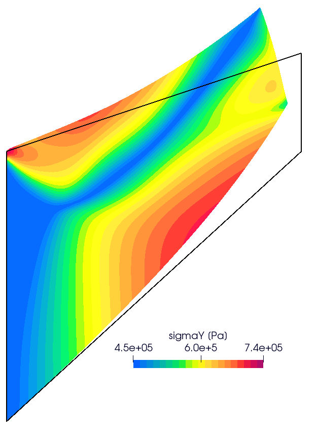

# Elastoplastic Cook's Membrane: `cooksMembrane`

Prepared by Ivan Batistić

---

## Tutorial Aims

- Demonstrate how to perform a solid-only analysis in solids4foam.
- Demonstrate the performance of a solid model in a finite strain elastoplastic regime.

```note
A small-strain elastic version of this tutorial is also available in solids4foam at tutorials/linearElasticity/cooksMembrane
```

## Case Overview

Cook's membrane is a well-known bending-dominated benchmark case used in linear and non-linear analysis. The tapered panel (trapezoid) is fixed on one side and subjected to uniform shear traction on the opposite side. The prescribed shear traction is $$\tau = 0.3125$$ MPa. The vertices of the trapezoid (in mm) are (0, 0), (48, 44), (48, 60),  and (0, 44), as shown in Figure 1. Gravitation effects are neglected, there are no body forces, and the problem is solved as 2D using plane strain assumption. The problem is solved as static, using 30 equally-sized loading increments. 

The material is considered elastoplastic, with the following property values: Young's modulus $$E = 206.9$$ MPa, Poisson's ratio $$\nu=0.29$$, initial yield stress $$\sigma_Y = 0.45$$ MPa and the hardening parameters $$\sigma_{\infty} = 0.715$$ MPa, $$\delta = 16.93$$, $$H = 0.12924$$ MPa. The strain hardening function is the one presented in [[1]]((https://onlinelibrary.wiley.com/doi/10.1002/nme.1620330705)):
$$
\sigma_y = \sigma_Y + (\sigma_{\infty} - \sigma_Y)(1-\text{exp}(-\delta\varepsilon_p)) + H\varepsilon_p.
$$

<div style="text-align: center;">
  
    <figcaption>
     <strong>Figure 1: Problem geometry</strong>
    </figcaption>
</div>

---

## Expected results

* Around the top-left corner, the elastic body is squeezed the most (positive hydrostatic compression).
* The body is most stretched near the bottom side (negative hydrostatic compression).
* There is no known analytical solution for this problem, but results from various codes and procedures are available in the literature [[1](https://onlinelibrary.wiley.com/doi/10.1002/nme.1620330705), [2](http://www.simplassoftware.com/benchmarks.html), [3](https://repositorio-aberto.up.pt/handle/10216/438)].

Figure 2 shows the convergence of the vertical displacement in `solids4Foam (foam-extend-4.1)` in the case of updated Lagrangian (`nonLinGeometryUpdatedLagrangian`) and total Lagrangian  (`nonLinGeometryTotalLagrangian`) formulation. In both formulations, vertical displacement in the top right corner tends to a value of 7.4 mm, which is close to the values reported in [[1](https://onlinelibrary.wiley.com/doi/10.1002/nme.1620330705), [2](http://www.simplassoftware.com/benchmarks.html), [3](https://repositorio-aberto.up.pt/handle/10216/438)]. 

In the `solids4foam` case, the vertical displacement at the top right corner is extracted using the `solidPointDisplacement` function object placed in the `controlDict`:

```
functions
{
    pointDisp
    {
        type    solidPointDisplacement;
        point   (0.048 0.060 0);
    }
}

```

The `solidPointDisplacement` function finds the mesh vertex nearest to the specified `point` and writes the displacement of this vertex to `postProcessing/0/solidPointDisplacement_pointDisp.dat`.

<div style="text-align: center;">
  
    <figcaption>
     <strong>Figure 2: Convergence of the vertical displacement in the top right corner 	</strong>
    </figcaption>
</div>
<div style="text-align: center;">
  
    <figcaption>
        <strong>Figure 3: Contours of &#963<sub>y</sub> stress. The black line denotes the initial undeformed configuration </strong>
    </figcaption>
</div>


---

## Running the Case

The tutorial case is located at `solids4foam/tutorials/solids/elastoplasticity/cooksMembrane`. The case can be run using the included `Allrun` script, i.e. `> ./Allrun`.  In this case, the Allrun consists of creating the mesh using `blockMesh` (`> ./blockMesh`) followed by running the `solids4foam` solver (`> ./solids4Foam`).


---

### References

[1] [Simo, J. C., and F. Armero, “Geometrically Nonlinear Enhanced Strain Mixed Methods and the Method of Incompatible Modes,” International Journal for Numerical Methods in Engineering, vol. 33, pp. 1413–1449, 1992.](https://onlinelibrary.wiley.com/doi/10.1002/nme.1620330705)

[2] [http://www.simplassoftware.com/benchmarks.html](http://www.simplassoftware.com/benchmarks.html)

[4] [J.M.A. César de Sá, P. Areias and R.M. Natal Jorge. “Quadrilateral elements for the solution of elasto-plastic finite strain problems“. *IJNME*, 51:883-917, 2001.](https://repositorio-aberto.up.pt/handle/10216/438)

