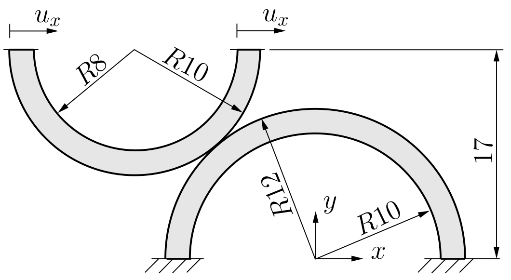
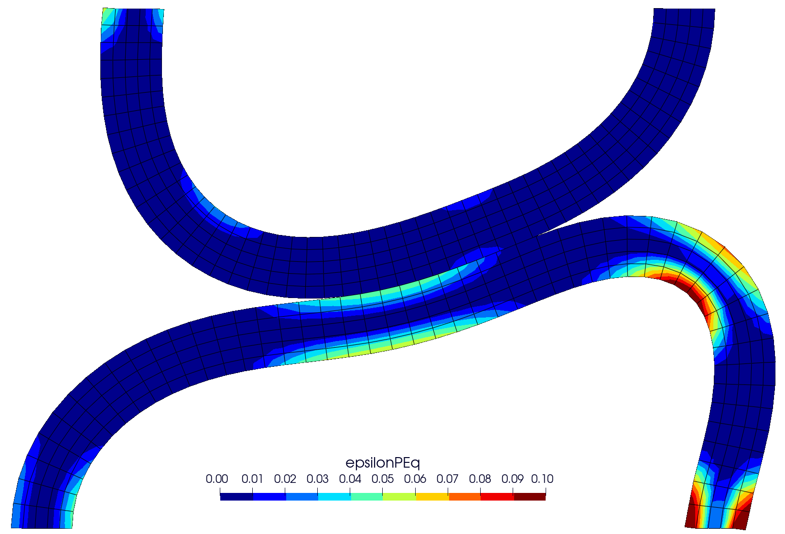
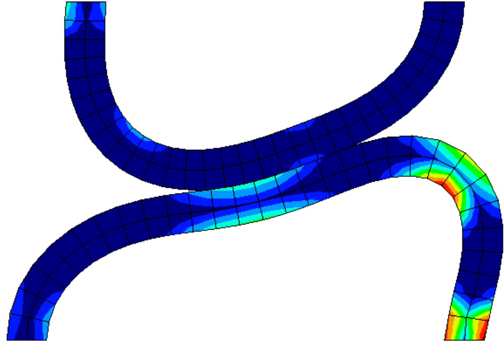
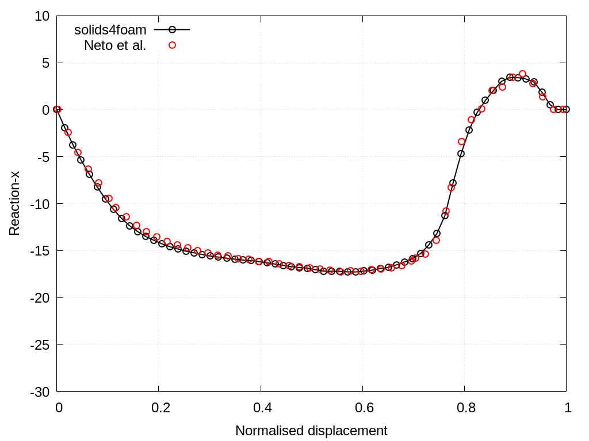
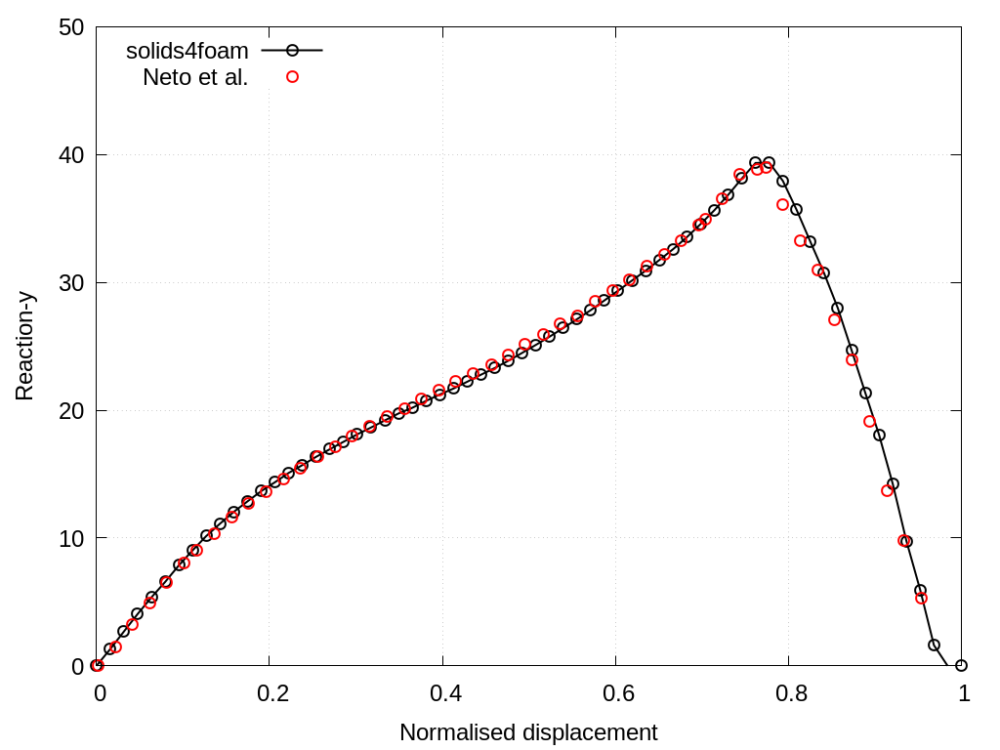

# Contact between curved beams: `curvedBeams`

---

Prepared by Ivan Batistić

---

## Tutorial Aims

- Demonstrate how to perform a solid analysis with large sliding and large deformations contact.

---

## Case overview

This example considers large sliding between two curved beams (see figure below). The lower beam is fixed, whereas the upper beam has a prescribed horizontal displacement of $$u_x = 31.5$$ mm. Both beams are modelled as elastoplastic with isotropic hardening using the following material properties: Young’s modulus $$E = 689.56$$ MPa, Poisson’s ration $$\nu = 0.32$$, initial yield strength $$\sigma_Y = 31$$ MPa and linear hardening coefficient $$H^‘ = 261.2$$ MPa. The problem is solved using $$63$$ equal displacement increments, assuming the plane strain conditions. The frictional responses is considered and coefficients of friction is set to $$\mu = 0.3$$. The beams are  discretised using 50 CVs in the circumferential and 5 CVs in the radial direction. The problem is solved using the plane strain assumption and without body forces.

  
    <figcaption>
     <strong>Figure 1: Problem geometry (dimensions in mm) [1]</strong>
    </figcaption>

---

## Expected results

* During the sliding, due to the larger diameter, the lower beam exhibits larger plastic deformation which is reduced by the larger values of the coefficient of friction (see Figure 2).

Figures 3 and 4 compare the evolution of the horizontal and vertical total reaction force between `solids4foam` and results reported  in the literature  [[2]](https://www.sciencedirect.com/science/article/abs/pii/S0045782515003643).  The resulting evolution of the reaction forces is smooth and matches well with results from the literature. Reported results in `solids4foam` are obtained using updated Lagrangian formulation (`nonLinearGeometryUpdatedLagrangian`) and `foam-extend 4.1`.

  
   
    <figcaption>
     <strong>Figure 2: Contours of equivalent plastic strain at displacement of 15 mm (left), compared with solution from [2] (right) 	</strong>
    </figcaption>

  
    <figcaption>
     <strong>Figure 3: Total reaction force in x-direction 	</strong>
    </figcaption>

   
    <figcaption>
     <strong>Figure 3: Total reaction force in y-direction 	</strong>
    </figcaption>

---

## Running the Case

The tutorial case is located at `solids4foam/tutorials/solids/elastoplasticity/curvedBeams`. The case can be run using the included `Allrun` script, i.e. `> ./Allrun`.  The `Allrun` script first creates the `blockMeshDict` file using the `m4` scripting language from the  `blockMeshDict.m4`  file located in `system` directory. Afterwards, `blockMesh`  (`> blockMesh`) is used to create mesh and `solids4foam`  (`> solids4Foam`) solver to run the case.  Optionally, if `gnuplot` is installed, the evolution of the horizontal and vertical reaction forces is plotted in the `reaction-x.png` and `reaction-y.png` files.

---

### References 

[1] [I. Batistić, P. Cardiff, and Ž. Tuković, “A finite volume penalty based segment-to-segment method for frictional contact problems,” Applied Mathematical Modelling, vol. 101, pp. 673–693, 2022.](https://www.sciencedirect.com/science/article/abs/pii/S0307904X21004248)https://www.sciencedirect.com/science/article/abs/pii/S0045782515003643

[2] [D. Neto, M. Oliveira, L. Menezes, and J. Alves, “A contact smoothing method for arbitrary surface meshes using Nagata patches,” Computer Methods in Applied Mechanics and Engineering, vol. 299, pp. 283 – 315, 2016.](https://www.sciencedirect.com/science/article/abs/pii/S0045782515003643)

