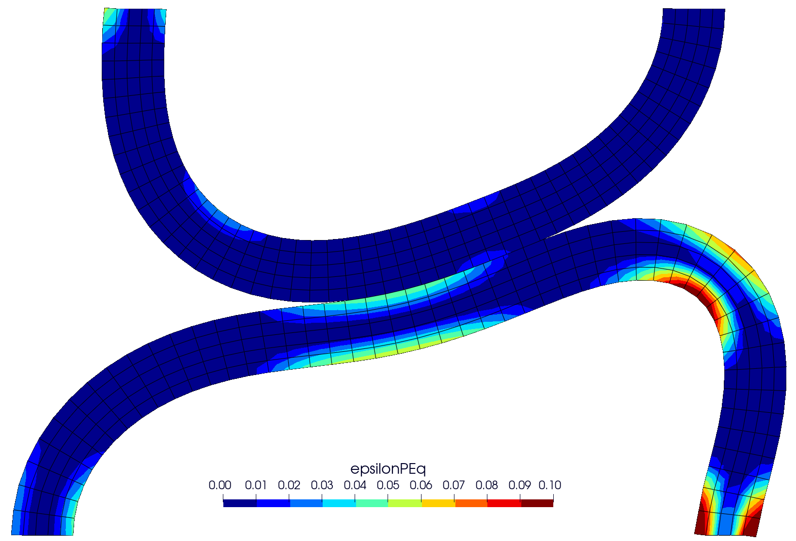
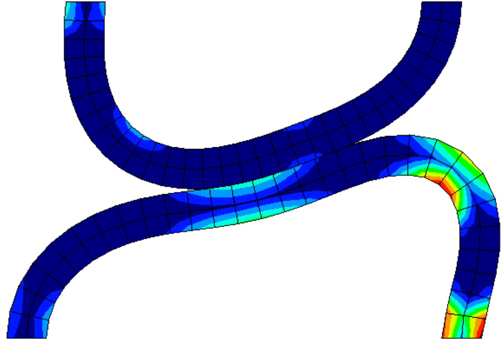

# Contact between curved beams: `curvedBeams`

---

Prepared by Ivan Batistić

---

## Tutorial Aims

- Demonstrate how to perform a solid analysis with large deformations and large
  sliding contact.

---

## Case Overview

This example considers large sliding between two curved beams (Figure 1). The
lower beam is fixed at both ends, whereas the upper beam has a prescribed
horizontal displacement of $$u_x = 31.5$$ mm at both ends. Both beams are
modelled as elastoplastic with isotropic hardening using the following material
properties: Young’s modulus $$E = 689.56$$ MPa, Poisson’s ration $$\nu = 0.32$$,
initial yield strength $$\sigma_Y = 31$$ MPa and linear hardening coefficient
$$H^‘ = 261.2$$ MPa. The problem is solved using $$63$$ equal displacement
increments. The frictional response is considered, and the coefficients of
friction are set to $$\mu = 0.3$$. The beams are discretised using 50 cells in
the circumferential and 5 cells in the radial direction. The problem is solved
using the plane strain assumption, neglecting inertial and body forces.

![Figure 1: Problem geometry (dimensions in mm)
[1]](./images/curvedBeams-geometry.png)

Figure 1: Problem geometry (dimensions in mm) [1]

---

## Expected Results

Due to its larger diameter, the lower beam exhibits greater plastic deformation
during the sliding (Figure 2). Theic deformation is expected to be reduced as
the coefficient of friction increases the amount of plasticity. Video 1 shows
the evolution of the equivalent (von Mises) stress distribution.

Figures 3 and 4 compare the evolution of the horizontal and vertical total
reaction force between `solids4foam` and results reported in the literature
[[2]](https://www.sciencedirect.com/science/article/abs/pii/S0045782515003643).
The resulting evolution of the reaction forces is smooth and matches well with
results from the literature. Reported results in `solids4foam` are obtained
using the updated Lagrangian formulation (`nonLinearGeometryUpdatedLagrangian`)
and `foam-extend-4.1`.

Figure 2 - Contours of equivalent plastic strain (epsilonPEq) at
displacement of 15 mm (left), compared with solution from [2] (right)

Figure 3 - Total reaction force in the x-direction

Figure 3 - Total reaction force in the y-direction



Video 1 - Evolution of the equivalent (von Mises) stress distribution

---

## Running the Case

The tutorial case is located at
`solids4foam/tutorials/solids/elastoplasticity/curvedBeams`. The case can be run
using the included `Allrun` script, i.e. `> ./Allrun`. The `Allrun` script first
creates the `blockMeshDict` file using the `m4` scripting language from the
`blockMeshDict.m4` file located in `system` directory. Afterwards, `blockMesh`
(`> blockMesh`) is used to create the mesh and the `solids4foam` solver is used
to run the case (`> solids4Foam`). Optionally, if `gnuplot` is installed, the
evolution of the horizontal and vertical reaction forces is plotted in the
`reaction-x.png` and `reaction-y.png` files.

---

### References

[1]
[I. Batistić, P. Cardiff, and Ž. Tuković, “A finite volume penalty based
segment-to-segment method for frictional contact problems,” Applied
Mathematical Modelling, vol. 101, pp. 673–693,
2022.](https://www.sciencedirect.com/science/article/abs/pii/S0307904X21004248)

[2]
[D. Neto, M. Oliveira, L. Menezes, and J. Alves, “A contact smoothing method
for arbitrary surface meshes using Nagata patches,” Computer Methods in Applied
Mechanics and Engineering, vol. 299, pp. 283 – 315,
2016.](https://www.sciencedirect.com/science/article/abs/pii/S0045782515003643)
