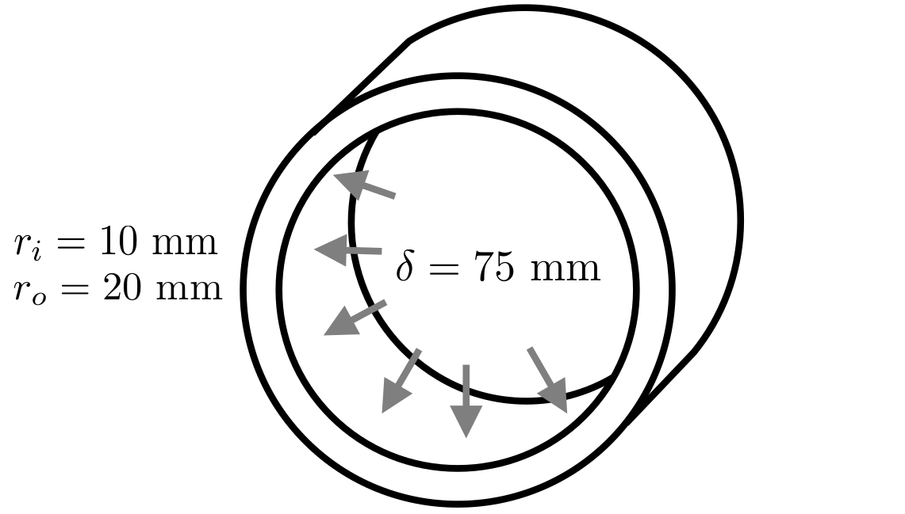
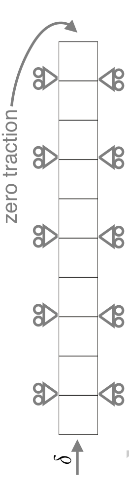
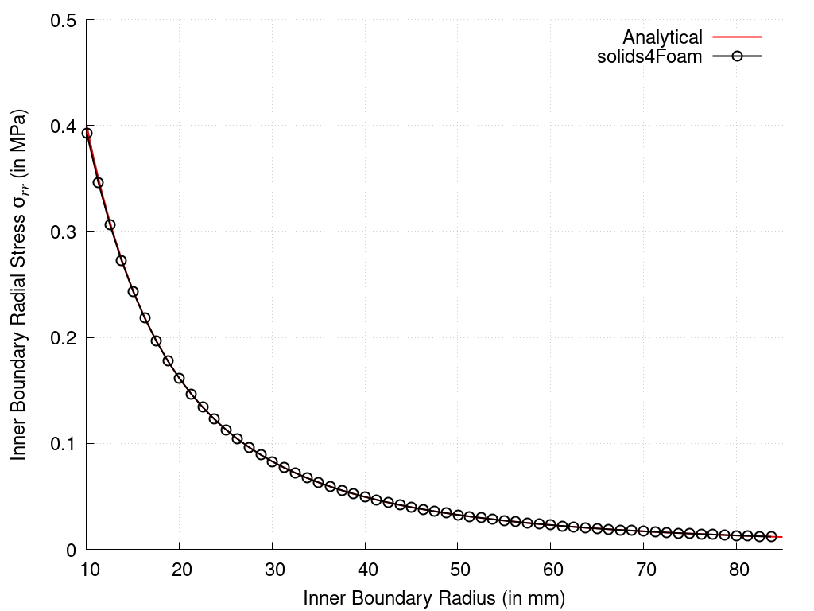

# Expansion of Thick-Walled Cylinder: `cylinderExpansion`

Prepared by Philip Cardiff and Ivan Batistić

---

## Tutorial Aims

- Check solver accuracy for large-strain elastoplasticity using an available analytical solution.

---

## Case Overview

In this case, which has been analysed in Cardiff et al. [1], a thick-walled cylinder with an inner radius $$r_i$$ of $$10$$ mm and an outer radius $$r_o$$ of $$20$$ mm is subjected to internal expansion (Figure 1). The mechanical properties (Table 1) are chosen to approximate rigid plastic behaviour, allowing comparison with an analytical solution. The inner radius is displaced by $$75$$ mm in the radial direction, driving the inner cylinder radius to a final value of $$85$$ mm. A zero traction condition is applied to the outer cylinder boundary. Inertial and body forces are neglected, and the problem is solved using a 1-D axisymmetric mesh consisting of $$10$$ CVs in the radial direction. 

  
  
    <figcaption>
     <strong>Figure 1: Problem geometry, loading and mesh [1]</strong>
    </figcaption>

**Table 1: Mechanical properties**

| Parameter           | Symbol       | Value       |
| ---------           | ------       | -----       |
| Shear modulus       | $$\mu$$      | $$3.8$$ GPa |
| Bulk modulus        | $$\kappa$$   | $$40$$ GPa  |
| Yield stress        | $$\sigma_Y$$ | $$0.5$$ MPa |
| Hardening parameter | -            | $$0$$       |

---

## Expected Results

Assuming rigid plasticity, the radial (Cauchy) stress, $$\sigma_{rr}$$ , at the inner surface is given analytically as [2, 3]:

$$
\sigma_{rr}=\left(\dfrac{\sigma_Y}{\sqrt{3}}\right) \ln \left( \dfrac{\left(\dfrac{r_0}{a_0}\right)^2+\left(\dfrac{a}{a_0}\right)^2-1}{\left(\dfrac{b_0}{a_0}\right)^2 + \left(\dfrac{a}{a_0}\right)^2 -1}  \right)
$$

where $$a_0$$ is the initial inner radius, $$b_0$$ is the initial outer radius, $$r_0$$ is the radius in the initial configuration of the material point at which the stresses are being calculated, and $$a$$ is the current value of the inside radius. The hoop and axial stresses are offset from the radial stress by a constant value; consequently, only the radial stress is examined.

A comparison between numerical and analytical solutions is shown in Figure 2, where one can see the plot of the radial (Cauchy) stress at the inner boundary versus the current inner radius. The plot is automatically generated using `plot.gnuplot` script when running the case using the `Allrun` script.

  
    <figcaption>
     <strong>Figure 2: Inner boundary stress vs. current inner radius</strong>
    </figcaption>

---

## Running the Case

The tutorial case is located at `solids4foam/tutorials/solids/elastoplasticity/cylinderExpansion`. The case can be run using the included `Allrun` script, i.e. `> ./Allrun`.  The `Allrun` script first creates the `blockMeshDict` file using the `m4` scripting language from the `blockMeshDict.m4`  file located in the `system` directory. Afterwards, `blockMesh`  (`> blockMesh`) is used to create the mesh and the `solids4foam` solver is used to run the case (`> solids4Foam`).  Optionally, if `gnuplot` is installed, the evolution of radial stress vs inner radius displacement is plotted in the `plot.pdf` file.

---

### References

[1] [P. Cardiff, Ž. Tuković, P. D. Jaeger, M. Clancy, and A. Ivanković, “A Lagrangian cell-centred finite volume method for metal forming simulation,” International Journal for Numerical Methods in Engineering, vol. 109, no. 13, pp. 1777–1803, 2017.](https://onlinelibrary.wiley.com/doi/abs/10.1002/nme.5345)

[2] W. Prager and P. G. Hodge. Theory of Perfectly Plastic Solids. John Wiley and Sons, 1951.

[3] Dassault Systémes Simulia Corp. Abaqus 6.11 documentation. http://www.simulia.com/products/abaqus_fea.html, 2012.
