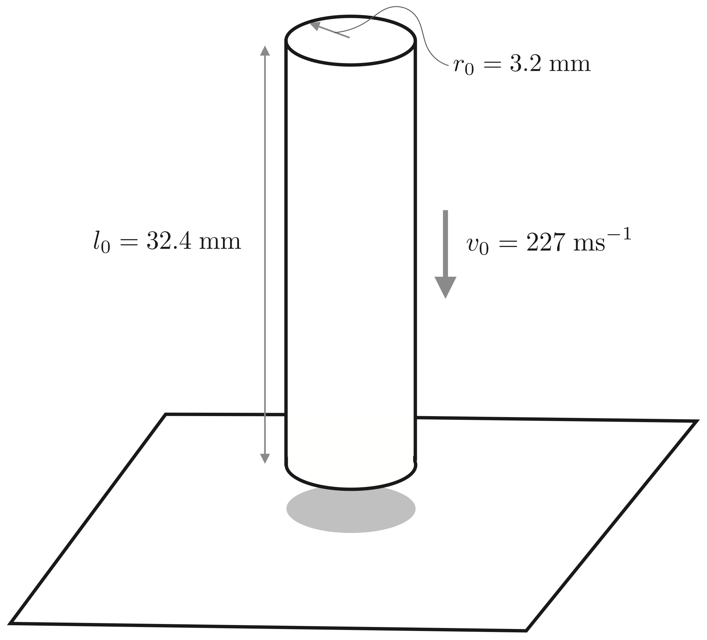
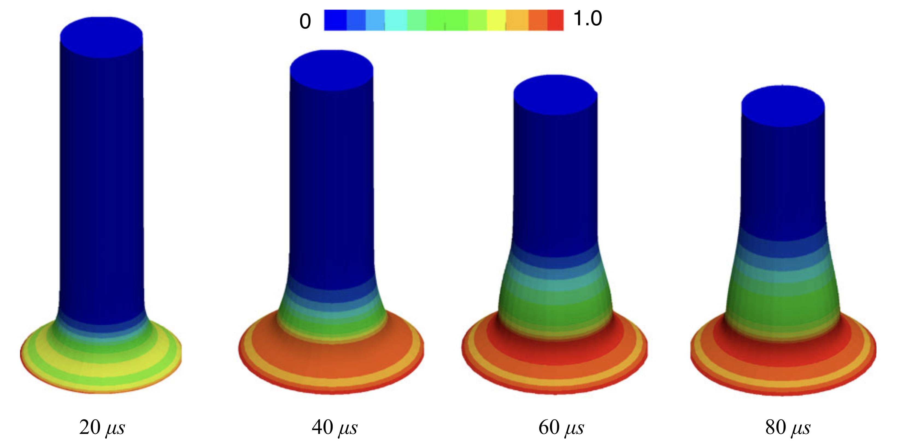

# Impact of cylinder against a rigid wall: `impactBar`

Prepared by Philip Cardiff and Ivan Batistić

---

## Tutorial Aims

- Demonstrate how to perform a dynamic impact analysis with large deformations
  and large sliding contact.

---

## Case Overview

In this case, which has been analysed by Cardiff et al. [1], a cylindrical
copper bar impacts a rigid wall. The bar has an initial radius of
$$r_0 = 3.2$$ mm, an initial length of $$l_0 = 32.4$$ mm, and an initial
velocity of $$v_0 = 227$$ m/s. A schematic of the problem geometry is
shown in Figure 1. The problem is modelled as axisymmetric.

Figure 1 - Problem geometry [1]

The mechanical properties are given in Table 1. Transient effects are included.
A frictionless contact is considered between the rigid ground and
the lower boundary of the cylinder. The model is solved in 1000 equally spaced
time increments.

Table 1 - Mechanical properties

| Parameter            | Symbol       | Value           |
| -------------------- | ------------ | --------------- |
| Young’s modulus      | $$E$$        | $$117$$ GPa     |
| Poisson's ratio      | $$\nu$$      | $$0.35$$        |
| Initial yield stress | $$\sigma_Y$$ | $$400$$ MPa     |
| Initial density      | $\rho$       | $8930$ kg/m$^3$ |
| Hardening modulus    | $\kappa$     | $100$ MPa       |

---

## Expected Results

The predicted deformed geometry is shown for four separate times in Figure 2. A
comparison with the numerical results predicted by Aguirre et al. [2] is
available in [1]. Table 2 compares the final end radius of the bar at
$$80$$ $$\mu$$s, for the finer mesh consisting of 5760 cells, with numerical
results from other methodologies [2, 3]. Good agreement is found.

Figure 2 - Predicted deformed geometry [1]

Table 2 - Predicted end radius at $$80$$ $$\mu$$s.

| Method                               | Predicted radius (in mm) |
| ------------------------------------ | ------------------------ |
| [2] FE method - tetrahedra           | $$5.55$$                 |
| [2] FE method - hexahedra            | $$6.95$$                 |
| [2] FE method average nodal pressure | $$6.99$$                 |
| [1] FV method                        | $$6.98$$                 |
| solids4Foam                          | $7.14$                   |



Video 1 - Mesh deformation during impact, coloured by velocity

## Running the Case

The tutorial case is located at
`solids4foam/tutorials/solids/elastoplasticity/impactBar`. The case can
be run using the included `Allrun` script, i.e. `> ./Allrun`.

The `Allrun` script first creates the `blockMeshDict` file from
`system/blockMeshDict.cylinder.m4` using the `m4` scripting language. The
`blockMesh` utility is then used to create the mesh. For foam-extend, the axis
edges are manually removed using `collapseEdges`. The `setFields` utility
initialises the old displacement and displacement-increment fields required by
the time scheme at the beginning of the simulation. Finally, the case is run
using the `solids4Foam` solver.

---

### References

[1]
[P. Cardiff, Ž. Tuković, P. D. Jaeger, M. Clancy, and A. Ivanković, “A
Lagrangian cell-centred finite volume method for metal forming simulation,”
International Journal for Numerical Methods in Engineering, vol. 109, no. 13,
pp. 1777–1803, 2017.](https://onlinelibrary.wiley.com/doi/abs/10.1002/nme.5345)

[2]
[M. Aguirre, A. J. Gil, J. Bonet, and A. A. Carreño, "A vertex centred finite
volume Jameson-Schmidt-Turkel (JST) algorithm for a mixed conservation
formulation in solid dynamics," Journal of Computational Physics, vol. 259,
pp. 672–699, 2014.](https://doi.org/10.1016/j.jcp.2013.12.012)

[3]
[J. Bonet and A. J. Burton, "A simple average nodal pressure tetrahedral element
for incompressible and nearly incompressible dynamic explicit applications,"
Communications in Numerical Methods in Engineering, vol. 14, no. 5,
pp. 437–449, 1998.](https://doi.org/10.1002/(SICI)1099-0887(199805)14:5%3C437::AID-CNM162%3E3.0.CO;2-W)
