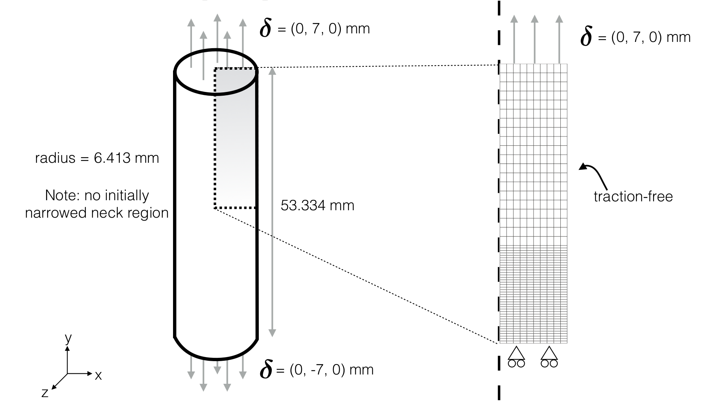
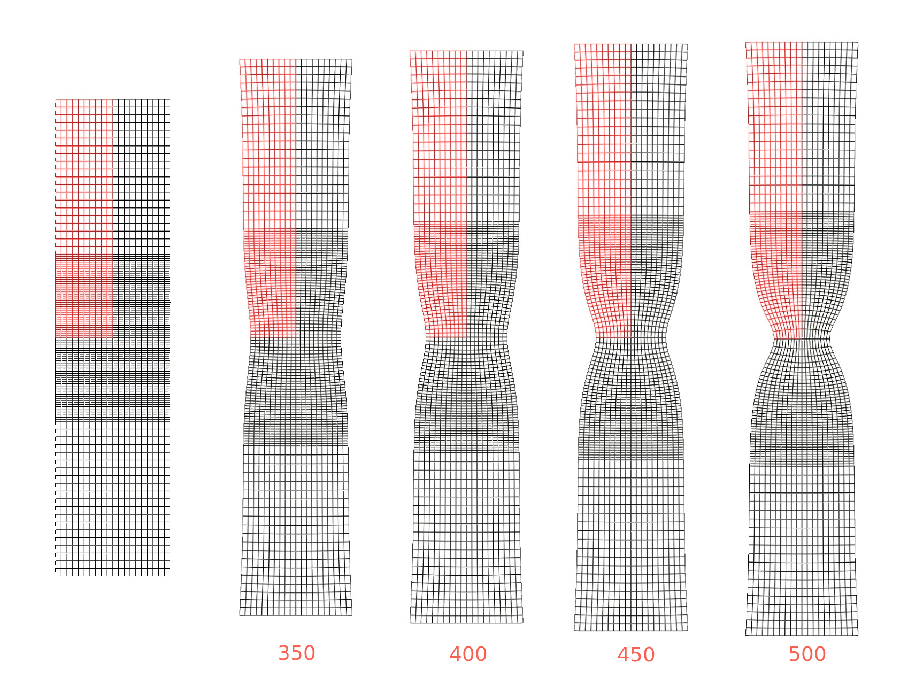
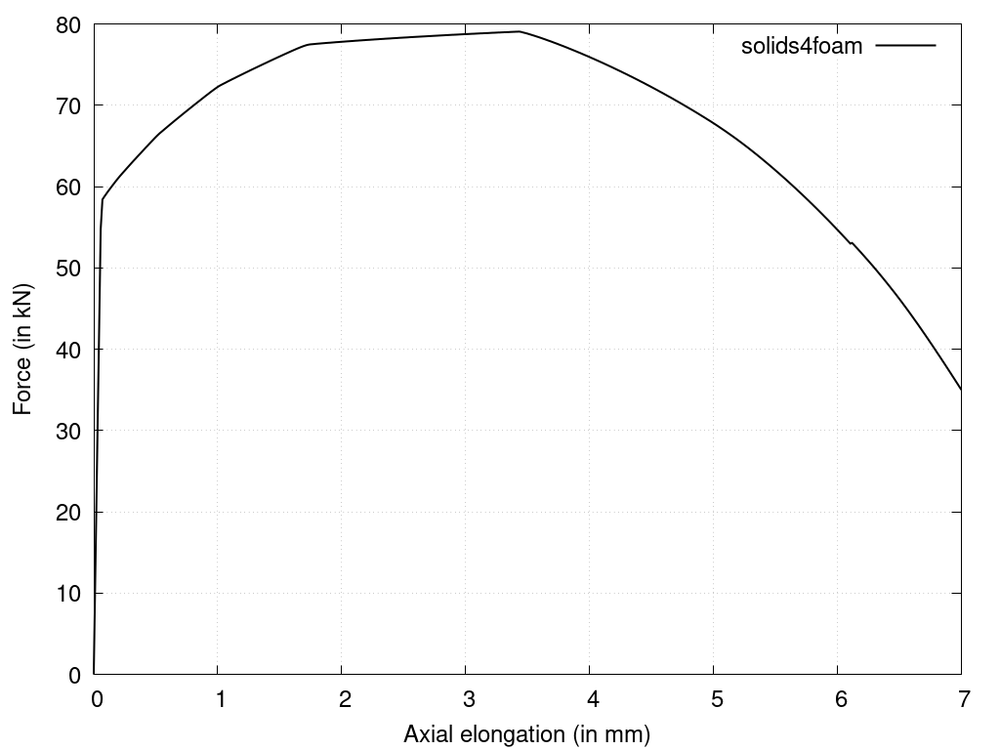

# Necking of a Cylindrical Bar: `neckingBar`

Prepared by Philip Cardiff and Ivan Batistić

---

## Tutorial Aims

- Check the solver's ability to capture large localised deformations in large-strain elastoplasticity analyses.

---

## Case Overview

This case considers the necking of a cylinder bar subjected to uniaxial tension, as examined in Cardiff et al. [1]. The problem geometry is shown in Figure 1 and is represented as axisymmetric. The initial cylindrical bar radius $$r_0$$ is $$6.413$$ mm and the initial length $$l_0$$ is $$53.334$$ mm, where there is no initially narrowed neck region. The mechanical properties of the bar are given in Table 1, and the hardening behaviour in Table 2.

  
    <figcaption>
     <strong>Figure 1: Problem geometry and mesh [1]</strong>
    </figcaption>

The two end surfaces of the bar are slowly displaced through a distance of $$7$$ mm in opposite directions, where no tangential contraction of the ends is allowed, i.e., the tangential displacement is zero. Due to symmetry, one-half of the bar is simulated, and symmetry plane conditions are employed. The mesh consists of $$600$$ quadrilateral cells; refinement is made near the expected neck, similar to the setup of Simo and Hughes [2]. Gravity and transient effects are neglected. The case is solved using $$500$$ equal loading increments.

**Table 1: Mechanical properties**

| Parameter           | Symbol       | Value       |
|         ---          |      ---       |          ---          |
|   Young’s modulus    |     $$E$$      |      $$200$$ GPa      |
|   Poisson's ratio    |    $$\nu$$     |        $$0.3$$        |
| Initial yield stress |  $$\sigma_Y$$  |      $$451$$ MPa      |

**Table 2: Hardening behaviour**
| Plastic strain | Yield Stress (in MPa) |
| ------------ | ------------------- |
|   $$0.000$$    |        $$451$$        |
|   $$0.006$$    |        $$476$$        |
|   $$0.019$$    |        $$525$$        |
|   $$0.038$$    |        $$583$$        |
|   $$0.066$$    |        $$642$$        |
|   $$0.147$$    |        $$710$$        |
|   $$0.500$$    |        $$777$$        |
|   $$1.000$$    |        $$831$$        |

---

## Expected Results

As the elongation is increased, the decrease in radius becomes strongly non-uniform, resulting in so-called "necking". Necking begins at the maximum load, where the increase in stress due to the decrease in the cross-sectional area of the specimen
becomes greater than the increase in the load-carrying ability of the metal due to strain hardening [3]. The development of the necking is shown in Figure 2.

  
    <figcaption>
     <strong>Figure 2: The initial mesh and the deformed mesh at a load step of 350, 400, 450 and 500 (the computational mesh is coloured red and is mirrored in black)</strong>
    </figcaption>

Once the ultimate strength is surpassed and necking begins, the material's ability to carry load diminishes rapidly. From Figure 3, one can see that for the current case, this starts to happen after elongation reaches ~3.5 mm (250 loading step). 

  
    <figcaption>
     <strong>Figure 3: Force-elongation curve</strong>
    </figcaption>

---

## Running the Case

The tutorial case is located at `solids4foam/tutorials/solids/elastoplasticity/neckingBar`. The case can be run using the included `Allrun` script, i.e. `> ./Allrun`.  The `Allrun` script first creates the `blockMeshDict` file using the `m4` scripting language from the `blockMeshDict.m4`  file located in the `system` directory. Afterwards, `blockMesh`  (`> blockMesh`) is used to create the mesh and the `solids4foam` solver is used to run the case (`> solids4Foam`).  Optionally, if `gnuplot` is installed, the evolution of the force vs elongation is plotted in the `forceElongation.png` file.

---

### References

[1] [P. Cardiff, Ž. Tuković, P. D. Jaeger, M. Clancy, and A. Ivanković, “A Lagrangian cell-centred finite volume method for metal forming simulation,” International Journal for Numerical Methods in Engineering, vol. 109, no. 13, pp. 1777–1803, 2017.](https://onlinelibrary.wiley.com/doi/abs/10.1002/nme.5345)

[2] [J. C. Simo and T. J. R. Hughes. Computational Inelasticity, volume 7. Springer-Verlag, New York, 1998.](https://link.springer.com/book/10.1007/b98904)

[3] G. E. Dieter and D. Bacon. Mechanical Metallurgy, SI Metric Edition, McGraw-Hill, 1989.
