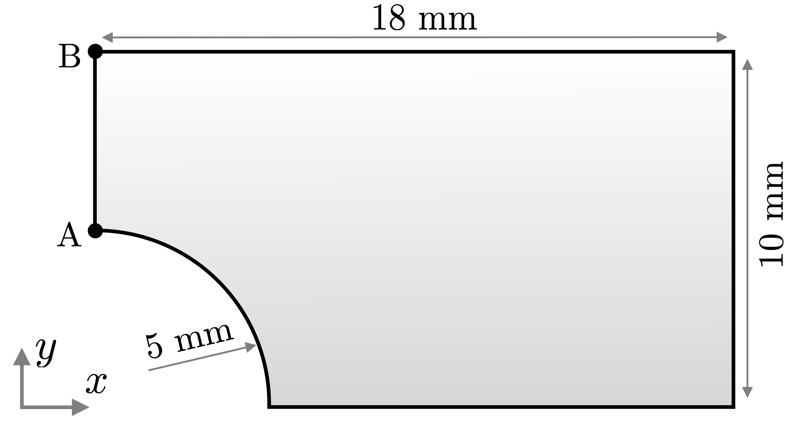
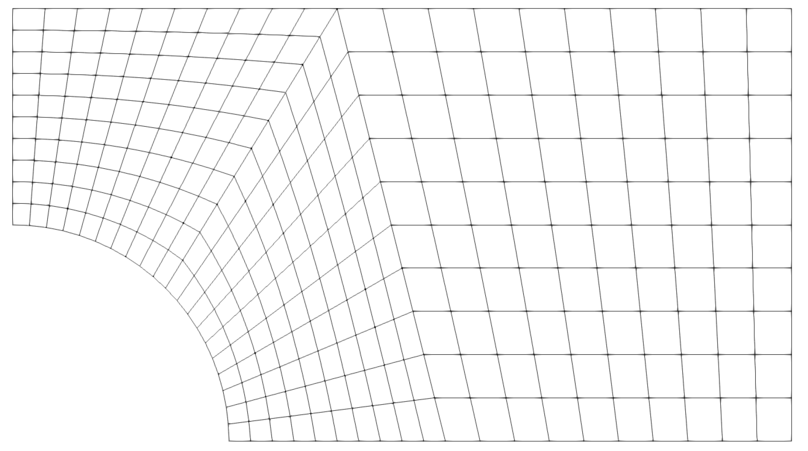

# Perforated Plate: `perforatedPlate`

Prepared by Philip Cardiff and Ivan Batistić

---

## Tutorial Aims

- Demonstrate a small-strain elastoplastic analysis of a perforated plate.

---

## Case Overview

This case considers a 2-D plate with a circular hole subjected to a
time-varying uniaxial traction. The full plate has dimensions of
$$36 \times 20$$ mm and contains a central circular hole with a diameter of
$$10$$ mm. Owing to the two symmetry planes, only one quarter of the plate is
modelled, as shown in Figure 1. The problem is represented as a plane-strain
case.

Figure 1 - Perforated plate geometry [1]

The traction is applied on the right boundary in the $$x$$ direction. It
increases linearly from zero to $$133.65$$ MPa during the first $$10$$ s and
then unloads linearly to zero by $$20$$ s. The hole and upper boundaries are
traction free, while symmetry conditions are applied on the left and lower
boundaries. Gravitational and inertial effects are neglected, and the case is
solved using time steps of $$0.1$$ s.

The default mesh, shown in Figure 2, consists of 300 cells. The total
displacement solid model is selected in `constant/solidProperties` using
`linearGeometryTotalDisplacement`.

Figure 2 - Computational mesh

The aluminium plate is modelled using the `linearElasticMisesPlastic`
mechanical law with isotropic hardening. The mechanical properties are given in
Table 1, and the tabulated hardening curve is specified in
`constant/plasticStrainVsYieldStress`.

Table 1 - Mechanical properties

| Parameter       | Symbol       | Value               |
| --------------- | ------------ | ------------------- |
| Young's modulus | $$E$$        | $$70$$ GPa          |
| Poisson's ratio | $$\nu$$      | $$0.3$$             |
| Yield stress    | $$\sigma_Y$$ | $$243$$ MPa         |
| Density         | $$\rho$$     | $$3500$$ kg/m$$^3$$ |

---

## Expected Results

Figure 3 compares the predicted $$y$$-displacement at point A on the upper rim
of the hole with Abaqus finite-element results. The mesh-refinement study
 shows that the finite-volume predictions become mesh independent and 
agree well with the finite-element reference solution [1].

Figure 3 also shows the residual $$\sigma_{xx}$$ stress component along the
path A-B after unloading at $$t = 20$$ s. Material near the hole yields during
loading and returns to a compressive residual stress state after unloading.
Additional comparisons are available in Cardiff et al. [1] and in the
[2] where vertex-centred discretisation is employed.

Figure 3 - Displacement and residual stress predictions [1]

The `solidForcesDisplacements` function object records the force and
displacement on the `right` patch. The `solidPointDisplacement` function object
records the displacement at point A, located at `(0 0.005 0)`.

---

## Running the Case

The tutorial case is located at
`solids4foam/tutorials/solids/elastoplasticity/perforatedPlate`. The case can
be run using the included `Allrun` script, i.e. `> ./Allrun`.

The `Allrun` script first creates the mesh using `blockMesh`
and runs the `solids4Foam` solver.

---

### References

[1]
[P. Cardiff, A. Karac, P. D. Jaeger, H. Jasak, J. Nagy, A. Ivanković, and
Ž. Tuković, "An open-source finite volume toolbox for solid mechanics and
fluid-solid interaction simulations," arXiv,
2018.](https://doi.org/10.48550/arXiv.1808.10736)

[2]
[F. Mazzanti and P. Cardiff, "Performance of a vertex-centred block-coupled
finite volume methodology for small-strain static elastoplasticity," *Computers
& Mathematics with Applications*, vol. 195, pp. 212-238,
2025.](https://doi.org/10.1016/j.camwa.2025.07.020)
