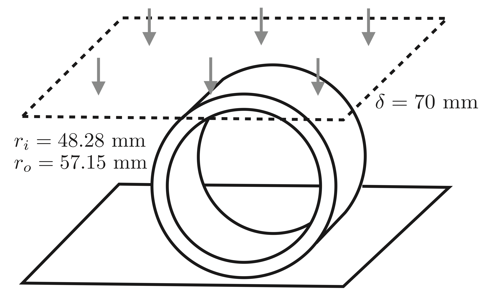
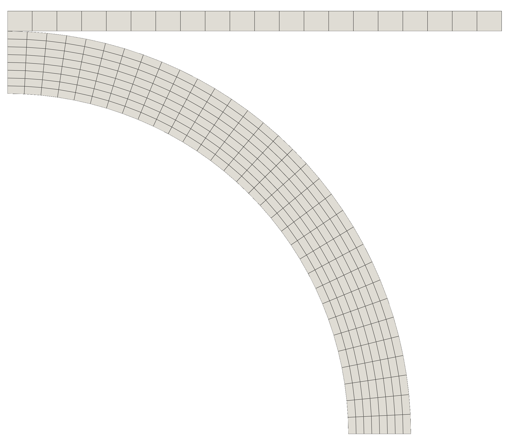
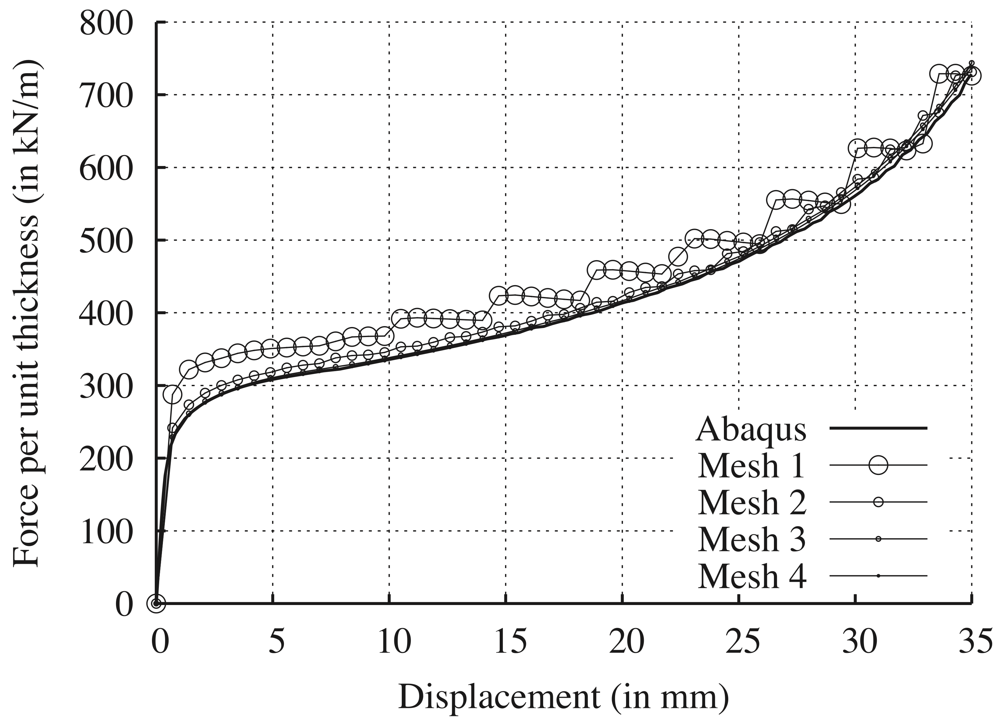

# Crushing of a Pipe: `pipeCrush`

Prepared by Philip Cardiff and Ivan Batistić

---

## Tutorial Aims

- Demonstrate a large-strain elastoplastic analysis with frictionless solid
  contact.
- Compare the predicted crushing force and deformation pattern with FE results.

---

## Case Overview

This case considers a thick-walled pipe compressed between two parallel rigid
frictionless platens, as shown in Figure 1. The pipe is represented as a
plane-strain 2-D problem. The inner radius $$r_i$$ is $$48.28$$ mm, and the
outer radius $$r_o$$ is $$57.15$$ mm.

The full pipe is crushed by $$70$$ mm, reducing the pipe diameter in the
loading direction from $$114.3$$ mm to $$44.3$$ mm. Because of symmetry, only
one quarter of the pipe cross-section is modelled, and the rigid platen in this
quarter model is displaced by $$35$$ mm. The loading is applied over 100
quasi-static increments. Transient and gravitational effects are neglected.

Frictionless penalty contact is applied between the rigid platen and the outer
pipe boundary using the `solidContact` boundary condition. The updated
Lagrangian solid model is selected in `constant/solidProperties` using
`nonLinearGeometryUpdatedLagrangian`.

Figure 1 - Pipe-crushing geometry [1]

Figure 2 - Initial mesh

The pipe is modelled using the `neoHookeanElasticMisesPlastic` mechanical law.
The mechanical properties are given in Table 1, and the tabulated hardening
curve is given in Table 2.

Table 1 - Mechanical properties

| Parameter            | Symbol       | Value               |
| -------------------- | ------------ | ------------------- |
| Young's modulus      | $$E$$        | $$186$$ GPa         |
| Poisson's ratio      | $$\nu$$      | $$0.3$$             |
| Initial yield stress | $$\sigma_Y$$ | $$241.32$$ MPa      |
| Initial density      | $$\rho$$     | $$7800$$ kg/m$$^3$$ |

Table 2 - Hardening behaviour

| Plastic strain | Yield stress (in MPa) |
| -------------- | --------------------- |
| $$0.000$$      | $$241.32$$            |
| $$0.0035$$     | $$275.79$$            |
| $$0.0083$$     | $$301.65$$            |
| $$0.0133$$     | $$318.88$$            |
| $$0.0182$$     | $$344.74$$            |
| $$0.0281$$     | $$361.98$$            |
| $$0.0380$$     | $$379.21$$            |
| $$1.000$$      | $$1482.37$$           |

---

## Expected Results

Figure 3 shows the predicted force-displacement response for different mesh
densities reported by Cardiff et al. [1], including a comparison with an Abaqus
finite-element solution on a 4096-cell mesh. The solids4foam predictions
approach the Abaqus fine-mesh result as the mesh is refined. Oscillations in
the force trace are reduced on finer meshes and are attributed to the contact
force calculation on faces in partial contact.

Figure 3 - Force-displacement response for different mesh densities [1]

Figure 4 shows the deformed pipe geometry at four stages of compression. The
hydrostatic pressure distribution is also compared with the Abaqus prediction. 
More information is available in Cardiff et al. [1].

Figure 4 - Deformed geometry and hydrostatic pressure distribution [1]

The `solidForcesDisplacements` function object is added in
`system/controlDict`. It records the contact force and displacement for the
`pipeContact` patch, which can be used to plot the force-displacement response
shown in Figure 3.

---

## Running the Case

The tutorial case is located at
`solids4foam/tutorials/solids/elastoplasticity/pipeCrush`. The case can be run
using the included `Allrun` script, i.e. `> ./Allrun`.

The `Allrun` script first adjusts the gradient scheme for the selected
OpenFOAM variant when required. It then creates the mesh using `blockMesh` and
runs the `solids4Foam` solver.

---

### References

[1]
[P. Cardiff, Ž. Tuković, P. D. Jaeger, M. Clancy, and A. Ivanković, "A
Lagrangian cell-centred finite volume method for metal forming simulation,"
International Journal for Numerical Methods in Engineering, vol. 109, no. 13,
pp. 1777-1803, 2017.](https://onlinelibrary.wiley.com/doi/abs/10.1002/nme.5345)
