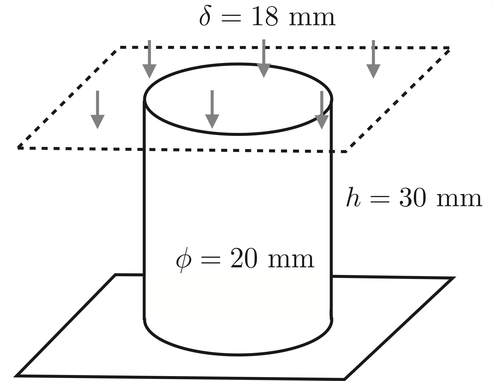
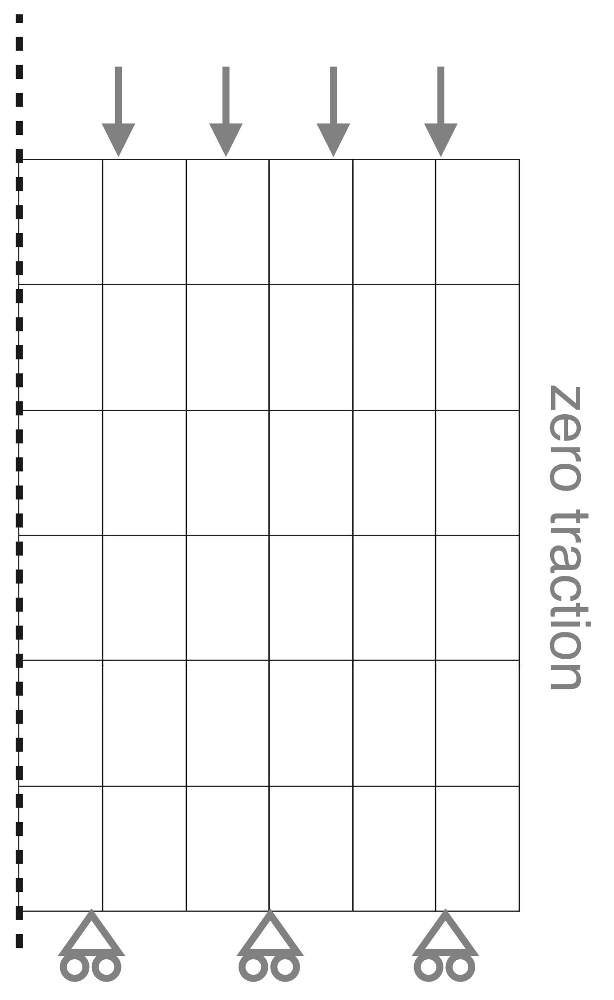
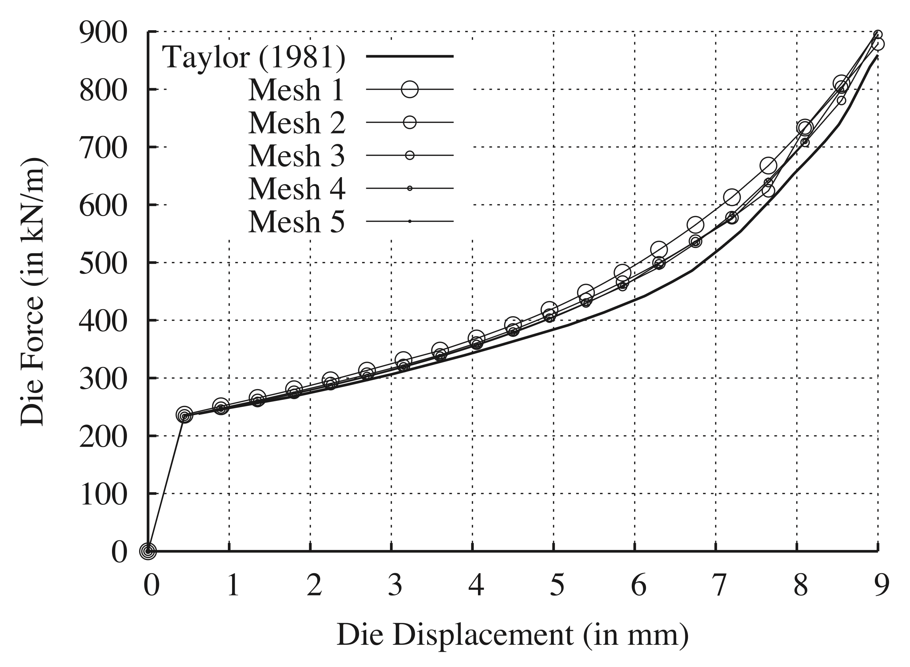

# Upsetting a Billet: `upsetBillet`

Prepared by Philip Cardiff and Ivan Batistić

---

## Tutorial Aims

- Demonstrate a large-strain elastoplastic analysis with rough solid contact in
  an axisymmetric model.
- Compare the predicted force-displacement response and deformation pattern
  with finite-element results.

---

## Case Overview

This case considers the upsetting of a cylindrical billet between two parallel
rough dies. The benchmark has been used to assess numerical methods for metal
forming simulations [1, 2, 3].

The billet has an initial diameter of $$20$$ mm and an initial height of
$$30$$ mm. It is upset by $$60\%$$, corresponding to a total die displacement
of $$18$$ mm. Because of symmetry, only the upper half of the billet is
modelled, so the rigid die in this half model is displaced by $$9$$ mm. The
problem geometry and loading are shown in Figure 1.

Gravitational and transient effects are neglected. The loading is applied over
2000 quasi-static time increments. Rough contact between the die and billet is
modelled using the `solidContact` boundary condition with a Coulomb friction
coefficient of $$0.5$$. Taylor [1] showed that this high friction coefficient
approximates the rough surface condition.

The case is represented as a 2-D axisymmetric model, see Figure 2. The default 
tutorial mesh consists of 168 cells. The updated Lagrangian solid model is
selected in `constant/solidProperties` using
`nonLinearGeometryUpdatedLagrangian`.

Figure 1 - Problem geometry [4]

Figure 2 - Axisymmetric mesh [4]

The billet is modelled using the `neoHookeanElasticMisesPlastic` mechanical
law. The mechanical properties are given in Table 1. The tabulated hardening
curve in `constant/plasticStrainVsYieldStress` corresponds to a hardening
modulus of $$300$$ MPa.

Table 1 - Mechanical properties

| Parameter            | Symbol       | Value                 |
| -------------------- | ------------ | --------------------- |
| Young's modulus      | $$E$$        | $$200$$ GPa           |
| Poisson's ratio      | $$\nu$$      | $$0.3$$               |
| Initial yield stress | $$\sigma_Y$$ | $$700$$ MPa           |
| Initial density      | $$\rho$$     | $$7833$$ kg/m$$^3$$   |
| Hardening modulus    | $$\kappa$$   | $$300$$ MPa           |

---

## Expected Results

Figure 3 shows the predicted force-displacement response for different mesh
densities reported by Cardiff et al. [4]. The Lagrangian finite-element result
from Taylor [1] is included for comparison. The finite-volume predictions
quickly approach a mesh-independent solution and are close to the
finite-element result.

Figure 3 - Force-displacement response for different mesh densities [4]

The predicted deformed shape of the billet, equivalent plastic strain
distribution, and comparison with Abaqus finite-element results are available
in Cardiff et al. [4].

The `solidForces` function object is added in `system/controlDict`. It records
the reaction force on the `symmPlane` patch, which can be used to plot the
force-displacement response shown in Figure 3.



Video 1 - Upsetting a billet animation

---

## Running the Case

The tutorial case is located at
`solids4foam/tutorials/solids/elastoplasticity/upsetBillet`. The case can be
run using the included `Allrun` script, i.e. `> ./Allrun`.

The `Allrun` script first checks the case format using
`solids4Foam::convertCaseFormat`. It then creates the `blockMeshDict` file
from `system/blockMeshDict.cylinder.m4` using the `m4` scripting language and
runs `blockMesh` to create the mesh. For foam-extend, the axis edges are
manually removed using `collapseEdges`. Finally, the case is run using the
`solids4Foam` solver.

This case is currently skipped by `Allrun` when using OpenFOAM.org.

---

### References

[1]
L. M. Taylor, "A finite element analysis for large deformation metal forming
problems involving contact and friction," The Institute for Computational
Engineering and Sciences, The University of Texas at Austin, ICES Report
81-15, 1981.

[2]
[Dassault Systémes Simulia Corp. "Abaqus 6.11 documentation", 2012. Accessed
August 2015.](http://www.simulia.com/products/abaqus_fea.html)

[3]
[H. Lippmann, "Metal Forming Plasticity: Symposium Tutzing/Germany August 28 -
September 3, 1978". Springer-Verlag: Berlin Heidelberg,
1979.](http://www.springer.com/us/book/9783642813573)

[4]
[P. Cardiff, Ž. Tuković, P. D. Jaeger, M. Clancy, and A. Ivanković, "A
Lagrangian cell-centred finite volume method for metal forming simulation,"
International Journal for Numerical Methods in Engineering, vol. 109, no. 13,
pp. 1777-1803, 2017.](https://onlinelibrary.wiley.com/doi/abs/10.1002/nme.5345)
