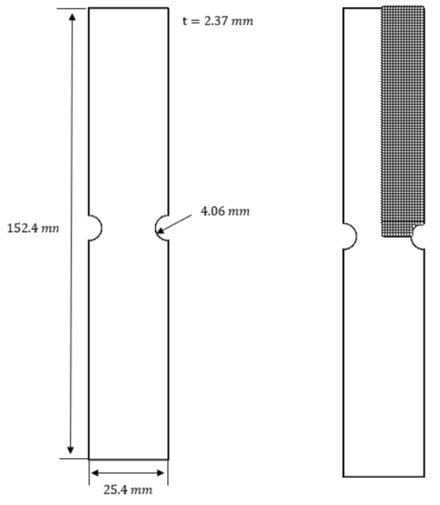
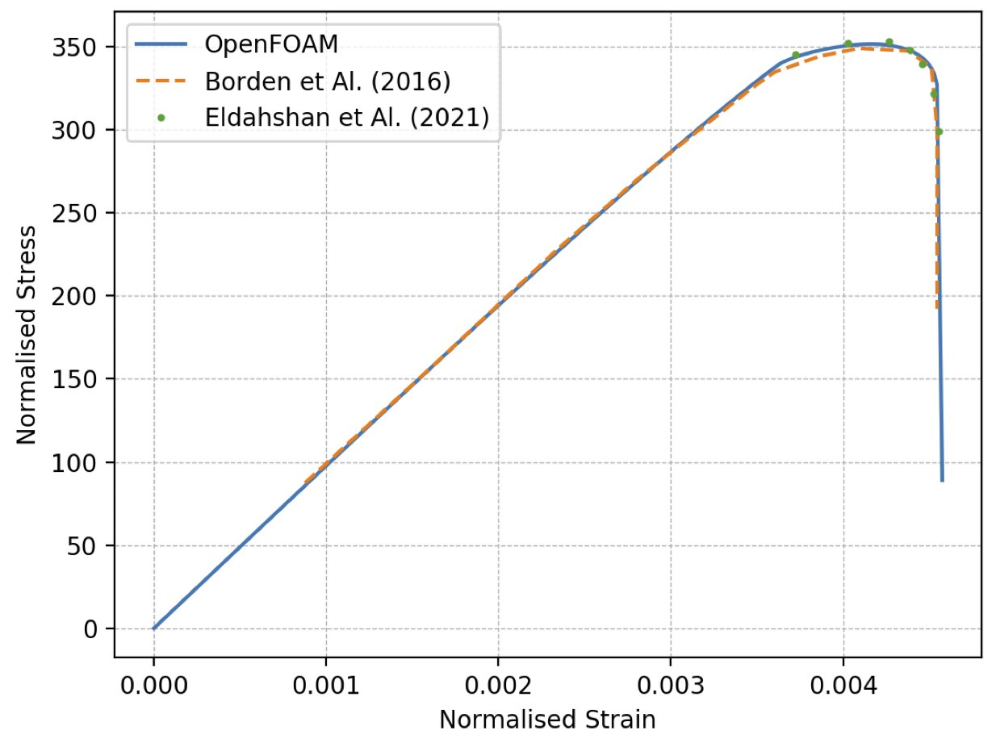
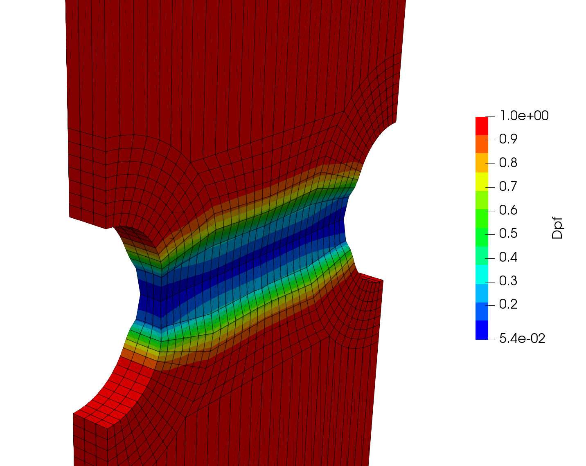

# Failure of a Notched Flat Tensile Plate: `notchedFlatTensile`

Prepared by Andrew Whelan and Philip Cardiff

---

## Tutorial Aims

- Demonstrate the use of a phase field damage model to predict failure.

---

```note
See also the related `tutorials/elastoplasticity/neckingBar` case.
```

## Case Overview

The damage and subsequent failure of a flat notched tensile specimen has been widely analysed the literature [2, 3]. The geometry consists of a plate ($$152.4 \times 25.4 \times 2.37$$ mm) with a two $$4.06$$ mm radius notches at the middle edges of its long sides (Figure 1). Symmetries can also be availed of in this test case, with only a quarter of the specimen simulated here. A displacement of $$1.143$$ mm is applied to the upper boundary in the positive vertical direction ($$y$$) over 100 loading increments. Inertia and gravity are neglected, and the geometry is simulated as 3-D.


<div style="text-align: center;">
  
    <figcaption>
     <strong>Figure 1: Problem geometry and mesh [1]</strong>
    </figcaption>
</div>

The material behaviour (Table 1) is assumed to be neo-Hookean elastic, Mises/$$J_2$$ plasticity, and damage governed by a phase field formulation [1]. For further details of the case and formulation, see Whelan [1].


**Table 1: Mechanical properties**

| Parameter           | Symbol       | Value       |
|         ---          |      ---       |          ---          |
|   Young’s modulus    |     $$E$$      |      $$68.8$$ GPa      |
|   Poisson's ratio    |    $$\nu$$     |        $$0.33$$        |
| Critical Fracture Energy |  $$G_C$$  |      $$60\times10^3$$ J/m$$^2$$      |
|   Plastic Threshold    |    $$W_o$$     |        $$1 \times 10^7$$ J/m$$^3$$         |
|   Characteristic Length    |    $$l_c$$     |        $$0.3226$$ mm         |
|   Yield Stress Hardening Law    |    $$\sigma_y$$     |        $$320 + 688 \bar{\epsilon}_{p} $$ MPa        |

where $$\bar{\epsilon}_{p}$$ is the equivalent plastic strain.


---

## Expected Results

The normalised stress vs normalised strain at the upper boundary (Figure 2) agree closely with predictions from Borden et al. [2] and Eldahshan et al. [3]. After the initial elastic region where the load increases linearly, yielding occurs where the normalised stress plateaus; subsequently, the damage localises in the notch causing the load to rapidly drop as the specimen fractures. Note that the results in Figure 2 were created using a mesh that is finer than the mesh in the tutorial case. The mesh density can be increased by modifying the `blockMeshDict.m4` or `blockMeshDict` files located in the case.


<div style="text-align: center;">
  
    <figcaption>
     <strong>Figure 2: Normalised stress vs normalised strain on the upper boundary compared with predictions from Borden et al. [2] and Eldahshan et al. [3].</strong>
    </figcaption>
</div>


The damage variable field (`Dpf`: damage phase field variable) in the region of the notches is shown at the end time in Figure 3. Note that in the current phase field formulation, $$Dpf = 0$$ represents fully damaged material, while $$Dpf = 0$$ represents fully intact material. For stability reasons, a value of $$Dpf$$ less than some small value is typically taken as fully damaged.


<div style="text-align: center;">
  
    <figcaption>
     <strong>Figure 3: The damage variable field (`Dpf`: damage phase field variable) at the end time</strong>
    </figcaption>
</div>


---

## Running the Case

The tutorial case is located at `solids4foam/tutorials/solids/fracture/notchedFlatTensile`. The case can be run using the included `Allrun` script, i.e. `> ./Allrun`.  The `Allrun` script creates the mesh using `blockMesh`. Optionally, the `blockMeshDict` file can be re-created using the `m4` scripting language from the `blockMeshDict.m4` file located in the case. The `solids4foam` solver is used to run the case (`> solids4Foam`). Optionally, if `gnuplot` is installed, the normalised stress vs normalised strain is created in the `stressVsStrain.png` file.


---

### References

[1] Andrew Whelan, “Finite Volume Implementation of Damage and Fracture Mechanics and Prediction of Damage in Metal Forming Processes", PhD thesis, School of Mechanical and Materials Engineering, University College Dublin. 2023. Supervisors: P. Cardiff, V. Pakrashi, M. Celikin.

[2] Michael J. Borden, Thomas J.R. Hughes, Chad M. Landis, Amin Anvari, and Isaac J. Lee. A phase-field formulation for fracture in ductile materials: Fi- nite deformation balance law derivation, plastic degradation, and stress triax- iality effects. Computer Methods in Applied Mechanics and Engineering, 312: 130–166, December 2016. ISSN 00457825. doi: 10.1016/j.cma.2016.09.005. URL https://linkinghub.elsevier.com/retrieve/pii/S0045782516311069.

[3] Hazem Eldahshan, Pierre-Olivier Bouchard, Jos ́e Alves, Etienne Perchat, and Daniel Pino Munoz. Phase field modeling of ductile fracture at large plastic strains using adaptive isotropic remeshing. Computational Mechanics, 67(3):763– 783, March 2021. ISSN 0178-7675, 1432-0924. doi: 10.1007/s00466-020-01962-7. URL http://link.springer.com/10.1007/s00466-020-01962-7.