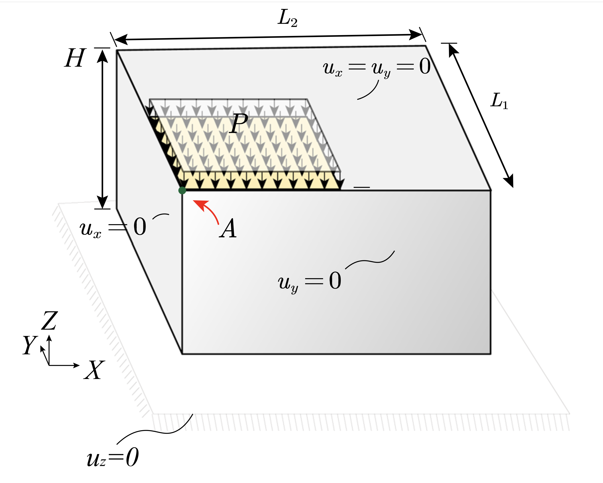
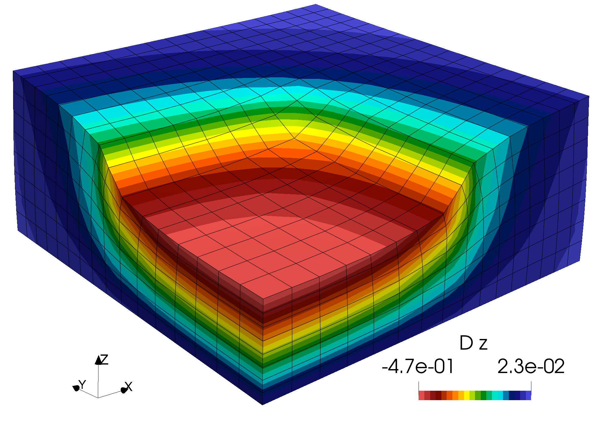

# Block Punch Problem: `blockPunch`

---

Prepared by Ivan Batistić and Philip Cardiff

---

## Tutorial Aims

- Demonstrate a large-strain Neo-Hookean compression problem.
- Generate a structured hexahedral and tetrahedral mesh with `gmsh`.

---

## Case Overview

This case is based on the 3-D punch problem of Xu et al. [1]. The body has
in-plane dimensions $$L_1 = L_2 = 2$$ m and height $$H = 1$$ m. A pressure load is
applied on one quarter of the top surface, while the remaining top surface
and the outer side surfaces are traction-free, see Fig 1. Symmetry conditions
are applied on the $$x = 0$$, $$y = 0$$, and bottom surfaces. The material is
modelled using the Neo-Hookean material law. The current case uses the Lame
constants from [1], $$\lambda = 400.75$$ Pa and $$\mu = 92.5$$ Pa, specified as
$$\mu = 92.5$$ Pa  and $$K = \lambda + \dfrac{2}{3}\mu = 462.42$$ Pa.



**Figure 1 - Punch geometry and boundary conditions [1]**

The default hexahedral mesh is generated with `gmsh` using the paper's refinement
convention with $$N = 8$$ divisions through the height and $$2N$$ divisions in
each in-plane direction, giving a $$16 \times 16 \times 8$$ structured
hexahedral mesh. The pressure history is specified in
`constant/timeVsPressure`. The tutorial currently ramps the pressure from
$$0$$ to $$150$$ over the interval $$0 \leq t \leq 1$$ s. The time step is
$$\Delta t = 0.1$$ s, so the load is applied over ten equal loading increments.
The final pressure is set to $$P = 150$$ Pa. Note that in [1] the authors use a
final pressure of $$P = 300$$ Pa.

---

## Expected Results

The quantity of interest is the displacement of point A, located at
$$A = (0, 0, 1).$$ The `solidPointDisplacement` function object in
`system/controlDict` writes the point displacement to
`postProcessing/0/solidPointDisplacement_pointDisp.dat`. Expected displacement
of point $$A$$ is $$0.47$$, i.e. $$47 \%$$ of the overall height.



**Figure 2 - Deformed geometry, coloured with displacement $D_z$**

---

## Running the Case

The tutorial case is located at
`solids4foam/tutorials/solids/hyperelasticity/blockPunch`.

The case can
be run using the included `Allrun` script. The `Allrun` script optionally takes
a first argument that specifies the solution approach:

```bash
./Allrun             # Defaults to the segregated  approach
./Allrun segregated  # Segregated second-order approach
./Allrun petscSnes   # PETSc SNES approach [2]
./Allrun highOrder   # PETSc SNES high-order approach [3]
```

and an optional second argument that specifies the mesh type:

```bash
./Allrun segregated hex   # Defaults to the hexahedral mesh
./Allrun segregated tet   # Tetrahedral mesh
```

The `Allrun` script starts by updating the files in the case to match the
selected approach; the following files are updated: `constant/solidProperties`,
`system/fvSchemes`, and `system/fvSolution`. The selected structured mesh is
created with `gmsh` and subsequently converted with `gmshToFoam` to OpenFOAM
format. `changeDictionary` is used to update patch types, after which the
`solids4Foam` solver is called.

---

## References

[1]
[Xu, BB., Peng, F. & Wriggers, P. Stabilization-free virtual element method for
3D hyperelastic problems, Comput Mech 75, 1687-1701 (2025).](https://doi.org/10.1007/s00466-024-02501-4)

[2] [P. Cardiff, D. Armfield, Ž. Tuković, I. Batistić, A Jacobian-free
Newton-Krylov method for cell-centred finite volume solid mechanics.
_International Journal for Numerical Methods in Engineering_, 127, e70268,
2026, 10.1002/nme.70268.](https://doi.org/10.1002/nme.70268)

[3] [I. Batistić, P. Castrillo, P. Cardiff, High-order cell-centred finite-volume
solid mechanics using a Jacobian-free Newton-Krylov method,
_Journal of Computational Physics_, 115056, 2026.](https://doi.org/10.1016/j.jcp.2026.115056)
