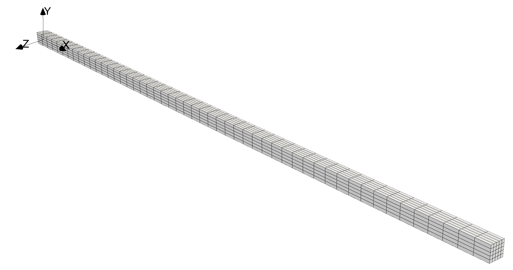

# Slender Cantilever in Bending: `cantileverBeam`

---

Prepared by Philip Cardiff and Ivan Batistić

---

## Tutorial Aims

- Demonstrate large-deformation bending of a slender hyperelastic cantilever
  beam.
- Demonstrate the behaviour of large deformation solid models for a
  high-aspect-ratio geometry.

---

## Case Overview

This tutorial considers a slender three-dimensional cantilever beam. The
reference geometry is a rectangular beam with length $$0.5$$ m and a square
cross-section of $$0.01$$ m $$\times$$ $$0.01$$ m. The mesh contains
$$51 \times 5 \times 5$$ hexahedral cells, see Figure 1.

**Figure 1: Computational mesh, generated using `blockMesh`.**

The beam is fixed at the left side ($$x = 0$$) and uniform pressure is applied
on the upper surface. Remaining surfaces are traction-free. The pressure
increases linearly from $$0$$ Pa at $$t = 0$$ to $$5$$ Pa at $$t = 1$$. The
problem is solved with one load increment, $$\Delta t = 1$$ s; therefore, the
full pressure load of $$5$$ Pa is applied in a single increment. Gravity effects
are neglected.
The material is modelled with the compressible Neo-Hookean hyperelastic law. The
material density is $$\rho = 1000$$ kg/m³, Young's modulus is
$$E = 3 \times 10^6$$ Pa and Poisson's ratio is $$\nu = 0.3$$.

---

## Expected Results

The beam should bend smoothly under the pressure applied on the top surface,
with zero displacement at the fixed end and the largest displacement near the
free end. The equivalent stress field, `sigmaEq`, should show the largest values
near the fixed support, where the bending stresses are concentrated.

The right-end displacement is monitored by the `solidPointDisplacement`
function object at point $$(0.5\ 0\ 0)$$. The displacement history is written to
`postProcessing/0/solidPointDisplacement_rightEndDisp.dat`. Since the pressure
is applied on the `top` patch, the load-direction deflection is the `Dy`
component.

---

## Running the Case

The tutorial case is located at
`solids4foam/tutorials/solids/hyperelasticity/cantileverBeam`. The case can
be run using the included `Allrun` script:

```bash
./Allrun
```

The `Allrun` script creates the mesh with `blockMesh`, and then
runs the `solids4Foam` solver.
