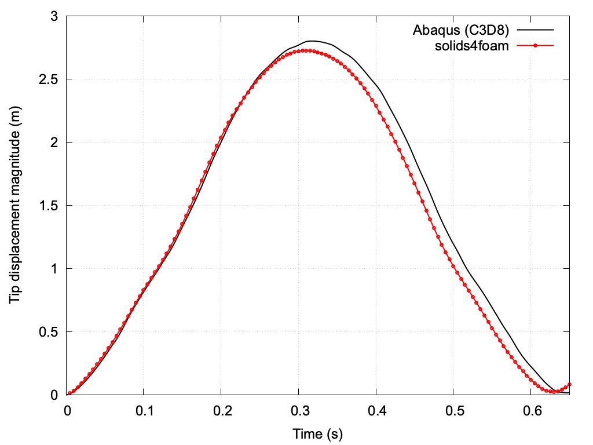

# Vibrating Hyperelastic Cantilever: `cantileverVibration`

Prepared by Philip Cardiff

---

## Tutorial Aims

- Demonstrate a transient (dynamic) solid-only analysis in solids4foam, where
  inertia governs the response;
- Exemplify the use of a hyperelastic mechanical law with large deformations
  and large rotations;
- Demonstrate the Jacobian-free Newton-Krylov (PETSc SNES) solution algorithm
  for a dynamic, geometrically nonlinear problem, and compare it with the
  segregated algorithm.

## Case Overview

A cantilever beam of length 2 m (in the $$z$$ direction) and a square
cross-section of 0.2 m x 0.2 m is clamped at one end (`back` patch, $$z = 0$$).
At $$t = 0$$, a uniform traction of $$(50, 50, 0)$$ kPa is applied suddenly to
the free-end face (`front` patch, $$z = 2$$ m) and is held constant
thereafter, i.e. a transverse force of 2 kN in each of the $$x$$ and $$y$$
directions, acting diagonally across the section. The traction vector is
fixed in direction: it does not follow the rotation of the end face. The
remaining faces are traction-free. Gravity is neglected.

Because the load is applied suddenly and there is no physical damping, the beam
starts from rest and oscillates about its (large-deflection) static equilibrium
position. The deformation is very large: at the peak, the tip has moved
approximately 1.75 m in the transverse (diagonal) direction and approximately
2.1 m axially back towards the clamped end, i.e. the beam curls through more
than 90 degrees, so geometric nonlinearity dominates the response.

The material is described by the compressible neo-Hookean hyperelastic law
(`neoHookeanElastic`) with:

- Young's modulus $$E = 15.293$$ MPa;
- Poisson's ratio $$\nu = 0.3$$;
- density $$\rho = 1000$$ kg/m$$^3$$.

The case uses the `nonLinearGeometryTotalLagrangianTotalDisplacement` solid
model, which solves for the total displacement `D` in the total Lagrangian
formulation.

The quantity of interest is the displacement of the centre of the free-end
face, $$(0.1, 0.1, 2)$$ m, which is written at every time step by the
`solidPointDisplacement` function object (defined in `system/controlDict`) to
`postProcessing/0/solidPointDisplacement_pointDisp.dat`, with columns:
time, $$D_x$$, $$D_y$$, $$D_z$$ and the magnitude $$|D|$$.

### Discretisation

- **Mesh**: a single structured `blockMesh` block with 6 x 6 x 60 hexahedral
  cells (2 160 cells; cell size 33.3 mm).
- **Time scheme**: second-order implicit backward (BDF2) differencing for both
  the `d2dt2` and `ddt` terms (`system/fvSchemes`).
- **Time step**: constant $$\Delta t = 0.005$$ s, with an end time of 0.65 s
  (130 time steps). A predictor (`predictor yes;` in
  `constant/solidProperties`) extrapolates `D` at the start of each time step
  from the previous velocity and acceleration.

```note
The shipped mesh and time step are a demonstration resolution chosen so that
the case runs in well under a minute; they are not converged. On this mesh,
halving the time step from 0.01 s to 0.005 s does not change the peak tip
displacement to four significant figures (2.7247 m), whereas the coarser
3 x 3 x 30 mesh gives a noticeably smaller peak (approximately 2.55 m), so
the remaining difference from the reference is dominated by the spatial
resolution.
```

### End time

The Abaqus reference time series (see "Expected Results") covers
0 s $$\le t \le$$ 1 s. The oscillation period is approximately 0.65 s: the
reference peaks at $$t = 0.318$$ s and returns close to the undeformed position
at $$t = 0.646$$ s. The tutorial end time of 0.65 s therefore covers one full
oscillation, i.e. the first 65% of the reference series. To compare over the
full reference window, set `endTime 1;` in `system/controlDict` (and widen
`set xrange` in `plot.gnuplot`).

---

## Running the Case

The tutorial case is located at
`solids4foam/tutorials/solids/hyperelasticity/cantileverVibration`. The case
can be run using the included `Allrun` script, which optionally takes an
argument that specifies the solution algorithm:

```bash
./Allrun             # Defaults to the petscSnes approach
./Allrun petscSnes   # Jacobian-free Newton-Krylov (PETSc SNES) approach [1]
./Allrun segregated  # Segregated approach
```

The `Allrun` script first links `constant/solidProperties` and
`system/fvSolution` to the `*.petscSnes` or `*.segregated` versions, then
creates the mesh with `blockMesh`, runs `solids4Foam`, and, if `gnuplot` is
installed, plots the tip displacement against the Abaqus reference in
`tipDisplacement.png`. The `petscSnes` approach requires solids4foam to be
compiled with PETSc; if PETSc is not available, the case exits without
running. `./Allclean` removes the results and restores the default
(`petscSnes`) links.

The default `petscSnes` approach takes approximately 25 s in serial on a
recent desktop CPU; the `segregated` approach gives the same tip displacement
history (peak 2.7247 m) but takes roughly three times longer (approximately
70 s).

---

## Expected Results

The solids4foam predictions are compared with an Abaqus solution using C3D8
elements, supplied with the tutorial in `reference/abaqusC3D8.dat` (copied
from the `solid-benchmarks` repository [2]; see the comment header in the
file for its provenance).



**Figure 1: Magnitude of the tip displacement at the centre of the free-end
face over one oscillation: solids4foam (6 x 6 x 60 cells,
$$\Delta t = 0.005$$ s, `petscSnes`, OpenFOAM-v2512) and Abaqus (C3D8).**

The solids4foam and Abaqus histories agree closely during the loading phase
($$t \lesssim 0.25$$ s). On this coarse tutorial mesh, solids4foam predicts a
peak displacement 2.7% smaller than Abaqus and an oscillation period roughly
2.5% shorter, i.e. the discretised beam is slightly too stiff, which is the
expected behaviour of a coarse mesh in bending.

**Table 1: Tip displacement magnitude: solids4foam (tutorial settings) versus
Abaqus.**

| Quantity | solids4foam | Abaqus (C3D8) |
| --- | --- | --- |
| Peak displacement (m) | 2.725 | 2.801 |
| Time of peak (s) | 0.310 | 0.318 |
| Time of return to minimum (s) | 0.630 | 0.646 |
| Displacement at minimum (m) | 0.025 | 0.018 |

The `regressionTest.sh` script runs the default configuration and checks that
the peak tip displacement over the run lies within $$[2.70, 2.78]$$ m. The
band allows for small differences between OpenFOAM versions: the peak is
2.7247 m with OpenFOAM-v2512, 2.7404 m with foam-extend-4.1 and 2.7556 m with
OpenFOAM-9.

---

## References

[1] [P. Cardiff, D. Armfield, Ž. Tuković, I. Batistić, A Jacobian-free
Newton-Krylov method for cell-centred finite volume solid mechanics.
_International Journal for Numerical Methods in Engineering_, 127, e70268,
2026, 10.1002/nme.70268.](https://doi.org/10.1002/nme.70268)

[2] [solids4foam solid-benchmarks repository,
`hyperElasticity/cantileverVibration`](https://github.com/solids4foam/solid-benchmarks)
