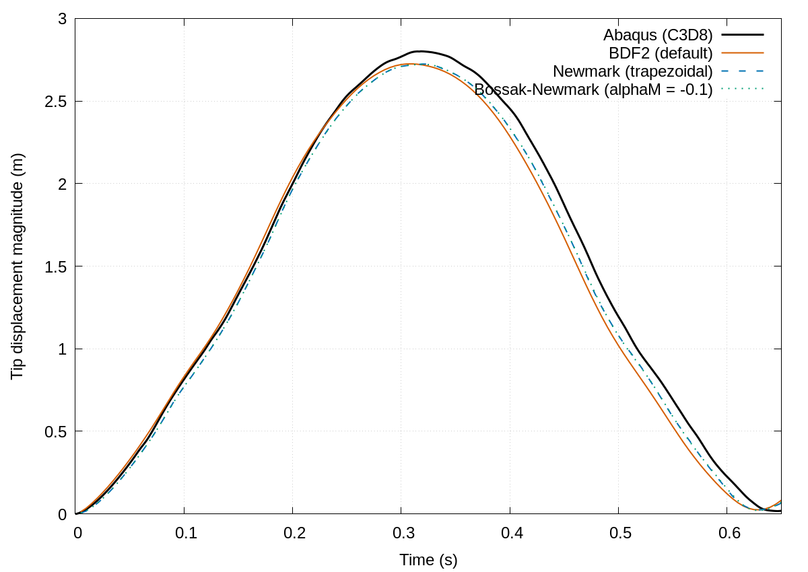

# Vibrating Hyperelastic Cantilever: `cantileverVibration`

Prepared by Philip Cardiff

---

## Tutorial Aims

- Demonstrate a transient (dynamic) solid-only analysis in solids4foam, where
  inertia governs the response;
- Exemplify the use of a hyperelastic mechanical law with large deformations
  and large rotations;
- Demonstrate the Jacobian-free Newton-Krylov (PETSc SNES) solution algorithm
  for a dynamic, geometrically nonlinear problem, and compare it with the
  segregated algorithm;
- Compare BDF2, trapezoidal Newmark and damped Bossak-Newmark time integration;
- Show, as a non-default option, why the higher-order `BDF` d2dt2 scheme
  (order 3 and above) is not suitable for an undamped structure.

## Case Overview

A cantilever beam of length 2 m (in the $$z$$ direction) and a square
cross-section of 0.2 m x 0.2 m is clamped at one end (`back` patch, $$z = 0$$).
At $$t = 0$$, a uniform traction of $$(50, 50, 0)$$ kPa is applied suddenly to
the free-end face (`front` patch, $$z = 2$$ m) and is held constant
thereafter, i.e. a transverse force of 2 kN in each of the $$x$$ and $$y$$
directions, acting diagonally across the section. The traction vector is
fixed in direction: it does not follow the rotation of the end face. The
remaining faces are traction-free. Gravity is neglected.

Because the load is applied suddenly and there is no physical damping, the beam
starts from rest and oscillates about its (large-deflection) static equilibrium
position. The deformation is very large: at the peak, the tip has moved
approximately 1.75 m in the transverse (diagonal) direction and approximately
2.1 m axially back towards the clamped end, i.e. the beam curls through more
than 90 degrees, so geometric nonlinearity dominates the response.

The material is described by the compressible neo-Hookean hyperelastic law
(`neoHookeanElastic`) with:

- Young's modulus $$E = 15.293$$ MPa;
- Poisson's ratio $$\nu = 0.3$$;
- density $$\rho = 1000$$ kg/m$$^3$$.

The case uses the `nonLinearGeometryTotalLagrangianTotalDisplacement` solid
model, which solves for the total displacement `D` in the total Lagrangian
formulation.

The quantity of interest is the displacement of the centre of the free-end
face, $$(0.1, 0.1, 2)$$ m, which is written at every time step by the
`solidPointDisplacement` function object (defined in `system/controlDict`) to
`postProcessing/0/solidPointDisplacement_pointDisp.dat`, with columns:
time, $$D_x$$, $$D_y$$, $$D_z$$ and the magnitude $$|D|$$.

### Discretisation

- **Mesh**: a single structured `blockMesh` block with 6 x 6 x 60 hexahedral
  cells (2 160 cells; cell size 33.3 mm).
- **Time scheme**: second-order implicit backward (BDF2) by default, with
  trapezoidal Newmark and Bossak-Newmark alternatives for the `d2dt2` term.
  The first derivative (`ddt`) uses backward differencing in all three cases.
- **Time step**: constant $$\Delta t = 0.005$$ s, with an end time of 0.65 s
  (130 time steps). A predictor (`predictor yes;` in
  `constant/solidProperties`) extrapolates `D` at the start of each time step
  from the previous velocity and acceleration.

```note
The shipped mesh and time step are a demonstration resolution chosen for
short run times; they are not converged. On this mesh,
with BDF2, halving the time step from 0.01 s to 0.005 s does not change the
peak tip displacement to four significant figures (2.7247 m), whereas the coarser
3 x 3 x 30 mesh gives a noticeably smaller peak (approximately 2.55 m), so
the remaining difference from the reference is dominated by the spatial
resolution.
```

### End time

The Abaqus reference time series (see "Expected Results") covers
0 s $$\le t \le$$ 1 s. The oscillation period is approximately 0.65 s: the
reference peaks at $$t = 0.318$$ s and returns close to the undeformed position
at $$t = 0.646$$ s. The tutorial end time of 0.65 s therefore covers one full
oscillation, i.e. the first 65% of the reference series. To compare over the
full reference window, set `endTime 1;` in `system/controlDict` (and widen
`set xrange` in `plot.gnuplot`).

---

## Running the Case

The tutorial case is located at
`solids4foam/tutorials/solids/hyperelasticity/cantileverVibration`. The case
can be run using the included `Allrun` script. Its first argument selects the
solution algorithm; its optional second argument selects the time scheme:

```bash
./Allrun                       # PETSc SNES with BDF2 (defaults)
./Allrun segregated            # Segregated algorithm with BDF2
./Allrun petscSnes newmark      # Trapezoidal Newmark
./Allrun petscSnes bossak       # Damped Bossak-Newmark
./Allrun petscSnes bdf3         # Third-order BDF (fails; see below)
./Allrun petscSnes all          # All three schemes and a comparison plot
```

The time-scheme selector is available with either algorithm. The results and
regression checks below use `petscSnes`. With the current segregated settings
on OpenFOAM-v2512, all three schemes (including the BDF2 baseline) failed at
the first time step with a non-positive deformation-gradient determinant;
use `petscSnes` to reproduce this comparison.

The second-derivative scheme parameters are:

| Option | Scheme | Beta | Gamma | AlphaM |
| --- | --- | --- | --- | --- |
| `bdf2` | `backward` | — | — | — |
| `newmark` | `NewmarkBeta` (trapezoidal rule) | 0.25 | 0.5 | 0 |
| `bossak` | `NewmarkBeta` (Bossak damping) | 0.3025 | 0.6 | -0.1 |
| `bdf3` | `BDF 3` (not recommended here) | — | — | — |

The `newmark` dictionary omits the coefficients to exercise the scheme's
defaults. The Bossak coefficients satisfy
$$\beta = (1 - \alpha_M)^2/4$$ and $$\gamma = 0.5 - \alpha_M$$.
The two Newmark dictionaries show both supported forms. `fvSchemes.newmark`
selects `NewmarkBeta` in `d2dt2Schemes` only, which is all the momentum
equation needs; the linear predictor's acceleration then uses the `ddtSchemes`
default (`backward`), and the solver log says so once. `fvSchemes.bossak`
also has the optional `"d2dt2\(.*\)"` entry in `ddtSchemes`, with the same
coefficients, so that the predictor uses the Newmark acceleration too. Both
forms give the same converged solution, since the predictor only changes the
initial guess. If the `ddtSchemes` coefficients differ from those in
`d2dt2Schemes`, the run stops with a fatal error. Neither form changes the
scheme for first derivatives.

### The `bdf3` option: a cautionary example

```warning
The `bdf3` option is not recommended for this case, and it does not reach
the end time. It is included only to show the deficit of the higher-order
`BDF` d2dt2 scheme for undamped structural dynamics.
```

`fvSchemes.bdf3` selects `BDF 3` in `d2dt2Schemes`. The `BDF` scheme applies
the backward differentiation formula of order 1 to 6 twice, as `backward`
applies BDF2. It is third-order accurate in time, but, unlike BDF1 and BDF2,
BDF3 and BDF4 are not dissipative for an undamped oscillation: they
*amplify* every resolved mode, by about 4.5% (BDF3) and 0.6% (BDF4) per
period at 20 time-steps per period. BDF5 and BDF6 damp well-resolved modes
but amplify modes with fewer than about 9 and 7.5 time-steps per period by
up to 38% and 58% per time-step. The growth vanishes as the time-step is
refined, but a mesh always has modes that are poorly resolved in time, and
in an undamped problem nothing removes the energy that the scheme adds to
them. The solver prints a warning when order 3 or above is selected.

In this tutorial, which has no physical damping, `bdf3` follows BDF2
closely up to and through the peak (2.7278 m at 0.315 s, against 2.7247 m at
0.310 s with BDF2). After about 0.5 s, a high-frequency oscillation grows in
the tip displacement, and at $$t = 0.54$$ s (108 time-steps) the
deformation-gradient determinant becomes negative and the run stops. A
smaller time-step delays the failure in time but not in time-steps: the
fastest-growing mode always has a similar number of time-steps per period,
so BDF3 fails after a roughly constant number of time-steps (about 180 at
$$\Delta t = 0.0003125$$ s). Higher orders fail sooner. Use `backward`
(BDF2) or `NewmarkBeta` for undamped problems such as this one. The `BDF`
scheme is intended for problems with enough physical or numerical damping,
e.g. viscoelastic or damped solids, or some fluid-solid interaction cases.

The `bdf3` option is not part of `all` or the regression test.

For a single run, `Allrun` links `constant/solidProperties` and
`system/fvSolution` to the selected algorithm's dictionaries and
`system/fvSchemes` to `fvSchemes.bdf2`, `fvSchemes.newmark`,
`fvSchemes.bossak` or `fvSchemes.bdf3`. It then creates the mesh with `blockMesh`, runs
`solids4Foam` and, if `gnuplot` is installed, plots the selected scheme
against Abaqus in `tipDisplacement.png`. Run `./Allclean` before changing
options for a single run to remove previous results.

The `all` option creates fresh cases in `timeSchemeRuns/bdf2`,
`timeSchemeRuns/newmark` and `timeSchemeRuns/bossak`, runs each, then generates
`tipDisplacement.png` with all three predictions and the Abaqus reference.
Use `./Allrun petscSnes all` to reproduce Figure 1.

The `petscSnes` approach requires solids4foam to be compiled with PETSc;
if PETSc is unavailable, the case exits without running. `./Allclean`
removes the results, including `timeSchemeRuns`, and restores the default
`petscSnes` and `bdf2` links.

---

## Expected Results

The solids4foam predictions are compared with an Abaqus solution using C3D8
elements, supplied with the tutorial in `reference/abaqusC3D8.dat` (copied
from the `solid-benchmarks` repository [2]; see the comment header in the
file for its provenance).



**Figure 1: Magnitude of the tip displacement at the centre of the free-end
face over one oscillation: BDF2, trapezoidal Newmark, Bossak-Newmark and
Abaqus (C3D8). The solids4foam runs use 6 x 6 x 60 cells,
$$\Delta t = 0.005$$ s, `petscSnes` and OpenFOAM-v2512.**

All three solids4foam histories agree closely with Abaqus during the loading
phase ($$t \lesssim 0.25$$ s). On this tutorial mesh their peak displacements
are approximately 2.7–2.8% smaller than Abaqus. The Newmark and Bossak-Newmark
curves nearly overlap at this resolution; the sampled peak occurs one time
step later than with BDF2. The return to minimum occurs approximately 2.5%
earlier than in the reference for all three schemes. These results are not
a mesh or time-step convergence study.

**Table 1: Tip displacement magnitude at the tutorial settings versus Abaqus.**

| Quantity | BDF2 | Newmark | Bossak-Newmark | Abaqus (C3D8) |
| --- | --- | --- | --- | --- |
| Peak displacement (m) | 2.72472 | 2.72369 | 2.72200 | 2.8007 |
| Time of peak (s) | 0.310 | 0.320 | 0.320 | 0.318 |
| Time of return to minimum (s) | 0.630 | 0.630 | 0.630 | 0.646 |
| Displacement at minimum (m) | 0.02495 | 0.02488 | 0.02105 | 0.018 |

The `regressionTest.sh` script runs all three schemes with PETSc SNES in
separate `regressionTests` subdirectories. It checks that each run reaches
0.65 s and that its peak tip displacement lies within $$[2.70, 2.78]$$ m.
The band retains the allowance for differences between OpenFOAM versions:
the BDF2 peak is 2.7247 m with OpenFOAM-v2512, 2.7404 m with foam-extend-4.1
and 2.7556 m with OpenFOAM-9. The Newmark results in Table 1 were measured
with OpenFOAM-v2512.

For each scheme, the regression also runs `Test-fvcD2dt2` on the same mesh
and dictionaries. This checks the selected scheme and coefficients, explicit
versus implicit inertia (with and without density), and, for Newmark and
Bossak-Newmark, physical and weighted accelerations against an independent
scalar recurrence. This distinguishes the physical acceleration from the
Bossak-weighted acceleration even when the displacement curves are close.
The regression also checks both `ddtSchemes` forms above: the `newmark` run
must report that its predictor uses `backward`, and the `bossak` run must
not. A final `Test-fvcD2dt2` run on the `bossak` mesh, with mismatched
coefficients in `ddtSchemes`, must stop with the fatal error.
The test utility must be built and available on `PATH`. Results are retained;
`./regressionTest.sh --check-only` rechecks their logs without rerunning.

---

## References

[1] [P. Cardiff, D. Armfield, Ž. Tuković, I. Batistić, A Jacobian-free
Newton-Krylov method for cell-centred finite volume solid mechanics.
_International Journal for Numerical Methods in Engineering_, 127, e70268,
2026, 10.1002/nme.70268.](https://doi.org/10.1002/nme.70268)

[2] [solids4foam solid-benchmarks repository,
`hyperElasticity/cantileverVibration`](https://github.com/solids4foam/solid-benchmarks)
