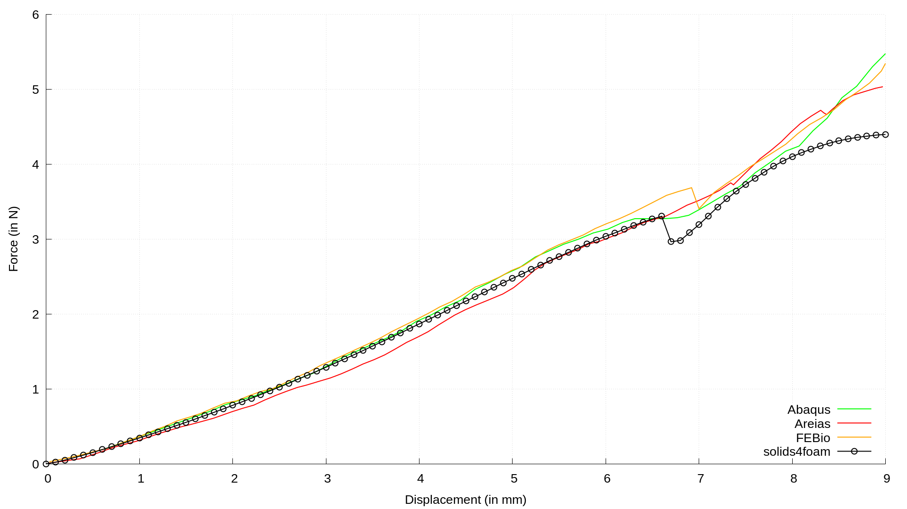
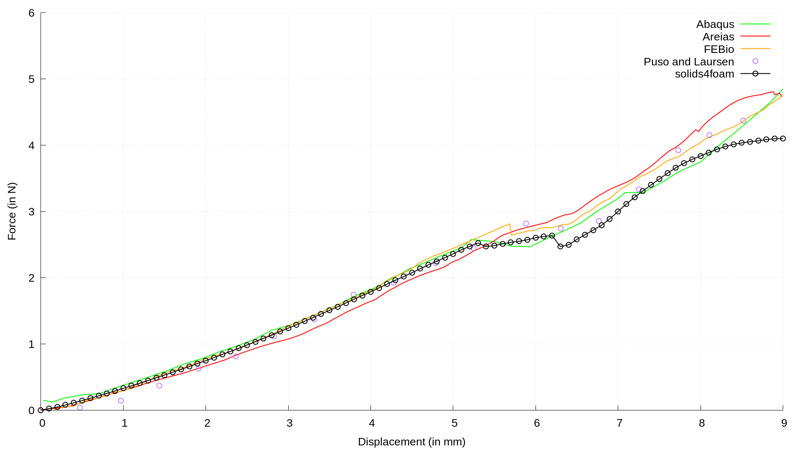

# Compression of two hollow spheres: `compressedSpheres`

---

Prepared by Ivan Batistić

---

## Tutorial Aims

- Demonstrate how to perform a solid analysis with a hyperelastic material,
  large deformations, buckling and large sliding contact between two deformable
  bodies and between deformable and rigid bodies;
- Show how to select frictionless or frictional contact between the bodies via
  an `Allrun` argument;
- Compare the compression force history with published solutions.

---

## Case Overview

Two thick-walled, hollow, concentric half-spheres are compressed between two
rigid planes (Figure 1). The inner sphere has an inner radius of $$r_1 = 10$$ mm
and an outer radius of $$r_2 = 12$$ mm, and the outer sphere has an inner
radius of $$r_2 = 12$$ mm and an outer radius of $$r_3 = 14$$ mm. Owing to the
geometric and loading symmetry, one quarter of the half-spheres is modelled,
with `solidSymmetry` conditions on the symmetry planes. The contact between the
lower rigid plane and the inner sphere, and between the upper rigid plane and
the outer sphere, is frictionless. For the contact between the two spheres, two
cases are considered: frictionless contact (the default) and Coulomb friction
with a coefficient of friction of $$\mu = 0.5$$. The rigid planes are modelled
as single cells with a rigid-master `solidContact` condition; all contacts use
the `standardPenalty` normal contact model.

Both spheres are described by the `neoHookeanElastic` law with Young's modulus
$$E = 1$$ MPa and Poisson's ratio $$\nu = 0.3$$. The upper rigid plane is
displaced by $$u_z = 10$$ mm over a pseudo-time of 1 s (`constant/timeVsDisp`)
in equal increments of $$\Delta t = 0.01$$ s, i.e. 0.1 mm per increment.
Gravitational and inertial forces are neglected, and the updated Lagrangian
formulation (`nonLinearGeometryUpdatedLagrangian`) is used.

The tutorial ships the coarse mesh of the original benchmark (680 cells in the
two spheres: 500 in the inner sphere and 180 in the outer sphere, with four
cells through each wall, plus one cell for each rigid plane) as the compressed
archive `coarseMesh.tar.xz`. On this mesh, beyond a displacement of about
7.7 mm the momentum loop reaches its maximum number of correctors in most
increments, and the solution diverges at about 8.6 mm. The tutorial is therefore
run to a displacement of 7.5 mm (`endTime 0.75` in `system/controlDict`), which
covers the initial loading phase, the buckling and the post-buckling recovery of
the force. The finer meshes used in the original study are available in the
`solid-benchmarks` repository (`hyperElasticity/compressedSpheres/meshes`).

![Figure 1: Problem geometry and computational mesh [1]](./images/compressedSpheres-geometry.png)

Figure 1: Problem geometry and the fine mesh of the original study (inner
sphere 2 420 cells, outer sphere 1 620 cells) [1]

```warning
This case currently only runs with foam-extend.
```

---

## Running the Case

The tutorial case is located at
`solids4foam/tutorials/solids/hyperelasticity/compressedSpheres`. The case can
be run using the included `Allrun` script, i.e.

```bash
> ./Allrun              # frictionless contact between the spheres (default)
> ./Allrun friction     # Coulomb friction (mu = 0.5) between the spheres
```

The `Allrun` script links the `0/DD`, `system/fvSchemes` and
`system/fvSolution` files to their `.frictionless` or `.friction` variants,
converts the case to the foam-extend format, extracts the mesh from
`coarseMesh.tar.xz` into `constant/polyMesh`, and runs the `solids4Foam`
solver. The compression force on the outer sphere, from its contact with the
upper rigid plane, is written to `postProcessing/0/solidForcesR_top.dat`
(columns: time, force components and normal force, in N); the force on the
inner sphere from the lower rigid plane is written to
`postProcessing/0/solidForcesr_bottom.dat`. If `gnuplot` is installed, the
compression force is plotted against the published solutions in
`force-displacement.png`. On a single core, the default case takes about
3.5 minutes and the frictional case about 4.5 minutes.

To run a different variant, first clean the case with `./Allclean`, which also
removes the extracted mesh and the links created by `Allrun`.

---

## Expected Results

As the planes approach each other, the force increases almost linearly up to a
displacement of about 5.5 mm, where the spheres buckle and the force drops,
before increasing again (Figure 2). With coarser meshes, the outer sphere is
less prone to buckling [1]; a similar mesh dependence can be seen in the
literature, where some authors report buckling of the outer sphere and others
do not.

![Figure 2: Deformed configurations of the coarse and fine meshes [1]](./images/compressedSpheres-deformedGeometry.png)

Figure 2: Deformed configurations of the coarse (top) and fine (bottom) meshes
for frictionless contact at a) 5 mm, b) 6 mm, c) 7.5 mm [1]

Table 1 compares the compression force computed on the shipped coarse mesh
with frictionless contact (foam-extend-4.1) with the published solutions,
interpolated from the digitised curves in `referenceData/frictionless`. Before
buckling (2.5 and 5 mm), the `solids4foam` force lies within the scatter of the
published solutions. The coarse-mesh force starts to drop at about 5.5 mm,
close to where the Abaqus and FEBio forces drop, but it drops further, so at
6 mm it is 13% to 22% below the published values. By 7.5 mm, the force has
recovered to within the scatter of the published solutions.

**Table 1: Compression force (N) for frictionless contact**

| Displacement (mm) | solids4foam (coarse mesh) | Abaqus [2] | FEBio [2] | Areias et al. [4] | Puso and Laursen [3] |
| --- | --- | --- | --- | --- | --- |
| 2.5 | 0.999 | 1.025 | 0.978 | 0.888 | 0.899 |
| 5.0 | 2.300 | 2.402 | 2.441 | 2.241 | 2.322 |
| 6.0 | 2.183 | 2.506 | 2.722 | 2.792 | 2.794 |
| 7.5 | 3.470 | 3.418 | 3.681 | 3.789 | 3.642 |

With frictional contact (`./Allrun friction`), the coarse-mesh force lies
within, or at most 3% above, the band of published solutions up to 5 mm
(Table 2), although it oscillates between about 3 and 5 mm, where many increments reach the maximum
number of momentum correctors. The drop in the force after buckling is again
larger than in the published solutions, and by 7.5 mm the force is 3% to 7%
below them.

**Table 2: Compression force (N) for frictional contact ($$\mu = 0.5$$)**

| Displacement (mm) | solids4foam (coarse mesh) | Abaqus [2] | FEBio [2] | Areias et al. [4] |
| --- | --- | --- | --- | --- |
| 2.5 | 1.070 | 1.032 | 1.045 | 0.932 |
| 5.0 | 2.382 | 2.576 | 2.586 | 2.343 |
| 6.0 | 2.529 | 3.125 | 3.201 | 3.002 |
| 7.5 | 3.657 | 3.772 | 3.921 | 3.884 |

Figures 3 and 4 show the compression force histories up to 9 mm reported in
the `solid-benchmarks` repository for the frictional and frictionless cases.
These curves differ from the coarse-mesh results in Table 1 after buckling, so
they should not be expected to be reproduced exactly by this tutorial. The
force matches the published results well before the buckling of the inner
sphere; afterwards, the compression force evolves differently and the structure
is less stiff in `solids4foam`.



Figure 3: Evolution of the compression force for the frictional case
($$\mu = 0.5$$)



Figure 4: Evolution of the compression force for the frictionless case

The results from [2], [3] and [4] were digitised using
[WebPlotDigitizer](https://apps.automeris.io/wpd/); the digitised curves are
provided in `referenceData`, where the header of each file states its source and
units.

The `regressionTest.sh` script runs the default frictionless case up to a
displacement of 2.5 mm (about 40 s) and checks the final compression force both
against its calibrated value and against the band spanned by the published
solutions.

---

### References

[1]
I. Batistić, "Segment-to-segment algorithm for finite volume mechanical
contact simulations", PhD thesis, University of Zagreb, 2022.

[2]
[B. K. Zimmerman and G. A. Ateshian, "A surface-to-surface finite element
algorithm for large deformation frictional contact in FEBio", Journal of
Biomechanical Engineering, vol. 140, no. 8,
2018.](https://www.ncbi.nlm.nih.gov/pmc/articles/PMC6056201/)

[3]
[M. A. Puso and T. A. Laursen, "A mortar segment-to-segment contact method for
large deformation solid mechanics", Computer Methods in Applied Mechanics and
Engineering, vol. 193, no. 6, pp. 601–629,
2004.](https://www.sciencedirect.com/science/article/abs/pii/S0045782503005802)

[4]
[P. Areias, T. Rabczuk, F. J. Melo, and J. C. Sá, "Coulomb frictional contact
by explicit projection in the cone for finite displacement quasi-static
problems", Computational Mechanics, vol. 55, no. 1, pp. 57–72,
2015.](https://link.springer.com/article/10.1007/s00466-014-1082-5)
