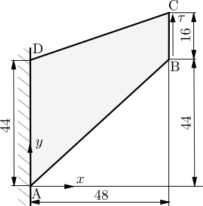

# Hyperelastic Cook's Membrane: `cooksMembrane`

Prepared by Ivan Batistić

---

## Tutorial Aims

- Demonstrate how to perform a finite-strain hyperelastic solid-only analysis
  in solids4foam.
- Demonstrate the performance of the total Lagrangian solid model in a
  bending-dominated problem on a skewed mesh.
- Compare the segregated and Jacobian-free Newton-Krylov (PETSc SNES)
  solution approaches, and compare the predictions with published deal.II
  and Abaqus results.

```note
A small-strain linear elastic version of this tutorial is available at
tutorials/solids/linearElasticity/cooksMembrane, and a finite-strain
elastoplastic version is available at
tutorials/solids/elastoplasticity/cooksMembrane
```

## Case Overview

Cook's membrane [2] is a well-known bending-dominated benchmark case. The
tapered panel (trapezoid) is fixed on its left side and subjected to a uniform
shear traction on its right side, while the top and bottom sides are
traction-free. The vertices of the trapezoid (in mm) are (0, 0), (48, 44),
(48, 60), and (0, 44), as shown in Figure 1. Gravitational effects are
neglected, there are no body forces, and the problem is solved as 2-D using
the plane strain assumption.

This variant follows the compressible hyperelastic Cook's membrane described
by Pelteret and McBride [[1](https://doi.org/10.5281/zenodo.1228964)]. The
material is a compressible neo-Hookean solid (`neoHookeanElastic`) with
Young's modulus $$E = 1.0985$$ MPa and Poisson's ratio $$\nu = 0.3$$, giving a
shear modulus $$\mu = 422.5$$ kPa and a bulk modulus $$\kappa = 915.4$$ kPa.
The strain energy function is

$$
\Psi = \frac{\mu}{2}\left(\text{tr}\,\bar{\mathbf{b}} - 3\right)
+ \frac{\kappa}{4}\left(J^2 - 1 - 2\ln J\right),
$$

where $$\bar{\mathbf{b}}$$ is the isochoric left Cauchy-Green deformation
tensor and $$J$$ is the Jacobian of the deformation gradient.

The shear traction $$\tau = 62.5$$ kPa (1/16 N/mm$$^2$$, i.e. a total force of
1 N on the 16 mm $$\times$$ 1 mm loaded face) is applied per unit undeformed
area (`useUndeformedArea true`), i.e. as a dead load. The traction is ramped
linearly to its final value in 30 equal load increments
(`constant/timeVsTraction`). The problem is solved as static using the total
Lagrangian `nonLinearGeometryTotalLagrangianTotalDisplacement` solid model on
a structured mesh of $$24 \times 24$$ cells.



Figure 1: Problem geometry

---

## Running the Case

The tutorial case is located at
`solids4foam/tutorials/solids/hyperelasticity/cooksMembrane`. The case can be
run using the included `Allrun` script. The `Allrun` script optionally takes an
argument which specifies the solution approach:

```bash
./Allrun             # Defaults to the segregated approach
./Allrun segregated  # Segregated approach
./Allrun petscSnes   # PETSc SNES Jacobian-free Newton-Krylov approach [3]
```

The `Allrun` script starts by updating the files in the case to match the
selected approach; the following files are updated:
`constant/solidProperties` and `system/fvSolution`. Subsequently, the mesh is
created with `blockMesh`, followed by running the solver `solids4Foam`. The
`petscSnes` approach requires solids4foam to be built with PETSc; if PETSc is
not available, the `Allrun` script exits without running the case. Both
approaches take a few seconds to run in serial.

---

## Expected Results

The quantity of interest is the vertical displacement of the reference point
at the mid-point of the loaded edge, (48, 52) mm, i.e. the mid-point of edge
BC in Figure 1. There is no known analytical solution for this problem, but
finite element results are available in the literature
[[1](https://doi.org/10.5281/zenodo.1228964)].

In the `solids4foam` case, the displacement of the reference point is
extracted using the `solidPointDisplacement` function object placed in the
`controlDict`:

```c++
functions
{
   pointDisp
   {
       type    solidPointDisplacement;
       point   (0.048 0.052 0);
   }
}
```

The `solidPointDisplacement` function finds the mesh vertex nearest to the
specified `point` and writes the displacement of this vertex to
`postProcessing/0/solidPointDisplacement_pointDisp.dat`.

On the tutorial mesh of $$24 \times 24$$ cells, the predicted vertical
displacement of the reference point is 14.61 mm (0.0146148 m, using
`OpenFOAM-v2512`), with both the segregated and PETSc SNES approaches. As the
mesh is refined, the prediction converges towards the mesh-converged deal.II
value of 14.74 mm. Table 1 compares the `solids4foam` predictions (PETSc SNES
approach, obtained by changing the number of cells in `system/blockMeshDict`)
with Abaqus results for meshes with the same number of cells, and Table 2 lists
the deal.II results of Pelteret and McBride
[[1](https://doi.org/10.5281/zenodo.1228964)]. The reference data are
included in the `reference` directory of this tutorial.

**Table 1: Vertical displacement of the reference point (mm) versus the
number of cells**

| Cells | Mesh | solids4foam | Abaqus (CPE4H) |
| :---: | :---: | :---: | :---: |
| 36 | $$6 \times 6$$ | 13.43 | 13.42 |
| 144 | $$12 \times 12$$ | 14.34 | 14.34 |
| 576 | $$24 \times 24$$ (tutorial) | 14.61 | 14.62 |
| 2304 | $$48 \times 48$$ | 14.70 | 14.70 |
| 9216 | $$96 \times 96$$ | 14.73 | 14.72 |

**Table 2: Vertical displacement of the reference point (mm) reported by
Pelteret and McBride [[1](https://doi.org/10.5281/zenodo.1228964)] using
deal.II**

| Elements per edge | Q1 elements | Q2 elements |
| :---: | :---: | :---: |
| 2 | 8.638 | 14.30 |
| 4 | 12.07 | 14.65 |
| 8 | 13.86 | 14.71 |
| 16 | 14.49 | 14.73 |
| 32 | 14.67 | 14.74 |
| 64 | 14.72 | 14.74 |

---

## References

[1]
[J-P. V. Pelteret and A. McBride, The deal.II code gallery: Quasi-Static
Finite-Strain Compressible Elasticity, 2016,
doi:10.5281/zenodo.1228964.](https://doi.org/10.5281/zenodo.1228964)

[2]
R. D. Cook, Improved two-dimensional finite element. Journal of the
Structural Division, 100(9), 1851-1863, 1974.

[3]
[P. Cardiff, D. Armfield, Ž. Tuković, I. Batistić, A Jacobian-free
Newton-Krylov method for cell-centred finite volume solid mechanics.
_International Journal for Numerical Methods in Engineering_, 127, e70268,
2026, 10.1002/nme.70268.](https://doi.org/10.1002/nme.70268)
